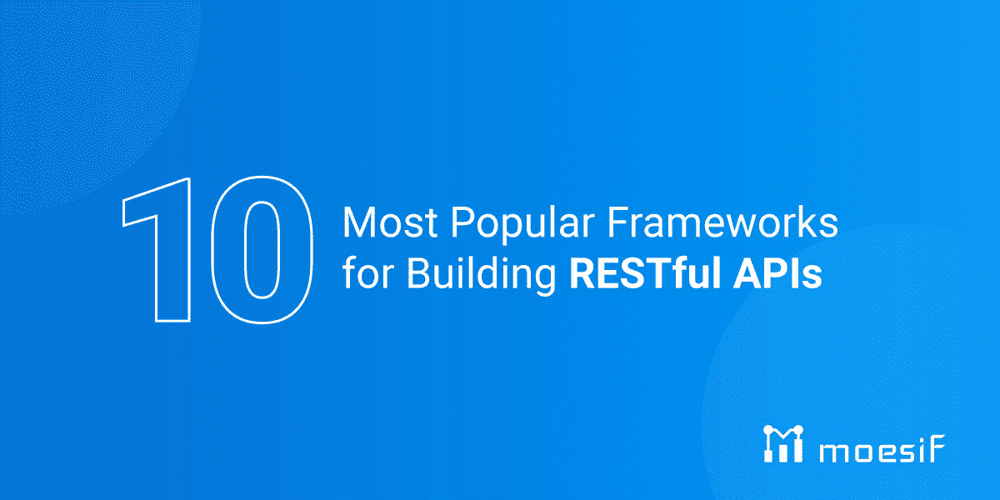

# 构建 RESTful APIs 的 10 个最流行的框架

> 原文：<https://www.moesif.com/blog/api-product-management/api-analytics/10-Most-Popular-Frameworks-For-Building-RESTful-APIs/>

[T2】](https://www.moesif.com/solutions/api-product-management?utm_campaign=Int-site&utm_source=blog&utm_medium=banner-image&utm_content=popular-rest-frameworks)

正如许多工程问题一样，有许多方法可以构建 RESTful APIs。大多数时候，在构建 RESTful APIs 时，工程师更喜欢使用框架。API 框架为构建 API 提供了一个极好的平台，其中大部分组件都是现成的。在本帖中，我们将探讨构建 web APIs 的 10 个最流行的 REST API 框架。这些框架跨越多种语言和不同级别的复杂性和定制。首先，让我们深入了解决定从哪个框架开始构建的一些关键因素。

## 如何选择一个 API 框架

选择 API 框架的第一个因素通常是决定您希望使用哪种语言。对于许多项目，根据您工作的组织或您的经验，选择可能是有限的。通常的建议是使用您已经熟悉的语言，因为学习一门新的语言和一个新的框架可能会导致不太理想的实现。如果你已经熟悉这种语言，你的主要精力可以放在理解框架和高效构建上。

一旦决定了语言，您可能有多种支持您选择的语言的框架可供选择。在这一点上，您需要根据您需要的 API 的功能类型来决定。一些框架会有插件和依赖项，允许与其他平台轻松集成，一些可能更精确地支持您的用例，而另一些可能在您需要的功能方面受到限制，自动取消它们的资格。确保框架支持你的用例及功能是关键。

最后但同样重要的是，你还应该考虑学习曲线和可用的教育材料和文档。作为一名开发人员，良好文档和示例的可用性是您和您的团队如何快速扩展 API 的重要因素。在决定一个框架之前，浏览文档，并进行快速搜索，以确保您可以找到可以指导您的示例，并告诉您在您选择的框架中构建 API 需要付出多少努力。

现在我们有一些因素要考虑，让我们看看一些流行的框架选项。

### Spring Boot

Spring Boot 是一个开源框架，帮助开发者构建网络和移动应用。由 Pivotal Software 开发的 Spring Boot 是一个旨在使最初的 Spring 框架更加用户友好的框架。您可以轻松地开始使用 Spring Boot 开箱即用，无需花费时间配置它的任何库。

**编程语言:** Java

**优点:**

*   由于增强的内存分配，加载速度更快
*   可以很容易地用 XML 配置和注释进行配置
*   易于运行，因为它包括一个内置服务器

**缺点:**

*   不能向后兼容以前的 Spring 项目，也没有工具来帮助迁移
*   二进制文件的大小可能会因默认的依赖关系而膨胀

### 轨道

Ruby on Rails 最初是作为 MVC 框架开发的，这使得它在开发者中被称为“启动技术”。该框架的主要目的是交付高性能的应用程序。Ruby on Rails 的高性能标准让使用 Python 和 PHP 的开发人员兴奋不已，它的许多概念在流行的 Python 和 PHP 框架中得到了复制。

**编程语言:** Ruby

**优点:**

*   以最小的错误进行快速开发的伟大框架
*   开源，有许多可用的工具和库
*   高效包装管理系统的模块化设计

**缺点:**

*   与 Django 和 Express 等其他框架相比，可能难以扩展
*   对某些库的有限多线程支持
*   文档可能有些稀疏，尤其是对于第三方库

### 瓶

烧瓶是由阿明·罗纳彻开发的 Python 框架。Flask 的框架比 Django 更清晰，也更容易学习。Flask 基于 Web 服务器网关接口工具包和 Jinja2 模板引擎。

**编程语言:** Python

**优点:**

*   内置开发服务器和快速调试器
*   对单元测试的集成支持
*   RESTful 请求分派
*   符合 WSGI 1.0
*   Unicode 基本码

**缺点:**

*   缺少包含的工具和扩展，通常需要定制代码
*   安全风险
*   较大的实现维护起来更复杂

### 姜戈休息

Django REST 框架是一个可定制的工具包，可以轻松构建 API。它基于 Danjgo 基于类的观点，所以如果你熟悉 Django，它会是一个很好的选择。

**编程语言:** Python

**优点:**

*   web 可浏览 API 对 web 开发者来说是一个巨大的胜利
*   开发者可以在他们的 web 应用上使用 OAuth2 认证用户。
*   提供 ORM 和非 ORM 序列化。
*   大量文档
*   易于部署

**缺点:**

*   学习曲线
*   不包括异步
*   对于 JSON 验证来说，序列化程序既慢又不实用

### 快递 Js

**快递。Js** 是 Node.js 的开源框架，它通过提供一组有用的工具、特性和插件来简化开发过程。

**编程语言:** Javascript

**优点:**

*   有据可查
*   快速扩展应用
*   广泛使用和良好的社区支持

**缺点:**

*   缺乏安全感
*   回调中的问题
*   中间件系统遇到的请求问题

### Fastify

于 2016 年首次创建的 **Fastify** 是一个高度致力于提供最佳开发者体验的 web 框架。强大的插件架构和最小的开销也使这个框架成为开发者的一个很好的选择。

**编程语言:** Javascript

**优点:**

*   容易开发
*   高性能和高可扩展性
*   支撑该系统的低开销 web 框架最小化了整个应用程序的运行成本。

**缺点:**

*   缺乏文档和社区支持
*   在工业中不容易使用

### 游戏框架

**Play** 是一个 web 应用程序框架，用于使用 Scala 和 Java 创建现代、健壮的应用程序。Play 基于动态类型，集成了现代 web 应用开发所需的组件和 API。

**编程语言:** Java，Scala

**优点:**

*   直观的用户界面
*   简化的应用程序测试
*   多个项目的快速开发

**缺点:**

*   陡峭的学习曲线
*   太多不稳定的插件
*   也许它没有提供任何向后兼容的特性。

### 杜松子酒

Gin 是一个用编程语言 Go 构建 web 应用和微服务的快速框架。它提供了一个类似 martini 的 API，使用户能够用 Go 构建功能多样、功能强大的应用程序。它包含了 web 开发框架中常用的功能，如路由、中间件支持、渲染等。

**编程语言:** Golang

**优点:**

*   表演
*   易于跟踪的 HTTP 方法状态代码
*   简单的 JSON 验证
*   无碰撞

**缺点:**

*   缺少文件
*   语法不简洁

### 凤凰

Phoenix 是用 Elixir 编写的，它实现了 MVC 模式。它看起来类似于 Ruby on Rails 和 Django 这样的框架。关于 Phoenix 的一个有趣的事情是，它有用于预编译模板的实时特性的通道。这些模板工作迅速，使网站流畅，易于滚动浏览。

**编程语言:**仙丹

**优点:**

*   过滤安全有效的数据
*   Elixir 在 Erland VM 上运行，以提高 web 应用程序的性能。
*   并发

**缺点:**

*   昂贵的
*   加工速率
*   需要事先掌握 Erlang 知识

### 快速 API

**Fast API** 是一个用 Python 开发 RESTful APIs 的 web 框架。它完全支持异步编程，因此可以与 Uvicorn 和 Hypercorn 等产品服务器一起运行。它支持流行 ide 中的快速 API，比如 Jetbrains PyCharm。

**编程语言:** Python

**优点:**

*   高性能
*   易于编码，几乎没有错误
*   开发时间短
*   支持异步编程

**缺点:**

*   请求验证不佳
*   不支持单一实例
*   主文件很拥挤

## 添加 API 分析和货币化

构建 API 只是开始。一旦构建了 API，您将需要确保您正在监控和分析传入的流量。通过这样做，您可以识别潜在的问题和安全缺陷，并确定您的 API 是如何被使用的。这些都是开发和支持 API 的关键方面。

随着 API 平台的发展，您可能会专注于 API 产品。这是从简单地构建 API 到将 API 作为商业工具使用的转变。很像一个更正式的产品，API 产品需要被管理，并且可能会被货币化。从你的 API 中获得收入是扩大你的业务底线的好方法。

有了 Moesif，你可以实现以上所有。Moesif 可以通过 SDK 或插件轻松集成，并在几分钟内启动和运行。一旦 Moesif 与您的 API 集成，您将能够探索图表和报告，以查看:

*   实时 API 流量
*   用于检查使用情况的时间序列报告
*   转换漏斗
*   卷紧报告等等…

Moesif 还通过允许您跟踪使用情况并将其同步到 Stripe、Recurly 或 Chargebee 等计费提供商来实现 API 货币化。几分钟内，集成您的 API 并开始向客户收取使用费。Moesif 允许您精确调整您想要的账单，并且高度可定制以满足您的确切需求。

## 包扎

在本文中，我们介绍了开发 RESTful APIs 的 10 个最流行的框架。我们查看了每一项的高级概述，并列出了一些注意事项。我们还讨论了如何决定使用哪个 API 框架的一些关键因素。最后，我们研究了 Moesif 如何通过实现分析和货币化来帮助您将 API 开发提升到一个新的水平。