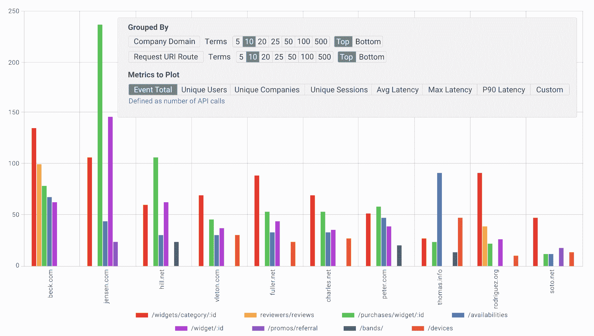
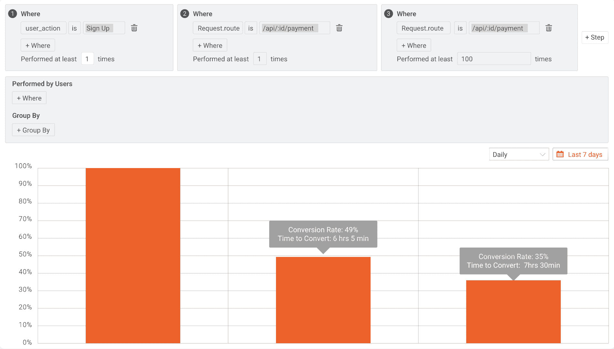
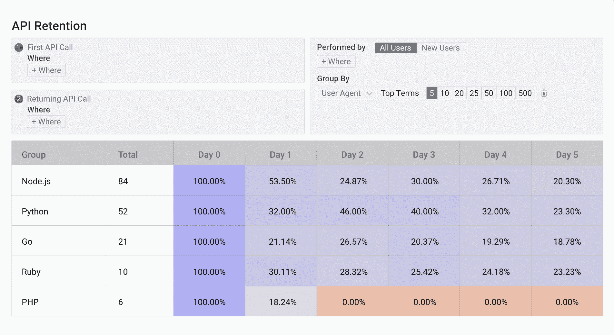
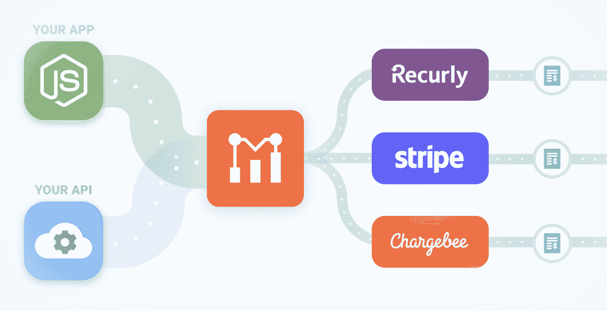

# 确定 API 价格的最佳方式是什么？

> 原文：<https://www.moesif.com/blog/product-management/api-analytics/Whats-The-Best-Way-To-Determine-The-Price-Of-An-API/>

作为一个 API 提供者，一旦你决定从你的 API 中获得收入，下一步就是弄清楚你将如何为使用定价。和任何商业决策一样，有很多方法可以为 API 定价。有许多短期策略可以建立初始定价，然后反复寻找最适合您客户的定价模式和价位。从长期来看，还可以采取一些措施来确保您的定价保持相关性，并平衡保留和收入。

在本文中，我们将深入探讨 API 定价的所有相关问题。我的目标是给你一些想法和一些最佳实践。希望在本文结束时，您将对 API 定价以及如何将下面的技术应用于您组织的货币化 API 有更好的理解。最后，我们将看看 [Moesif](https://www.moesif.com/?utm_campaign=Int-site&utm_source=blog&utm_medium=body-cta&utm_content=determine-price-apis) 如何帮助你弄清楚哪些 API 可以赚钱，如何定价，以及如何实际向用户收取使用费。让我们跳进来吧！

## API 定价是如何工作的？

与大多数产品定价一样，API 定价包含两个主要问题:将收取什么指标的费用，以及将实施什么定价模型？例如，您可以选择对每个 API 调用计费，并对每个调用收取固定的费用。当使用量超过一定数量时，您还可以享受每次通话的折扣率。也许您会决定只对每个用户或用于访问 API 的 API 密钥收费。

每家公司可能有不同的衡量标准，他们希望根据这些标准计费，并且可能希望实施不同的定价模型。这些选择都非常依赖于你正在货币化的 API 和你的业务需求。

### 什么是收费的通用指标？

有无限多的度量标准可供选择。不过，一般来说，我会想到一些常见的场景。以下是一些用于衡量 API 使用情况的最常用指标:

#### 每个事件

这个指标适用于进入 API 的每个调用。每次通话都被记录下来，并计入计费周期的总数。例如，如果您希望对每个 API 调用收取 0.10 美元的费用。如果用户调用 API 5 次，他们将在账单上收到 0.50 美元的费用。这是最受欢迎的指标之一，因为它最容易实现。

#### 每个请求/响应的主体计数

在某些情况下，您可能希望计算 API 请求或响应主体中的元素数量。如果您想根据进出 API 的有效负载向用户收费，这是非常好的。例如，如果我们希望对请求体中的每个元素收费 0.10 美元(因为每个元素都将由我们的服务处理)。在这种情况下，如果开发人员发送一个请求，请求体中有 3 个要处理的元素，他们的 API 调用将被收取 0.30 美元。

#### 每个唯一用户

当您希望根据访问 API 的唯一用户来收取使用费时，这种方法非常有用。与使用 API 密匙不同，在 API 密匙中，一个用户可能有几个密匙，相反，您在用户级别收费。举个例子，如果你想对每个用户每月收费 10 美元。在这种情况下，不管用户使用多少 API 键，可能每个环境或应用一个，他们访问平台的 API 只需支付 10 美元。

#### 每个 API 密钥

与每个唯一用户类似，费用将基于用于访问 API 的唯一 API 键的数量。在计费期结束时，总 API 密钥使用量将被累加并计费。例如，如果每个 API 键每月的成本为 5 美元。在这种情况下，如果一个开发人员有 3 个 API 键，他们使用这些键来访问 API，那么这个月他们将被收取 15 美元的使用费。

除了这里讨论的指标，还有很多其他指标。其中一些可能提供了一个很好的起点，随着您的扩展，您可能会发现需要测量更复杂的指标来适应您未来的用例。

## 可以实施哪些定价模式？

定价模式千差万别，尽管许多公司都使用一些主要的定价模式。下面让我们快速了解一些更标准的定价模型，这些模型可以在对 API 使用收费时使用。

### 标准定价

当您希望对每个 API 调用或每个唯一用户收取相同的价格时，可以使用这种定价模型。本质上，每一个被记录的使用单位都将在相同的价格点上被收费。这是现存的最简单的定价模型，如果你不想一开始就变得太复杂，这可能是一个很好的起点。

### 包裹

当您希望按包或一组单元对 API 使用收费时，可以使用这种定价模型。例如，您可以将其设置为每 1000 次 API 调用收取 10 美元。每当用户超过 1000 个 API 调用阈值时，他们就要再支付 10 美元。

### 分等级的

如果您想使用定价等级来收取使用费，分级定价是可行的。例如，在分级定价方案中，您可能对前 100 个单位收取$10.00，然后对接下来的 50 个单位收取$5.00。

### 卷

使用基于数量的定价可用于根据售出的单位总数对每个单位收取相同的价格。例如，您可以对 50 个单位收取$10.00，或对 100 个单位收取$7.00。在计费期结束时，使用量总计，总使用量将决定应用于每个使用单位的价格。

当然，这并不是一个详尽的列表。根据客户或产品的不同，您也可以对每种产品使用不同的定价模式。选择对您的特定 API 最有意义的定价模型应该在推动客户使用和确保收入最大化之间取得平衡。

## 确定 API 价格的最佳方式是什么？

一旦你决定了衡量标准和定价模式，你就必须决定你将向客户收取多少费用。当然，这可能非常复杂，取决于您使用的指标和定价模型等因素。下面的建议旨在指导您在考虑 API 价格时的一些重要考虑事项。

### 为您的业务计算 API 的成本

你需要考虑的一件事是你的 API 给你的业务带来的成本。这种成本可能是持续的支持成本、新特性的开发成本，甚至是 API 利用的第三方 API 或服务增加的成本。

最容易确定的成本是您的 API 使用的其他服务以及与它们相关的成本。目标应该是至少涵盖这些将直接导致您的业务支出的成本。您可能会考虑第三方 API 成本，可能是您的 API 用来提供其功能的其他服务，或者甚至是您的基础设施成本，如果 API 调用量会使成本增加或减少的话。

创造一个产品也需要花费时间和金钱来支持和持续的工程努力。这也应该被计算到你的 API 的拥有成本中。如果用于支持和维护的资源将大部分时间花在货币化的 API 上，这一点尤其正确。计算出 API 的基础成本或总拥有成本，可以帮助您了解价格应该从哪里开始。

### 你通过你的 API 增加了多少价值？

你的 API 给潜在用户带来了很多价值吗？例如，价值可能有许多不同的形式，但最常想到的一种形式是公司从使用您的 API 中节省了多少成本。这种节省通常表现为他们在内部开发类似服务的成本。如果这项服务需要他们 2 天的时间来创建和部署，也许你需要给你的产品增加一点深度，以获得更高的使用价值。另一方面，如果他们需要几个月的时间和大量的预算来建立你已经创造的东西，那么你可能处于一个非常好的位置。

可能很难量化确切的价值，但你应该很清楚在内部构建一个同等的服务需要什么，以及为了使用你的服务和构建他们自己的服务，公司可能愿意支付多少。另一种衡量价值的方法可能是，如果你通过你的 API 提供一项服务，而这超出了你的潜在市场的专业范围。这意味着他们可能需要雇佣一整套员工来创造你已经有的东西。使用您添加的值来给出您的定价范围，并最终确定您的 API 的价格。

### 你应该使用什么样的定价模式？

一般来说，在这方面你有两个重大的决定:你会收取订阅费还是根据实际使用情况收费？两者都有优点和缺点，也有结合两种范例的方法。例如，您可以收取每月 1000 次 API 调用的订阅费，然后以超额费的形式收取超额使用费。如果你决定对超额收费，除了定价模型之外，你还需要考虑你的超额模型。

一旦您确定了上述更高层次的定价问题，您就可以决定是否实施任何基于数量的定价、分层定价和其他可用的潜在定价方案。一些公司努力提供简单的定价策略，而其他公司则有大量的灵活性和选择。根据您的客户，以及他们可能使用的其他产品，您可能会感觉到哪种定价模式最有意义。

### 您是否应该将 SLA 和支持纳入使用成本？

除了按使用量收费之外，一些公司还对不同级别的支持收取额外费用。这可能是为你的 API 增加收入的另一种方式，可以计入你向客户收取的总价格中。你仍然可以根据一个严格的定价方案对你的 API 收费，但是对需要这样一个协议的公司的升级收费，比如一个改进的支持包。

## 继续测试你的价位

你的价格点不必永远一成不变。与大多数产品和服务一样，随着时间的推移，成本往往会增加。客户通常期望在某个时候有所增长，只要价值仍然以同等或超过的方式交付，他们就不会因为成本而流失。

### 您应该何时评估您当前的定价模式？

这个问题的答案很大程度上取决于你的商业模式。如果你做的是按月或按使用付费的模式，价格点在技术上可以随时改变。显然，你要确保客户意识到保护自己免受任何负面影响，并给客户一个适应新费率的机会。然而，如果你有一个按年付费的企业计划或更严格的基于时间的合同，你可能只能在续约时增加价格。

与竞争对手比较评估你的价格总是好的。如果您的服务更贵，您可能希望深入挖掘差异化优势，并从这方面推动，以确保您向消费者展示了成本的价值。

总的来说，应该经常评估和重新评估定价。这应包括查看您的收费、客户可以使用的定价模式，以及新功能是否保证整个定价方案的价格上涨，或者是否应在购买选项中添加新的产品包或附加产品。

### 推出价格变化的最佳方式是什么？

推出价格变化的最佳方式是确保你有准确的反馈回路。当价格发生变化时，您需要进行监控，以便客户成功和销售团队能够尝试带回流失的客户。这更像是一种被动的方法，并不是每个客户都会回来，有些人可能担心未来价格会进一步上涨。

你也要确保任何价格变化都得到很好的沟通。如果客户要续约，尽早开始谈判。如果顾客每月用信用卡付款，试着在下一个账单周期开始前让他们提前知道，这样他们就不会感到惊讶。需要注意的一点是，不要过度传达价格变化的“原因”。您可以简单介绍新功能、改进的 SLA 或其他高层次的增值，以证明增加的合理性。然而，通过列出你改进的所有特性，这可能会给客户一个机会说“我不使用它，为什么我要为它付费？”以及其他可能反对涨价的理由。

最后，你也可以在客户调查中添加一个关于价格的问题，以检查他们对当前价格是否满意，或者他们是否认为价格过高或过低。询问顾客“你愿意为我们的服务支付的上限是多少？”实际上是一种很好的方式，可以看到客户的感知价值，并在不试验实际价格的情况下测试上限可能是多少。

### 免费试用，免费层，还是什么都没有？

评估你的试用期价格也是你可以玩的东西。如果你有一个免费的试用版，试试它的长度也可能会吸引更多的付费用户。你可能会发现你的免费层“太好了”,许多客户会继续使用它。这可以防止客户跳到付费计划，因为免费计划已经涵盖了他们需要的一切。或许取消任何审判对你的生意有利？

试用可能是采用的主要驱动力，评估你的试用期优惠对你和你的客户如何起作用是定价策略的一部分。如果你在产品中尝试试用产品，确保有大量的分析输入，这样你就可以跟踪变化的真实价值。

## 使用 Moesif 进行转换分析和计费

有了 Moesif，使用 API 分析来帮助确定哪些 API 可以赚钱以及收取什么价格成为了一门更精确的科学。当然，你可以猜测所有这些因素，通过反复试验，找到有效的方法。这带来了巨大的风险，也浪费了从一开始就增加收入的机会。

使用 Moesif 平台可以帮助您为 API 找到合适的价格，引导价格变化，并优化入职。该平台可以通过使用 SDK 的现有 API 代码或利用我们的插件通过 API 网关轻松集成。

### 研究 API 端点的 API 使用情况以盈利

您熟悉哪些 API 的流量最大吗？你知道流量来自哪些公司吗？通过询问和回答 API 使用中的关键问题，您可以快速确定利用哪些终端赚钱。你甚至可以准确地预测 API 何时开始货币化。Moesif 可以帮助生成报告，以您可能从未见过的方式显示 API 使用情况。

Moesif 的一个条形图，展示了每个客户的用户在哪里生成了最多数量的 API 事件

通过使用 Moesif 深入挖掘您的 API 使用情况，您可以发现许多问题的答案，这有助于确定 API 的价值以及潜在的收费标准。实施货币化后，这些报告可以帮助您查看用户和公司层面的收入，以推动长期组织目标，并为您的 API 产品路线图提供信息。

### 用户漏斗和留存

Moesif 的用户漏斗报告，显示完成三个集成阶段的用户百分比

在你实施或改变你的定价后，你需要确保客户仍然在转化为付费客户。这可以通过 Moesif 中的[用户漏斗](https://www.moesif.com/docs/user-analytics/conversion-funnel-analysis/?utm_campaign=Int-site&utm_source=blog&utm_medium=body-cta&utm_content=determine-price-apis)来跟踪。用户漏斗将允许您概述您的转化漏斗中的每个步骤，并查看在每个步骤中用户转化的百分比以及需要多长时间。

 API 保留图表显示了哪些用户在不同的集成阶段使用了哪种语言。语言包括 node.js，python，go，ruby，php

留住顾客也很重要，尤其是在价格变化之后。通过[留存报告](https://www.moesif.com/docs/user-analytics/cohort-retention-analysis/?utm_campaign=Int-site&utm_source=blog&utm_medium=body-cta&utm_content=determine-price-apis)，您可以查看产品的历史留存率，并确保最近的定价策略变化有利于您的业务，而不是降低留存率。

### 计费仪表

 流程图显示数据从您的应用或 API 转移到 Moesif，然后再转移到支付处理器 Recurly、Stripe 或 Chargebee

Moesif 还可以帮助在您的 API 上实现货币化。通过使用[计费表](https://www.moesif.com/docs/metered-billing/?utm_campaign=Int-site&utm_source=blog&utm_medium=body-cta&utm_content=determine-price-apis)，您可以建立您想要货币化的终端和定价模式，并将使用总量发送给计费提供商，如 Stripe、Recurly 或 Chargebee。Moesif 的计费仪表以最少的工程工作量提供了端到端的货币化能力。如果您需要一个解决方案来轻松、安全、快速地将您的 API 货币化，那么 Moesif 的计费计量功能正是您所需要的。

## 包扎

最适合您业务的定价方案总是需要量身定制。对 API 调用进行定价可能非常困难，但是遵循上面的指导方针可以帮助您找到使它变得更容易和更精确的方法。确保您决定货币化的任何终端都能为开发人员及其组织带来价值，这对您的企业和他们的企业来说都是双赢的局面。

使用 Moesif 可以在 API 货币化的许多方面提供帮助，包括帮助您做出明智的定价决策，确定货币化的终端，以及在整个过程中跟踪客户保持率。首先，[立即注册](https://www.moesif.com/signup?utm_campaign=Int-site&utm_source=blog&utm_medium=body-cta&utm_content=determine-price-apis),亲自体验 Moesif 的 API 分析和货币化功能。