# Django、Stripe 和 Moesif 的端到端 API 货币化

> 原文：<https://www.moesif.com/blog/technical/stripe/End-To-End-API-Monetization-With-Django-Stripe-And-Moesif/>

许多 API 开发者和公司都在努力寻找简单的方法来建立系统，以使他们的 API 货币化。有些很简单，但不可定制，有些很复杂，需要大量的工程工作才能真正运行起来。

为了让事情变得更简单，Moesif 创建了一个名为 Billing Meters 的特性，它提供了巨大的可定制性，但只需要最少的代码和工程工作。

对于这个实际上可以开箱即用的例子，我们将使用 Moesif、Django 和 Stripe 向用户收取 API 使用费。对于这种设置，有一些假设:

*   您的机器上安装了一个工作 Python 环境
    *   我们使用 Python 3.10.5，这是撰写本文时可用的最新版本
    *   我们还使用 [pipenv](https://github.com/pypa/pipenv) 在虚拟环境中管理我们的项目
*   您有一个有效的 Stripe 帐户
*   您有一个有效的 Moesif 帐户

从外观上看，设置非常简单。我们将创建一个 **/register** 端点，它:

*   在**条**中注册一个新用户
*   为该用户订阅产品
*   在 Moesif 中注册用户和公司
*   创建一个 JWT 来认证/授权对我们货币化终端的呼叫

我还使用 Django Forms 创建了一个前端，它包含一个简单的表单，通过调用 **/register** 端点来注册用户，然后为新注册的用户显示生成的 JWT。

## 1 -以条纹形式创建您的产品和价格

我们将采取的第一步是创建一个 Stripe 产品和价格。最好先完成这一步，因为当您将 Stripe 集成到 Moesif 中时，您已经有了一些 Moesif 的定价计划。然后，可以将定价计划与 Moesif 计费仪表中设置的特定计费标准相关联。

要创建产品和价格，请登录 Stripe 并进入 Stripe UI 中的**产品**页面。在那里，点击右上角的 **+添加产品**按钮。


然后，您可以添加产品的详细信息和价格。您产品的表单将有几个要填写的字段。

### 产品资料

#### 名字

*   这是您产品的名称。在下面的例子中，我们使用名称“我的 API”。

#### 描述

*   此字段是可选的，但您可以在此输入产品的简要描述。在下面的例子中，我们使用了“这是一个货币化的 API”的描述。

#### 图像

*   可以选择上传一张图片，帮助您轻松识别产品页面上的商品。在这个例子中，我们将使用默认的占位符图像。

### 定价信息

#### 定价模型

在 Stripe 中可以设置一些不同的定价模式。这些定价模型包括:

*   **标准定价**
    *   如果您希望对每个 API 调用收取相同的费用，请使用此选项。


*   **套餐定价**
    *   如果您按包或一组单位对 API 使用收费，请使用此选项。例如，您可以将其设置为每 1000 次 API 调用收取 10 美元。每当用户超过 1000 个 API 调用阈值时，他们就要再支付 10 美元。


*   **分级定价**
    *   使用分级定价层，这可能会导致订单中的某些产品价格不同。例如，您可能对前 100 个单位收取$10.00，然后对接下来的 50 个单位收取$5.00。如今，这仅适用于经常性价格。


*   **批量定价**
    *   如果您根据售出的总数量对每个单位收取相同的价格，请使用。例如，50 个单位的单价为 10.00 美元，100 个单位的单价为 7.00 美元。


#### 价格

根据所选的定价模型，可以在此字段中设置价格。

#### 计费周期

计费周期可以设置为:

*   **每日**
*   **每周一次**
*   **每月**
*   **每 3 个月一次**
*   **每 6 个月一次**
*   **每年**
*   **客户**

对于您的 Moesif 配置，我们建议将计费周期设置为每月**月**。我们还建议，如果您正在使用 Moesif 的计费计量功能，请同时选中**用量被计量**框。

#### 按计量使用收费

一旦选择了**用量计量**复选框，将出现计量用量收费选项。此字段允许您选择计量使用的计算和收费方式。该字段的可用值为:

*   **期间使用值总和**
    *   在整个计费周期中，用户都要为其记录的使用付费
*   **期间的最近使用值**
    *   根据计费周期结束前记录的最后一次使用情况向用户收费
*   **最近使用值**
    *   在每个计费周期结束时，用户需要为在整个订阅周期中记录的最后一次使用付费
*   **期间最大使用值**
    *   用户按计费周期内记录的最高金额付费

> Moesif 计费仪表的最佳设置是将该值设置为时间段内使用值的总和，因为 Moesif 每小时向条带报告使用情况

#### 价格描述

这是一个可选字段，但建议填写。您可以在这里简单描述您的价格。这将使您更容易理解您在 Moesif 的计费表中选择的价格，尤其是在一种产品有多个价格的情况下。

输入产品和价格的所有详细信息后，您可以点击屏幕右上角的**保存产品**。


当您创建产品时，您将能够在**产品**屏幕上查看和编辑它们。

## 2 -启用 Moesif-条带集成

一旦你的产品和价格确定下来，是时候开始整合 Stripe 和 Moesif 了。要开始在 Moesif 中配置 Stripe，请转到**计费表**页面，并点击屏幕右上角的**编辑计费提供商**下拉菜单。


这将打开条带配置屏幕，引导您完成集成。在这个屏幕上，您可以获得将 Stripe 插入 Moesif 所需的所有信息。配置的每个步骤都包含在模式中。

### 将 Moesif webhook 添加到条带

集成的第一步是将 Moesif webhook 添加到 Stripe 的配置中。添加此功能允许 Stripe 向 Moesif 发送订阅更新。

要将 Moesif webhook 添加到 Stripe，从右上角点击**开发者**，然后在左侧菜单中点击 **Webhooks** 。这将把你带到**网页挂钩**页面，在那里你可以查看现有的网页挂钩并添加新的。要添加新的 webhook，我们将单击屏幕底部的**添加端点**按钮。


从这里，我们将插入我们的 Moesif API 端点 URL，并配置要监听的事件。您需要将 Moesif Webhook URL 复制到**端点 URL** 字段，然后点击 **+选择事件**按钮。

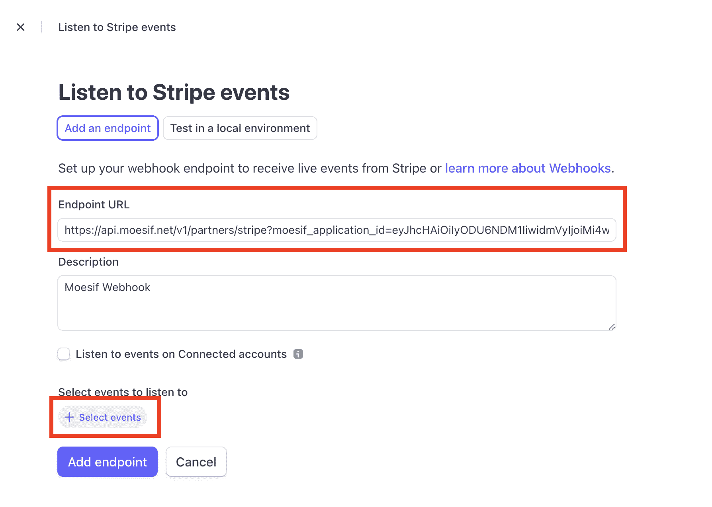

> 这些细节都可以在前面提到的 Moesif 中的条带配置页面上找到。

您应该选择**客户**下的选项进行**选择所有客户事件**。之后，点击屏幕底部的**添加事件**按钮。


此后，您将返回到添加端点详细信息的原始屏幕。滚动到屏幕底部，单击**添加端点**将端点保存到条带。

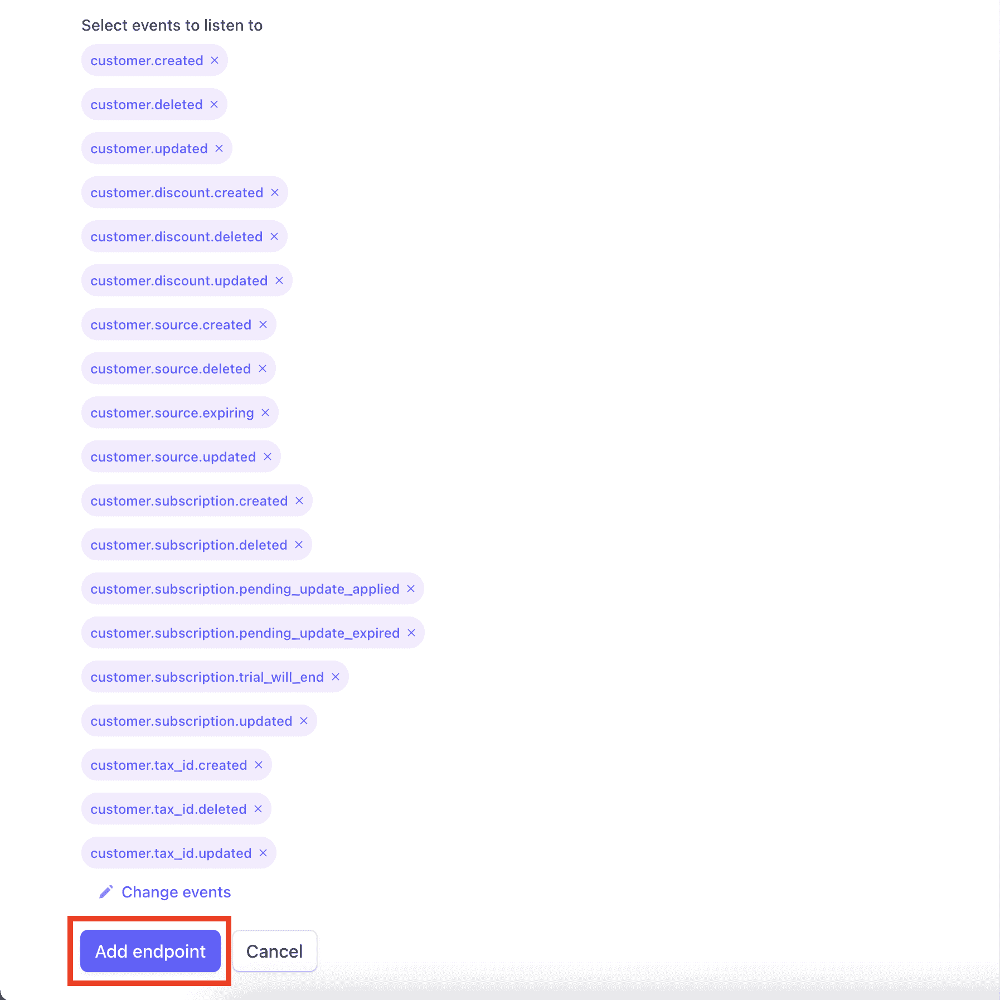

### 将条带 API 细节插入 Moesif

为了让 Moesif 向 Stripe 中的订阅添加使用量，我们需要向 Moesif 中添加 Stripe API 细节。这是在 Moesif 的条带配置屏幕中完成的，与我们之前使用的屏幕相同。


目前，Moesif 仅支持条带 API 的版本 **2020-08-27** ，因此字段默认为**条带 API 版本**字段。

对于 **Stripe API 密钥**字段，您需要从 Stripe 中检索 API 密钥以将其插入。从**开发者**界面，与我们在上一步中使用的界面相同，您将点击 **API 键**。然后，您将能够在屏幕上的**秘密密钥**或生成的**受限密钥**字段中看到您的 API 的私有密钥。两个键都可以用。


从 Stripe 复制密钥后，您将把这个密钥粘贴到 Moesif 中的 **Stripe API 密钥**字段。完成后，回到 Moesif，你可以向下滚动到屏幕底部，点击**保存**保存配置。


至此，Moesif 中的条带集成已经完成，您可以开始使用它了。

> 或者，您也可以在 Moesif 中定制**客户 ID 源**。默认设置将适用于本指南，不需要进行任何更改。如果您确实需要定制它，这些设置允许您指定如何将条带**订阅**和**客户**对象映射到 Moesif 中的**公司 ID** 和**用户 ID** 。

## 3 -创建计费计数器

一旦您在 Moesif 中激活了条带集成，您就可以开始设置您的计费表了。在 Moesif 中创建的计费表做两件事:根据特定的标准跟踪使用情况，并向计费提供者报告使用情况。Moesif 允许您相对容易地设置非常简单和非常复杂的计费表。

要创建计费表，在 Moesif 中，您将导航至**计费表**屏幕。您可以从左侧菜单中完成此操作。


在计费表屏幕上，点击屏幕右上角的 **+添加计费表**。


下一个屏幕是您可以实际输入计费表标准的地方。


该屏幕上的字段包括:

*   **计费电表名称**
    *   这是您的新计费仪表的 Moesif 内部名称
*   **账单提供商**
    *   在此下拉列表中，您可以选择要将您的使用指标发送给哪个计费提供商。
*   **产品(仅条纹)**
    *   在这里，您可以选择您在 Stripe 中设置的产品，您希望您的使用指标与该产品相关联。
*   **价格(仅条纹)**
    *   计费计数器的计费提供者设置中的最后一个字段，您可以在这里选择要将您的使用指标绑定到哪个价格。
*   **使用乘数**
    *   在将数据发送给选定的计费提供商之前，可以选择将您的使用量乘以一个比率。
*   **舍入模式**
    *   如果 usage multiplier 设置为小于 1.0 的任何值，Moesif 可以在几种不同的模式下取整。那些模式分别是*上*、*下*、*半上*、*半下*、*半平*。
*   **过滤器**
    *   在过滤器配置下，您将配置您的计费标准，以仅包括符合特定标准的请求。
*   **指标**
    *   在这里，您可以选择希望计费的指标。可用选项包括:

    *   **事件计数**
        *   这将增加符合过滤标准中列出的标准的每个事件的使用量。
    *   **唯一用户**
        *   每当唯一用户发送符合过滤标准的请求时，这将增加使用量。对于每个唯一用户，无论该用户的事件计数是多少，计数都将增加 1。
    *   **唯一会话/API 密钥**
        *   每当使用唯一的会话或 API 键来发送符合过滤标准的请求时，这将增加使用量。对于每个唯一的会话或 API 键，无论该特定会话或 API 键的事件计数如何，计数都将增加 1。
    *   **自定义**
        *   这允许配置标准与*过滤器*提供的标识符相同。

> 指标下还有其他选项，但以上 4 个选项最适用于基于使用的计费。

例如，在本指南中，我们将创建一个计费计量器，用于过滤单个端点的流量，以及请求收到成功 HTTP 200 响应的位置。我们将使用**事件计数**指标来确保每个请求都被添加到计数中并被发送到计费提供者。

在 Moesif 中，计费表的配置如下所示。

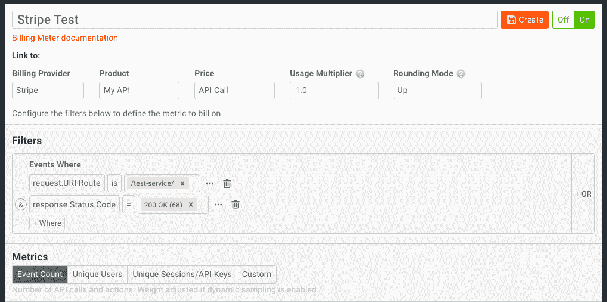

然后，我们将单击**创建**。这将创建并激活**计费表**。然后，当您返回计费表仪表板时，您将看到新的计费表出现。


Moesif 现在将汇总使用情况，并将这些详细信息发送给 Stripe。现在计费表已经配置好了，我们将设置一个流程让用户注册、订阅并创建一个 JWT，这样他们就可以使用我们的货币化 API。

## 4 -创建/register 端点

我们将构建自己的流程，而不是使用预先构建的入职流程，例如通过 API 网关中的开发人员门户。我们将创建一个名为 **/register** 的端点，然后我们可以用它来装载想要使用 API 的用户。结果将是用户收到一个他们可以使用的 JWT，它将跟踪他们的使用情况。

由于我们使用 Moesif、Stripe 和 Python 作为我们整体解决方案的一部分，我们需要确保每个组件都能正常工作。

端点将执行以下操作:

*   创建带条纹的客户
*   为新客户订阅条带中的 API 订阅
*   在 Moesif 中创建 CompanyID(这将是条带订阅 ID)
*   在 Moesif 中创建 UserID(这将是 Stripe 客户 ID)
*   创建一个带有包含条带客户 ID 的`id`字段的 JWT

> 如果您在 Moesif 和其他系统中已经有了您想要使用的用户和公司标识符，而不是使用 Stripe 的客户和订阅作为您的 id，您可以在 Moesif 中的 Stripe 配置设置下这样做。

在这个例子中，我将使用 Django REST 框架创建一个简单的 Django API 来完成上述任务。

### 安装必要的 python 依赖项

如前所述，我们将利用`pipenv`在虚拟环境中安全地管理我们的依赖关系。Pipenv 为开发人员提供了一种设置工作环境的简单方法。使用 pipenv 给了我们一些更高级的特性，但最重要的是包括对环境变量的内置支持。

我创建了一个名为`moesif-monetization-django`的文件夹，我将在其中工作，但你可以随意命名你的文件夹。在您喜欢的 IDE 或文本编辑器中打开此目录。在本教程的剩余部分，我将使用 Visual Studio 代码进行所有编码。打开 Code 的集成终端，使用`pipenv`安装以下依赖项，以便在您的虚拟环境中使用。

```py
pipenv install django djangorestframework moesifdjango stripe pyjwt 
```

您将看到`Pipfile`和`Pipfile.lock`文件都已创建。

这些依赖项将帮助我们调用 REST 端点，连接到 Stripe 和 Moesif，生成和验证 jwt，以及我们将构建到应用程序中的各种其他功能。

> 如果您愿意，使用 pip 并全局安装您的依赖项是一个非常好的选择。如果您使用 pip，您将需要安装 django-environ 包来管理环境变量。您将使用的命令如下所示:`pip install django moesifdjango stripe django-environ`。

### 启动 pipenv shell

让我们进入虚拟环境的外壳，开始设置我们的项目。

```py
pipenv shell 
```

### 创建 Django 项目

接下来，我们将使用`django-admin startproject`命令创建一个名为 moesif _ monetization 的文件夹，并准备我们的项目。这是我们添加 API 代码的地方。运行以下命令:

```py
django-admin startproject moesif_monetization . 
```

您将在当前工作目录中看到一个 moesif _ monetary 文件夹以及一个`manage.py`文件。

最后，我们将通过运行以下命令来应用必要的迁移:

```py
python manage.py migrate 
```

### 确认项目相关性

您可以仔细检查您的 **Pipfile** 文件是否包含正确的依赖关系:

```py
[[source]]
url = "https://pypi.org/simple"
verify_ssl = true
name = "pypi"

[packages]
django = "*"
moesifdjango = "*"
stripe = "*"
djangorestframework = "*"
pyjwt = "*"
moesifapi = "*"

[dev-packages]

[requires]
python_version = "3.10" 
```

您的依赖项将被引入项目并安装到我们的虚拟环境中。这些依赖项将帮助我们调用 REST 端点，连接到 Stripe 和 Moesif，生成和验证 jwt，以及我们将构建到应用程序中的各种其他功能。

### 创建。环境文件

我们不会将条带键和其他静态值硬编码到我们的应用程序中，而是将它们抽象到一个. env 文件中。同样，我们将利用`pipenv`对环境变量的内置支持。

在根目录下，创建一个名为**的文件。env** 。在这个文件中，我们将添加几个条目，其中包含代码中使用的键和值。

```py
STRIPE_API_KEY="sk_test_XXX"
STRIPE_PRICE_KEY="price_XXX"
MOESIF_APPLICATION_ID="YOUR_MOESIF_APPLICATION_ID"
TOKEN_SECRET_KEY="YOUR_TOKEN_SECRET_KEY” 
```

这里的值可以在以下位置找到:

`STRIPE_KEY` *这可以在我们之前为计费表获取条带和 Moesif 集成密钥的相同位置找到。实际上，您可以为两者使用同一个键，或者创建一个**受限键**，其范围正好是每个功能所需的范围。*


`STRIPE_PRICE_KEY` *这将是您之前在 Stripe 中创建的**价格**的价格键。这可以通过转到条带中的产品并从 **API ID** 列中获取值来找到。*


`MOESIF_APPLICATION_ID` *这可以在 Moesif 中找到，方法是转到屏幕左下方的菜单链接(会显示你的名字)并选择 **API 键**。*


*该密钥将出现在**采集器应用 Id** 下的页面上。*


这将是用于生成和验证 jwt 的一部分的秘密。

用四个键值对填充文件后，保存文件。在本教程的剩余部分，我们不需要再接触这个文件。

### 设置 settings.py 文件

我们需要对 Django 为我们生成的默认设置文件进行一些修改。我们将添加几个应用程序，这个术语包括 python 包、模型、视图、模板、模板标签、静态文件、URL 和我们项目中使用的中间件。

首先，将以下导入添加到文件中。

```py
import os, jwt 
```

接下来，我们将把`rest_framework`添加到我们的`INSTALLED_APPS`定义中。

```py
INSTALLED_APPS = [
    'django.contrib.admin',
    'django.contrib.auth',
    'django.contrib.contenttypes',
    'django.contrib.sessions',
    'django.contrib.messages',
    'django.contrib.staticfiles',
    'rest_framework',
] 
```

注释掉`CsrfViewMiddleware`并将`moesif_middleware`添加到`MIDDLEWARE`定义中。

```py
MIDDLEWARE = [
    'django.middleware.security.SecurityMiddleware',
    'django.contrib.sessions.middleware.SessionMiddleware',
    'django.middleware.common.CommonMiddleware',
    # 'django.middleware.csrf.CsrfViewMiddleware',
    'django.contrib.auth.middleware.AuthenticationMiddleware',
    'django.contrib.messages.middleware.MessageMiddleware',
    'django.middleware.clickjacking.XFrameOptionsMiddleware',
    'moesifdjango.middleware.moesif_middleware'
] 
```

接下来，我们将定义我们的`identifyUser`函数，它使我们能够跟踪 Moesif 中的用户并配置我们的 Moesif 中间件。

```py
def identifyUser(req, res):
    customerID = ""

    try:
        jwt_token = req.headers['Authorization']
        tokenArray = jwt_token.split(" ");
        decodedJWT = jwt.decode(tokenArray[1], os.environ['TOKEN_SECRET_KEY'], algorithms=["HS256"])
        customerID = decodedJWT.get("id")
    except Exception as exception:
        print(exception)
        customerID = ""

    if customerID != "":
        # Sending customerID to Moesif...
        return customerID
    else:
        # CustomerID not found - possibly not included in request authorization header
        return None

MOESIF_MIDDLEWARE = {
    'APPLICATION_ID': os.environ['MOESIF_APPLICATION_ID'],
    'CAPTURE_OUTGOING_REQUESTS': False, # Set to True to also capture outgoing calls to 3rd parties.
    'IDENTIFY_USER': identifyUser, # Optional hook to link API calls to users } 
```

我们的`identifyUser`函数有点超前了。当我们的 Django 服务器收到一个 API 调用时，它的内容就会被转发给 Moesif。在这个函数中，我们将从请求的`Authorization Header`中提取 JWT。我们将解析它，并对照我们的令牌密钥进行检查，这样我们就可以提取出`customerID`,从而在 Moesif 中实现用户跟踪。

我们还用我们的应用程序 ID 定义和配置 Moesif 中间件。我们将需要稍后重新访问这个文件，但是现在让我们继续站立我们的 API。

### 编辑 urls.py 文件

在我们 app 的根目录下，我们将编辑生成的 **urls.py** 文件。在这个文件中，我们将添加下面的代码，它简单地定义了我们的端点:

```py
from django.contrib import admin
from django.urls import path
from moesif_monetization import views

urlpatterns = [
    path('admin/', admin.site.urls),
    path('test-service/', views.test_service),
    path('register/', views.register),
] 
```

我们稍后还将回到这一点，以便为我们的前端配置端点。

### 创建 views.py 文件

我们的下一步是实现我们的**/注册**和**/测试服务**端点的逻辑。

**/register** 端点将在我们生成的 JWT、条带和 Moesif 之间创建绑定。结果将是一个生成的 JWT，它将使用情况与 Moesif 中的用户相关联，然后报告给 Stripe。

首先，让我们定义我们的导入并配置我们的 api 客户机。

```py
import os, stripe, jwt, json
from moesifapi.moesif_api_client import *
from moesifapi.models import *
from django.http.response import JsonResponse
from rest_framework import status

stripe.api_key = os.environ['STRIPE_API_KEY']
api_client = MoesifAPIClient(os.environ['MOESIF_APPLICATION_ID']).api 
```

现在我们将定义我们的`register`函数。我们流程中的第一步是创建 Stripe 中的客户。我们将使用 Stripe python 包来做到这一点。我们将使用来自请求正文的参数(电子邮件、名字、姓氏)来使用**条带创建条带中的客户。创建**函数。然后，我们将把创建的客户存储在一个自定义变量中，这样我们就可以访问 Stripe 中生成的**客户 ID** 。

```py
def register(request):
  request_body = json.loads(request.body.decode('utf-8'))

  # Create Stripe Customer
  customer = stripe.Customer.create(
    email = request_body['email'],
    name = request_body['firstname'] + ' ' + request_body['lastname'],
    description = 'Customer created through /register endpoint'
  )
  print("Creating Stripe Customer Complete. Returned ID: " + customer.id) 
```

在同一个函数体中，我们将为这个新用户订阅我们之前在 Stripe 中创建的 API 订阅。我们将使用**条纹。Subscriptions.create** 函数并使用从前面的函数调用中生成的**客户 ID** 来订阅它们。这将返回一个**订阅**对象，其中包含一个我们稍后会用到的 ID。

```py
 # Create Stripe Subscription
  subscription = stripe.Subscription.create(
    customer = customer.id,
    items = [{'price': os.environ['STRIPE_PRICE_KEY']}]
  )
  print("Creating Stripe Subscription Complete. Returned ID: " + subscription.id) 
```

在 Stripe 中创建了我们的客户和订阅之后，我们将使用 Moesif 中间件来创建用户，并将他们的相关详细信息添加到 Moesif 中。首先，我们将调用 Moesif 中间件的 **update_company** 函数，将条带 **subscription.id** 映射到 Moesif 中的 **companyId** 。

```py
 # Create Company in Moesif
  company = {'company_id': subscription.id}
  update_company = api_client.update_company(company) 
```

我们的下一步是生成附加了 Stripe 客户 ID 的 JWT。这一行将为我们创建一个用于端点的 JWT。

```py
 token = jwt.encode({'id': customer.id}, os.environ['TOKEN_SECRET_KEY']) 
```

然后，我们将对 **update_user** 函数执行类似的步骤，并使用它将条带 **customer.id** 映射到 **userId** ，将条带 **subscription.id** 映射到 **companyId** ，并将我们收集的关于用户的一些其他元数据映射到 Moesif。

可选地，我们将把我们的 JWT 添加到我们的 Moesif 用户元数据中，以便于使用。不建议在生产环境中使用这种方法，但在测试您的设置时会有所帮助，如果您丢失了之前生成的 JWT，可以不生成新的。

```py
 # Create User in Moesif
  user = {
    'user_id': customer.id,
    'company_id': subscription.id,
    'metadata': {
      'email': request_body['email'],
      'first_name': request_body['firstname'],
      'last_name': request_body['lastname'],
      'metadata': {
        'jwt': token
      }
    }
  }
  update_user = api_client.update_user(user) 
```

最后，我们将向调用者返回一个**200 OK**JSON 响应，并在响应体中包含 JWT。

```py
 return JsonResponse(data=token, status=status.HTTP_200_OK, safe=False, encoder=json.JSONEncoder) 
```

完成的函数将如下所示:

```py
def register(request):
  request_body = json.loads(request.body.decode('utf-8'))

  # Create Stripe Customer
  customer = stripe.Customer.create(
    email = request_body['email'],
    name = request_body['firstname'] + ' ' + request_body['lastname'],
    description = 'Customer created through /register endpoint'
  )
  print("Creating Stripe Customer Complete. Returned ID: " + customer.id)

  # Create Stripe Subscription
  subscription = stripe.Subscription.create(
    customer = customer.id,
    items = [{'price': os.environ['STRIPE_PRICE_KEY']}]
  )
  print("Creating Stripe Subscription Complete. Returned ID: " + subscription.id)

  # Create Company in Moesif
  company = {'company_id': subscription.id}
  update_company = api_client.update_company(company)

  # Encode JWT
  token = jwt.encode({'id': customer.id}, os.environ['TOKEN_SECRET_KEY'])

  # Create User in Moesif
  user = {
    'user_id': customer.id,
    'company_id': subscription.id,
    'metadata': {
      'email': request_body['email'],
      'first_name': request_body['firstname'],
      'last_name': request_body['lastname'],
      'metadata': {
        'jwt': token
      }
    }
  }
  update_user = api_client.update_user(user)

  return JsonResponse(data=token, status=status.HTTP_200_OK, safe=False, encoder=json.JSONEncoder) 
```

接下来，我们将实现我们的**/测试服务**端点的逻辑。

```py
def test_service(request):
  try:
    # Parse request headers and jwt token array
    jwt_token = request.headers['Authorization']
    token_array = jwt_token.split(" ")

    # Attempt to decode JWT
    print("JWT tokenized: " + token_array[1]);
    decoded = jwt.decode(token_array[1], os.environ['TOKEN_SECRET_KEY'], algorithms=["HS256"])
    print("Decoded: " + decoded.get("id"))
  except Exception:
    return JsonResponse(data="Bad Auth Token", status=status.HTTP_401_UNAUTHORIZED, safe=False)

  return JsonResponse(data={token_array[0]: token_array[1]}, status=status.HTTP_200_OK, safe=False) 
```

我们将尝试解析我们传递的 JWT 的授权头。然后，我们将尝试使用我们的`.env`文件中的`TOKEN_SECRET_KEY`来解码 JWT。根据结果，我们将返回适当的`JsonResponse`对象，成功地包含我们的 JWT 令牌用于审计目的。

有了这个，我们现在可以实际测试我们的端点，以确保每个部分都按预期工作。结果应该是一个注册用户与相关的 JWT，将记录和报告使用数据到条纹。让我们继续测试它。通过运行以下命令启动服务器:

```py
python manage.py runserver 
```

## 5 -向/register 端点发送测试请求

一旦您的 **/register** 端点被编码和部署，就该测试它了。现在我们将简单地使用 Postman 来发送请求。我们的请求将包含一个 JSON 请求体，该请求体将包含:

*   西方人名的第一个字
*   姓
*   电子邮件

当然，这是我们在 Stripe 和 Moesif 中配置我们的系统和配置文件以及生成 JWT 所需的最少信息。您可以根据特定用例的需要轻松添加更多字段。

在 Postman 中，我们将使用以下信息创建我们的请求:

**请求类型:** `POST`

**端点 URL:** `http://127.0.0.1:8000/register`

**请求正文:**

```py
{  "firstname":  "Userfirstname",  "lastname":  "Userlastname",  "email":  "test@test.com"  } 
```

一旦所有东西都插入到 Postman 中，它应该看起来像下面这样:

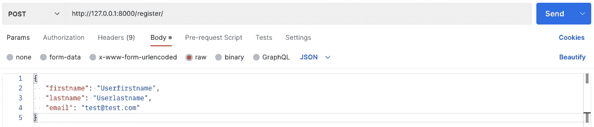

发送请求后，响应应该包含新注册用户可以使用的 JWT。


我们现在将检查 Stripe，以确保我们向客户注册的信息正确输入到 Stripe 中。

重新登录 Stripe，您将导航至**客户**屏幕。您应该会在列表中看到新创建的用户。

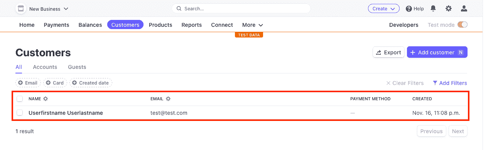

单击列表中新添加的客户。在下一个屏幕上，您应该看到该客户也订阅了您的 API 订阅。


检查完成后，我们可以放心地假设我们的 **/register** 端点正在 Stripe 中正确地设置我们的用户帐户和订阅。

## 6 -使用生成的 JWT 调用您的 API

我们的下一步是实际使用我们生成的 JWT。然后，我们将确认所有正确的信息都已添加到 Moesif 中。我们正在确认的数据包括:

*   条带客户 ID 映射到 Moesif 用户 ID
*   条带订阅 ID 映射到 Moesif 公司 ID
*   Moesif 包含用户配置文件中的条带元数据

### 使用邮递员发送请求

接下来，让我们使用 Postman 或另一个平台向 **/test-service** 端点发送一个请求。这是我们在上面的步骤 3 中为其设置计费计量器的端点。

在《邮差》中，我们将:

*   将**/测试服务** API 端点作为请求 URL
*   选择授权选项卡
*   选择类型作为不记名令牌
*   填充令牌详细信息
*   将令牌设置为从我们的/register 调用收到的 JWT

下面是 Postman 中填充请求配置的一个示例。

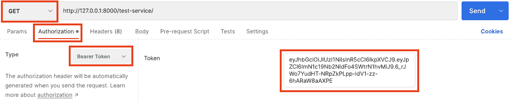

要将请求发送到我们的端点，请单击 send。

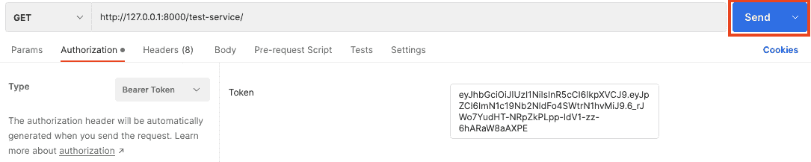

一旦发送，API 调用分析应该在 Moesif 着陆。

### 确认 Moesif 收到了请求信息

回到 Moesif，您将导航到**实时事件日志**屏幕。您可以通过点击**新建**按钮并选择**实时事件日志**来完成此操作。

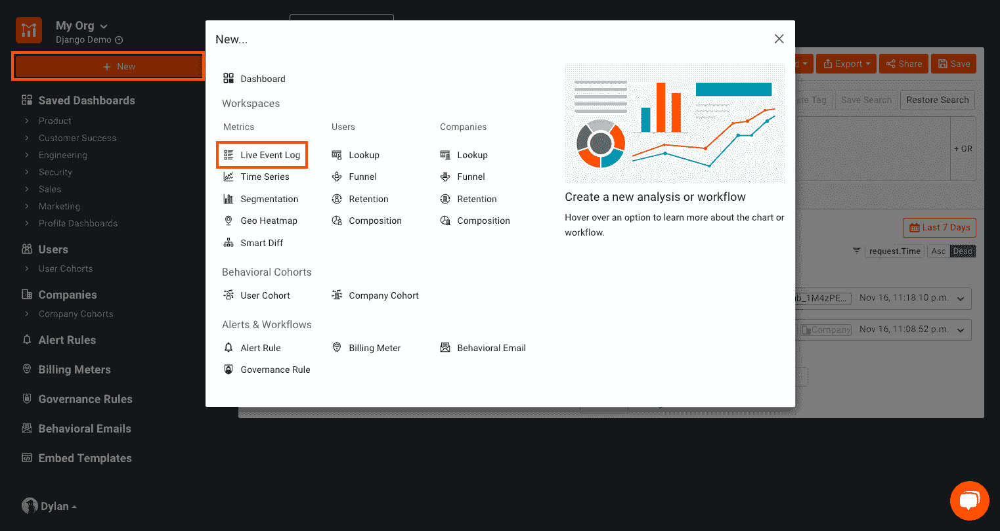

在这个屏幕上，您应该会看到您刚刚发送的请求。您应该会看到该条目包含一个用户 ID 和一个公司 ID，其中填充了 Stripe 用户和订阅 ID。条目应该如下所示:

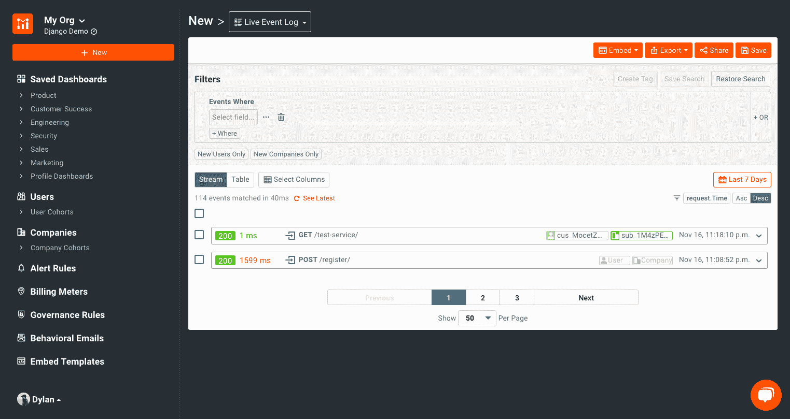

> 客户 ID 看起来像“库斯 _XXXX ”,订阅 ID 看起来像“sub_XXXX”。

如果您单击实时事件日志屏幕上条目中显示的用户 ID，您将进入用户资料页面。在此页面上，我们将确认条带元数据是否存在。我们需要在配置文件中添加一个新列来显示条带数据。为此，在个人资料页面，点击 **…更多操作**按钮，然后点击**自定义个人资料的布局**。


然后，我们将为条带元数据添加一个新列。您将单击屏幕最右侧的 **+** 按钮来创建一个新列，我们将在其中添加条带元数据。

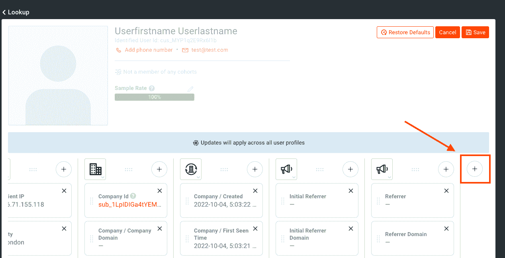

> 您可能需要向右滚动才能看到它，这取决于您的分辨率和屏幕大小，以便看到+按钮。

然后，您将深入到**元数据>条带>客户>创建**，并在新行中使用该字段。我还改变了一个更适合的列图像。您可以通过点击图片并选择最合适的图片进行定制。


您还可以添加其他字段，但是目前仅这一个字段就足以告诉我们 Moesif 正在正确地从 Stripe 接收数据。

> 如果您没有看到条带元数据条目作为可用字段，请等待几分钟。如果几分钟后条带元数据不存在，请确保 Moesif 中的条带配置是正确的。在确认或编辑它之后，尝试创建一个新用户并再次发送请求以确认集成正在工作。

在这一点上，我们现在已经确认我们的 API 调用正在工作，并且在 Moesif 中使用了正确的用户和公司详细信息。我们还确认了 Stripe 正在将数据发送回 Moesif，这些数据被正确地映射到相应的用户配置文件，这是通过 Moesif 中的 Stripe 元数据确认的。

## 7 -创建前端

接下来，我们想添加一个简单的小前端，这样我们就不需要通过邮递员调用我们的 JWT。我们将制作一个快速的小注册表单，然后返回一个 JWT 供我们新注册的用户使用。

首先，我们将创建几个模板文件，然后编辑 settings.py 文件，将 moesif _ monetary 项目作为应用程序添加进来，并让 Django 找到我们的模板文件。然后，我们将更新我们的 urls.py 文件，以引入一些新的端点。接下来，我们将实现 html 页面的标记。此外，我们将创建 Django 表单，用于协调视图之间的数据传递。最后，我们将更新 views.py 文件，并对我们的函数进行一些更改，以适应从前端接收数据。

### 添加前端文件

在应用程序的 moesif_monetization 目录中，我们将创建一个名为`templates`的文件夹。然后，我们将在该文件夹中添加一个**base.html**、一个**index.html**和一个**registered.html**文件。

此外，在 moes if _ monetary 目录中创建一个 **forms.py** 文件。

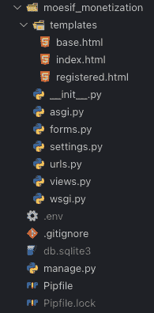

### 编辑 settings.py 文件

将`moesif_monetization`或者您的项目名称添加到`INSTALLED_APPS`数组中。这允许 Django 将我们的项目视为一个应用程序本身，并呈现我们的前端。

```py
INSTALLED_APPS = [
    'django.contrib.admin',
    'django.contrib.auth',
    'django.contrib.contenttypes',
    'django.contrib.sessions',
    'django.contrib.messages',
    'django.contrib.staticfiles',
    'rest_framework',
    'moesif_monetization'
] 
```

此外，将以下内容添加到`TEMPLATES`部分的`DIRS`部分。这允许 Django 定位我们的模板文件。

```py
TEMPLATES = [
    {
        'BACKEND': 'django.template.backends.django.DjangoTemplates',
        'DIRS': [os.path.join(BASE_DIR, 'templates')],
        'APP_DIRS': True,
        'OPTIONS': {
            'context_processors': [
                'django.template.context_processors.debug',
                'django.template.context_processors.request',
                'django.contrib.auth.context_processors.auth',
                'django.contrib.messages.context_processors.messages',
            ],
        },
    },
] 
```

### 编辑 url.py 文件

在 **urls.py** 文件中，我们将添加路由来服务静态 HTML 文件。用以下代码替换我们之前输入的内容:

```py
urlpatterns = [
    path('', views.index, name='index'),
    path('admin/', admin.site.urls),
    path('test-service/', views.test_service),
    path('register/', views.register),
    path('registered/', views.registered, name='registered'),
] 
```

现在，当您导航到 [http://127.0.0.1:8000/](http://127.0.0.1:8000/) 时，该代码将加载网站(一旦我们插入代码)。

### 编写前端表单代码

最后，让我们添加前端 HTML 和 Django 表单功能的代码。在**base.html**文件中，我们将添加如下所示的标记:

```py
<!DOCTYPE html>
<html lang="en">
<head>
    <meta charset="UTF-8">
    <meta http-equiv="X-UA-Compatible" content="IE=edge">
    <meta name="viewport" content="width=device-width, initial-scale=1.0">
    <title>Moesif Monetization Demo</title>

    <!-- Bootstrap CSS -->
    <link rel="stylesheet" href="https://maxcdn.bootstrapcdn.com/bootstrap/4.0.0/css/bootstrap.min.css" integrity="sha384-Gn5384xqQ1aoWXA+058RXPxPg6fy4IWvTNh0E263XmFcJlSAwiGgFAW/dAiS6JXm" crossorigin="anonymous">

    <script src="https://code.jquery.com/jquery-3.2.1.slim.min.js" integrity="sha384-KJ3o2DKtIkvYIK3UENzmM7KCkRr/rE9/Qpg6aAZGJwFDMVNA/GpGFF93hXpG5KkN" crossorigin="anonymous"></script>
    <script src="https://cdnjs.cloudflare.com/ajax/libs/popper.js/1.12.9/umd/popper.min.js" integrity="sha384-ApNbgh9B+Y1QKtv3Rn7W3mgPxhU9K/ScQsAP7hUibX39j7fakFPskvXusvfa0b4Q" crossorigin="anonymous"></script>
    <script src="https://maxcdn.bootstrapcdn.com/bootstrap/4.0.0/js/bootstrap.min.js" integrity="sha384-JZR6Spejh4U02d8jOt6vLEHfe/JQGiRRSQQxSfFWpi1MquVdAyjUar5+76PVCmYl" crossorigin="anonymous"></script>

    <script src="https://unpkg.com/htmx.org@1.6.1"></script>
</head>
<body>

    <div class="container mt-4">
        
        
    </div>

</body>
</html> 
```

另外，在**index.html**文件中。

```py



<form method="post">
  {{ form.as_p }}
  <input type="submit" value="Register">
</form>

 
```

最后，**registered.html**文件。

```py



<p>
  {{ jwt }}
</p>
<a href="../">Go Back</a>

 
```

### 创建注册表单

在我们的 **forms.py** 文件中，让我们定义我们的注册表单。

```py
from django import forms

class RegistrationForm(forms.Form):
  first_name = forms.CharField(label='First Name', max_length=100)
  last_name = forms.CharField(label='Last Name', max_length=100)
  email = forms.EmailField(label='Email', max_length=100) 
```

这个标记与我们的 forms.py 文件相结合，将显示一个允许用户输入电子邮件、名字和姓氏的表单。它还有一个注册按钮，可以调用我们将要实现的新的 **register_frontend** python 函数。该函数将在我们的 **views.py** 文件中。

### 编辑 views.py 文件

我们将添加以下三个函数和导入来完成我们的 views.py 文件。

```py
...

from django.shortcuts import render
from .forms import RegistrationForm

...

def index(request):
  context = {'form': RegistrationForm()}
  if request.method == 'POST':

    # create a form instance and populate it with data from the request:
    form = RegistrationForm(request.POST)

    # check whether it's valid:
    if form.is_valid():
      response = register_frontend(form.cleaned_data['email'], form.cleaned_data['first_name'], form.cleaned_data['last_name'])
      print("get_registration_info - Valid")
      jwt = (response.content.decode("utf-8").strip('"'))
      request_context = {'jwt': jwt}
      return render(request, 'registered.html', request_context)
    else:
      print("get_registration_info - not valid")
  else:
      print("get_registration_info - Not Post")

  return render(request, 'index.html', context)

def registered(request):
  return render(request, 'registered.html')

def register_frontend(email, firstname, lastname):

  # Create Stripe Customer
  customer = stripe.Customer.create(
    email = email,
    name = firstname + ' ' + lastname,
    description = 'Customer created through /register endpoint'
  )
  print("Creating Stripe Customer Complete. Returned ID: " + customer.id)

  # Create Stripe Subscription
  subscription = stripe.Subscription.create(
    customer = customer.id,
    items = [{'price': os.environ['STRIPE_PRICE_KEY']}]
  )
  print("Creating Stripe Subscription Complete. Returned ID: " + subscription.id)

  # Create Company in Moesif
  company = {'company_id': subscription.id}
  update_company = api_client.update_company(company)

  token = jwt.encode({'id': customer.id}, os.environ['TOKEN_SECRET_KEY'])

  # Create User in Moesif
  user = {
    'user_id': customer.id,
    'company_id': subscription.id,
    'metadata': {
      'email': email,
      'first_name': firstname,
      'last_name': lastname,
      'metadata': {
        'jwt': token
      }
    }
  }
  update_user = api_client.update_user(user)

  return JsonResponse(data=token, status=status.HTTP_200_OK, safe=False, encoder=json.JSONEncoder) 
```

**register_frontend** 函数本质上与我们之前实现的 register 函数相同，只是做了一些小的改动，以适应前端如何将数据传递给后端。

## 8 -测试前端

要测试前端，保存您的代码更改并重启服务器。然后，在浏览器中，导航到 [http://127.0.0.1:8000/](http://127.0.0.1:8000/) 。然后，您将看到表单出现。

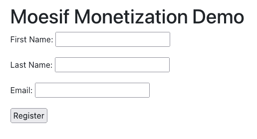

### 填写表单字段并提交

现在表单已经加载到屏幕上，请填写字段并单击 Register 按钮。这将获取信息，将其发送到我们的 **/register_frontend** 端点，并给我们生成的 JWT。

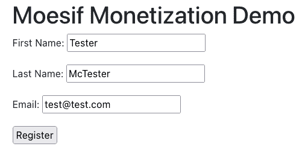

> 建议您使用一个不同的电子邮件，而不是之前通过 **/register** 端点直接创建 JWT 时使用的电子邮件。

### 确认 JWT 回来了

单击提交按钮后，几秒钟后，JWT 应该会返回到 UI。

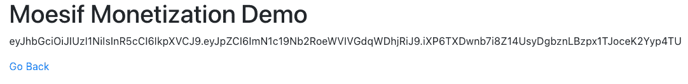

## 9 -向您的货币化 API 发送请求

我们将再次希望确保所有东西都与我们的 UI 一起工作，直到我们的后端系统。为此，只需重复从**步骤 6** 开始的步骤，以确认用户和公司 id 已正确填充，并且为该用户和新 JWT 返回了条带元数据。

## 10 -确认所有部件工作正常

尽管这是可选的，但这一步可能有助于解决我们之前步骤中可能出现的任何问题。这里有几件事需要检查，以确保一切正常。通过 UI 创建新用户并使用生成的 JWT 调用 API 后，请确认以下内容:

### 成条纹状

*   确认已经使用您在 UI 中输入的详细信息在 Stripe 中创建了一个客户
*   确认客户订购了正确的产品和价格

### 在默西迪斯

*   您的 API 调用被记录在 Moesif 的实时事件日志中
*   您的 API 调用在 Moesif 的用户和公司字段中分别有 Stripe 客户 ID 和订阅 ID。
*   确认在 Moesif 中填充了条带元数据

## 11 -检查条带的使用情况

最后，几个小时后，最好进入 Stripe，确认使用情况是否被添加到用户订阅中。确保您已经发送了几个请求，以确保您有一些应该发送到条带的数据。

> 从 Moesif 到条带化可能需要几个小时。如果几个小时后 Moesif 中仍然没有数据，请确保您遵循了本指南中概述的所有步骤。这包括确保来自 Moesif 的用户和公司 ID 正确地映射到 Stripe 中相应的密钥。

要检查使用情况，在 Stripe 中，您需要导航到**客户**屏幕，并选择与您进行 API 调用的客户。一旦选中，您应该会看到您通过 **/register** 端点注册的用户的一些活动订阅。我们之前创建的那个叫做**我的 API** 。单击订阅条目。

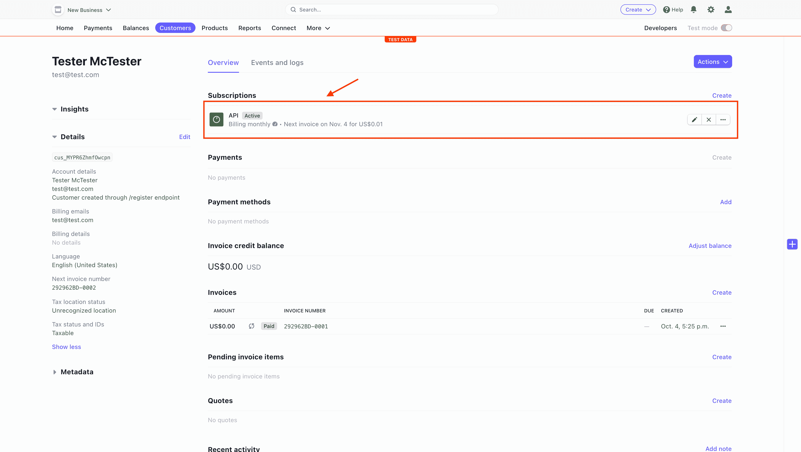

在下一个屏幕上，点击价格条目旁边的**查看用法**。

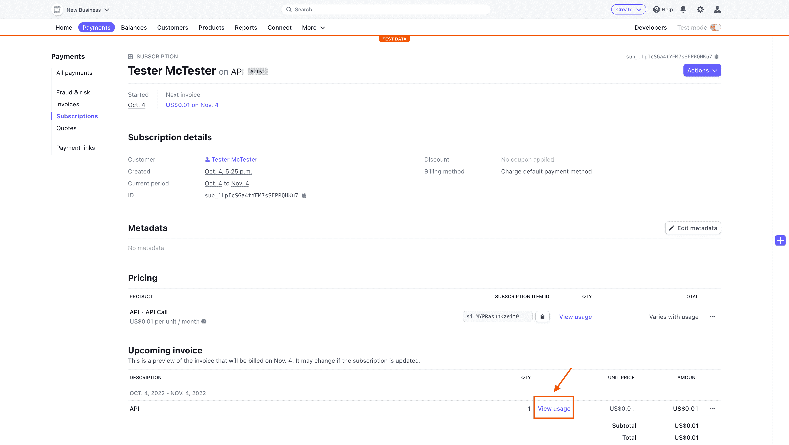

现在应该会弹出一个模型，向您显示已经从 Moesif 中剥离的 API 的用法。


> 请记住，Moesif 向 Stripe 报告时会有延迟。如果您的数据还没有，请稍后再回来查看。

## 12 -确定计费仪表是否正常工作

测试创建的计费表很容易，没有测试表功能。从左侧导航窗格导航至您创建的计费表，并选择您的**条带测试**计费表。选择右上方的**测试仪**。


Moesif 将等待在 Stripe 内创建的订阅，这些订阅将在 Moesif 自身内关联。此页面会自动更新，无需刷新。


然后，Moesif 将使用为我们创建的 JWT，等待对与我们的计费表相关联的任何端点的 API 调用。

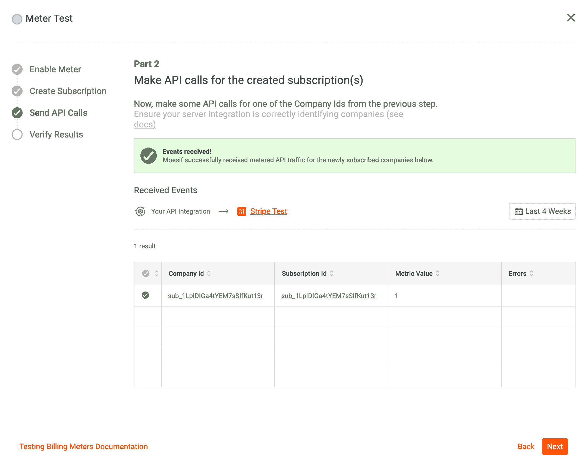

最后，Moesif 将每隔 15 分钟将所有使用数据同步到条带。该步骤可能需要几分钟时间，具体取决于 API 调用的启动时间，但会按照给定的时间间隔进行更新。

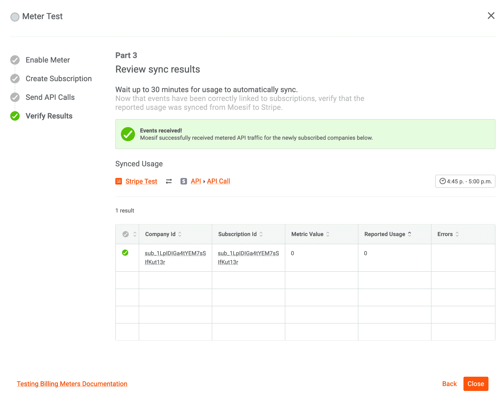

## 包扎

货币化一直是一个难以逾越的障碍。许多定制解决方案提供了灵活性，但工程和支持成本非常高。有了 Moesif，API 货币化就有可能在极短的时间内实现。正如本文所展示的，通过一点点配置和最少的代码，我们可以在最短的时间内创建一个生产就绪的后付费货币化方案。