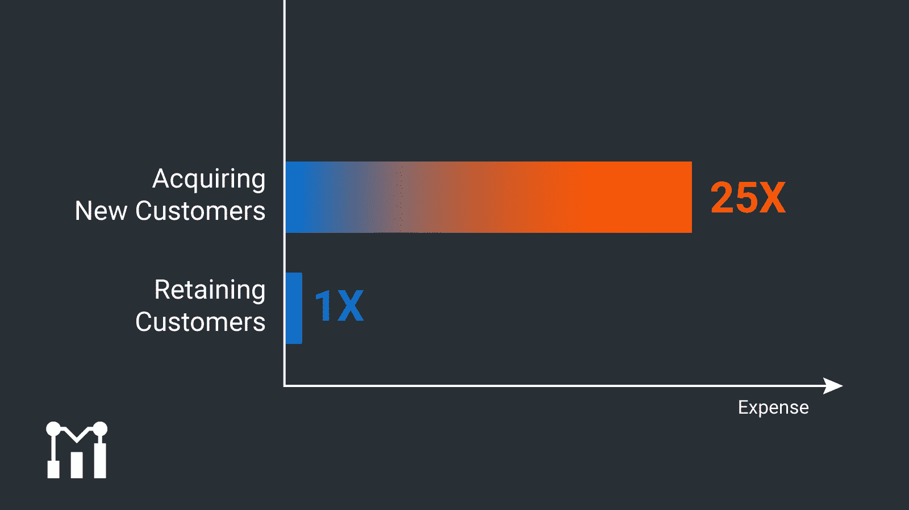

# 如何定义、衡量、分析和预测客户流失

> 原文：<https://www.moesif.com/blog/customer-success/monitoring/How-to-Define-Measure-Analyze-and-Predict-Customer-Churn/>

获得一个新客户比留住一个现有客户的成本更高。至于究竟要高出多少，分析不一，但大约在 5X 的 25 倍左右。因此，定义、衡量和分析客户流失，然后预测并主动减少客户流失，可以为您的企业节省资金。一大笔钱。以下是方法。

 获得一个客户的成本是留住一个客户的 25 倍

## 客户流失是最重要的指标

如果你想从客户身上获得最大价值，你需要留住他们。这样做是您客户成功战略的核心部分。这意味着你需要了解你的客户流失率。

### 客户成功中的流失是什么？

客户流失率是客户停止使用你的产品或服务的比率。它通常表示为固定时间段内的比率，例如每月 2%的流失率或每季度 6%的流失率。

这种收入流失对你的企业来说代价很高。你投入了大量的时间和精力，却最终失去了客户。

让你的客户满意并长期使用你的产品是降低客户流失率的关键。这使得你在获得这些客户时的初始投资最大化。

### 用户流失率如何影响其他指标？

那么，为什么用户或客户流失是[最重要的指标](https://www.moesif.com/blog/customer-success/monitoring/Customer-Health-Metrics-Help-CSM-Teams-Reduce-Churn-and-Accelerate-Upsell-in-API-Platform-Companies?utm_campaign=Int-site&utm_source=blog&utm_medium=body-cta&utm_content=define-measure-predict-customer-churn)？为了了解你的客户流失率，你需要监控你的客户在做什么。当用户努力集成或使用你的产品和 API 时，你也需要提醒。您为实现这一目标而制定的一系列指标将由减少客户流失的需求驱动。

为了了解您的客户流失率，您需要测量和分析:

*   API 调用和保持的数量
*   错误事件
*   群组和产品保留

理想情况下，所有这些都应该有自动警报，以便如果客户下降到某个水平以下，就会发出通知。

### 客户流失的两个主要原因是什么？

客户流失的原因有很多。也许你的营销吸引了错误类型的顾客，所以你的产品不能满足他们的需求。也许你的产品很棒，但是你的客户支持很糟糕。或者可能支持是正确的，但是你的产品有问题。价格也很关键——如果你的价格比你产品的感知价值高，你的客户会很快盯上竞争对手。

虽然客户流失的两个主要原因是你的业务和产品所特有的，但它们将集中在以下几个方面:客户契合度、产品特性、客户支持效率、可靠性或定价。这就是为什么深入研究客户流失如此重要。

### 为什么流失在 SaaS 和 API 中特别重要？

SaaS 和 API 业务依赖于来自用户的定期收入。如果 SaaS 的流失率越来越高，公司将很快陷入困境。因此，使用客户流失率作为关键指标来监控客户成功，对于企业的财务健康至关重要。

## 我可以使用什么工具来跟踪客户流失？

跟踪客户流失是为了充分利用您的数据。它可以向您展示哪些痛点导致了客户流失，提供对客户保留问题的见解，使您能够采取及时、果断的行动。

那么，我可以用什么工具来跟踪客户流失呢？有各种各样的工具可以帮助你追踪你的流失率。它们为您提供了解客户流失程度所需的数据可见性。然后，就看你如何利用这些数据并付诸行动了。

Moesif 是这种工具的一个很好的例子。它提供:

*   全方位了解您客户的账户健康状况
*   跨大量数据点的全面流失分析
*   警报自动化
*   易用性

这些元素中的每一个都在流失分析和减少中扮演着重要的角色。借助 360°可见性，您可以直观地了解每个客户的情况，并发现趋势，表明客户何时适合扩张或面临流失风险。分析大量的数据点可以做到这一点。它们包括:

*   新帐户登录
*   每日登录
*   日常使用
*   每日 API 增长率
*   特征利用
*   最活跃的用户
*   API 错误日志
*   MRR 增长

拥有广泛的指标是全面客户流失分析的基础。显微镜下的特定指标将取决于您的业务。对于特别有帮助的分析，寻找允许您定制您报告的指标的工具。确保内置自动警报，这样您就不会错过任何客户面临流失风险的警告信号。

在整个过程中，无论是定制报告还是深入研究不同的指标，您的流失分析工具越简单，您就能越快地支持您的客户坚持使用您的服务。

### 谁对客户流失负责？

制定减少客户流失的策略并不是你企业中某一个人的事。事实上，如果你真的想实施一些方法来[阻止客户流失](https://www.superoffice.com/blog/reduce-customer-churn)并保持你的客户群的健康，一系列的团队都需要参与进来。

当然，为了实现你选择的减少客户流失的工具，你需要你的工程师和其他技术人员。他们还可以帮助确保监控正确的指标，与您的核心运营团队合作，确保分析正确的数据。

然后，您将需要客户成功团队的意见，以帮助了解数据显示的客户痛点，并建议更好地支持这些客户的策略。毫无疑问，其中一些修正也需要您的技术团队的大量投入。

您的财务团队也需要参与讨论任何旨在减少客户流失的支出，并分析这样做的潜在财务收益。

这样一个跨多个团队的大范围流失分析项目，也需要管理层的监督，以确保它符合公司的长期方向。简而言之，减少客户流失和提高客户保持率是团队的共同努力。

## 通过有针对性的主动保留减少客户流失

失去顾客并想知道原因的日子已经一去不复返了。至少，如果你有合适的工具来分析你的流失率背后的原因，那些日子已经一去不复返了。有了合适的平台，您可以采取有针对性的主动方法来留住客户。

 追踪留存率，把注意力放在最大限度减少流失上

### 什么是客户流失和保留？

我们根据客户离开你的服务的比率来考虑客户流失。与之抗衡的是客户保持，这是所有关于防止客户停止使用。

客户保留是任何旨在阻止客户流失的战略的核心。它是关于长期吸引你的客户，并确保他们对你的产品和支持感到满意。

### 如何通过主动参与提高客户保持率并减少客户流失

以提醒您的工程、客户成功和销售团队潜在客户流失的方式监控每一位客户，意味着您可以接触到每一位面临客户流失风险的客户。例如，有了 Moesif，你可以通过电子邮件、短信、Slack、PagerDuty 或定制的 webhook 发送警报——无论哪种方式最适合你的业务。然后你的团队就可以开始行动了。

客户越来越少使用你的产品/服务可能有很多原因，从缩减他们的运营规模到你甚至没有意识到的集成问题。借助使用动态警报的主动[保留策略](https://techsee.me/blog/technology-based-solutions-to-enhance-customer-retention-strategies)，您可以快速识别客户使用量的下降，找出原因并支持客户克服这一问题。根据您的业务模式和需求，您可以为关键客户或每个客户设置提醒。

令人高兴的是，积极主动的客户参与方式有助于建立信任——这对长期保持客户关系至关重要。假设客户对您的 API 的使用下降了 2 倍。如果动态提醒标记了这一点，意味着您可以在客户需要的时候提供相关的咨询，您不仅会支持他们解决问题，还会建立信任和欣赏。这都是帮助防止流失的一部分。

### 最重要的客户保持策略是什么？

有许多策略可以通过[有针对性的主动保留](https://www.moesif.com/blog/customer-success/monitoring/6-ways-moesif-API-alerts-can-help-your-engineering-customer-success-and-sales-teams?utm_campaign=Int-site&utm_source=blog&utm_medium=body-cta&utm_content=define-measure-predict-customer-churn)来减少客户流失。它们的核心是一个简单的任务——让客户成功。这将减少流失。

让你的客户满意并留住他们的策略围绕着创造积极的互动(从入职到克服障碍)，建立对你的公司和产品的信任，以及传递价值感。正确掌握这些基本原则，你就能大大降低客户流失率。

这些顶级目标中的每一个都可以分解为各种以客户保持为中心的任务。它们可以是简单的事情，如发送一份新闻稿，提供解决常见产品集成问题的技巧，也可以是更加个性化的事情，提供独特的客户体验。同样，您的业务将决定您的特定需求和战略，但如果您将客户满意度作为核心，然后添加一个主动的方法来减少客户流失，您可能会看到积极的结果。

## 查看客户成功指标并获得洞察力

所有这些主动参与的基础是查看正确指标的能力。这使您能够识别哪些客户面临流失风险，并调查客户对您的服务参与度下降背后的原因。因此，监控客户成功也与正确的衡量标准有关，这也许并不奇怪。

客户成功与客户流失有着内在联系。如果你不支持你的客户取得成功，他们就会流失。如果你的产品提供的客户体验很糟糕，他们就会流失。如果你的客户服务很差呢？没错，更多的流失。因此，您需要一个稳健且经过深思熟虑的客户成功战略，以及一个客户成功管理团队，提供客户可能希望得到的所有知识和关怀。并且了解不同的客户希望获得不同水平和风格的客户服务。

有了这些要素，就该考虑您的客户成功指标了。Moesif 的方法是让您能够监控完整的端到端客户体验。这不仅能让您了解您的总体客户健康评分，还能识别客户行为的任何变化。最终可能导致客户流失的变化。

### 你如何确定客户是否会流失？

使用 Moesif，确定客户是否会流失的第一步是了解正常行为是什么样的。毕竟，如果你不知道规范是什么，你就不能标出与规范的偏差。要做到这一点，您需要持续监控功能和性能问题，以构建一幅正常对您的业务和客户意味着什么的画面。

然后是实时用户监控(RUM)的时候了。这不仅仅是关于基础设施指标，而是关于与采用、参与和保留相关的关键客户标准。Moesif 的高级异常检测算法处理所有这些数据，以发现与标准的偏差——可能表明客户将流失的行为模式。它发现了客户行为中的“未知的未知”，这意味着是时候让您的客户服务团队进行调查并可能提供额外的支持了。

有了[客户成功代理](https://www.custify.com/how-to-create-a-customer-success-journey-map)来调查您的客户成功指标中的异常情况，您可以采取主动的、几乎是有预见性的方法来更好地支持您的用户。在某些情况下，您甚至可以在客户意识到问题之前就发现问题。这可以给客户体验带来意想不到的快乐，特别是当您的客户成功代理向用户指出这一点并提供一个易于实施的简单解决方案时。

您可以引入动态警报来标记客户流失的迹象。定期查看关于您最重要的客户的报告也是一个好主意，这样您就可以监控*他们的*客户成功指标的总体方向。这种对客户健康评分的主动方法可以确定哪些客户最有可能流失，并使您能够在他们流失之前采取措施。您可以利用从您的客户成功指标中收集的见解来确定问题并实施解决方案，所有这些都可以降低您的流失率，并最终确保您从最初获得该客户的投资中实现最大价值。

## 通过定义、测量、分析并最终预测来停止流失

当你的顾客不高兴时，顾客就会流失。理解你的客户为什么在搅动是释放你阻止他们这样做的能力的关键。这就是为什么定义、衡量、分析和预测客户流失非常重要。除非你主动这样做，否则你很可能会让你的企业损失惨重。以至于你的客户流失率可能是最重要的指标。

幸运的是，有了合适的工具，您可以跟踪客户流失率，获得洞察力并采取措施降低流失率，从而为您的底线带来相关的好处。