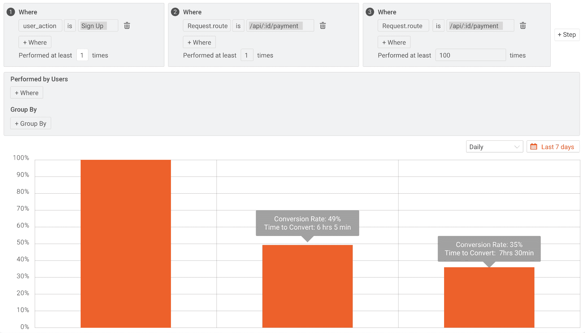
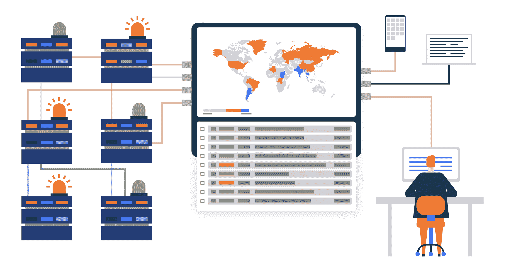
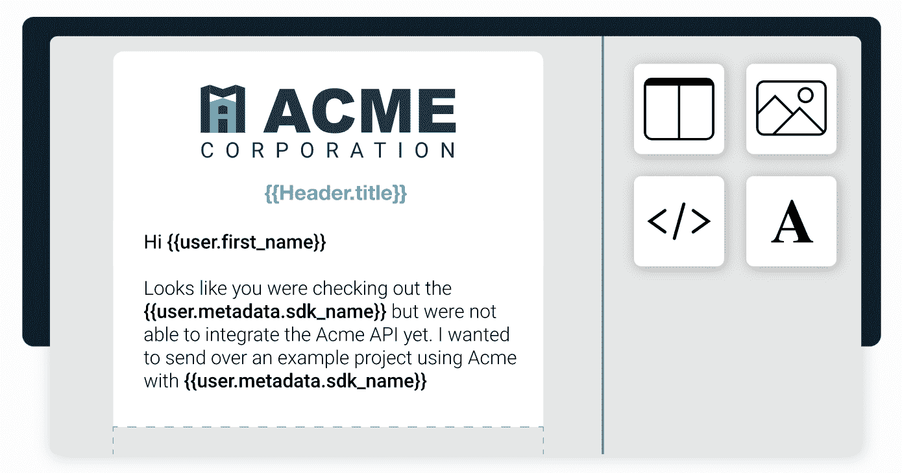
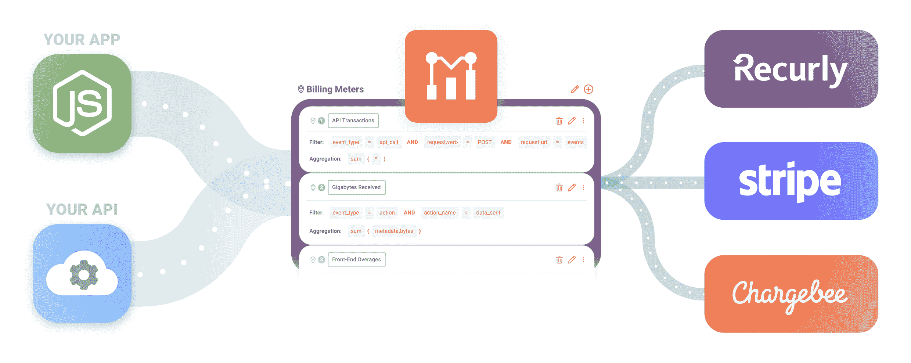

# Moesif 如何帮助您改善平台的开发者体验

> 原文：<https://www.moesif.com/blog/developer-marketing/api-analytics/How-Can-Moesif-Help-You-Improve-Your-Platforms-Developer-Experience/>

一个好的开发者体验可以成就或者毁灭你的产品。包括我在内的开发人员对他们用来构建和监控项目的工具非常挑剔。有了大量可用的开发工具，选择挑剔比以往任何时候都容易。

产品体验的伟大之处在于，通过适当的跟踪和分析，你可以慢慢地做出有影响力的小改变。这些小的改变可以迅速地将你的产品的可用性和开发者体验变得更好。

这就是 Moesif 可以提供帮助的地方，从有效地收集指标到帮助您理解它们。Moesif 是一个分析工具，可以从您的 API 调用和前端收集指标，以准确跟踪您的整个客户旅程。然后，当你做出改变时，Moesif 还会帮助你跟踪结果，以确保你朝着正确的方向前进。让我们来看看 Moesif 可以帮助您改善开发人员体验的几个方面。

## 用户和公司跟踪

Moesif 平台的一个构建模块是将应用程序中发生的每个事件与用户和/或公司相关联的能力。这允许进行一定程度的详细报告和分析，这是您无法从无法与特定用户旅程相关联的指标中获得的。有助于衡量开发者体验的两个关键分析是漏斗和保持。让我们看看每个特性是如何工作的，以及如何使用它来改善开发人员的体验。

### 烟囱

漏斗本质上是应用程序中特定流程的逐步分解。例如，您可能正在查看您的注册流程，并尝试对其进行优化。

通过这种分析，您可以看到用户完成每一步需要多长时间，以及有多少百分比的用户真正完成了这一步。这很重要，因为它允许您建立一个基线，并了解用户在哪里被挂起。然后，当你做出改变时，你可以检查以确保整个漏斗的转化率在提高。至少，您应该检查以确保您的“改进”不会给用户带来更多的问题。

### 保留

从你的平台中获取价值并享受其体验的用户往往会被留住。保持力分析可以帮助你确定客户何时会对你的产品失去兴趣。同样，这可以让您创建一个基线，将开发人员体验的改善或恶化与用户保持联系起来。

## 发信号

积极主动地吸引用户也是改善平台开发人员体验的好方法。有时候，开发者体验不仅仅是拥有最漂亮的用户界面或入门，还可以归结为当你陷入困境时公司如何帮助你。

对产品的 UI 或物理体验的改进可能需要一段时间来改变，这就是提醒可以派上用场的地方。警报可用于通知客户成功团队、工程团队或任何其他关注客户体验的团队有关用户可能遇到的问题。团队可以做两件事:

*   在客户放弃产品之前，主动联系客户，帮助他们解决问题
*   将反馈发送到产品团队的反馈循环中，以帮助改善未来的体验

Moesif 中有两种类型的警报:静态和动态。让我们来看看两者。

### 静态警报

如果您心中有一个特定的阈值，例如，如果用户在 1 小时内遇到超过 5 个 401 -未授权错误，您可以使用静态警报。这是一个静态标准，您将使用静态发生次数作为阈值。

### 动态警报

如果您不确定希望用作警报阈值的确切发生次数，动态警报可能是最佳选择。动态警报允许您设置阈值，例如当用户遇到与正常数量相比的 401 错误高峰时发出警报。动态警报允许您监视趋势和峰值，而无需为阈值输入具体的数字。

这两种警告风格都可以用来改善开发人员在产品中的体验。虽然与产品没有直接关系，但产品背后的团队乐于助人、知识渊博且积极主动，会是一个重要的优势。

## 行为邮件

如果你不能处理大量的高接触电子邮件支持，或者只是想通过自动化来优化它，行为电子邮件是一条出路。Moesif 允许你设置由应用程序中的事件触发的行为邮件流。例如，如果用户收到大量的 500 内部服务器错误响应，那么您可能希望向他们发送一封电子邮件，概述原因和可能的修复方法。这减轻了支持团队的负担，也允许采取即时和主动的行动。

你也可以使用行为电子邮件来引导开发人员找到可以帮助他们使用特性或 API 的资源。当开发人员使用你的产品时，这有助于提高他们的生产力和效率。通过引导他们找到正确的文档，您可以帮助用户更快地进入他们使用您的 API 的第一个“Hello World”时刻，或者帮助他们探索您的 API 或工具中更高级的特性。

## 计费仪表

自助服务是改善产品开发人员体验的好方法。许多开发人员不喜欢通过繁琐的程序或销售电话来访问和使用产品。在开发者和你的产品之间设置一个强制性的“与销售人员交谈”的障碍，你可能会失去客户。相反，允许用户注册、选择计划、添加信用卡或开使用发票可以成为吸引新用户的游戏规则改变者。

Moesif 的计费表可以帮助解决这个问题。计费仪表功能允许您快速构建一个货币化模型，并将使用情况发送给计费提供商，如 Stripe 或 Recurly。注册、计费和开发票的操作都可以自动化，为开发人员提供一个无缝的流程。

### 自助 API 使用

虽然使用计费表可能有许多目的，但利用计费表的最大好处是它使公司能够快速创建自助消费模型。开发人员不需要通过销售来开始，他们可以简单地注册并使用该平台。大多数开发人员工具都支持自助式模型，因此可以自下而上地采用。因为这是一种规范，所以这也是您的平台所期望的。

如果你有 API 或者你的产品的另一部分，你可以简单地建立一个收费标准，让 Moesif 计算使用量并为开发者创建一张发票。你也可以支持预付费计费，开发者可以购买积分，并在使用服务时“烧掉”。为 API 使用提供自助服务是提高开发人员利用您的平台的便利性的一个好方法。

## 包扎

积极的开发人员体验根植于良好的 DX、良好的文档和始终如一的目标，即在您的产品中改进开发人员的旅程。糟糕的开发者体验不仅会让开发者离开你的产品，如果口碑成为产品采用的因素，还会阻止其他软件工程师尝试它。这就是为什么跟踪度量标准并使用战术变化来改善开发人员的体验，对于任何创建了开发团队使用的工具或服务的公司来说都是必须的。

Moesif 不仅是跟踪开发人员体验的最佳工具之一，也是直接改进开发人员体验的最佳工具之一。如前所述，使用 Moesif 的[用户和公司跟踪](https://www.moesif.com/docs/getting-started/identify-customers/?utm_campaign=Int-site&utm_source=blog&utm_medium=body-cta&improve-devex)、[提醒](https://www.moesif.com/docs/api-monitoring/?utm_campaign=Int-site&utm_source=blog&utm_medium=body-cta&improve-devex)、[行为电子邮件](https://www.moesif.com/docs/behavioral-emails/?utm_campaign=Int-site&utm_source=blog&utm_medium=body-cta&improve-devex)和[计费表](https://www.moesif.com/docs/metered-billing/?utm_campaign=Int-site&utm_source=blog&utm_medium=body-cta&improve-devex)都是增加你对开发者的产品的好方法。通过使用 Moesif 跟踪和改善开发人员的体验，您应该可以在整个产品中看到更好的激活和保持。为了亲自体验 Moesif，[现在就注册](https://www.moesif.com/signup?utm_campaign=Int-site&utm_source=blog&utm_medium=body-cta&improve-devex)，开始跟踪和改进您平台内的开发者体验。