# Moesif 如何帮助你理解 API 的用法？

> 原文：<https://www.moesif.com/blog/product-management/api-analytics/How-Can-Moesif-Help-You-Understand-API-Usage/>

你想发展你的业务吗？为您的客户创造更多价值？好吧，理解 API 的使用应该是你的首要任务，就在跟踪 API 使用和 API 监控的能力之后。

通过使用 Moesif 了解客户的 API 使用情况，您可以获得许多不同的见解，例如

*   你最受欢迎的 API
*   哪些 API 错误最多
*   个人用户和公司如何使用你的 API
*   还有更多…

了解这些关键见解有助于做出明智的业务和工程决策。有了 Moesif，有许多不同的方法可以对 API 分析进行切片和切块，以揭示 API 使用的多个角度。不仅如此，您还可以使用某些功能来采取行动，以提高保留率，并在减少错误的同时提高用户的使用率。

让我们看看 Moesif 中的一些特性，它们有助于理解和改进 API 的使用。

## 图表

> 探索不同指标报告的文档可以在[这里](https://www.moesif.com/docs/api-analytics/?utm_campaign=Int-site&utm_source=blog&utm_medium=body-cta&utm_content=moesif-for-api-usage)找到

能够可视化 API 的使用是为数据带来上下文并使其更易理解的一个好方法。Moesif 的核心焦点是提供易于配置的图表，使用户能够真正深入细节。这是通过对数据应用过滤器以获得您想要的精确输出来实现的。例如，您可能希望看到一个**时间序列**图表，它显示了过去 2 周所有 API 的错误趋势。您可能希望进一步挖掘，查看特定公司的用户在过去 12 小时内尝试访问某个端点时发生的 401 个错误。能够准确地拨入你所需要的是 Moesif 最擅长的。

虽然有很多不同的图表样式，但是让我们回顾一下两种最流行的样式，它们有助于理解 API 的用法。

### 实时事件日志

**现场活动日志**是查看和深入 Moesif 中每个活动的好方法。通过单击每个事件，您可以探索关于请求和响应的所有细节。这比查看纯文本 API 日志要高效得多。

如果您设置并启用了**用户和公司跟踪**，您还可以轻松地深入查看附加到事件的用户和公司资料。为了展示如何使用**实时事件日志**的快速示例，让我们过滤一些演示数据来*识别在***/购买** *路线*上发生的不成功 API 调用。

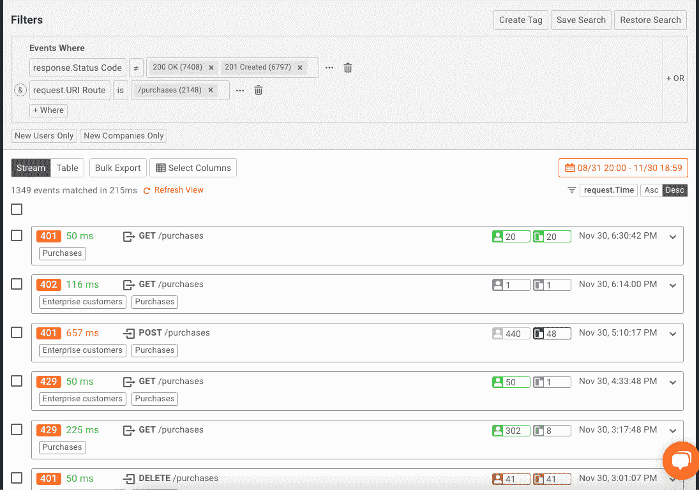

您可以在这里看到，我们可以很容易地看到哪些调用出错，甚至可以检查或生成一个示例 API 请求来重放请求，以便进行故障排除或测试。

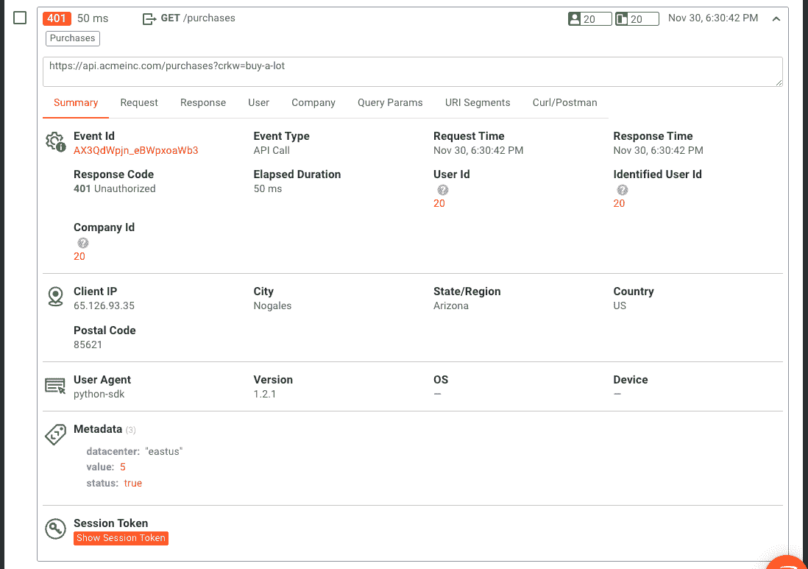

使用**实时事件日志**来了解 API 使用指标的好处是可以看到每个事件并与之交互。这是一个很好的方式来解决问题，并看到需要在最细粒度的水平上探索的趋势。

### 时间序列

为了观察一段时间内的趋势，时间序列图是最好的可视化方式。有了**时间序列**，你将决定你想要跟踪哪些事件，然后让 Moesif 显示一段时间内的趋势。例如，我们希望查看发生不成功 API 调用的*前 5 名端点*，并观察这一趋势。下面是一个可能的例子。

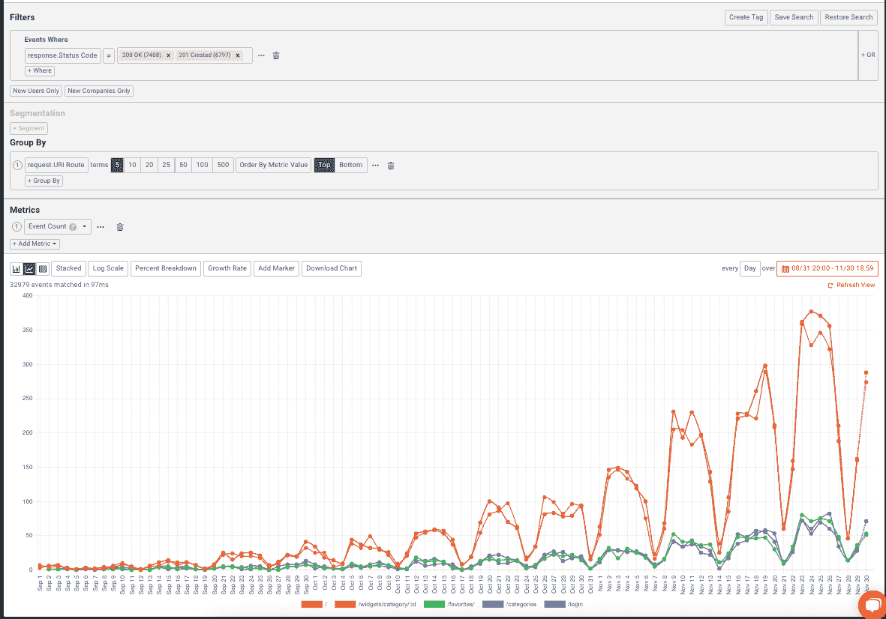

**时序图**可以让你更容易地看到趋势，而**实时事件日志**可以让你深入每个单独的 API 调用。这两个图表对于理解如何使用 API 以及详细研究每个调用都非常有用。

## 仪表盘

> 仪表板文档可在[这里](https://www.moesif.com/docs/api-dashboards/?utm_campaign=Int-site&utm_source=blog&utm_medium=body-cta&utm_content=moesif-for-api-usage)找到

既然您已经找到了一些图表，可以帮助您深入了解组织内的 API 指标，那么让我们将它们集中到一个地方。仪表板允许您将所有喜爱的图表集中在一个位置，以便于查看和管理。如果您想在一个地方查看 API 指标的多个方面，仪表板是实现这一点的好方法。

### 默认仪表板

当您第一次创建您的 Moesif 帐户时，您的 Moesif 实例将被填充一些现成的仪表板。这些仪表板涵盖了大多数企业的核心领域，并预先填充了可能对每个领域都有帮助的工作区。这些领域包括:

*   产品
*   工程
*   安全性
*   客户成功
*   销售
*   营销

例如，在默认出现的**产品**仪表板中，我们可以看到包含的工作区标题。

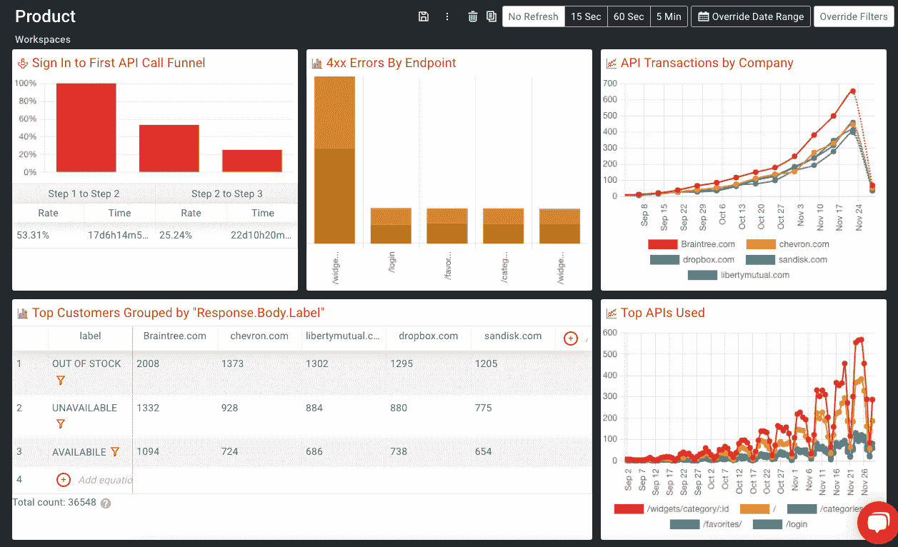

这些可以作为一个很好的起点，您可以根据您喜欢的图表和报告添加更多的工作区切片，或者您可以编辑每个切片以更好地适应您的特定用例。

### 自定义仪表板

如果 Moesif 默认包含的仪表板不是您所需要的，或者您只是想从头开始创建一些东西，也可以创建自定义仪表板。自定义仪表板是一种很好的方式，可以创建简化的方式来访问您最喜爱的图表和报告，这些图表和报告更符合您的确切需求。关于创建仪表板的细节，包括自定义仪表板，请查看[我们的文档](https://www.moesif.com/docs/api-dashboards/creating-a-dashboard/?utm_campaign=Int-site&utm_source=blog&utm_medium=body-cta&utm_content=moesif-for-api-usage)。

## 用户和公司跟踪

> 用户和公司跟踪功能的文档可在[这里](https://www.moesif.com/docs/user-analytics/?utm_campaign=Int-site&utm_source=blog&utm_medium=body-cta&utm_content=moesif-for-api-usage)找到

Moesif 与其他分析平台的主要区别在于 Moesif 能够将每个事件与用户和/或公司联系起来。这开启了许多深度分析用例，这些用例在查看大型数据集时是不可能的，因为大型数据集只能匿名查看事件。

用户和公司跟踪最常用的两个功能是漏斗和留存分析。两者都可以回答客户如何使用产品，你的入职效果如何，以及用户是否会离开你的产品。让我们仔细看看这两个特性。

### 烟囱

漏斗允许 Moesif 用户看到他们转换漏斗中的每一步是如何工作的。对于大多数企业来说，这可以给出非常重要的提示，说明应该改进什么，以及最新的改进是如何改进或阻碍转换过程的。

一个简单的例子是让我们看看探索用户登录的三步漏斗。我们将看到一个漏斗，其中:

*   用户登录一次
*   用户第二次登录
*   用户在第二次登录后会再登录 3 次

这样做的目的是让我们看到我们的客户是如何回到这个平台的。漏斗看起来像这样:

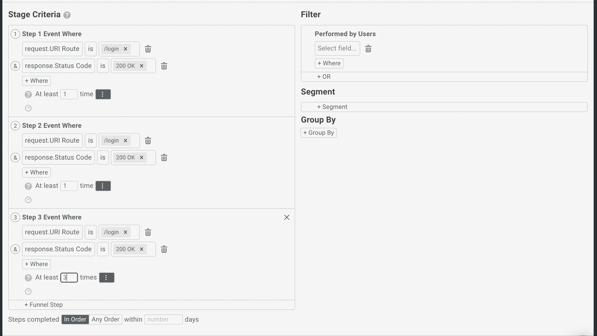 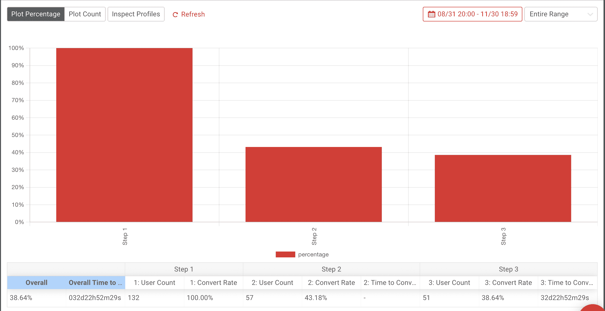

### 保留

理解 API 使用的另一个关键部分是了解用户是如何被保留的。让用户开始使用你的 API 是战斗的一部分，对公司更大的价值是保持用户流量进入 API。

使用 Moesif，与仅跟踪客户是否拥有有效订阅的订阅保持不同，Moesif 可用于调查产品保持。这更准确，因为它跟踪用户是否回来并积极使用你的产品。为了计算用户的保持率，Moesif 需要一个初始事件和一个返回事件。如果我们有一个允许用户结帐的 API，我们可以让初始和返回事件等于他们调用 **/purchase** API 的时间。

本质上，这种类型的保留分析将概述用户正在进行持续购买，我们将重复购买的用户视为活跃/保留客户。在 Moesif 中，上面的每周保留分析如下所示。

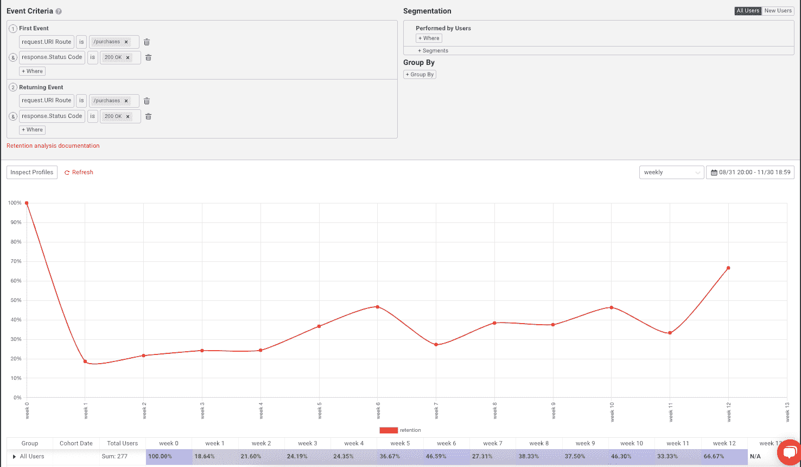

我们可能会更进一步，观察使用我们平台的不同细分市场或群体的留存率。这方面的一个例子可能是查看企业客户与非企业客户在保留率上的差异。将它添加到我们的报告中会是这样的:

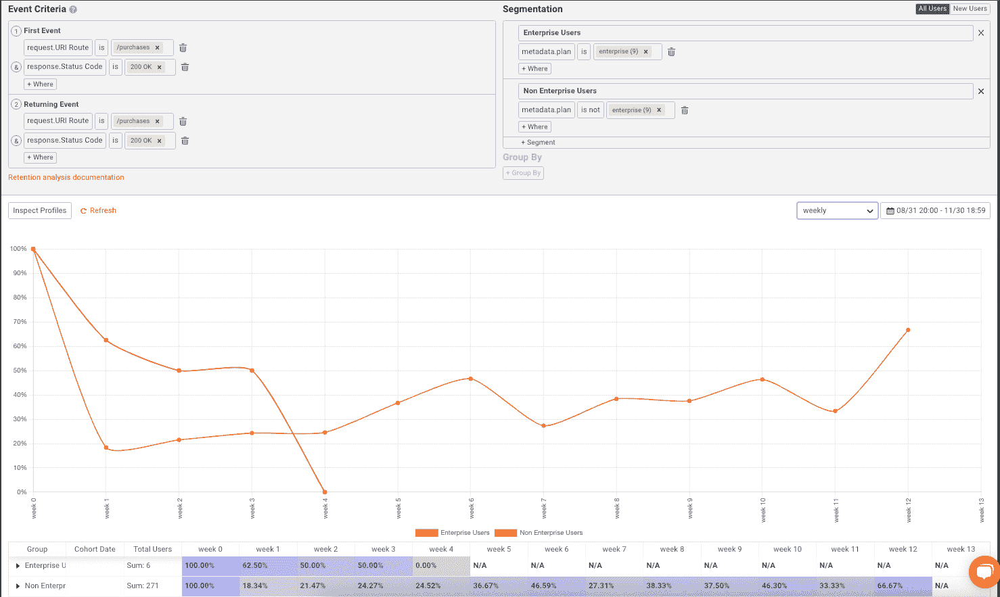

在**漏斗**和**留存**分析中，您还可以挖掘特定的用户群，例如按用户或公司查看留存趋势。这可以帮助您了解个人层面的 API 使用情况，并了解各种用户和公司如何使用该平台，以及他们是否会返回该平台。

## 警报

> 报警和监控文件可在[这里](https://www.moesif.com/docs/api-monitoring/?utm_campaign=Int-site&utm_source=blog&utm_medium=body-cta&utm_content=moesif-for-api-usage)找到

当某些事情发生在你的客户身上或你的产品中时，得到通知是很重要的。依靠仪表板和持续的手动轮询来发现问题是非常低效和不可靠的。通过 alerts，您可以将 Moesif 配置为通过电子邮件、SMS、Slack、PagerDuty 或其他自定义渠道向您发出警报，以便在达到特定标准时通知您。

在理解 API 使用方面，您可能想知道 API 何时接收到异常高或异常低的流量。Moesif 可以通过使用两种不同类型的警报来实现这一点。

### 静态警报

静态警报允许您配置警报，以便在达到静态阈值时发送通知。例如，当特定的 API 端点每小时接收超过 1，000 个调用时，就会发出警报。一旦端点接收到该数量的流量，就会向配置的任何通道发送通知。在 Moesif 中，这是它的样子:

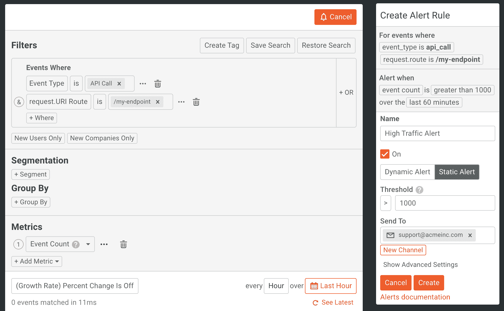

### 动态警报

如果您不确切知道您想要设置为警报阈值的静态数量，您可以使用动态警报。动态警报的设置类似于上面的静态警报设置，除了您将类型指定为**动态警报**，然后设置诸如**突然峰值灵敏度**、**异常变化灵敏度**和**趋向更高灵敏度**等因素的灵敏度。

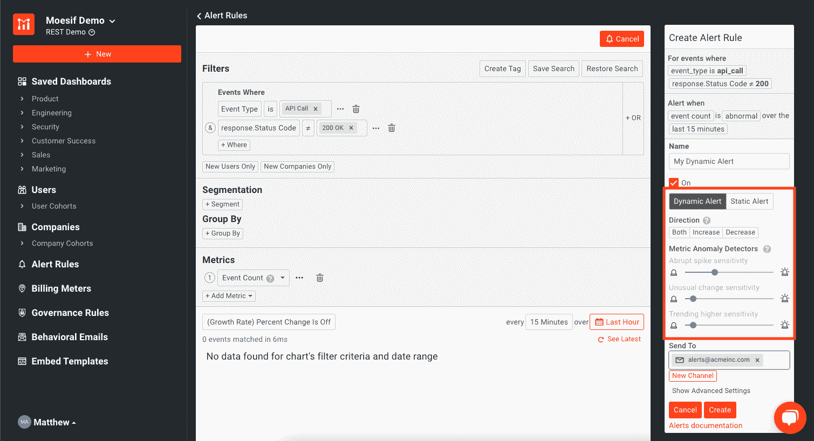

当**动态警报**启用时，Moesif 将查看趋势和峰值，以提醒用户其客户的 API 使用中的异常。与静态阈值相比，这可能是监控 API 使用情况的更好方法。

## 治理规则

> 治理规则的文档可以在[这里](https://www.moesif.com/docs/api-governance-rules/?utm_campaign=Int-site&utm_source=blog&utm_medium=body-cta&utm_content=moesif-for-api-usage)找到

大多数时候，创建报告和监控 API 是必不可少的，但是能够以自动化的方式使用这些见解会非常强大，并增强这些功能。这意味着理解 API 的用法只是战斗的一部分。能够使用这些见解来管理对 API 的访问是理解 API 使用和主动使用数据的下一个层次。有了 Moesif 的**治理规则**特性，您就可以做到这一点。

### 阻止不必要的行为和使用

**治理规则**特性可用于检测不需要的行为或条件何时发生，并阻止用户使用 API。有两种类型的治理规则可以应用:阻塞和非阻塞。非阻塞规则仍然允许请求通过上游 API，但是允许响应主体、响应状态代码和响应头被覆盖。对于阻塞规则，请求不会被上游 API 接收，而是在插件/网关或 SDK 级别被阻塞，被覆盖的响应将被发送回调用 API 的用户。

这可能有用的一个例子是在 API 货币化的环境中。在 Moesif 中，我们可以创建一个治理规则，阻止有过期发票的用户访问货币化的 API。用户还会收到一个响应，告诉他们有一张过期的发票，并向调用者返回一个 **429 - Payment Required** 状态代码。

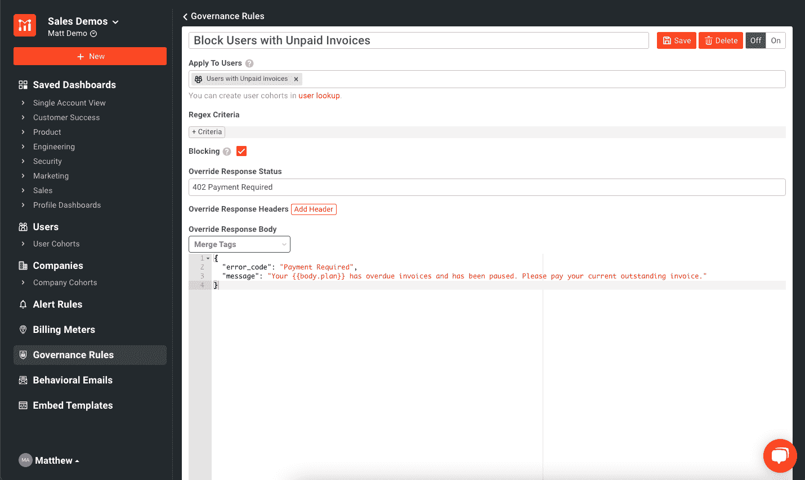

> 不是每个 SDK 或插件都支持治理规则。请检查你的插件的文档，看看它是否支持**治理规则**。

**治理规则**是一种很好的方式，可以利用 API 使用的度量标准，并自动化治理，使 API 更加安全和用户友好。

## 试试吧！

Moesif 充满了大量的特性来增强你的 API 业务和理解 API 和产品的使用。我们已经介绍了一些有助于理解 API 用法的关键特性，并展示了一些 Moesif 中每个特性的例子。Moesif 平台使您的整个组织，从工程师到 API 产品经理，能够更深入地理解 API 的使用。此外，该平台还允许您使用这些见解，通过[治理规则](https://www.moesif.com/docs/api-governance-rules/?utm_campaign=Int-site&utm_source=blog&utm_medium=body-cta&utm_content=moesif-for-api-usage)，甚至通过其他功能，如[行为电子邮件](https://www.moesif.com/docs/behavioral-emails/?utm_campaign=Int-site&utm_source=blog&utm_medium=body-cta&utm_content=moesif-for-api-usage)或[计量计费](https://www.moesif.com/docs/metered-billing/?utm_campaign=Int-site&utm_source=blog&utm_medium=body-cta&utm_content=moesif-for-api-usage)，自动采取行动。[登录](https://www.moesif.com/wrap?utm_campaign=Int-site&utm_source=blog&utm_medium=body-cta&utm_content=moesif-for-api-usage)或[今天就注册](https://www.moesif.com/signup?utm_campaign=Int-site&utm_source=blog&utm_medium=body-cta&utm_content=moesif-for-api-usage)开始 Moesif！