# 利用 Java Spring、Stripe 和 Moesif 实现端到端 API 货币化

> 原文：<https://www.moesif.com/blog/api-monetization/stripe/End-To-End-API-Monetization-With-Java-Spring-Stripe-And-Moesif/>

许多 API 开发者和公司都在努力寻找简单的方法来建立系统，以使他们的 API 货币化。有些很简单，但不可定制，有些很复杂，需要大量的工程工作才能真正运行起来。

为了让事情变得更简单，Moesif 几个月前创建了一个名为 Billing Meters 的功能，它提供了大量的可定制性，但只需要最少的代码和工程工作。

对于这个实际上可以开箱即用的例子，我们将使用 Moesif、Java Spring 和 Stripe 向用户收取 API 使用费。对于这种设置，有一些假设:

*   您的机器上安装了 Java
    *   我们将使用 openJDK 17 和 Gradle
*   您有一个有效的 Stripe 帐户
*   您有一个有效的 Moesif 帐户

从外观上看，设置非常简单。我们将创建一个 **/register** 端点，它:

*   在条带中注册用户
*   为该用户订阅产品
*   在 Moesif 中注册用户和公司
*   创建一个 JWT 来认证/授权对我们货币化终端的呼叫

我还为它创建了一个小小的前端，这是一个注册用户的简单表单，然后为新注册的用户显示生成的 JWT。

## 1 -以条纹形式创建您的产品和价格

我们将采取的第一步是创建一个 Stripe 产品和价格。最好先完成这一步，因为当您将 Stripe 集成到 Moesif 中时，您已经有了一些 Moesif 的定价计划。然后，可以将定价计划与 Moesif 计费仪表中设置的特定计费标准相关联。

要创建产品和价格，请登录 Stripe 并进入 Stripe UI 中的**产品**页面。在那里，点击右上角的 **+添加产品**按钮。


然后，您可以添加产品的详细信息和价格。您产品的表单将有几个要填写的字段。

### 产品资料

#### 名字

*   这是您产品的名称。在下面的例子中，我们使用名称“我的 API”。

#### 描述

*   此字段是可选的，但您可以在此输入产品的简要描述。在下面的例子中，我们使用了“这是一个货币化的 API”的描述。

#### 图像

*   可以选择上传一张图片，帮助您轻松识别产品页面上的商品。在这个例子中，我们将使用默认的占位符图像。

### 定价信息

#### 定价模型

在 Stripe 中可以设置一些不同的定价模式。这些定价模型包括:

*   **标准定价**
    *   如果您希望对每个 API 调用收取相同的费用，请使用此选项。


*   **套餐定价**
    *   如果您按包或一组单位对 API 使用收费，请使用此选项。例如，您可以将其设置为每 1000 次 API 调用收取 10 美元。每当用户超过 1000 个 API 调用阈值时，他们就要再支付 10 美元。


*   **分级定价**
    *   使用分级定价层，这可能会导致订单中的某些产品价格不同。例如，您可能对前 100 个单位收取$10.00，然后对接下来的 50 个单位收取$5.00。如今，这仅适用于经常性价格。


*   **批量定价**
    *   如果您根据售出的总数量对每个单位收取相同的价格，请使用。例如，50 个单位的单价为 10.00 美元，100 个单位的单价为 7.00 美元。


#### 价格

根据所选的定价模型，可以在此字段中设置价格。

#### 计费周期

计费周期可以设置为:

*   **每日**
*   **每周一次**
*   **每月**
*   **每 3 个月一次**
*   **每 6 个月一次**
*   **每年**
*   **客户**

对于您的 Moesif 配置，我们建议将计费周期设置为每月**月**。我们还建议，如果您正在使用 Moesif 的计费计量功能，请同时选中**用量被计量**框。

#### 按计量使用收费

一旦选择了**用量计量**复选框，将出现计量用量收费选项。此字段允许您选择计量使用的计算和收费方式。该字段的可用值为:

*   **期间使用值总和**
    *   在整个计费周期中，用户都要为其记录的使用付费
*   **期间的最近使用值**
    *   根据计费周期结束前记录的最后一次使用情况向用户收费
*   **最近使用值**
    *   在每个计费周期结束时，用户需要为在整个订阅周期中记录的最后一次使用付费
*   **期间最大使用值**
    *   用户按计费周期内记录的最高金额付费

> Moesif 计费仪表的最佳设置是将该值设置为时间段内使用值的总和，因为 Moesif 每小时向条带报告使用情况

#### 价格描述

这是一个可选字段，但建议填写。您可以在这里简单描述您的价格。这将使您更容易理解您在 Moesif 的计费表中选择的价格，尤其是在一种产品有多个价格的情况下。

输入产品和价格的所有详细信息后，您可以点击屏幕右上角的**保存产品**。


当您创建产品时，您将能够在**产品**屏幕上查看和编辑它们。

## 2 -启用 Moesif-条带集成

一旦你的产品和价格确定下来，是时候开始整合 Stripe 和 Moesif 了。要开始在 Moesif 中配置 Stripe，请转到**计费表**页面，并点击屏幕右上角的**编辑计费提供商**下拉菜单。


这将打开条带配置屏幕，引导您完成集成。在这个屏幕上，您可以获得将 Stripe 插入 Moesif 所需的所有信息。配置的每个步骤都包含在模式中。

### 将 Moesif webhook 添加到条带

集成的第一步是将 Moesif webhook 添加到 Stripe 的配置中。添加此功能允许 Stripe 向 Moesif 发送订阅更新。

要将 Moesif webhook 添加到 Stripe，从右上角点击**开发者**，然后在左侧菜单中点击 **Webhooks** 。这将把你带到**网页挂钩**页面，在那里你可以查看现有的网页挂钩并添加新的。要添加新的 webhook，我们将单击屏幕底部的**添加端点**按钮。


从这里，我们将插入我们的 Moesif API 端点 URL，并配置要监听的事件。您需要将 Moesif Webhook URL 复制到**端点 URL** 字段，然后点击 **+选择事件**按钮。


> 这些细节都可以在前面提到的 Moesif 中的条带配置页面上找到。

您应该选择**客户**下的选项进行**选择所有客户事件**。之后，点击屏幕底部的**添加事件**按钮。

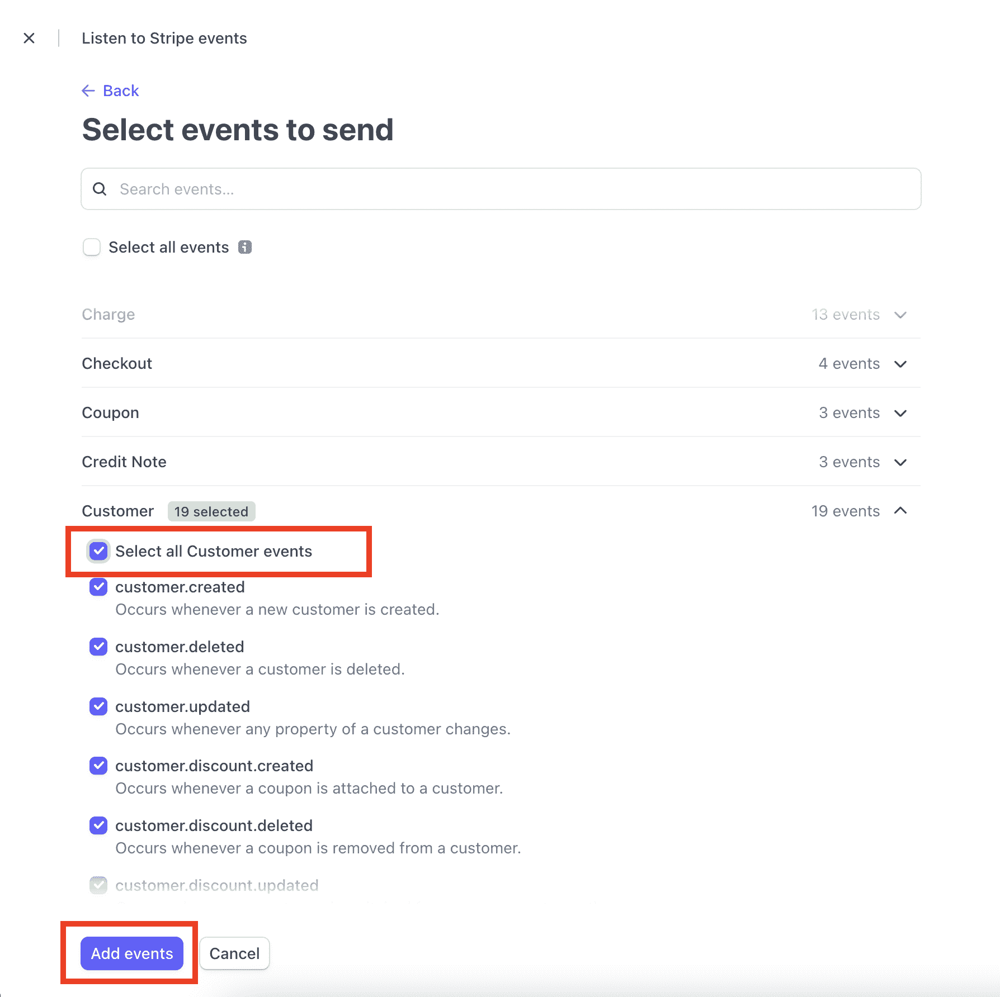

此后，您将返回到添加端点详细信息的原始屏幕。滚动到屏幕底部，单击**添加端点**将端点保存到条带。


### 将条带 API 细节插入 Moesif

为了让 Moesif 向 Stripe 中的订阅添加使用量，我们需要向 Moesif 中添加 Stripe API 细节。这是在 Moesif 的条带配置屏幕中完成的，与我们之前使用的屏幕相同。


目前，Moesif 仅支持条带 API 的版本 **2020-08-27** ，因此字段默认为**条带 API 版本**字段。

对于 **Stripe API 密钥**字段，您需要从 Stripe 中检索 API 密钥以将其插入。从**开发者**界面，与我们在上一步中使用的界面相同，您将点击 **API 键**。然后，您将能够在屏幕上的**秘密密钥**或生成的**受限密钥**字段中看到您的 API 的私有密钥。两个键都可以用。


从 Stripe 复制密钥后，您将把这个密钥粘贴到 Moesif 中的 **Stripe API 密钥**字段。完成后，回到 Moesif，你可以向下滚动到屏幕底部，点击**保存**保存配置。

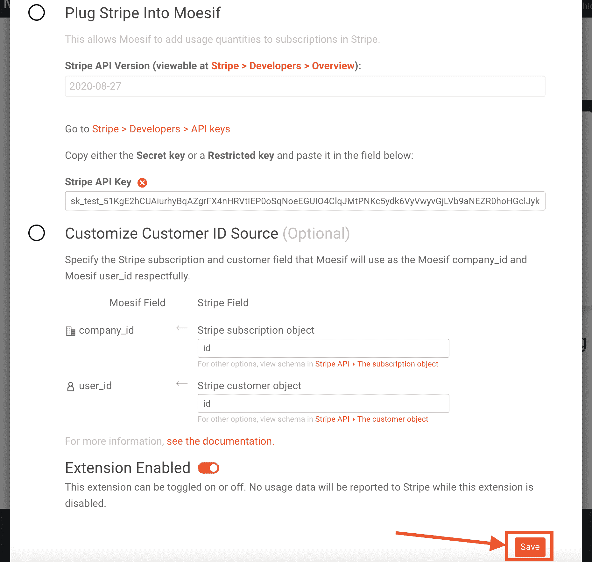

至此，Moesif 中的条带集成已经完成，您可以开始使用它了。

> 或者，您也可以在 Moesif 中定制**客户 ID 源**。默认设置将适用于本指南，不需要进行任何更改。如果您确实需要定制它，这些设置允许您指定如何将条带**订阅**和**客户**对象映射到 Moesif 中的**公司 ID** 和**用户 ID** 。

## 3 -创建计费计数器

一旦您在 Moesif 中激活了条带集成，您就可以开始设置您的计费表了。在 Moesif 中创建的计费表做两件事:根据特定的标准跟踪使用情况，并向计费提供者报告使用情况。Moesif 允许您相对容易地设置非常简单和非常复杂的计费表。

要创建计费表，在 Moesif 中，您将导航至**计费表**屏幕。您可以从左侧菜单中完成此操作。

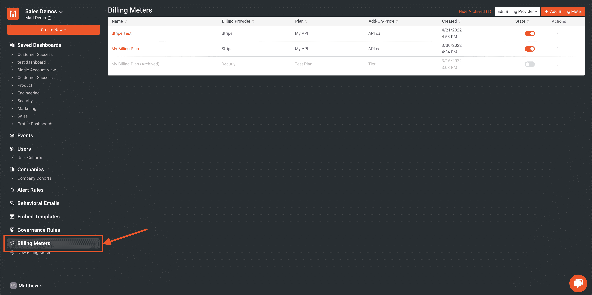

在计费表屏幕上，点击屏幕右上角的 **+添加计费表**。


下一个屏幕是您可以实际输入计费表标准的地方。


该屏幕上的字段包括:

*   **计费电表名称**

    *   这是您的新计费仪表的 Moesif 内部名称
*   **账单提供商**

    *   在此下拉列表中，您可以选择要将您的使用指标发送给哪个计费提供商。
*   **产品(仅条纹)**

    *   在这里，您可以选择您在 Stripe 中设置的产品，您希望您的使用指标与该产品相关联。
*   **价格(仅条纹)**

    *   计费计数器的计费提供者设置中的最后一个字段，在这里您可以选择您要将使用指标绑定到哪个价格。
*   **过滤器**

    *   在过滤器配置下，您将配置您的计费标准，以仅包括符合特定标准的请求。
*   **指标**

    *   在这里，您可以选择希望计费的指标。可用选项包括:
*   **事件计数**

    *   这将增加符合过滤标准中列出的标准的每个事件的使用量。
*   **唯一用户**

    *   每当唯一用户发送符合过滤标准的请求时，这将增加使用量。对于每个唯一用户，无论该用户的事件计数是多少，计数都将增加 1。
*   **独特的公司**

    *   每当一家独特的公司发送符合过滤标准的请求时，这将增加使用量。对于每个唯一的公司，无论该公司的事件计数如何，计数都将增加 1。
*   **唯一会话/API 密钥**

    *   每当使用唯一的会话或 API 键来发送符合过滤标准的请求时，这将增加使用量。对于每个唯一的会话或 API 键，无论该特定会话或 API 键的事件计数如何，计数都将增加 1。

> 指标下还有其他选项，但以上 4 个选项最适用于基于使用的计费。

例如，在本指南中，我们将创建一个计费计量器，它将过滤名为`/test-service`的单个端点的流量，其中请求接收到一个成功的 HTTP 200 响应。我们将使用**事件计数**指标来确保每个请求都被添加到计数中并发送给计费提供者。

在 Moesif 中，计费表的配置如下所示。


然后，我们将单击**创建**。这将创建并激活**计费表**。将出现一个模式，通知您计费表已经创建，并提供一个引导，以确保计费表配置正确。

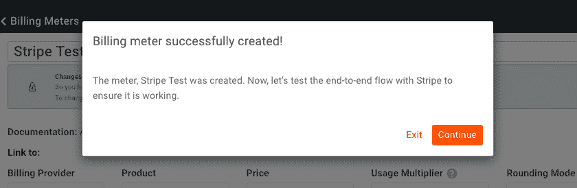

首先，我们将建立一个流程，让用户注册、订阅并创建一个 JWT，这样他们就可以使用我们的货币化 API。一旦完成，我们将返回并继续进行演练。

## 4 -创建 API

我们将构建自己的流程，而不是使用预先构建的入职流程，例如通过 API 网关中的开发人员门户。我们将创建一个名为 **/register** 的端点，然后我们可以用它来装载想要使用 API 的用户。结果将是用户收到一个他们可以使用的 JWT，它将跟踪他们的使用情况。

由于我们使用 Moesif、Stripe 和 Java Spring 作为我们整体解决方案的一部分，我们需要确保每个组件都能正常工作。

端点将执行以下操作:

*   创建带条纹的客户
*   为新客户订阅条带中的 API 订阅
*   在 Moesif 中创建 CompanyID(这将是条带订阅 ID)
*   在 Moesif 中创建 UserID(这将是 Stripe 客户 ID)
*   创建一个带有包含条带客户 ID 的`jti`字段的 JWT

> 如果您在 Moesif 和其他系统中已经有了您想要使用的用户和公司标识符，而不是使用 Stripe 的客户和订阅作为您的 id，您可以在 Moesif 中的 Stripe 配置设置下这样做。

在本例中，我们将创建一个简单的 Java Spring API 来完成上述任务。

### 创建 Java Spring 项目

我们将使用 [Spring Initializr](https://start.spring.io) 工具来帮助创建我们的初始项目。Spring Initializr 生成器提供了许多选项，允许快速定制我们的 starter 项目。

这些选项包括:

*   **项目**
    *   与项目一起使用的生成工具的类型
*   **语言**
    *   项目将使用的语言
*   **Spring Boot**
    *   要使用的 Spring Boot 版本
*   **项目元数据**
    *   **组名**
        *   在所有项目中唯一标识您的项目
    *   **神器名称**
        *   没有版本的 jar 的名称
    *   **名称**
        *   项目名称
    *   **描述**
        *   项目的描述
    *   **包名**
        *   包的名称，通常是组名和工件名的组合
    *   **包装类型**
        *   生成项目时创建的包的类型
    *   **Java 版本**
        *   项目中要使用的 Java 版本
*   **依赖关系**
    *   选择并包含许多依赖项，从开发人员工具和数据库到 web 和安全框架

我们将在项目中使用以下设置:

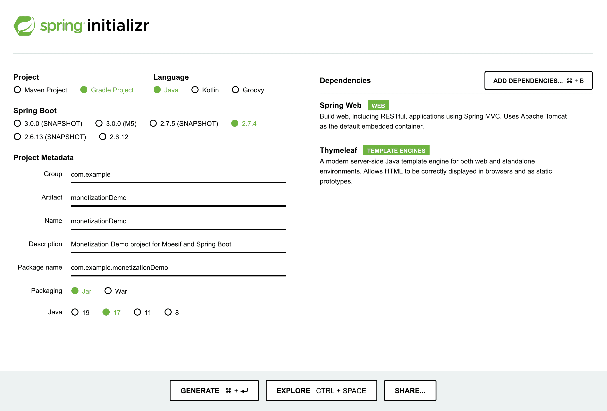

选择 *Generate* 将启动样本项目的下载。在您最喜欢的编辑器中，解压并打开 Spring Initializr 生成的文件夹，在我们的例子中称为 monetizationDemo。这是我们添加 API 代码的地方。运行`./gradlew build`以确保我们的项目一开始就正确构建。

### 添加项目依赖项

现在，我们将使用正确的依赖项编辑 build.gradle 文件。在 build.gradle 中，我们将在 dependencies 对象下添加以下条目。

```py
dependencies {
 implementation 'org.springframework.boot:spring-boot-starter-thymeleaf'
 implementation 'org.springframework.boot:spring-boot-starter-web'
 implementation 'com.moesif.servlet:moesif-servlet:1.7.4'
 implementation 'com.stripe:stripe-java:21.8.0'
 implementation 'io.jsonwebtoken:jjwt-api:0.11.5'
 implementation "jakarta.xml.bind:jakarta.xml.bind-api:2.3.2"
 implementation "org.glassfish.jaxb:jaxb-runtime:2.3.2"
 implementation 'io.jsonwebtoken:jjwt-impl:0.11.5'
 implementation 'io.jsonwebtoken:jjwt-jackson:0.11.5'
 testImplementation 'org.springframework.boot:spring-boot-starter-test'
} 
```

保存文件，然后导航到终端并运行:

`./gradlew build`

现在，您的依赖项将被引入到项目中，并在必要时进行编译。这些依赖项将帮助我们调用 REST 端点，连接到 Stripe 和 Moesif，生成和验证 jwt，以及我们将构建到应用程序中的各种其他功能。

由于我们选择使用 Web MVC 框架，我们有许多依赖于其他类并与之交互的类。在接下来的部分中，我们将构建这些类中的每一个。如果您的项目开始抛出错误，那么在继续阅读本指南后，应该会将它们整理出来。

### 定义 Moesif 过滤器

> 接下来，我们将把`/src/main/java/com/username/monetizationDemo`称为我们的*工作目录*。

在我们的工作目录中，我们将创建名为**MoesifConfig.java**的文件。在这个文件中，我们将添加以下代码，这些代码将允许我们通过使用 JSON Web 令牌(JWT)以及其他一些使过滤器能够工作的代码来识别 moesif 中的用户。

```py
import java.util.Base64;
import javax.servlet.Filter;
import javax.servlet.http.HttpServletRequest;
import javax.servlet.http.HttpServletResponse;
import com.moesif.servlet.MoesifFilter;
import com.moesif.servlet.MoesifConfiguration;
import org.json.JSONObject;
import org.springframework.context.annotation.*;
import org.springframework.web.servlet.config.annotation.*;
import org.springframework.web.servlet.view.InternalResourceViewResolver;

@Configuration
@EnableWebMvc
@ComponentScan
public class MoesifConfig {
  public String applicationId = "YOUR_MOESIF_APPLICATION_ID";

  @Bean
  public Filter moesifFilter() {

    MoesifConfiguration config = new MoesifConfiguration() {

      @Override
      public String identifyUser(HttpServletRequest request, HttpServletResponse response) {
        String customerID = null;

        try {
          // Obtain Stripe customerID from JWT included in header
          String token = request.getHeader("Authorization");
          String[] chunks = token.split("\\.");
          Base64.Decoder decoder = Base64.getUrlDecoder();
          String payload = new String(decoder.decode(chunks[1]));
          JSONObject jsonObject = new JSONObject(payload);
          customerID = jsonObject.getString("jti");
        } catch (Exception e) {
          System.out.print("Auth payload could not be parsed into JSON object: " + e.toString());
        }

        if (customerID == null) {
          return null;
        }

        return customerID;
      }

      @Override
      public String getSessionToken(HttpServletRequest request, HttpServletResponse response) {
        return request.getHeader("Authorization");
      }

      @Override
      public String getApiVersion(HttpServletRequest request, HttpServletResponse response) {
        return request.getHeader("X-Api-Version");
      }
    };

    MoesifFilter moesifFilter = new MoesifFilter(applicationId, config, true);

    // Set flag to log request and response body
    moesifFilter.setLogBody(true);

    return moesifFilter;
  }

  @Bean
  public InternalResourceViewResolver viewResolver() {
    InternalResourceViewResolver resolver = new InternalResourceViewResolver();
    resolver.setPrefix("/WEB-INF/jsp/");
    resolver.setSuffix(".jsp");
    return resolver;
  }
} 
```

这里我们配置了 Moesif 过滤器，包括实现 **identifyUser** 函数从 JWT 中提取客户 ID，以便在 Moesif 中进行用户跟踪。

我们还声明了我们的 Moesif 应用程序 ID。这可以在 Moesif 界面中找到。

#### 获取您的 Moesif 应用程序 ID

进入屏幕左下方的菜单链接(将显示您的姓名)，选择 **API 键**，即可在 Moesif 中找到您的 Moesif 应用 ID。


然后，密钥将出现在出现在**收集器应用 Id** 下的页面上。


### 创建 Moesif 服务

在我们的工作目录中，我们将创建名为**MoesifService.java**的文件。我们将创建一个 config 对象，它利用了我们在上一步中创建的 MoesifConfig，一个用于在发送请求之前拦截和处理请求的 filter 对象，以及一些 helper 方法。

```py
import com.moesif.api.APIHelper;
import com.moesif.api.models.UserModel;
import com.moesif.api.models.UserBuilder;
import com.moesif.api.models.CompanyModel;
import com.moesif.api.models.CompanyBuilder;
import com.moesif.servlet.MoesifFilter;
import com.moesif.servlet.MoesifConfiguration;
import io.jsonwebtoken.io.IOException;

public class MoesifService {

  MoesifConfig config = new MoesifConfig();
  MoesifFilter moesifFilter = new MoesifFilter(config.applicationId, new MoesifConfiguration(), true);

  public String updateUser(String customerId, String subscriptionId, String email, String firstname, String lastname, String jwt) {
    try {
      UserModel user = new UserBuilder()
          .userId(customerId)
          .companyId(subscriptionId)
          .metadata(APIHelper.deserialize("{" +
              "\"email\": \"" + email + "\"," +
              "\"first_name\": \"" + firstname + "\"," +
              "\"last_name\": \"" + lastname + "\"," +
              "\"metadata\": {" +
              "\"jwt\": \"" + jwt + "\"" +
              "}" +
              "}"))
          .build();

      moesifFilter.updateUser(user);
    } catch (IOException ex) {
      ex.printStackTrace();
    } catch (Throwable t) {
      System.out.println("Error while updating the user profile.");
      t.printStackTrace();
    }

    return "user updated, check moesif";
  }

  public String updateCompany(String subscriptionId) {
    try {
      CompanyModel company = new CompanyBuilder()
          .companyId(subscriptionId)
          .metadata(APIHelper.deserialize("{" +
              "\"org_name\": \"Stripe Subscription\"" +
              "}"))
          .build();

      moesifFilter.updateCompany(company);
    } catch (IOException ex) {
      ex.printStackTrace();
    } catch (Throwable t) {
      System.out.println("Error while updating the company profile.");
    }

    return "company updated, check moesif";
  }
} 
```

我们定义的方法将使用 Stripe 返回的信息(如客户 id、订阅 id 和价格键)在 Moesif 中创建用户和公司。

### 创建注册服务

在我们的工作目录中，创建名为 RegistrationService.java 的**文件。这个类提供了一些方法，分别通过使用`createCustomer`和`createSubscription`在 Stripe 中创建客户和订阅。**

```py
import java.util.Map;
import java.security.Key;
import java.util.HashMap;
import com.stripe.Stripe;
import com.stripe.model.Customer;
import com.stripe.model.Subscription;
import io.jsonwebtoken.Jwts;
import io.jsonwebtoken.JwtBuilder;
import io.jsonwebtoken.SignatureAlgorithm;
import javax.crypto.spec.SecretKeySpec;
import javax.xml.bind.DatatypeConverter;

public class RegistrationService {

  public String createCustomer(String email, String firstname, String lastname) {
    String id = null;
    try {
      Stripe.apiKey = "STRIPE_SECRET_OR_RESTRICTED_KEY";
      Map<String, Object> customerParams = new HashMap<>();
      customerParams.put("description", "Customer created through /register endpoint");
      customerParams.put("email", email);
      customerParams.put("name", String.format("%s %s", firstname, lastname));

      // create the new customer
      Customer customer = Customer.create(customerParams);
      id = customer.getId();
    } catch (Exception ex) {
      ex.printStackTrace();
    }
    return id;
  }

  public String createSubscription(String customerId, String plan) {
    String id = null;
    try {
      Stripe.apiKey = "STRIPE_SECRET_OR_RESTRICTED_KEY";
      Map<String, Object> item = new HashMap<>();
      item.put("plan", plan);

      Map<String, Object> items = new HashMap<>();
      items.put("0", item);

      Map<String, Object> params = new HashMap<>();
      params.put("customer", customerId);
      params.put("items", items);

      Subscription sub = Subscription.create(params);
      id = sub.getId();
    } catch (Exception ex) {
      ex.printStackTrace();
    }
    return id;
  }

   public String generateJWT(String id) {
    SignatureAlgorithm signatureAlgorithm = SignatureAlgorithm.HS256;
    byte[] apiKeySecretBytes = DatatypeConverter.parseBase64Binary("TOKEN_SECRET");
    Key signingKey = new SecretKeySpec(apiKeySecretBytes, signatureAlgorithm.getJcaName());
    JwtBuilder builder = Jwts.builder().setId(id)
        .signWith(signingKey, signatureAlgorithm);
    return builder.compact();
  }
} 
```

我们还将创建一个`generateJWT`方法，它将为我们的授权目的生成一个 JWT。我们将把 JWT 作为一个承载令牌，它将 API 调用归属于特定的用户。

#### 获取您的条带 API 和价格密钥

您将在上面的代码示例中看到，我们需要为我们的`createCustomer`和`createSubscription`方法提供一个秘密或受限密钥。

您的 Stripe API 密钥可以在我们之前为计费表获取 Stripe 和 Moesif 集成密钥的同一位置找到。实际上，您可以为两者使用同一个键，或者创建一个**受限键**，仅包含每个函数所需的范围。


现在，让我们抓住我们的 Stripe 产品的`price`键。我们将在下一节用到它。您的 Stripe 价格密钥是您之前在 Stripe 中创建的**价格**的标识符。这可以通过转到条带中的产品并从 **API ID** 列中获取值来找到。_


#### 创建您的秘密令牌

这将是用于生成和验证 jwt 的一部分的秘密。这可以是您喜欢的任何 256 位字符串，但是，出于生产目的，您最好使用某种生成方式，并且显然将这个键存储在其他地方，并使用 [Java Spring 的外部化配置支持](https://docs.spring.io/spring-boot/docs/2.7.4/reference/html/features.html#features.external-config)引入。

### 创建 API 控制器

在我们的工作目录中，我们将创建文件名为 APIController.java**的文件**。在这个文件中，我们定义了我们的`MoesifConfig`和`MoesifFilter`对象以及我们的`RegistrationService`和`MoesifService`对象。

我们还将为我们的 API 创建三个端点。

*   一个基础端点- `/`
    *   简单地用来测试我们的 API 是否在工作
*   注册端点- `/register`
    *   这个端点将在我们生成的 JWT、条带和 Moesif 之间创建绑定。结果将是一个生成的 JWT，它将使用情况与 Moesif 中的用户相关联，然后报告给 Stripe
*   一个测试服务端点- `/test-service`
    *   返回一个简单的字符串，但更重要的是，实现了`@Request Header`注释来传递 JWT 无记名令牌

```py
import java.util.Map;
import java.util.HashMap;
import com.moesif.servlet.MoesifFilter;
import com.moesif.servlet.MoesifConfiguration;
import org.springframework.web.bind.annotation.*;
import org.springframework.web.bind.annotation.PostMapping;

@RestController
public class APIController {

  MoesifConfig config = new MoesifConfig();
  MoesifFilter moesifFilter = new MoesifFilter(config.applicationId, new MoesifConfiguration(), true);

  private RegistrationService registrationService = new RegistrationService();
  private MoesifService moesifService = new MoesifService();

  @RequestMapping("/")
  public String hello(@RequestParam(value="name", defaultValue="") String name) {
    return "{ \"message\": \"Hello World!\" }";
  }

  @PostMapping("/register")
  public Map<String, Object> registerUser(@RequestBody Map<String, Object> payload) {
    String email = payload.get("email").toString();
    String firstname = payload.get("firstname").toString();
    String lastname = payload.get("lastname").toString();

    // Create Stripe customer and subscription
    String customerId = registrationService.createCustomer(email, firstname, lastname);
    String subscriptionId = registrationService.createSubscription(customerId, "price_1LpI5yGa4tYEM7sSR5G1QWP0");

    // Generate JWT for user using customerID
    String jwt = registrationService.generateJWT(customerId);

    // Create Moesif User and Company
    moesifService.updateCompany(subscriptionId);
    moesifService.updateUser(customerId, subscriptionId, email, firstname, lastname, jwt);

    // Build json response
    Map<String, Object> jsonResponse = new HashMap<>();
    jsonResponse.put("JWT", jwt);
    return jsonResponse;
  }

  @RequestMapping("/test-service")
  @ResponseBody
  public String simpleString(@RequestHeader (name="Authorization") String token) {
    return "this is a simple string";
  }

} 
```

`/register`端点接收我们的用户名和电子邮件，然后我们的`RegistrationService`在 Stripe 内创建一个客户和订阅，返回必要的标识符。然后使用客户标识符创建一个 JWT，最后将所有这些数据传递给我们的`MoesifService`,在 Moesif 中创建一个用户和公司。JWT 在我们从对`/register`端点的调用中得到的响应中传递，我们将在对`/test-service`端点的调用中使用它作为承载令牌。

有了这些，我们现在可以实际测试我们的端点，以确保每一部分都按预期工作。结果应该是一个注册用户与相关的 JWT，将记录和报告使用数据到条纹。让我们继续测试它。

构建您的项目:

```py
./gradlew build 
```

然后部署它:

```py
java -jar build/libs/monetizationDemo-0.0.1-SNAPSHOT.jar 
```

> 如果您在构建依赖项时遇到问题，请尝试:`./gradlew clean build --refresh-dependencies`

## 5 -向/register 端点发送测试请求

一旦您的 **/register** 端点被编码和部署，就该测试它了。现在我们将简单地使用 Postman 来发送请求。我们的请求将包含一个 JSON 请求体，该请求体将包含:

*   西方人名的第一个字
*   姓
*   电子邮件

当然，这是我们在 Stripe 和 Moesif 中配置我们的系统和配置文件以及生成 JWT 所需的最少信息。您可以根据特定用例的需要轻松添加更多字段。

在 Postman 中，我们将使用以下信息创建我们的请求:

**请求类型:** `POST`

**端点 URL:** `http://localhost:8080/register`

**请求正文:**

```py
{  "firstname":  "Userfirstname",  "lastname":  "Userlastname",  "email":  "test@test.com"  } 
```

一旦所有东西都插入到 Postman 中，它应该看起来像下面这样:

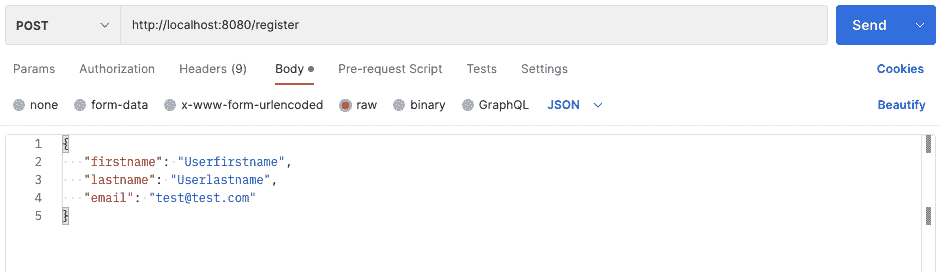

发送请求后，响应应该包含新注册用户可以使用的 JWT。

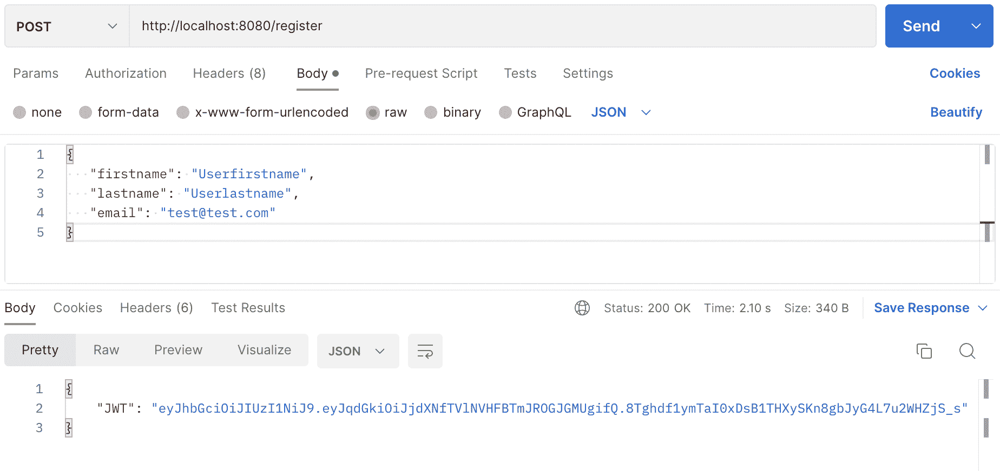

我们现在将检查 Stripe，以确保我们向客户注册的信息正确输入到 Stripe 中。

重新登录 Stripe，您将导航至**客户**屏幕。您应该会在列表中看到新创建的用户。


单击列表中新添加的客户。在下一个屏幕上，您应该看到该客户也订阅了您的 API 订阅。


检查完成后，我们可以放心地假设我们的 **/register** 端点正在 Stripe 中正确地设置我们的用户帐户和订阅。

## 6 -使用生成的 JWT 调用您的 API

我们的下一步是实际使用我们生成的 JWT。然后，我们将确认所有正确的信息都已添加到 Moesif 中。我们正在确认的数据包括:

*   条带客户 ID 映射到 Moesif 用户 ID
*   条带订阅 ID 映射到 Moesif 公司 ID
*   Moesif 包含用户配置文件中的条带元数据

### 使用邮递员发送请求

接下来，让我们使用 Postman 或另一个平台向 **/test-service** 端点发送一个请求。这是我们在上面的步骤 3 中为其设置计费计量器的端点。

在《邮差》中，我们将:

*   将**/测试服务** API 端点作为请求 URL
*   选择授权选项卡
*   选择类型作为不记名令牌
*   填充令牌详细信息
*   将令牌设置为从我们的/register 调用收到的 JWT

下面是 Postman 中填充请求配置的一个示例。

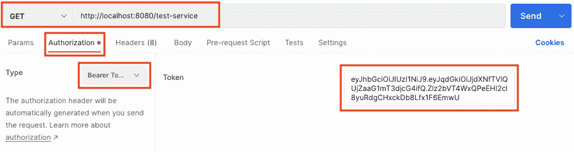

要将请求发送到我们的端点，请单击 send。

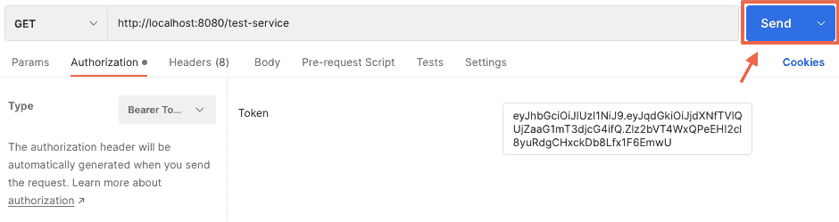

一旦发送，API 调用分析应该在 Moesif 着陆。

### 使用个人资料仪表板确认 Moesif 收到了请求信息

回到 Moesif，您将导航到**实时事件日志**屏幕。您可以通过点击**新建**按钮并选择**实时事件日志**来完成此操作。

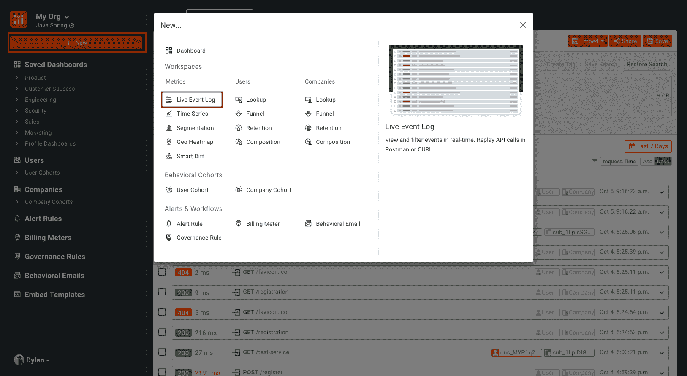

在这个屏幕上，您应该会看到您刚刚发送的请求。您应该会看到该条目包含一个用户 ID 和一个公司 ID，其中填充了 Stripe 用户和订阅 ID。条目应该如下所示:

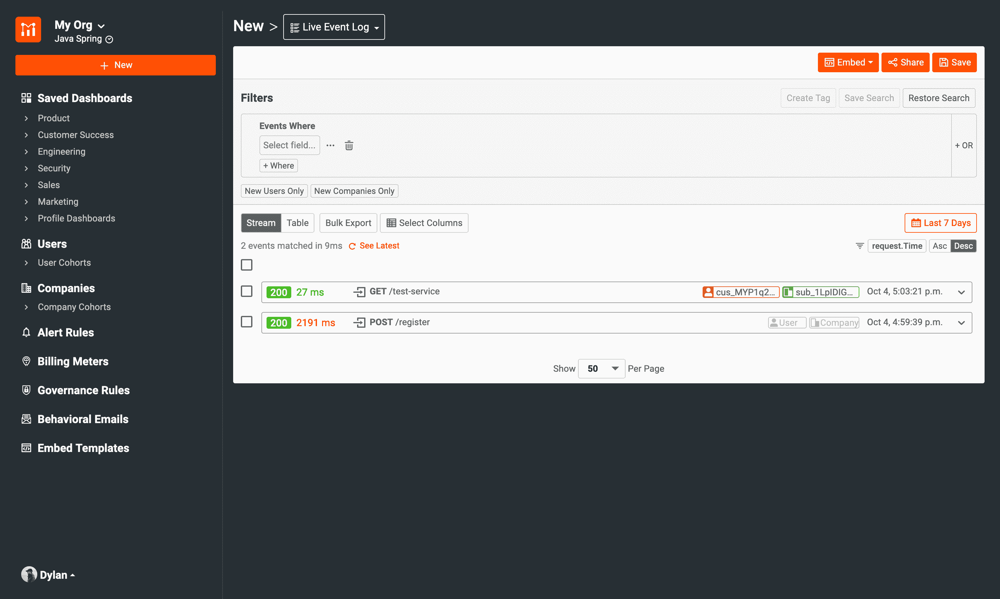

> 客户 ID 看起来像“库斯 _XXXX ”,订阅 ID 看起来像“sub_XXXX”。

如果您单击实时事件日志屏幕上条目中显示的用户 ID，您将进入用户资料页面。在此页面上，我们将确认条带元数据是否存在。我们需要在配置文件中添加一个新列来显示条带数据。为此，在个人资料页面，点击 **…更多操作**按钮，然后点击**自定义个人资料的布局**。

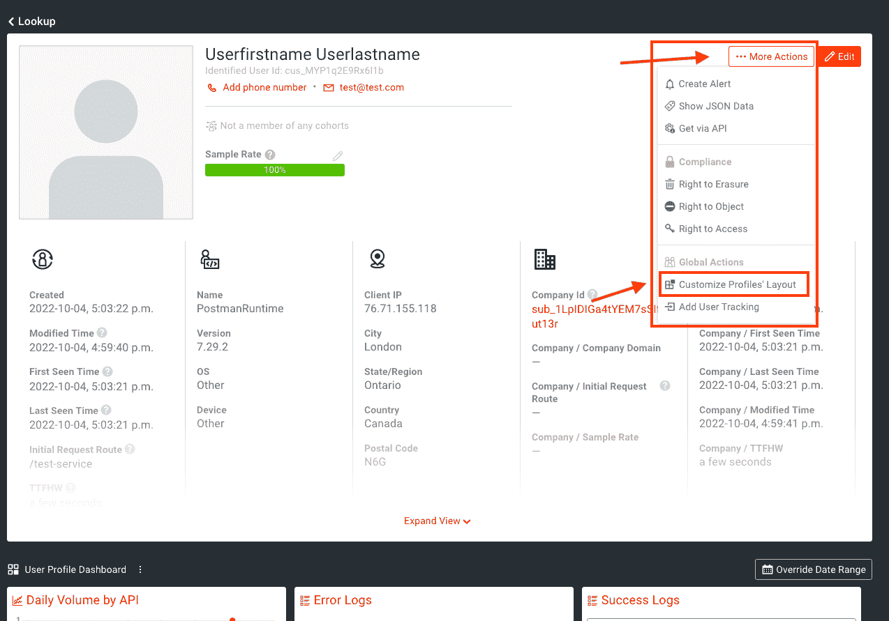

然后，我们将为条带元数据添加一个新列。您将单击屏幕最右侧的 **+** 按钮来创建一个新列，我们将在其中添加条带元数据。


> 您可能需要向右滚动才能看到它，这取决于您的分辨率和屏幕大小，以便看到+按钮。

然后，您将深入到**元数据>条带>客户>创建**，并在新行中使用该字段。我还改变了一个更适合的列图像。您可以通过点击图片并选择最合适的图片进行定制。

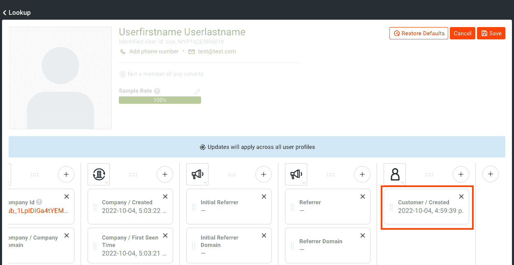

您还可以添加其他字段，但是目前仅这一个字段就足以告诉我们 Moesif 正在正确地从 Stripe 接收数据。

> 如果您没有看到条带元数据条目作为可用字段，请等待几分钟。如果几分钟后条带元数据不存在，请确保 Moesif 中的条带配置是正确的。在确认或编辑它之后，尝试创建一个新用户并再次发送请求以确认集成正在工作。

在这一点上，我们现在已经确认我们的 API 调用正在工作，并且在 Moesif 中使用了正确的用户和公司详细信息。我们还确认了 Stripe 正在将数据发送回 Moesif，这些数据被正确地映射到相应的用户配置文件，这是通过 Moesif 中的 Stripe 元数据确认的。

## 7 -创建前端

接下来，我们想添加一个简单的小前端，这样我们就不需要通过邮递员调用我们的 JWT。我们将制作一个快速的小注册表单，然后返回一个 JWT 供我们新注册的用户使用。

### 将 html 文件添加到应用程序

在应用程序的`src/main/resources`目录下，创建一个名为`templates`的文件夹，我们将添加两个文件。我们将添加一个 registration.html 的**和一个 result.html 的**文件。****

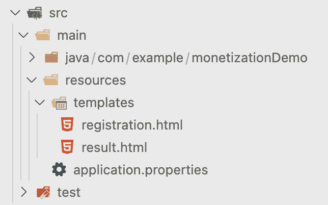

### 编写前端表单和逻辑

让我们添加前端 HTML 的代码。在`registration.html`文件中，我们将添加如下所示的标记:

```py
<!DOCTYPE HTML>
<html xmlns:th="https://www.thymeleaf.org">
<head>
    <title>Moesif Monetization Example</title>
    <meta http-equiv="Content-Type" content="text/html; charset=UTF-8" />
</head>
<body>
  <h1>Moesif Monetization Example</h1>
    <form action="#" th:action="@{/registration}" th:object="${registration}" method="post">
      <p>Email: <input type="text" th:field="*{email}" /></p>
      <p>First Name: <input type="text" th:field="*{firstname}" /></p>
      <p>Last Name: <input type="text" th:field="*{lastname}" /></p>
      <form:hidden path="jwt" />
      <p><input type="submit" value="Register" /> <input type="reset" value="Reset" /></p>
    </form>
</body>
</html> 
```

这个标记将显示一个允许用户输入电子邮件、名字和姓氏的表单。它还有一个注册按钮，将输入的数据传递给我们马上要创建的`RegistrationController`。

接下来，我们将把以下标记添加到我们的`result.html`文件中:

```py
<!DOCTYPE HTML>
<html xmlns:th="https://www.thymeleaf.org">
<head>
    <title>Moesif Monetization Example</title>
    <meta http-equiv="Content-Type" content="text/html; charset=UTF-8" />
</head>
<body>
  <h1>Moesif Monetization Example Results</h1>
    <p th:text="'Email: ' + ${registration.email}" />
    <p th:text="'First Name: ' + ${registration.firstname}" />
    <p th:text="'Last Name: ' + ${registration.lastname}" />
    <p th:text="'JWT: ' + ${registration.jwt}" />
    <a href="/registration">Submit another registration</a>
</body>
</html> 
```

在我们的注册流程完成后,`result.html`文件将显示从控制器收到的数据。

### 创建注册模型

回到我们的“工作目录”(`/src/main/java/com/username/monetizationDemo`)，创建下面两个文件，`Registration.java`和`RegistrationController.java`。

在**Registration.java**文件中，我们将创建一个用于为我们的用户建模的类:

```py
public class Registration {

  private String email;
  private String firstname;
  private String lastname;
  public String jwt;

  public String getEmail() {
    return email;
  }

  public void setEmail(String email) {
    this.email = email;
  }

  public String getFirstname() {
    return firstname;
  }

  public void setFirstname(String firstname) {
    this.firstname = firstname;
  }

  public String getLastname() {
    return lastname;
  }

  public void setLastname(String lastname) {
    this.lastname = lastname;
  }

  public String getJWT() {
    return jwt;
  }

  public void setJWT(String jwt) {
    this.jwt = jwt;
  }

} 
```

### 创建注册控制器

`RegistrationController`用于呈现我们的表单，接收从前端输入的数据，并将其传递给我们的后端`RegistrationService`。其结果将显示给最终用户，返回的 JWT 用于授权呼叫。

```py
import java.util.Map;
import java.util.HashMap;
import org.springframework.ui.Model;
import org.springframework.stereotype.Controller;
import org.springframework.web.bind.annotation.GetMapping;
import org.springframework.web.bind.annotation.PostMapping;
import org.springframework.web.bind.annotation.ModelAttribute;

@Controller
public class RegistrationController {

  @GetMapping("/registration")
  public String registrationForm(Model model) {
    model.addAttribute("registration", new Registration());
    return "registration";
  }

  @PostMapping("/registration")
  public String registrationSubmit(@ModelAttribute Registration registration, Model model) {
    // Create payload from form data for registration
    Map<String, Object> payload = new HashMap<>();
    payload.put("email", registration.getEmail());
    payload.put("firstname", registration.getFirstname());
    payload.put("lastname", registration.getLastname());

    // Register User and add generated JWT to result form response
    Map<String, Object> jsonResponse = new APIController().registerUser(payload);
    registration.setJWT(jsonResponse.get("JWT").toString());
    model.addAttribute("registration", registration);
    return "result";
  }
} 
```

## 8 -测试前端

要测试前端，保存您的代码更改并重启服务器。然后，在浏览器中，导航到[http://localhost:8080/registration](http://localhost:8080/registration)。然后，您将看到表单出现。

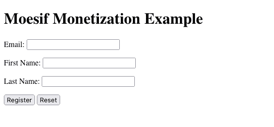

### 填写表单字段并提交

现在表单已经加载到屏幕上，请填写字段并单击 Register 按钮。这将获取信息，将其传递给我们的`RegistrationController`，并给我们生成的 JWT。

> 建议您使用不同的电子邮件地址，而不是您之前通过 **/registration** 端点直接创建 JWT 时使用的电子邮件地址。

### 确认 JWT 回来了

单击提交按钮后，几秒钟后，JWT 应该会返回到 UI。

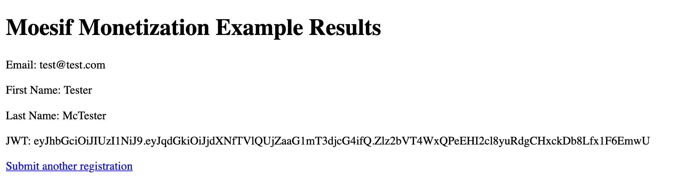

## 9 -向您的货币化 API 发送请求

我们将再次希望确保所有东西都与我们的 UI 一起工作，直到我们的后端系统。为此，只需重复从**步骤 6** 开始的步骤，以确认用户和公司 id 已正确填充，并且为该用户和新 JWT 返回了条带元数据。我们应该会在实时事件日志中看到这些呼叫。


## 10 -确认所有部件工作正常

尽管这是可选的，但这一步可能有助于解决我们之前步骤中可能出现的任何问题。这里有几件事需要检查，以确保一切正常。通过 UI 创建新用户并使用生成的 JWT 调用 API 后，请确认以下内容:

### 成条纹状

*   确认已经使用您在 UI 中输入的详细信息在 Stripe 中创建了一个客户
*   确认客户订购了正确的产品和价格

### 在默西迪斯

*   您的 API 调用被记录在 Moesif 的实时事件日志中
*   您的 API 调用在 Moesif 的用户和公司字段中分别有 Stripe 客户 ID 和订阅 ID。
*   确认在 Moesif 中填充了条带元数据
*   所有计费仪表测试条件均已通过

## 11 -检查条带的使用情况

最后，几个小时后，最好进入 Stripe，确认使用情况是否被添加到用户订阅中。确保您已经发送了几个请求，以确保您有一些应该发送到条带的数据。

> 从 Moesif 到条带化可能需要几个小时。如果几个小时后 Moesif 中仍然没有数据，请确保您遵循了本指南中概述的所有步骤。这包括确保来自 Moesif 的用户和公司 ID 正确地映射到 Stripe 中相应的密钥。

要检查使用情况，在 Stripe 中，您需要导航到**客户**屏幕，并选择与您进行 API 调用的客户。一旦选中，您应该会看到您通过 **/register** 端点注册的用户的一些活动订阅。我们之前创建的那个叫做**我的 API** 。单击订阅条目。


在下一个屏幕上，点击价格条目旁边的**查看用法**。


现在应该会弹出一个模型，向您显示已经从 Moesif 中剥离的 API 的用法。

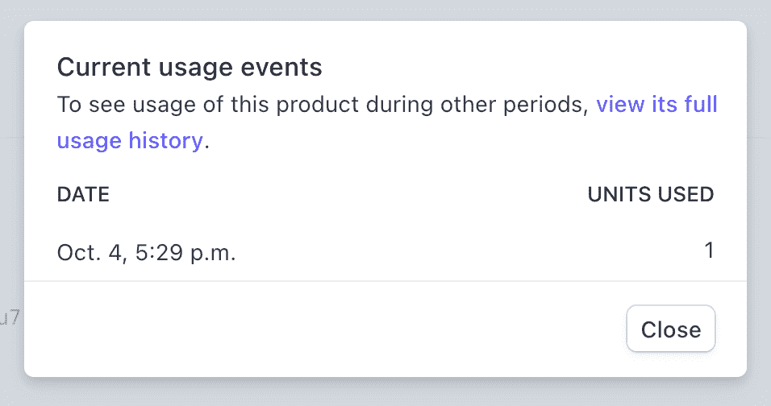

> 请记住，Moesif 向 Stripe 报告时会有延迟。如果您的数据还没有，请稍后再回来查看。

## 12 -确定计费仪表是否正常工作

测试创建的计费表很容易，没有测试表功能。从左侧导航窗格导航至您创建的计费表，并选择您的**条带测试**计费表。选择右上方的**测试仪**。

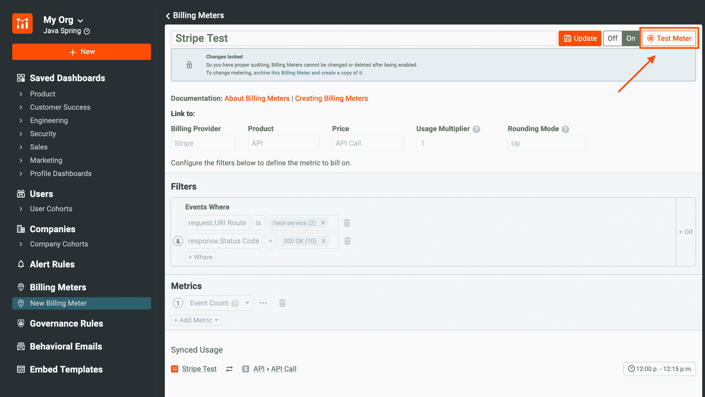

Moesif 将等待在 Stripe 内创建的订阅，这些订阅将在 Moesif 自身内关联。此页面会自动更新，无需刷新。

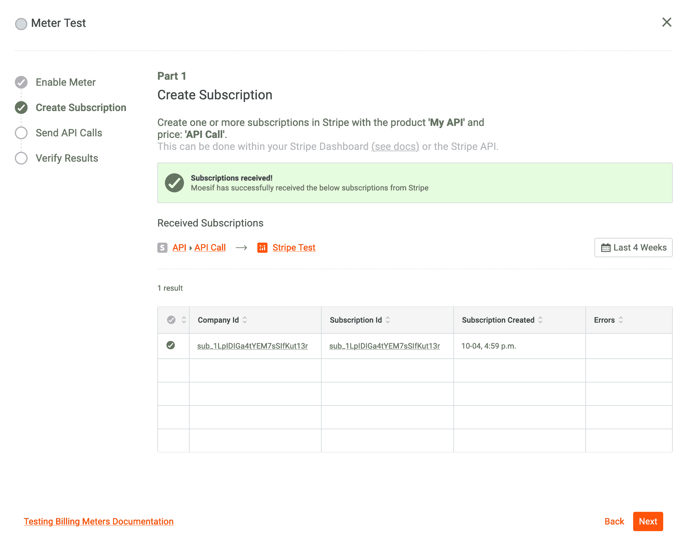

然后，Moesif 将使用为我们创建的 JWT，等待对与我们的计费表相关联的任何端点的 API 调用。


最后，Moesif 将每隔 15 分钟将所有使用数据同步到条带。该步骤可能需要几分钟时间，具体取决于 API 调用的启动时间，但会按照给定的时间间隔进行更新。


## 包扎

货币化一直是一个难以逾越的障碍。许多定制解决方案提供了灵活性，但工程和支持成本非常高。有了 Moesif，API 货币化就有可能在极短的时间内实现。正如本文所展示的，通过一点点配置和最少的代码，我们可以在最短的时间内创建一个生产就绪的后付费货币化方案。