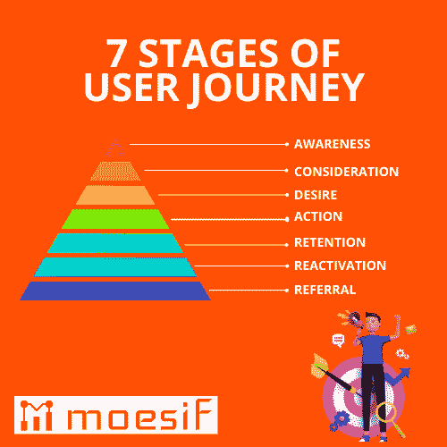

# 用户渠道对客户体验至关重要

> 原文：<https://www.moesif.com/blog/customer-success/moesif-product/User-Funnels-Are-Vital-To-The-Customer-Experience/>

## 快乐的客户+客户忠诚度=品牌倡导者

如果你在寻找提高客户满意度、体验和忠诚度的方法，你需要关注客户如何使用和采纳你的产品。为此，你需要关注你的用户漏斗，有时被称为转换漏斗。在这篇文章中，我们将向你展示用户漏斗可以改善你的业务的一些关键领域的七种方式，以促进上述所有！

用户渠道是你的客户在与你的产品或服务互动时所选择的路径。这可以跟踪从他们第一次发现你的产品，注册，并开始使用特定功能的步骤。通过了解和优化用户漏斗，您可以有针对性地进行改进，以提高客户满意度和忠诚度。以下是用户渠道可以帮助你做到这一点的七种方式:

### 1.改进入职流程

入职流程对新用户至关重要。对于许多客户来说，入职体验是“成败”的一步，在这里你会看到大部分人被淘汰。如果用户体验良好，他们更有可能留下来继续使用产品。如果没有，他们更有可能流失，或者更糟，对你的产品进行负面评价，即使他们没有机会真正体验它。

用户渠道可以帮助您了解用户在哪里下车，以及是什么导致他们这样做，从而帮助您优化入职流程。入职流程通常包含多个可分割的步骤。通过在过程中的每一步检查转换，而不是将其视为一个单一的实体，您可以快速改善体验，并就应该在哪些方面做出更明智的决定。一个伟大的营销战略和销售团队能做的只有让人们注册，入职是你真正脱颖而出并为你的产品创造福音的地方

### 2.提高参与度

参与是让客户满意的关键，让他们能够提供产品反馈和见解。提供反馈可以帮助产品团队改进功能，跟上竞争对手并建立持久的关系。参与可以有许多不同的形式，包括在客户生命周期的不同阶段使用客户反馈调查。你可能会发现，向新客户发送试用后电子邮件调查可以保持客户参与，并有望为你的产品或服务注册付费账户。

提高参与度的尝试也可能来自产品电子邮件。这些电子邮件可能会显示最新的功能或定制的电子邮件流，指出根据其他行为为特定用户带来最大价值的功能。当使用一个序列来尝试和推动采用时，关注你的用户漏斗，看看你推动参与的行动是否会导致转化和采用，这很重要。

### 3.减少流失

当客户参与进来时，他们不太可能关注其他竞争对手或寻求我们的替代解决方案。相关文档和支持对客户的成功至关重要。分析客户流失的原因对于公司的发展至关重要，对于理解哪里可以创造新功能，哪里可以改进现有功能也很重要。通过收集数据来了解客户流失的原因，您可以跟踪用户体验的变化，以了解客户流失是在减少还是在增加。用户漏斗可以让你准确地看到客户旅程中的哪个阶段最有可能引起客户流失。

### 4.提高客户满意度

让客户满意是让客户开心的关键因素。如果他们对你的产品或服务不满意，他们会继续抱怨。识别用户漏斗中的负面体验有助于创建指南，帮助客户更好地利用您的产品和服务。根据易用性、文档或功能可用性等因素，客户满意度可能会提高或降低。用户漏斗有助于找出痛点，进行补救，并跟踪改进对客户的影响。

### 5.提高忠诚度

客户忠诚度是留住客户的关键。建立一个喜欢你的产品并继续回到平台的客户群是建立经常性收入的最好方法之一。正如大多数人所知，发展业务最昂贵的部分之一是吸引和吸纳新客户。通过保持客户忠诚度，你可以继续从那些已经采用你的产品的人那里增加收入。

要建立客户忠诚度，了解客户哪里需要支持的能力至关重要。这种支持可以来自持续的营销和产品文档，也可以直接来自客户成功团队。最重要的是，忠诚度可以表明你的公司有能力提供客户感兴趣的产品或服务，并从中获得重复价值。

### 6.增加收入

收入增加是客户满意度和客户忠诚度提高的自然结果。通过提高用户漏斗和转化率，您可以提高客户满意度和忠诚度，从而增加收入。

### 7.改善整体客户体验

整体客户体验是吸引客户的关键。这项工作从销售代表到客户成功团队开始。

## 典型用户旅程的七个关键阶段

### 认知阶段

这是一个潜在客户意识到你的品牌或产品的时候。例如，他们可能会看到一则广告，读到一篇关于你的产品的文章，或者被朋友推荐。

### 兴趣和考虑阶段

一旦他们意识到你的产品，他们需要对它产生一定程度的兴趣。这是你需要提供更多信息的地方，关于你的产品能为他们做什么，为什么他们应该关心。这可能来自不同的来源，如指南、影响者营销、社交媒体、电子邮件营销、数字营销、Reddit、Twitter 和/或 LinkedIn。任何社交媒体平台都可以在客户旅程中发挥重要作用。

### 欲望

在这个阶段，潜在客户非常想要你的产品，正在考虑购买。他们可能会比较不同的产品，阅读评论，或联系销售团队，因此营销策略对任何新客户都非常重要。

### 行动

最后，潜在客户采取行动，购买你的产品。但是他们的旅程并没有随着销售团队而结束。

### 保留

即使有人已经购买了你的产品，你也需要让他们参与进来，这样他们才不会成为一次性顾客。你可以通过提供优质的客户服务、提供额外的产品或服务，或者发放奖励来培养客户忠诚度。

### 再活化

如果某个客户已经有一段时间不活跃了，您可以尝试通过特别优惠重新激活他们，或者将他们添加到公司电子邮件列表中。

### 介绍

最好的客户是那些告诉他们的朋友你的产品并帮助你带来新的商业线索的人。你可以通过推荐项目或其他激励措施来鼓励这种行为。

用户渠道是创造快乐的潜在客户和不断回头客的重要部分。通过了解您的客户经历的旅程并优化每个阶段，您可以确保他们从认知阶段到推荐阶段有一个平稳愉快的体验，并提高客户忠诚度。你希望你的客户成为品牌倡导者。

## 为什么是用户漏斗？

用户漏斗是让你的新客户更开心的好方法，原因有很多。首先，用户渠道可以帮助你引导你的客户通过你的网站或应用程序，这种方式对他们来说非常简单和直观。这有助于减少沮丧和困惑，并使他们更有可能找到他们正在寻找的东西。

其次，用户漏斗可以帮助你收集关于你的客户的重要数据，你可以用这些数据来改善他们的体验。例如，您可以使用来自用户渠道的数据来了解哪些页面或功能最受客户欢迎，并做出相应的更改。

第三，用户渠道可以帮助你细分你的客户，这样你就可以针对目标受众定制你的营销和沟通。这可以确保你的客户只收到他们感兴趣的相关信息，这使得他们更有可能参与你的品牌。

总的来说，用户漏斗提供了很多好处，可以让你的新客户更开心。通过使他们更容易在你的网站或应用程序上找到他们需要的东西，并通过提供你可以用来改善他们体验的有价值的数据，用户漏斗可以帮助你从头到尾为你的客户创造更好的体验。

## 如何实现用户漏斗

用户漏斗是让你的新客户更开心的好方法。通过实施用户漏斗，你可以以更有效的方式引导客户浏览你的网站或应用，从而为他们提供更好的体验。

用户漏斗可以帮助你追踪用户的行为，并看到他们在哪里下车。通过这种方式，您可以对您的网站或应用程序进行更改，以改善用户体验。此外，用户渠道还可以帮助您向客户进行追加销售和交叉销售。

有几种不同的方法来实现用户漏斗。对于 B2C 领域的前端分析，一种方法是使用 Google Analytics。你可以在谷歌分析中设置用户渠道，方法是进入管理部分，选择“目标”菜单。在那里，您可以创建一个新目标，并选择“漏斗”作为类型。

实现用户漏斗的另一种方式是通过 A/B 测试。A/B 测试允许你用一小组用户测试你的网站或应用的不同版本。这样，您可以看到哪个版本最适合您的客户。

Moesif 是一个很好的工具，可以跟踪用户的整个旅程。您可以看到用户在哪里注册，何时使用产品，何时购买或订阅产品。[点击此处](https://www.moesif.com/docs/guides/guide-on-creating-user-funnels-in-moesif/?utm_campaign=Int-site&utm_source=blog&utm_medium=body-cta&utm_content=user-funnels-vital-cx)获取使用 Moesif 用户漏斗的帮助指南。

总的来说，用户漏斗是通过跟踪用户行为来改善你的网站或应用程序的客户体验的好方法。

## 用户渠道的类型

有几种不同类型的用户渠道，企业可以用来让他们的新客户更开心。

一种用户漏斗是免费试用漏斗。这种漏斗为新用户提供产品或服务的免费试用期。免费试用期结束后，用户需要为产品或服务付费。这种类型的漏斗是让新客户在承诺付费之前试用你的产品或服务的好方法。

另一种用户漏斗是订阅漏斗。这种类型的漏斗需要新用户注册订阅才能访问你的产品或服务。一旦订阅结束，用户将不再能够访问您的产品或服务。这种漏斗是让新客户承诺定期使用你的产品或服务的好方法。

最后一种用户漏斗是一次性购买漏斗。这种类型的漏斗允许新用户直接购买你的产品或服务。不需要用户做出任何承诺，只要他们愿意，他们就可以使用你的产品或服务。这种漏斗是吸引新客户进行一次性购买的好方法。

## 提高顾客满意度的 7 个技巧

1.  保持你的用户漏斗简单和用户友好
2.  让新顾客轻松找到他们想要的东西。
3.  提供良好的第一印象，创造品牌知名度
4.  提供卓越的客户服务
5.  客户支持了解他们的需求创造忠诚的客户
6.  积极主动地创建持续的教育内容，在他们的客户之旅中为他们提供支持。
7.  对客户保持表示赞赏

## 最后的想法

用户渠道是增加销售额的好方法。通过了解用户如何与你的产品互动，你可以设计一个引导他们购买的漏斗。用户渠道也可以用来接纳新用户。通过向新用户展示你的产品的最重要的特性，你可以帮助他们开始并增加他们继续使用你的产品的机会。用户漏斗可以用许多不同的方式来设计。重要的是考虑用户的旅程，以及每一步你想让他们做什么。通过设计一个用户漏斗，你可以让用户更有可能采取你希望他们采取的行动，这可能会带来推荐和品牌知名度。

总的来说，用户漏斗是提高客户满意度的好方法。通过为用户提供一条清晰的路径，你可以帮助他们更容易地实现他们的目标。这可以为您的客户带来更好的体验，最终让客户更加满意。