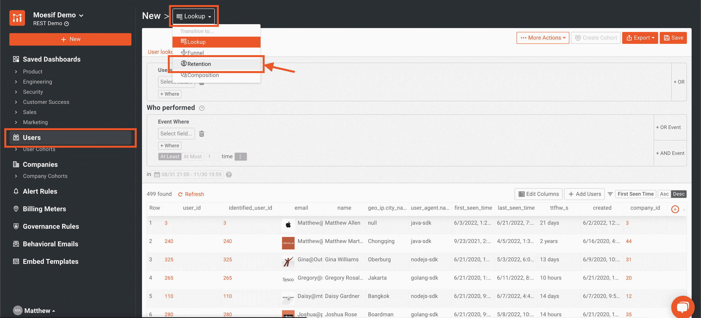
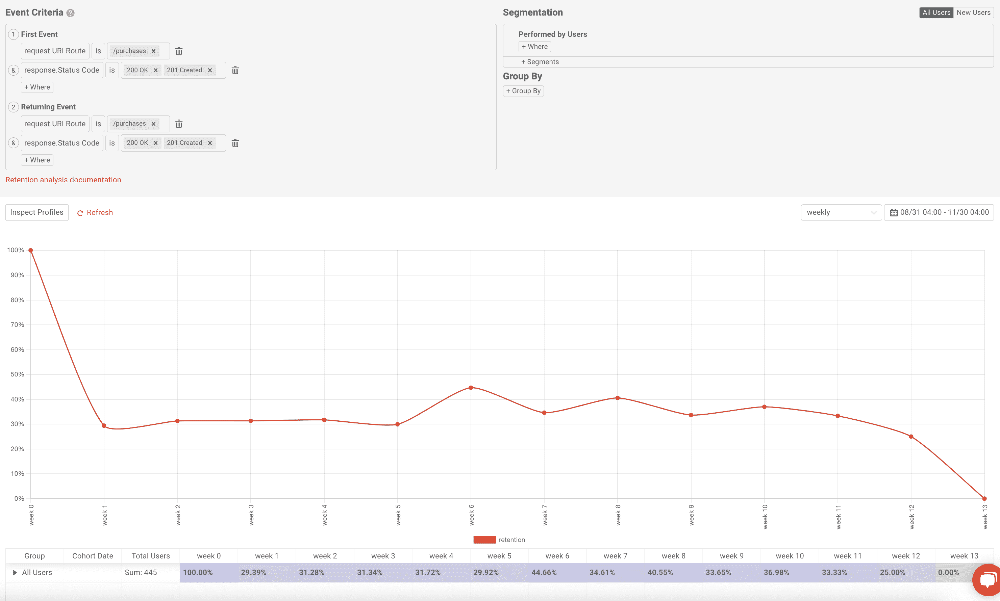
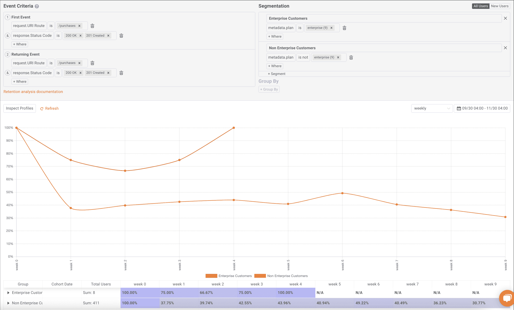
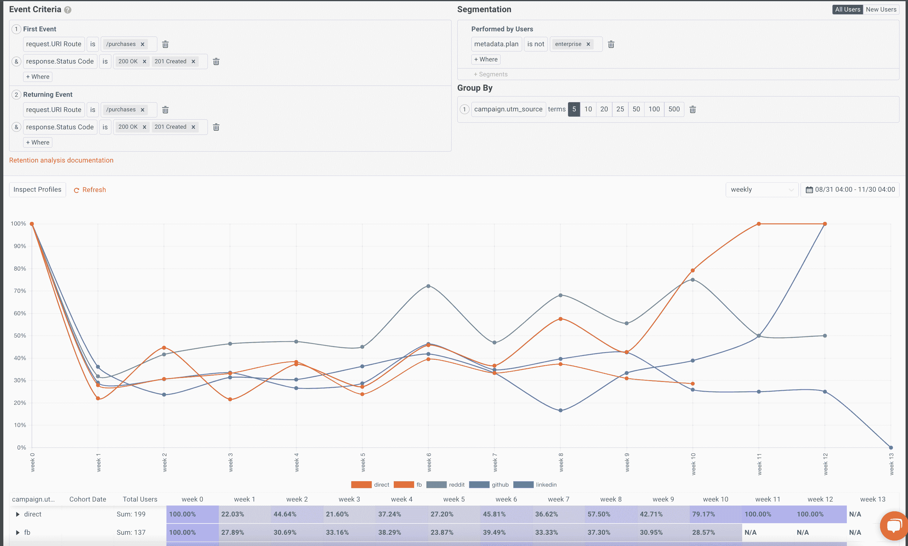

# 什么是产品留存率，如何提高产品留存率？

> 原文：<https://www.moesif.com/blog/api-product-management/retention-analysis/What-Is-Product-Retention-And-How-Can-You-Improve-It/>

产品保持率是检查企业健康状况的一个极其重要的指标。计算你的企业的保留率将返回给定时间段内继续使用你的产品或服务的用户的百分比。保留率实际上可以被视为衡量客户忠诚度的一个标准，也是您与新客户或现有客户关系质量的一个很好的反映。如何提高客户保持率是许多企业非常关心的问题，制定一个伟大的客户保持战略是解决这个问题的最佳途径。如果你能设法保持低客户流失率并继续留住客户，那么在获取客户方面做得很好才有意义。

客户保持率低可能是你的产品有问题的主要标志，包括产品价值的价格过高。高客户保持率意味着你当前的客户重视你的产品，产品的持续使用带来了可持续的收入来源。保持力分析很容易执行，但是使用像 Moesif 这样的平台来创建保持力分析是随着时间的推移跟踪客户保持力的最佳方式。让我们来看看保留报告每个部分的细节，以及如何在 Moesif 中创建和解释它们。

## API 优先业务的产品保留

如果你的业务是 API，那么衡量产品留存率就有点不同了。衡量开发人员门户的登录情况可能不准确，因为开发人员通常不会每天或每周登录管理门户。衡量原料药产品保留率的最佳方法是通过一致的原料药活动。然而，并不是所有的 API 流量都是相等的。使用 API 流量作为保留报告的基础，需要考虑为客户创造价值的流量，而不仅仅包括任何 API 调用。如果您采用基于使用量的计费模式，为客户带来价值的流量可能与您收取的费用相同。API 业务的客户可能使用不同的 API 来满足不同的需求，这意味着您可能需要一种方法来过滤客户可能发送的特定字段或数量。例如，不应在保留报告中考虑 4xx 或 5xx HTTP 错误响应代码，因为这些通常是错误情况，会扭曲保留分析。

## 确定第一个事件并返回事件

当我们考虑客户保留时，有两个重要事件用于确定用户是否被保留。初始事件被称为“第一个事件”，这将是您的保留报告开始的地方。**第一事件**可以通过确定用户何时第一次从产品接收价值来确定。对于电子商务平台，这可能是用户第一次实际创建采购订单。如果你是一个通信平台，第一个事件可能是用户通过该平台发送一条短信。您也可以将其推广为任何 API 调用。

保留分析的第二部分是当用户执行一个**返回事件**时，表明他们是一个回头客。返回事件是指客户返回平台，并执行一项活动，从产品中获得价值。通常，这是在**第一个事件**中执行的相同类型的事件，但也可能是完全不同的事情。每次用户执行**返回事件**时，他们都被视为保留用户。当用户不再执行**返回事件**时，用户不再被保留并且可能不再使用该产品。

## 在 Moesif 中创建保留报告

在 Moesif 中创建保留报告很容易。第一步是导航到**用户**屏幕。一旦进入屏幕，接下来你要做的就是从屏幕左上方的下拉菜单中选择**保留**。

现在在**保留**屏幕上，您可以指定**第一事件**和**返回事件**。在本例中，我们将着眼于创建一个简单的保留分析，其中当用户在平台上进行购买和重复购买时，**第一个事件**和**返回事件**。我们还将通过指定响应**状态代码**等于 **200** 或 **201** 来确保仅包括成功的结账，表示成功的调用。下面是它在 Moesif 中的样子。

> 在 Moesif 中，如果未指定事件，Moesif 将根据为该用户接收的任何事件来计算保留时间。这有时很有用，但通常更准确地选择特定的第一个和返回事件。正如你所看到的，Moesif 自动创建了一个图表，描绘出客户保持曲线。

## 添加分段和分组

为了进一步细分保留报告，我们还可以考虑向数据添加分段和分组。

对于细分，我们可能希望只包括执行了某项活动的客户或属于我们客户群中某个细分市场的客户。例如，在我们之前构建的示例的基础上，我们可以添加一个细分子句，以查看**企业**和**非企业**客户在保留率方面的差异。为此，我们将添加细分市场，以区分这两种类型的客户。下面是一些例子。

另一个观察分析的角度是使用按分组的**功能。这使我们能够看到不同用户群的保留情况。例如，我们可以将前面的示例改为只查看**非企业**客户，并添加一个 **Group By** ，以便按照 **UTM Source** 对该细分市场内的客户进行分组。这将向我们展示，根据用户来自哪个 UTM 来源，他们的客户保持率是什么样的。这可以帮助我们了解在创造忠诚客户时，哪些策略有效，哪些策略无效。这就是它的样子。**

有了这两个额外的特性，我们可以真正深入挖掘客户维系的各个方面，并得出比没有细分和分组更深入、更具体的见解。

## 解释留存报告

当实际查看保留报告时，了解您正在查看的内容非常重要。有几个场景显示了健康的保留，其他场景显示了不健康的保留或需要改进的保留。

### 保持力高/最佳

最佳保留率因行业而异，因此很难说您希望您的保留率达到什么水平。也就是说，有很多研究显示了行业的平均保留率[，包括 ProfitWell](https://www.profitwell.com/customer-retention/industry-rates) 在 2020 年完成的这项研究。在此报告中，我们可以看到以下按行业划分的平均保留率:

*   零售:63%
*   银行业:75%
*   电信:78%
*   IT: 81%
*   保险:83%
*   专业服务:84%
*   媒体:84%

根据你所在的行业，你显然希望确保你的留存曲线开始快速变平，并大致保持在这些目标附近。同样重要的是，看看你在做什么来保持这么高的客户保留率，并继续这样做来留住忠诚的客户。如果随着你对入职、业务流程、市场营销和其他因素的改变，保留率开始下降，你可能要考虑恢复到保留率较高时的策略。很可能你的服务或应用程序的体验没有达到客户的期望。你的客户保持策略应该始终以尽可能保持高的客户保持率为目标。

### 张力迅速下降

如果留存率迅速下降到较低水平，这通常意味着客户对产品不满意，或者没有从产品中获得价值来证明退货的合理性。如果您按月查看留存率，到第二个月留存率显著下降，您可能希望查看更短时间段的留存率，例如每周甚至每天。在记忆力差的情况下，好的一面是小的变化可能会导致巨大的差异。当保留率很低时，你需要继续密切关注潜在的改进，因为低保留率会给许多企业带来灾难。

### 保留报告没有显示多少历史记录

如果您的业务仅开展了 4 周，或者您仅跟踪了 4 周的留存率，那么很难查看 12 个月的留存率，因为数据不存在。如果您发现您的保留报告比您预期的更快停止，您需要确保您有足够的数据来支持您正在尝试查看的时间跨度。如果您的数据有限，请考虑使用更短的时间单位，例如每天或每周查看保留时间，直到您的数据增长到足以每月或每年进行评估。

当然，每家公司对他们应该保留的员工都有不同的期望。你很可能属于上述三种类型中的一种，甚至可能是多种。一旦你评估了你的记忆力，下一步就是保持它，或者更有可能的是，提高它。接下来，让我们看看提高记忆力的一些方法。

## 提高保持力的技巧

保持能力可能有点难，但是跟踪保持能力的指标是提高保持能力的第一步。有很多方法可以提高记忆力，根据你所处的行业，有些方法可能比其他方法更适用。这里有一些留住客户的策略，你可以尝试一下，从更多的忠诚客户中建立你的客户群。

### 完善您的入职流程

没有什么比糟糕的客户入职流程更能迅速吓跑新客户了。如果客户从未充分参与进来并发现你的产品的价值，就很难留住他们。这就是为什么提高你的入职培训是提高用户保持率的最佳方式。出色的入职体验通常会带来出色的客户体验，从而快速交付满足客户需求的解决方案。要了解您的入职流程在当前状态下的情况，您可能需要查看以下指标:

*   有多少用户正在开始入职流程，但尚未完成？
*   大多数人都放弃了入职流程。
*   在入职流程的哪个阶段，用户更有可能坚持到底？

一个极其复杂和漫长的入职流程会很快扼杀员工的忠诚度。用户发现价值的时间越短，你的入职就越有影响力。要使用 Moesif 深入了解入职，您可能希望使用我们的[用户渠道](https://www.moesif.com/docs/user-analytics/conversion-funnel-analysis/)功能来查看入职流程中的每一步，有多少人转换到下一步，以及完成每一步需要多长时间。更好的入职体验可能是通过改善整体客户体验来真正提高保留率的秘诀。

### 通过客户反馈调查吸引客户

喜欢你的产品的优秀客户可以回答一些关于他们为什么继续使用你的产品的问题。放下你的产品的顾客也可以提供同样多的见解。通过对这两类客户的客户调查获得客户反馈，可以深入了解用户留下和离开的原因，这是保持方程的核心。使用客户调查来建立定性的客户数据可以帮助你了解客户建立品牌忠诚度的快乐程度。

对于留下来的用户来说，询问他们最喜欢产品的哪些方面、他们属于哪个人群以及产品的哪些部分可能会让他们离开是很重要的(这可能是关于功能、可靠性甚至价格的问题)。一旦你发现是什么留住了用户，并发现了一些趋势，你就可以加倍努力，试图将这些好的氛围传播给新的和其他现有的客户。至于负面反馈，这可以优先考虑，以确保问题得到解决，从而提高保留率。

更重要的是，尤其是如果你的留存率已经很低的话，弄清楚为什么以前的用户会离开这个平台。在一个简短的调查中，你可以问这些客户他们为什么离开，怎样才能让他们回来。这将让你对问题和潜在的解决方案有更深入的了解，让你走上改进产品的正确道路，并有望提高客户保留率。一旦产品得到改进，你甚至可能会想联系这些以前的用户，让他们知道他们的反馈已经被听取，你很想让他们尝试你的新的和改进的体验。

客户反馈调查是一种非常有效的方式，可以获得对一些最大的客户体验和保留问题的简洁反馈，并可能帮助您发现影响客户满意度的问题，这些问题您甚至从来不知道。

### 一旦获得客户，不要停止营销

一旦有人注册、加入并使用了产品，许多公司就会停止营销。从逻辑上讲，这可能有道理，但实际上，这与事实相去甚远。你应该始终致力于吸引用户，让他们把你的产品和服务放在第一位。这可能包括时事通讯、产品发行说明和其他重要内容，以保持用户参与并发现产品的新价值。与客户保持联系并继续推广您的产品是让客户再次使用该产品并发现释放其价值的新途径的好方法。这应该是企业实施的几乎所有客户保留策略的基石。

对这种方法的一个很大的警告是，确保您使用智能自动化来持续向现有客户营销。使用包含与用户相关内容的个性化电子邮件，对于保持收到价值和被惹恼之间的界限至关重要。使用应用程序中的事件来驱动特定的电子邮件可能是一种很好的方式，例如当用户第一次使用某个功能时，您可以通过电子邮件向他们发送概述或文档链接，这样他们就可以根据需要深入了解。在 Moesif 中，可以通过使用[行为电子邮件](https://www.moesif.com/docs/behavioral-emails/)来进行这种类型的电子邮件营销，您可以根据应用程序的使用情况或应用程序中的特定事件或客户行为来触发特定的电子邮件。这可以作为一种方式来保持对现有客户的营销，同时也确保您提供良好的自动化客户支持。您还应该确保发送的电子邮件数量不会让用户不堪重负，从而有可能将您列入黑名单或退订名单。

## 使用 Moesif 提高保留率

现在，您已经知道了什么是客户保持率，为什么它很重要，以及一些关于如何提高客户保持率的技巧，您可以开始使用 Moesif 跟踪客户保持率指标。还没有使用 Moesif 吗？[立即注册](https://www.moesif.com/signup)开始行动，在几分钟内开始跟踪和提高客户保持率和客户忠诚度。无论您是使用我们的[保留分析](https://www.moesif.com/docs/user-analytics/cohort-retention-analysis/)来跟踪您的客户保留率，还是使用[行为电子邮件](https://www.moesif.com/features/user-behavioral-emails)或其他功能来帮助提高客户保留率，Moesif 都可以帮助您提高客户成功和保留率。让 Moesif 帮助您建立一个有效的客户保留策略，因为保留一个忠诚的客户是增加收入和增加客户终身价值的最有效的方法。