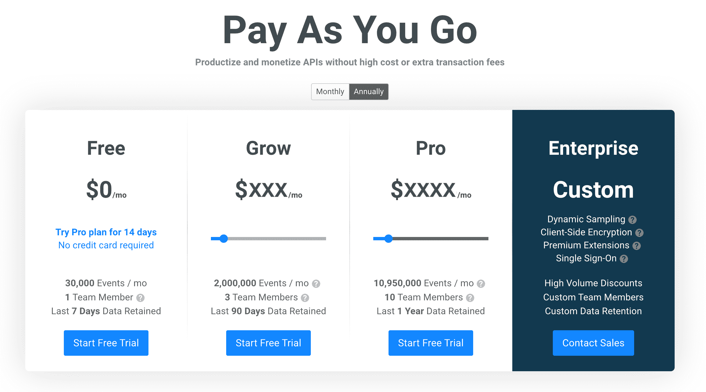

# API 定价时需要了解的内容

> 原文：<https://www.moesif.com/blog/api-monetization/api-strategy/What-You-Need-to-Know-When-Pricing-APIs/>

为 API 正确定价是 API 货币化策略的关键部分。这意味着了解您应该如何对使用收费，是按月还是按季度定价更好，是数据层还是按使用量付费的 API 定价模式效果最好，以及一系列其他因素。在本帖中，我们将涵盖 API 定价时你需要知道的所有内容。

## 为你的 API 建立定价策略

### 谁为 API 买单？

在最基本的层面上，询问谁真正为 API 付费是很重要的。当你将你的 API 货币化时，你是通过向最终用户——利用你的 API 提供商业价值的公司——收费来实现的。因此，通过了解您的 API 提供的价值，您将能够更好地建立一个有利的定价策略。

当把你的 API 当作一个产品时，一个基本原则是理解你的客户。通过了解他们如何使用你的产品，你不仅可以更好地为你的服务定价，还可以让你对什么可行、什么不可行以及你的路线图上应该有什么有不可或缺的见解。关于将 API 视为产品的更多信息[请查看](https://www.moesif.com/blog/tags/?utm_campaign=Int-site&utm_source=blog&utm_medium=body-cta&utm_content=pricing-your-apis#api-as-a-product)我们丰富的库。

### 你如何计算 API 价格？

有几种方法可以确定 API 的价值。根据 API 调用的数量收费是一种常见的定价标准，但当涉及到您的[定价模型](https://www.moesif.com/blog/developer-platforms/self-service/A-Playbook-To-Properly-Implement-Pay-As-You-Go-Pricing?utm_campaign=Int-site&utm_source=blog&utm_medium=body-cta&utm_content=pricing-your-apis)时，这肯定不是唯一的选择。在制定 API 策略时，要考虑不同的基于使用的计费方法，包括:

*   交易量——基于 API 调用的数量。它非常适合 API 和基于事件的平台，例如在 communications [Twilio](https://www.twilio.com/pricing) 或 analytics[moes if]https://www . moes if . com/price？UTM _ campaign = Int-site&UTM _ source = blog&UTM _ medium = body-CTA&UTM _ content = pricing-your-APIs){:target = " _ blank " }。
*   收入/成本份额–您向最终用户收取一定比例的收入或交易费用。这非常适合金融平台，比如那些专注于支付[条纹](https://stripe.com/pricing)或费用报告的平台。
*   数据量–基于发送的千兆字节或处理的分钟数。对于专注于数据的平台来说，这是一个很好的方法，比如日志或存储 [AWS](https://aws.amazon.com/s3/pricing/) 。
*   以用户为中心–基于每月活跃独立用户数量定价。这是现代版的按用户或座位收费。资源–基于计算单位或活动时间。非常适合数据库或虚拟机等计算基础架构。

你提供的产品将在你的定价策略中发挥关键作用。从 SaaS [价格点](https://www.beondeck.com/post/saas-pricing-strategy)方法中可以学到很多东西，因为许多 API 定价策略都植根于更广泛的 SaaS 定价解决方案。SaaS 定价的主导思想强调需要根据三个主要因素来定价:交付产品的成本、竞争对手的定价和你的价值指标。也就是说，你的客户将如何支付。从你的第一批付费客户那里获得反馈也很关键，因为他们会有很多关于哪些定价模式适合他们，哪些不适合他们的想法。

### 内部与外部 API

面向外部的 API 通常是收费的，这些 API 可供组织外的其他公司使用。内部 API，您可以用来在您的组织内互连不同的服务，通常不收费，因此不需要定价策略。

## 现收现付 API

[现收现付计费模式](https://www.moesif.com/blog/developer-platforms/api-analytics/How-To-Monetize-Your-APIs-Choosing-Your-API-Monetization-Stack?utm_campaign=Int-site&utm_source=blog&utm_medium=body-cta&utm_content=pricing-your-apis)意味着客户只为他们消费的东西付费。这可以通过一系列指标来衡量，比如发送的消息数量。这种基于消费的定价模型非常适合 API，API 自然是基于事务的。

使用随用随付 API 计费，您可以根据客户的使用情况选择收费标准。你也可以实现[批量折扣](https://www.moesif.com/blog/developer-platforms/api-analytics/How-To-Monetize-Your-APIs-Choosing-Your-API-Monetization-Stack?utm_campaign=Int-site&utm_source=blog&utm_medium=body-cta&utm_content=pricing-your-apis)，这取决于你如何将你的 API 货币化。

随用随付模式易于实现，这使得它成为许多公司设计其第一个 API 货币化策略的流行选择。一个示例[云架构](https://patterns.arcitura.com/cloud-computing-patterns/design_patterns/pay_as_you_go)说明了这种实现的简单性。

从客户的角度来看，实施现收现付计费成本较低。然而，从长远来看，如果不限制使用量，对他们来说成本会更高。你还需要实现一个[系统，提醒](https://www.moesif.com/features/user-behavioral-emails?utm_campaign=Int-site&utm_source=blog&utm_medium=body-cta&utm_content=pricing-your-apis)你的用户配额限制，以避免他们收到意外账单。这样一个系统将会对你的信用有所帮助，因为它将会避免意外账单促使你的顾客货比三家寻找更便宜的替代品。

### API 调用是如何计算的？

有许多不同的方法来计算你如何为你的 API 收费。这是 Moesif 真正的亮点，因为我们的平台可以基于 API 中的任何参数进行计费。这意味着您可以围绕客户的精确需求来制定您的 API 货币化策略。如果您决定基于使用计费，可能的消耗指标包括 API 调用次数、发送的千兆字节数、用时数、每月活跃用户数、活跃小时数等等。

### 一个 API 能赚多少？

不考虑定价策略，另一个关键问题是你的 API 能产生多少。API 是 SaaS 的一个子集，一次又一次地被证明能够以超高速扩展。

绘制两个 API 成功典范 Twilio 和 Stripe 的快速崛起的图表很有启发性。两家公司都基于 API 优先的模型——通过 API 提供服务。在 2011 年推出产品后，Stripe 的收入从 2016 年的 4000 万美元增长到 18 个月后的 4.5 亿美元，并在 2020 年增长到 70 亿美元。同样，Twilio 的收入从 2013 年的 5000 万美元增长到了 2021 年的近 4000 万美元。

### API 或企业软件含义？

如果您可以选择提供 API 产品或企业软件解决方案，那么这个决定将对您创收的速度产生重大影响。一个策略是专注于向最终用户提供你的 API。这意味着您可以更快地进入市场，并将所有的工程人才集中在 API 提供的业务逻辑上。相反，如果你想构建一个企业软件解决方案，你也需要投资创建一个前端。通过将您的所有资源集中在您的差异化业务功能上，您可以为您的解决方案收取更多费用。

## 确定价格点，并相应地包装您的层

在开发分层定价模型时，由您来决定价格点并相应地包装您的层。采用“免费增值”的定价策略变得越来越普遍，即初始层是免费的，后面的层是付费的。在 Moesif 的案例中，我们有四个层次:免费、增长、专业和企业。

正如我们在最近的一篇文章中讨论[分层定价](https://www.moesif.com/blog/api-product-management/role/What-Are-Good-Traits-That-Make-A-Great-API-Product-Manager?utm_campaign=Int-site&utm_source=blog&utm_medium=body-cta&utm_content=pricing-your-apis)时提到的，在交易和分层产品定价模型之间存在权衡。如果您使用分层方法，您需要定义每层包含哪些功能和使用配额。您还需要解决客户对此模型的主要担忧:

### 如果我达到了 API 计划的限额，会发生什么？

以 Moesif 为例，每一层都定义了用途、用户数量和功能。如果客户需要更多，他们可以选择升级到下一层，作为其计划增长的一部分。这是一个简单的模型，使客户可以轻松地进行预算和管理，因此当然可以考虑将其作为 API 定价策略的一部分。

### 什么是高级 API 商业模式？

从 Moesif 模型中可以看出，分层定价的另一个好处是可以引入溢价元素。什么是高级 API 商业模式？在这种情况下，顶层客户可以从任何其他层都无法获得的某些功能中受益。在 Moesif 的情况下，高级扩展包括将 API 使用数据同步到内部仓库、Salesforce 集成、MarTech 工具等的能力。您可以提供的高级 API 元素将基于您独特的业务模型。

## API 解决了一个独特的需求吗？

API 定价的最后一个要素与你的产品提供的价值有关。问问你自己:这个 API 解决了一个独特的需求吗？如果是这样的话，那么你在定价方面就有了更大的自由，如果你的 API 满足了许多竞争对手的 API 也能满足的需求。

易用性也很重要，所以您还需要考虑 API 的易用性。是 REST API 还是另一种格式？它是基于云的 web API 还是在本地运行的？用户需要一个 API 密匙吗？如果需要，获取它的过程是否顺利？

### API 的例子是什么？

本质上，你让客户访问你的 API 越容易，就越好。例如，佛蒙特州立法机构 API 使用 [HTTP basic auth](https://legislature.vermont.gov/docs/api/v1/index.html) 进行认证，用户必须向佛蒙特州立法机构发送电子邮件才能获得 API 密钥。这就带来了摩擦和延迟，因为潜在用户在使用电子邮件之前必须等待回复。记住:客户更愿意为易于使用的 API 付费，而不是让他们头疼的 API。

### 命名 API 和 API 安全性

最后要考虑的几点是如何正确命名 API，这应该在设计决策中加以考虑，以及如何解决 API 安全性问题。API 安全性需要什么？这本身就是一个巨大的话题。一旦您制定了自己的 API 定价策略，请查看我们的 [API 安全特性](https://www.moesif.com/solutions/api-security?utm_campaign=Int-site&utm_source=blog&utm_medium=body-cta&utm_content=pricing-your-apis),以确保您尽全力降低自己和客户的安全风险。

## 立即设置您的价格

将上述所有因素纳入你的 API 定价策略，意味着你将能够有效地将你的产品货币化。越早考虑货币化越好。

今天就放手一搏吧。尝试我们的货币化解决方案，并把你在这里学到的一切付诸实践。