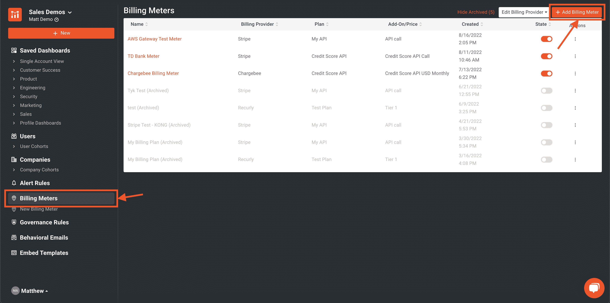
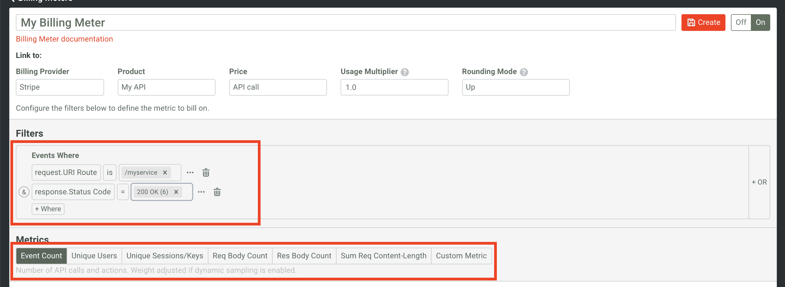
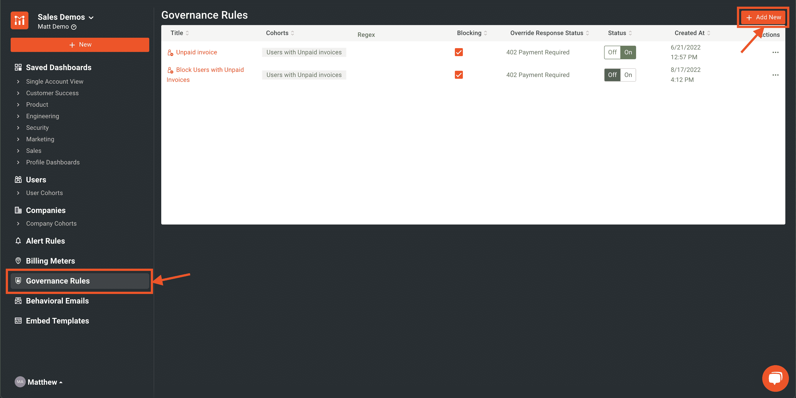
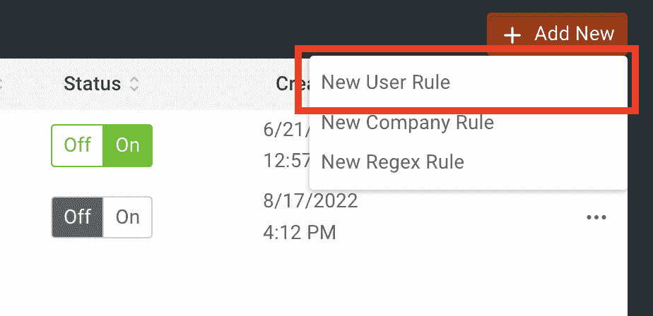
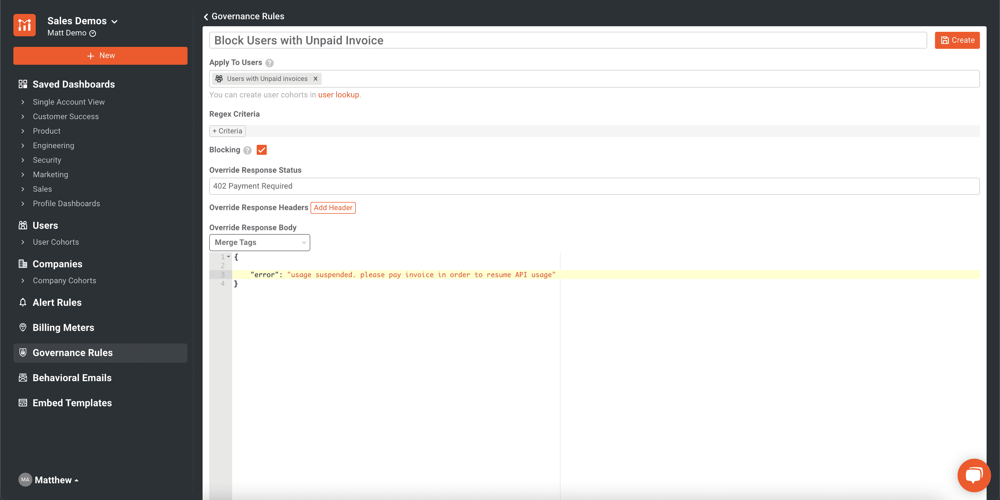
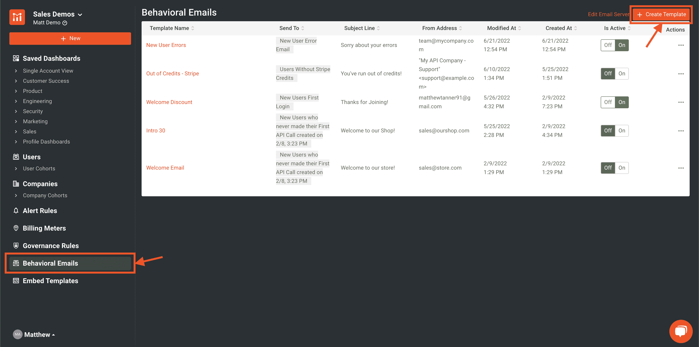
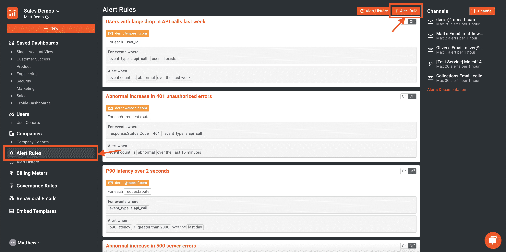
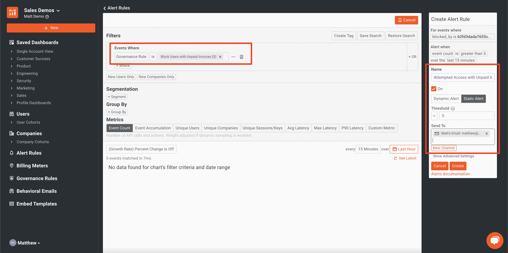

# 通过 Moesif 实现 API 货币化

> 原文：<https://www.moesif.com/blog/technical/stripe/Enabling-API-Monetization-With-Moesif/>

作为一个 API 提供者，你可能会把你的 API 带来某种形式的收入作为你的商业模式的一部分。当你第一次开始你的 API 产品的货币化之旅时，你可能会发现货币化的复杂性根深蒂固。很多时候，解决这个问题超出了典型 API 网关或 API 管理平台的能力。问题开始出现，比如“您是按 API 调用收费还是按用户收费？”或者“如果 API 用户有过期发票，我如何阻止他们使用 API？”。要解决这些问题，需要大量的定制、测试和支持。幸运的是，有了 Moesif，通过该平台提供的端到端货币化，为用户创造一个顺畅的旅程变得极其简单。Moesif 可以作为一个 API 货币化平台，提供大量的灵活性。它还提供了其他工具，可以补充您的用户旅程，推动 API 的采用，并改进您的 API 产品。

让我们来看看如何使用 Moesif，通过利用 Moesif 的 API 货币化功能实现 API 货币化策略来增加收入。

## 账单提供商

根据您的具体使用情况，您可能会倾向于选择最符合您需求的计费提供商。目前，Moesif 支持 3 个不同的计费提供商。账单提供商包括:

*   种类
*   递归地
*   受款人

这些平台各有利弊。要了解更多相关信息，请查看[这篇](https://www.zeni.ai/blog/best-saas-subscription-billing-solution-chargebee-vs-recurly-vs-stripe-billing)很棒的文章，它讲述了每个平台的所有错综复杂之处。根据您的 API 货币化模型，您可能会发现这些平台中的一个或多个将支持您的用例。

通过 Moesif，这些计费提供商可以连接到 Moesif，以便可以将使用数据发送给提供商，并且提供商也可以将数据发送回 Moesif，例如发票详细信息或订阅更新。通过使用 Moesif 向提供商发送计费数据并接收返回的数据，Moesif 可以在 API 的整体盈利中发挥关键作用，并允许轻松配置和维护/故障排除。

## 计费仪表

将 Moesif 连接到计费提供商后，您将能够创建计费表。计费仪表主要做两件事:

*   允许您创建一个过滤器来监控和统计 API 使用情况
*   将 API 资源的使用情况发送给选定的计费提供商

Moesif 是启动您的计费流程的最佳地点，因为它拥有来自 API 调用的所有数据以及创建复杂计费标准的能力。

要创建计费表，只需登录 Moesif 并从左侧导航导航至**计费表**屏幕。从那里，点击**添加计费仪表**按钮。

在下一个屏幕上，您可以设置过滤器，以指定您希望对哪些流量进行计费。例如，我们可以为一个特定的端点和状态代码设置一个过滤器，比如只对收到一个 **200 OK** 响应状态代码的 **/myservice** 端点的 API 调用计费。此时，您还将选择要计费的指标。我们将为此选择**事件计数**，这样每个 API 调用都将被计为一个单元，但其他选项也是可用的，包括按**唯一用户**、**响应主体计数**，或使用**自定义指标**。

> 您还需要确保在 Moesif 中配置了账单提供商。这可以在短短 5 分钟内完成！好奇有多简单？查看我们的指南，了解如何使用、和。创建计费计量器后，使用情况将自动同步到您为计费计量器选择的计费提供商。在几分钟内，您将拥有通过 Moesif 利用计量计费的货币化 API。如需更深入的示例，请使用[孔](https://www.moesif.com/blog/technical/stripe/kong/End-To-End-API-Monetization-With-Kong-Stripe-And-Moesif/?utm_campaign=Int-site&utm_source=blog&utm_medium=body-cta&utm_content=enable-monetization-with-moesif)、[孔](https://www.moesif.com/blog/technical/stripe/tyk/End-To-End-API-Monetization-With-Tyk-Stripe-And-Moesif/?utm_campaign=Int-site&utm_source=blog&utm_medium=body-cta&utm_content=enable-monetization-with-moesif)和[节点](https://www.moesif.com/blog/api-monetization/stripe/End-To-End-API-Monetization-With-NodeJS-Stripe-And-Moesif/?utm_campaign=Int-site&utm_source=blog&utm_medium=body-cta&utm_content=enable-monetization-with-moesif)查看我们的端到端指南。

## 治理规则

API 货币化是一回事，但基于计费状态控制访问是另一回事。如果用户有过期发票或已超出其批准的支出，您可能希望暂停他们的访问。这可以在 Moesif 中使用治理规则来完成。治理规则很容易建立。只需导航到**治理规则**屏幕并点击**添加新的**。

然后我们将添加一个新的**用户规则**。

在下一个屏幕上，将配置规则以阻止属于未支付发票的**用户群的用户。我们将返回一个带有 **402 -付款要求**响应代码和概述问题的响应主体的响应。**

一旦这个治理规则被创建，它将有效地阻止用户访问 API，直到他们的发票被结算。对于预付费场景，您还可以使用一个治理规则在用户的信用余额达到 0 美元时阻止呼叫。要更详细地了解这个预付费场景，请查看我们关于 Moesif 预付费计费的博客。

> 关于 Moesif 中的治理规则，有两个重要注意事项。首先，治理规则是企业计划的一个特性，因此您需要企业订阅。其次，并不是所有的 SDK 和插件都支持治理规则。在尝试实施治理规则之前，请验证您的特定设置和计划将支持治理规则。

## 行为电子邮件和警报

尽管是可选的，使用 Moesif 的行为电子邮件和提醒功能可以增强用户对货币化 API 的体验。这两种功能都使用可定制的过滤器来建立发送电子邮件或警报的条件。

行为电子邮件可用于指导用户注册您的 API，通知他们可能发生的问题以及如何解决这些问题，或者在货币化 API 的情况下，让用户知道他们有一张未结发票阻止他们访问 API。

例如，我们可以设置一个行为电子邮件，当一个 API 消费者试图访问一个未支付发票的 API 时，该电子邮件将被发送。为此，导航至**行为电子邮件**屏幕，并选择**创建模板**。

在这里，我们将填写详细信息，并创建一封简单的电子邮件，让用户知道他们的 API 访问因未结发票而暂停，以及如何付款。

一旦创建了电子邮件，只要用户成为未支付发票的**用户**的一部分，他们就会自动收到一封电子邮件，帮助他们重新获得 API 的访问权限。

警报可用于提醒内部团队有关事件，如用户遇到大量错误或集成问题。然而，就 API 货币化而言，您可以进一步使用警报，让销售和客户成功团队了解可能需要拓展或允许可能的追加销售机会的某些情况。

根据上面的示例，我们还可以提醒客户成功团队(或会计团队，在他们负责跟进过期帐户之前)，让他们知道客户可能需要帮助来结算过期发票。要创建警报，导航至**警报规则**屏幕并选择 **+警报规则**。

从这里开始，我们将配置警报，每当有人在 15 分钟的时间内试图访问 API 超过 5 次时，就会向我们的支持团队发送电子邮件。

一旦警报被激活，我们的客户成功团队将会收到通知。当然也有通过短信，Slack，PagerDuty，或者自定义 Webhook 配置来告警的方式。关于**警报规则**的更多信息可以在文档中找到。

## 试试吧！

实施货币化战略一直是一个难以逾越的障碍。许多定制解决方案提供了灵活性，但工程和支持成本非常高。有了 Moesif，API 货币化就有可能在极短的时间内实现。正如本文所展示的，通过一点点配置和最少的代码，我们可以在最短的时间内创建一个货币化的 API。

最重要的是，通过治理规则、行为电子邮件和提醒来指导客户并为客户提供良好的体验，支持客户变得更加容易。Moesif 是市场上最灵活、最易用的端到端 API 货币化产品。想试试吗？[立即注册](https://www.moesif.com/signup?utm_campaign=Int-site&utm_source=blog&utm_medium=body-cta&utm_content=enable-monetization-with-moesif)开始将您的 API 货币化，并在几分钟内增加您的 API 收入。