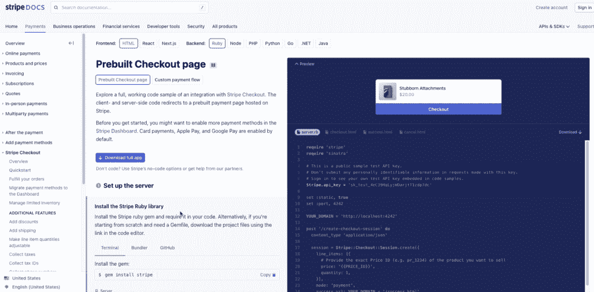
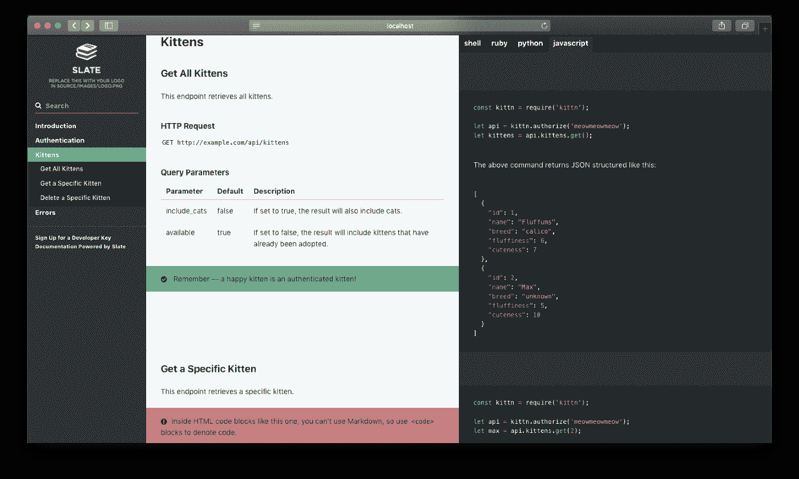
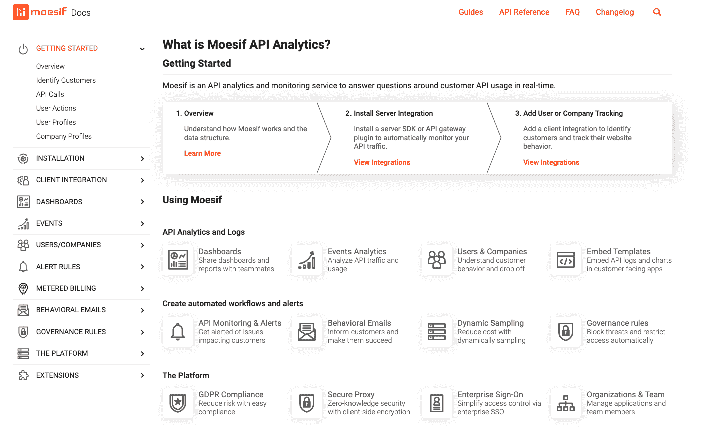

# Stripe 开发人员体验和文档拆卸

> 原文：<https://www.moesif.com/blog/best-practices/api-product-management/the-stripe-developer-experience-and-docs-teardown/>

在本文中，我们将探讨为什么 Stripe 开发者体验受到全球成千上万开发者的热情支持。Stripe 的任务之一是增加互联网的 GDP，在过去的十年中，他们每天通过 API 成功执行 2.5 亿个 API 请求，每年超过 910 亿个请求。Stripe 的成功来自于它对客户的关注，将开发者放在第一位，以及创新的设计实践。在本文中，我们将深入探讨 Stripe 针对开发人员的一些设计选择，并带您了解如何利用他们的经验为您的客户构建理想的开发人员体验。

### 三列开发人员文档

Stripe 的开发人员文档因其三栏布局而闻名，用于组织导航、内容发现和实时代码片段执行。顶部导航将文档分为 Stripe 的不同产品领域，如支付、业务运营、开发工具等。在左侧导航中，您可以在每个产品下执行的每个操作都有相应的快速入门指南，供开发人员使用。除了快速入门指南，Stripe 还提供了深入的文档和教程，内置在导航中，因此开发人员无需访问外部网站或搜索博客来获得问题的答案。

Stripe 开发者体验中我最喜欢的部分之一是他们的 UI/UX。条纹 UI/UX 允许您突出显示描述窗口中的元素，然后突出显示代码编辑器中与该描述相关的代码区域。对于开发人员来说，这是一个非常强大的特性，它提供了一个简洁的 UI 来帮助开发人员准确理解每个代码示例的功能。此外，当您将鼠标悬停在每个部分上时，会出现一个复制按钮，供您复制和粘贴特定的代码部分。还有一个下载按钮，可以下载 Stripe 提供的完整代码示例。总的来说，UI 是干净的、直观的，并且如你所期望的那样工作。开发人员可能没有意识到文档具有所有这些特性，因为从头到尾的整个体验是如此直观。

### 响应 Slate 的 API 文档

对于那些希望构建自己的 API 文档(外观和风格与 Stripe 或 PayPal 类似)的初创公司或开发者来说， [GitHub 上有一个非常棒的开源框架，叫做 Slate](https://github.com/slatedocs/slate) 。Slate 开箱即用，设计简洁直观，对所有屏幕尺寸都反应灵敏。此外，由于它是完全开源的，你可以修改源代码，所有的文档都是用 Markdown 编写的。另外，从开发者体验的角度来看，包括教程和视频演练在内的开发者倡导使用你的 API 可以帮助开发者在第一次使用你的 API 时有一个无缝的体验。

### Moesif 的开发者体验

在设计上，Moesif 的整体布局与石板和条纹略有不同。然而，就开发者体验而言，它仍然遵循相同的核心原则。左侧导航包含入门材料和教程。我非常喜欢 Moesif 文档体验的一个特点是，每个主导航项都有子导航项，这些子导航项以平铺的形式列在每个主页上。这有助于开发人员在菜单中有一个清晰的导航体验，并为每个选项的内容提供更多的上下文。此外，许多 Moesif 的 API 文档都嵌入了特定主题的 YouTube 视频，这有助于视觉和听觉学习者/开发者。将 YouTube 视频添加到开发者文档中是从谷歌搜索中获取流量的一个很好的方式，这也是 Stripe 可以做得更好的地方。*点击* *了解有关将 Moesif 集成到您的分析堆栈* [*的更多信息。*](https://www.moesif.com/features/api-analytics?utm_campaign=Int-site&utm_source=blog&utm_medium=body-cta&utm_term=stripe-devex)

Moesif 在侧边导航上列出了安装 SDK 的每种方法，并且他们有每种方法的分步说明。此外，开发人员可以通过查看右侧的子导航来确定文档页面上的内容。

为了与 Moesif 的 API 接口，Moesif 正在使用开源框架 Slate 来格式化他们的文档。它是用 Moesif 的调色板定制的，看起来很漂亮，在移动设备上完全响应。

### 开发者体验综述

如果您是一名希望为 API 创建文档的开发人员，请记住包括以下内容，以便为开发人员提供卓越的开发体验:

*   适用于所有屏幕尺寸的响应式页面布局
*   代码突出显示和语法。当开发人员用鼠标突出显示某个元素时，在代码窗口上突出显示相应的元素。
*   在 API 文档中提供可视化、图表和图片
*   将 YouTube 视频添加到您的文档页面，其中包含一个开发人员倡导者，他可以指导开发人员使用您的 API
*   添加复制和粘贴按钮，使开发人员可以轻松地立即尝试代码
*   三栏导航结构是开发人员的理想格式

要了解关于 Moesif 的更多信息，以及为什么开发人员喜欢他们的分析解决方案，请访问 [Moesif 主页](https://www.moesif.com/?utm_campaign=Int-site&utm_source=blog&utm_medium=body-cta&utm_term=stripe-devex)了解更多信息。