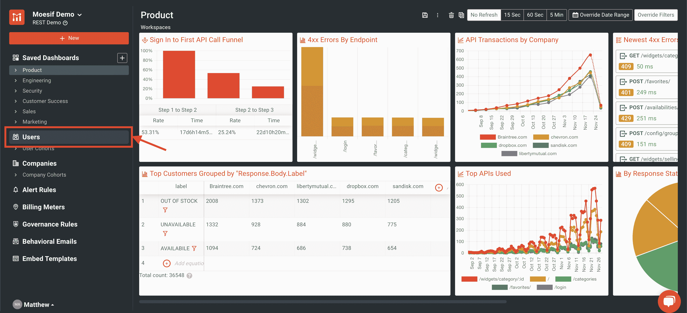
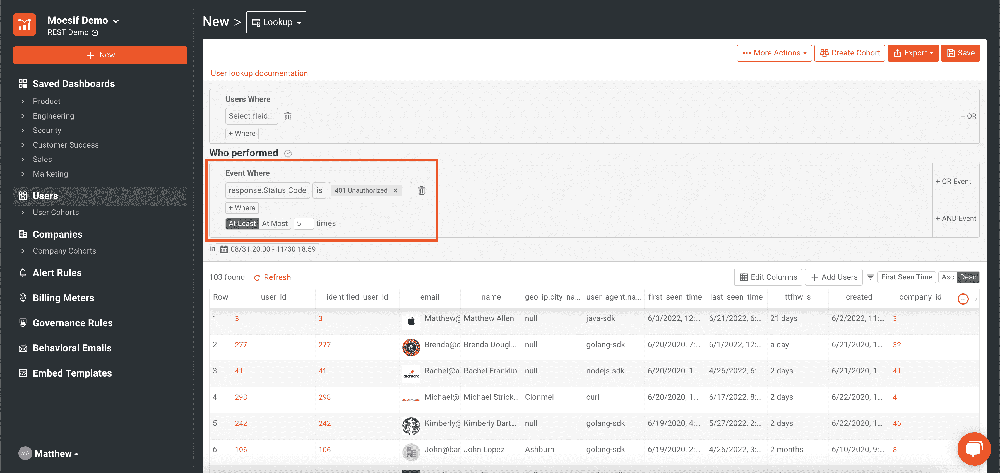
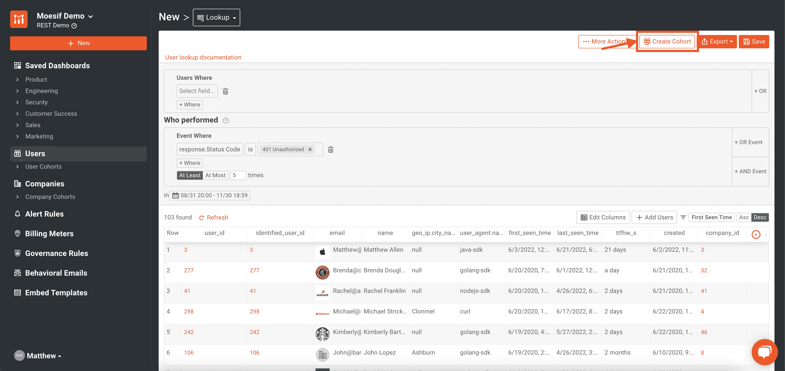
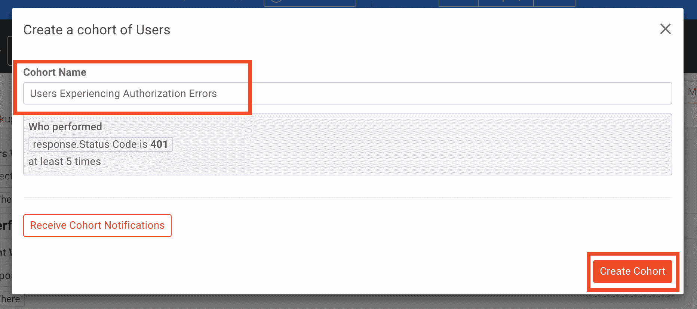
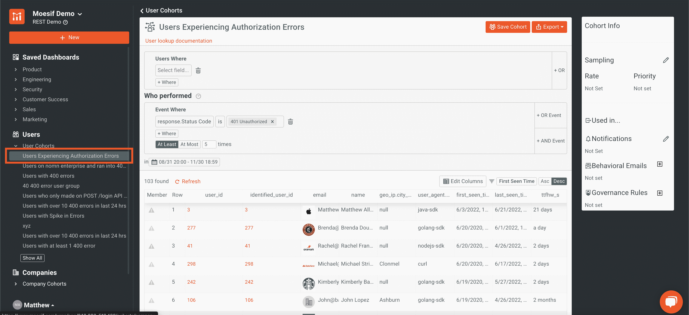

# 被拯救的群体:什么，为什么，如何

> 原文：<https://www.moesif.com/blog/technical/api-analytics/Saved-Cohorts-The-What-Why-And-How/>

能够根据用户或公司的行为或特征对他们进行分组是非常有用的。在 Moesif 中，我们有一个名为**保存队列**的功能，可以让你做到这一点。**保存的队列**可以帮助企业推动营销活动和其他销售计划，帮助工程师和客户成功团队管理持续的问题，以及许多其他用例。

## 什么是保存的队列？

**保存的群组**实质上是符合特定标准的用户或公司的分组。当条件满足时，用户或公司可以被添加到群组中。当用户或公司不再符合群组定义时，他们将被从群组中移除。为了在 Moesif 中使用**保存的群组**，您必须启用用户和/或公司跟踪。该功能不适用于匿名用户或公司。

在 Moesif 中，**用户群组**将从**保存群组**中添加或删除个人用户。当试图识别个人或组何时出现问题或错误、新用户或其他特定分组时，这可能很有用。例如，对于客户成功团队来说，知道新用户何时遇到特定错误可能是有用的，比如在尝试访问 API 时出现 **HTTP 401 未授权**响应。可以创建群组来跟踪符合该条件的所有用户。

一个**公司群组**类似于一个**用户群组**，除了它将一个公司内的所有用户视为一个单独的单元。回到我们之前的例子，我们可以建立一个**公司群组**，它将监控收到 **HTTP 401 未授权**响应的公司。这意味着该公司内接收到符合该标准的响应的任何用户将意味着该公司被添加到群组中。根据你试图从你的数据中获得什么样的洞察力，同时使用用户和**公司群组**可能是有用的。

## 什么是群组通知？

除非你经常刷新你的群组列表，否则当一个新的用户或公司被添加到你已经建立的特定群组时得到通知可能是有用的。为此，您可以使用**群组通知**。使用**群组通知**将允许您准确知道新用户或公司何时符合特定标准，而无需持续手动监控您的群组列表。

**群组通知**支持多种不同的渠道，可以在创建新群组时创建，也可以添加到现有群组中。支持**群组通知**的渠道包括电子邮件、Slack 或自定义网络挂钩。有了几个选项，就可以灵活地将通知传递给团队中最有效的渠道，如果需要，甚至可以传递给多个渠道。当用户或公司被添加到群组中时，选定的渠道将会收到通知，以帮助您的团队了解情况。

## 为什么使用保存的群组？

使用**保存的群组**对于查看在产品使用方面具有相似特征或趋势的用户分组非常有用。**保存的群组**可用于报告目的，也可用于快速查看哪些用户属于您概述的特定细分市场或标准。在 Moesif 中，除了报告或查看群组成员，我们许多最强大的功能都是由**拯救的群组**驱动的。例如，像**行为电子邮件**和**治理规则**这样的功能是通过使用群组来实现的。

对于**行为电子邮件**，当用户被添加到群组时，他们可能会自动收到一封电子邮件。一个简单的例子是，当用户第一次调用 API 或注册您的平台时，您可以自动向他们发送电子邮件，作为入职电子邮件流程的一部分。对于遇到特定错误的用户，您也可以这样做。通过为他们创建群组，当他们遇到特定的错误情况时，您可以向他们发送电子邮件。

就像上面的**行为电子邮件**场景一样，使用**监管规则**，需要创建一个群组，概述您可能想要阻止的特定行为。一个很好的例子是，如果你有一个货币化的 API，并希望阻止过期发票的用户。您可以简单地创建一个群组来添加发票过期 7 天以上的用户。一旦用户加入这个队列，**治理规则**可以向用户返回一个 **HTTP 402 Payment Required** 状态，包括一个请求体，告诉用户支付他们的发票。

群组也可用于动态采样。通过将流量与**保存的群组**相关联，您可以选择定制或减少 Moesif 中记录的流量。通过这样做，您可以确保最重要的流量被记录在 Moesif 中，同时排除不太重要的流量。您可能希望确保 100%返回错误响应的调用都进入 Moesif，而只对 20%的成功调用进行采样。为此，你只需为每种情况建立一个**保存群组**，作为你抽样标准的一部分。

正如您所看到的，Moesif 中的群组不仅仅是简单地用作报告工具，还可以在平台中驱动一些非常棒的功能。

## 如何在 Moesif 中创建保存的群组

现在，您已经了解了什么是**保存的群组**以及它们可以做什么。让我们简单看看如何建立一个**用户群**。首先，您需要导航到 Moesif 中的**用户**屏幕。

在此之后，我们将建立一个标准。在这个例子中，我将过滤过去几个月中至少收到 5 次 **HTTP 401 未授权**响应的用户。看起来会像这样:

现在我的过滤器已经创建好了，我将点击屏幕右上角的**创建群组**。

在这里，输入您的群组名称，然后点击模式右下角的**创建群组**按钮。

> 您也可以点击**接收群组通知**来设置此时的通知。或者，您也可以在群组创建后再进行设置。

现在，您将看到群组已经创建。通过点击屏幕右侧的条目，您可以利用一些其他功能，如**和 [**治理规则**](https://www.moesif.com/docs/api-governance-rules/?utm_campaign=Int-site&utm_source=blog&utm_medium=body-cta&utm_content=saved-cohorts-wwh) 。您也可以通过此面板配置**群组通知**。**

 **

如果您需要编辑或想要在未来查看群组，可通过左侧导航上的**用户群组**菜单项获得。

> 如果你需要创建一个**公司团队**，也应该采取同样的步骤。你可以按照同样的步骤创建 __ 公司群组 _ _ 进入**公司**屏幕，而不是我们上面做的**用户**屏幕。

## 试试吧！

有兴趣为自己尝试一下**保存的队列**？如果你已经注册了 Moesif，只需[登录](https://www.moesif.com/wrap?utm_campaign=Int-site&utm_source=blog&utm_medium=body-cta&utm_content=saved-cohorts-wwh)并按照上面的说明操作，或者查看[我们的指南](https://www.moesif.com/docs/guides/guide-creating-saved-cohorts/?utm_campaign=Int-site&utm_source=blog&utm_medium=body-cta&utm_content=saved-cohorts-wwh)即可。如果您是 Moesif 的新用户，[今天就注册一个帐户](https://www.moesif.com/signup?utm_campaign=Int-site&utm_source=blog&utm_medium=body-cta&utm_content=saved-cohorts-wwh)并解锁我们所有的高级功能，包括**行为电子邮件**和**治理规则**，它们都由**保存的群组**提供支持。**