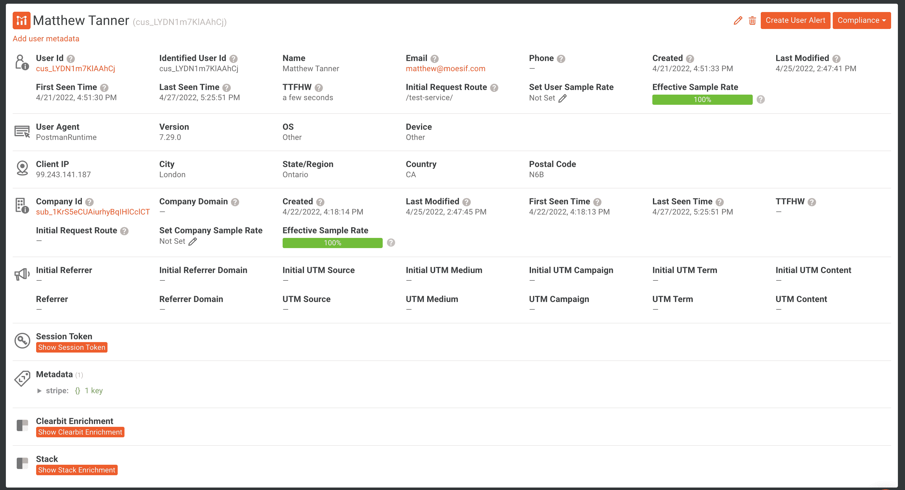
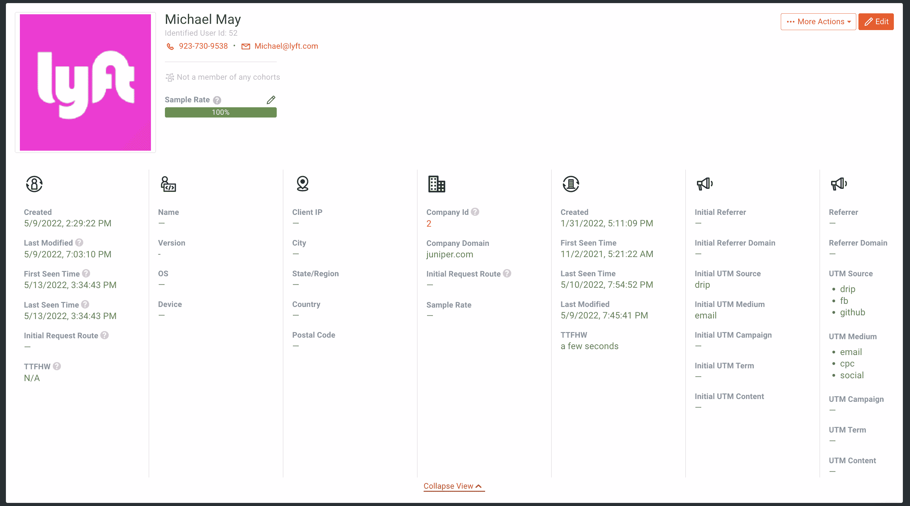
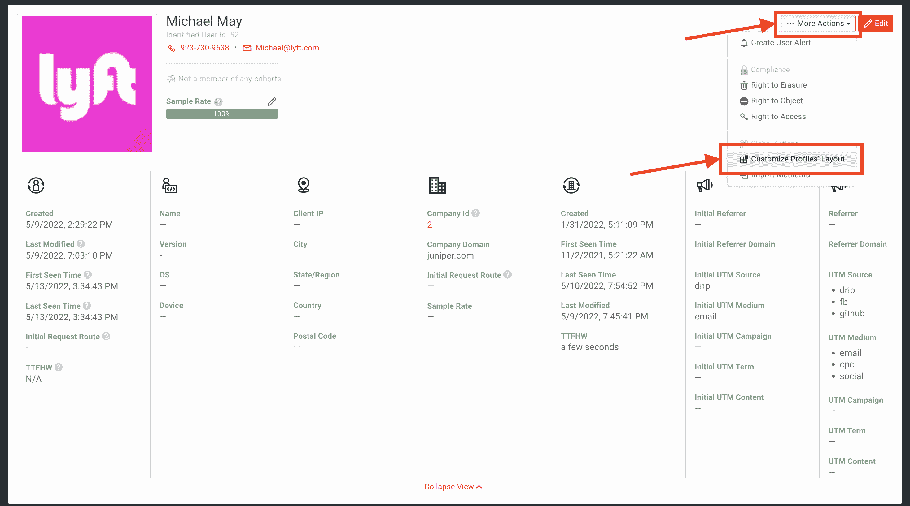
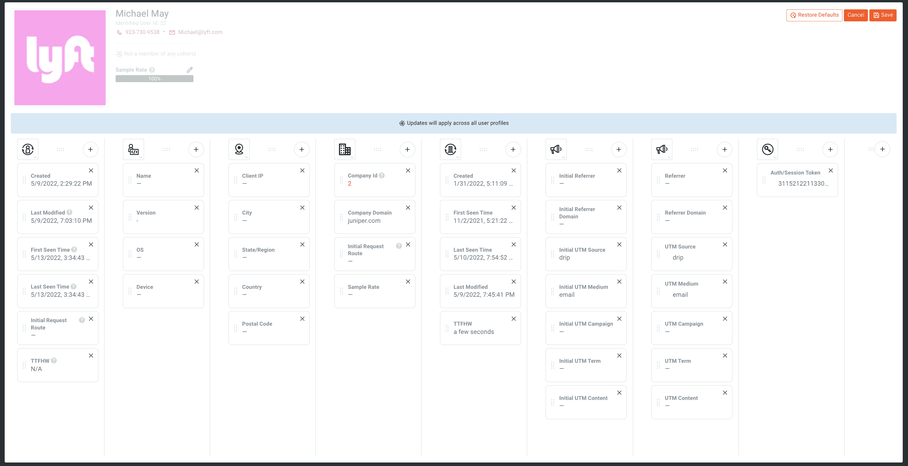
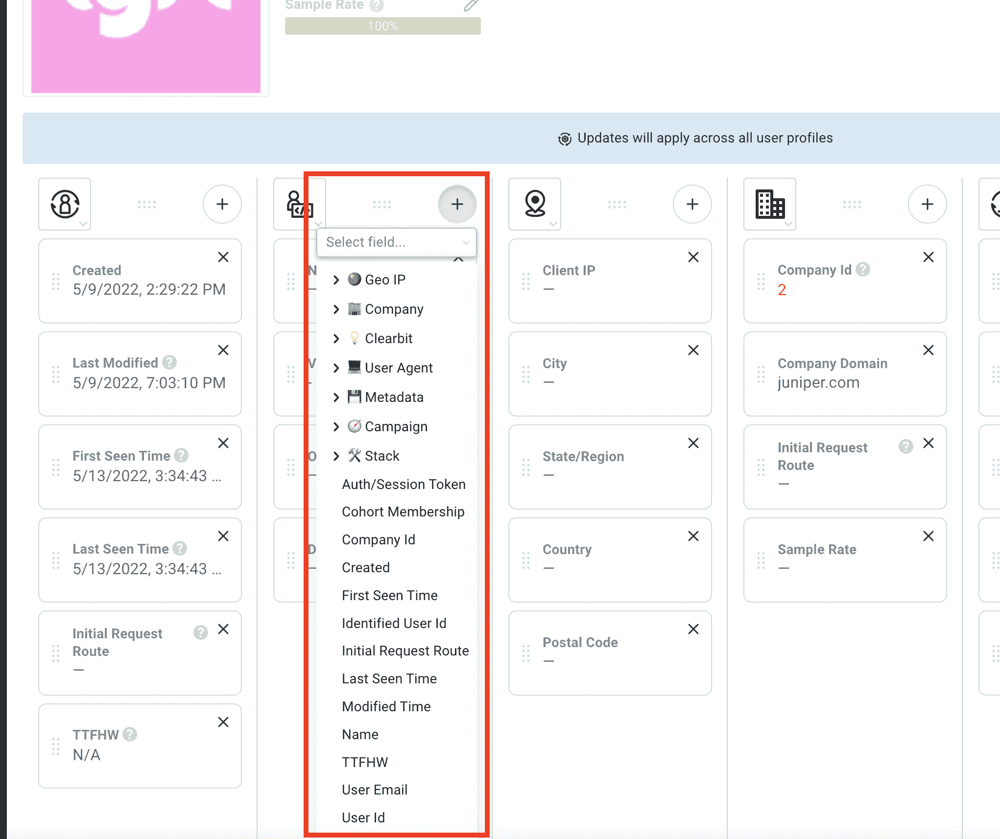
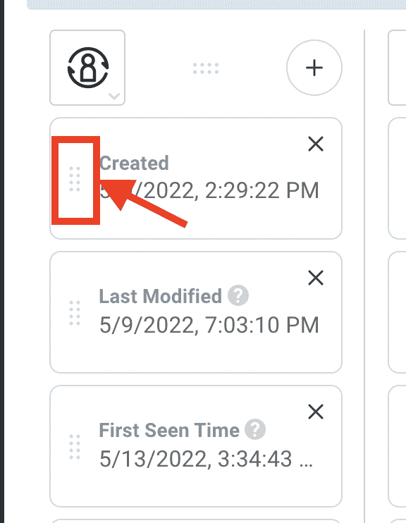
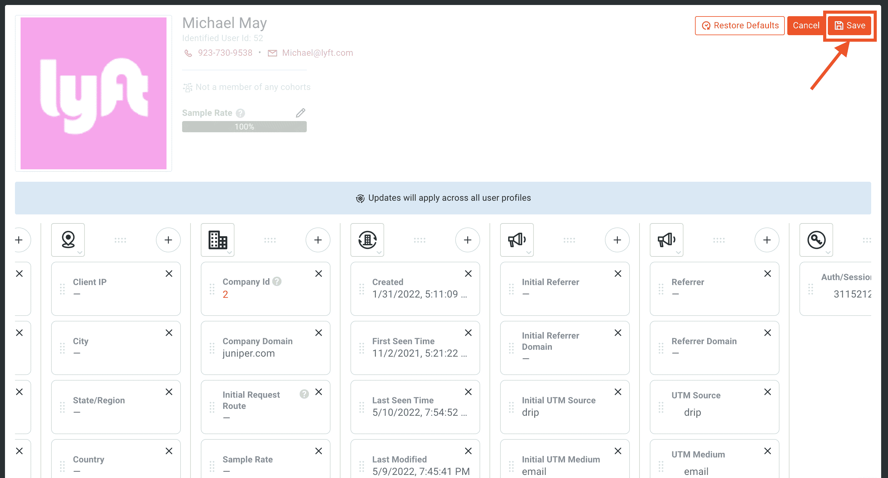
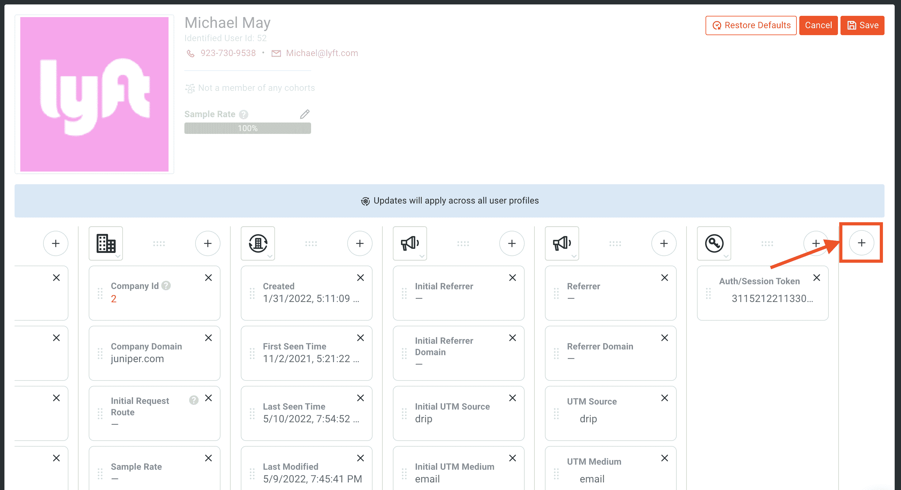
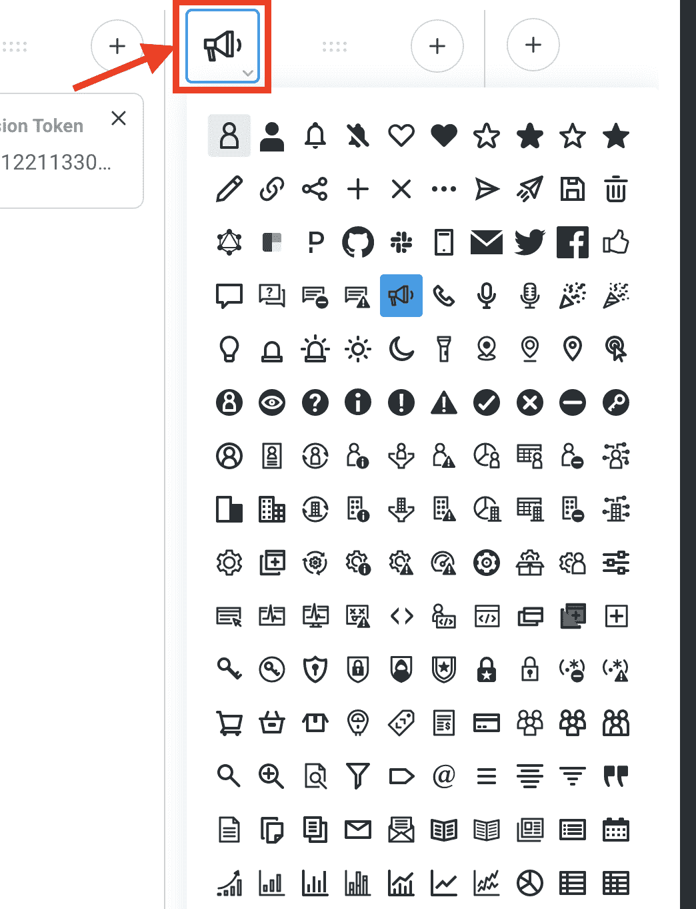

# 如何在 Moesif 中定制您的个人资料视图体验

> 原文：<https://www.moesif.com/blog/api-product-management/api-analytics/How-To-Customize-Your-Profile-View-Experience-In-Moesif/>

在 Moesif，我们做了大量工作来改善特定用户和公司的观看细节和趋势。这包括我们最近增加的添加[个人资料仪表板](https://www.moesif.com/blog/api-product-management/api-analytics/Introducing-Profile-Dashboards/?utm_campaign=Int-site&utm_source=blog&utm_medium=body-cta&utm_term=profile-dash-custom)，以将个人和可重复使用的图表添加到用户和公司个人资料中

现在，我们增加了更多的功能，允许用户自定义每个用户和公司的个人资料视图。这使得显示与您的组织相关的所有数据并隐藏不相关的数据变得更加容易。

## 什么变了？

旧的纵断面图屏幕是静态的，无法自定义。尽管大部分数据是有用的，但它可能与使用 Moesif 的每个组织的需求不相关。以前，纵断面图如下所示:

现在，我们已经添加了一个新的外观和功能，使个人资料视图更加可用和完全可定制。当你点击一个用户或公司的个人资料，你会在屏幕上方看到下面的个人资料视图。

## 如何自定义纵断面图

在纵断面图中自定义字段非常容易。编辑纵断面图后，无论何时打开纵断面图，都可以将其保存并应用于纵断面图。用户和公司个人资料视图都可以独立编辑。这有助于进一步的自定义，因为您可能希望在公司简档中看到某些特定字段，而在用户简档中可能不希望看到这些字段，反之亦然。

*[使用 Moesif 为对您的 API 最重要的指标创建自定义仪表板。](https://www.moesif.com/features/api-dashboards?utm_campaign=Int-site&utm_source=blog&utm_medium=body-cta&utm_term=profile-dash-custom)T3】*

### 添加和编辑字段

要编辑哪些字段出现在配置文件视图中，只需点击窗格右上角的**更多操作**，然后选择**自定义配置文件的布局**。

选择后，屏幕将变为可编辑状态。

要向列中添加新字段，只需点击每列顶部的 **+** 按钮。

从这里，选择您要添加的字段。然后，该字段将被添加到选定的列中。您还可以通过单击并拖动新字段和现有字段到所需位置来重新定位它们。

> 您需要确保单击并按住左边的条目来移动字段。

要保存您的更改，请点击屏幕右上角的**保存**按钮。

### 添加列

要添加新列，请滚动到已创建列的末尾，并点击 **+** 按钮。

然后，选择要添加到新列中的第一个字段。比如我会选择**初始 Utm 介质**。选择后，将创建新列。

*[用 Moesif 组织你的 API 日志和指标。](https://www.moesif.com/features/api-logs?utm_campaign=Int-site&utm_source=blog&utm_medium=body-cta&utm_term=profile-dash-custom)T3】*

要编辑用于该列的图标，您可以单击当前图标。然后，您将看到可用的图标库。

单击您想要使用的图标，它将被分配到该列。

要保存您的更改，请点击屏幕右上角的**保存**按钮。

## 你自己试试吧

使您的组织能够轻松查看 Moesif 中每个用户和公司的最重要的详细信息。使用 profile view 中最新的自定义功能，帮助您的销售、客户成功和其他团队快速访问最重要的数据。要查看这一最新功能，请[登录](https://www.moesif.com/wrap?utm_campaign=Int-site&utm_source=blog&utm_medium=body-cta&utm_term=profile-dash-custom)或[立即创建](https://www.moesif.com/signup?utm_campaign=Int-site&utm_source=blog&utm_medium=body-cta&utm_term=profile-dash-custom)您的 Moesif 账户。