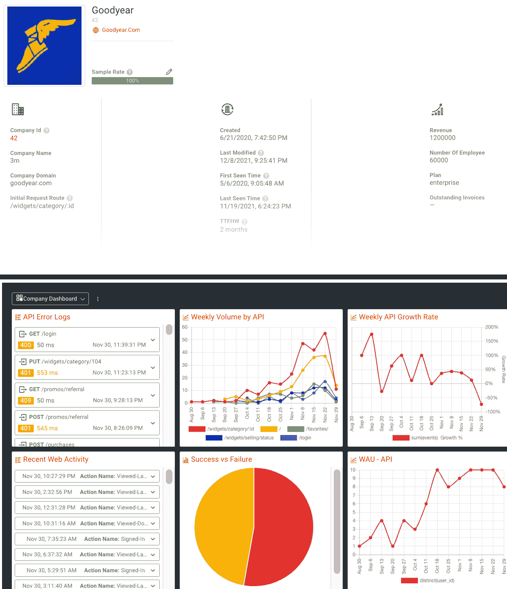
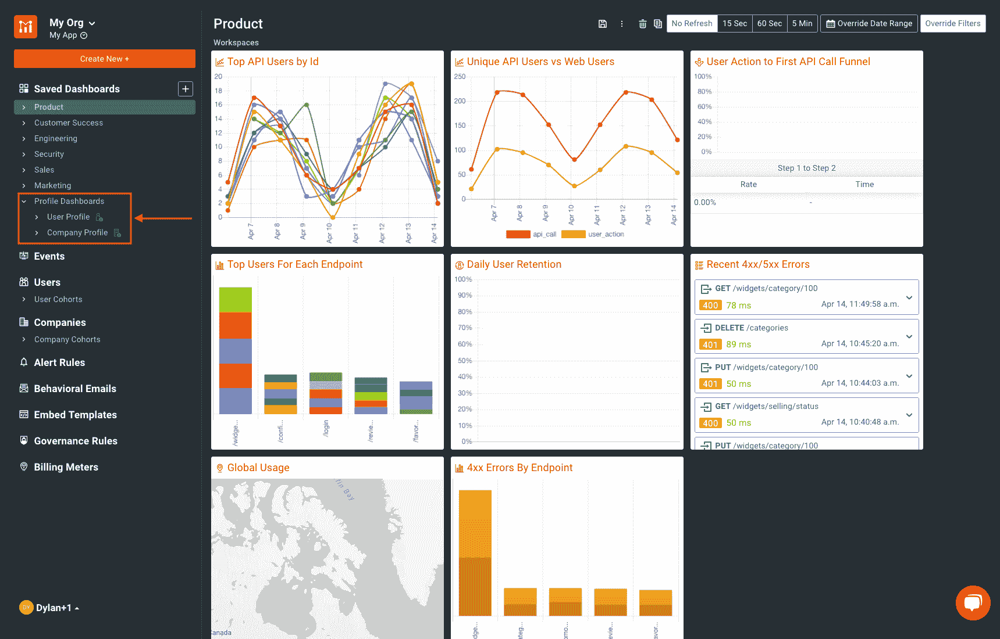
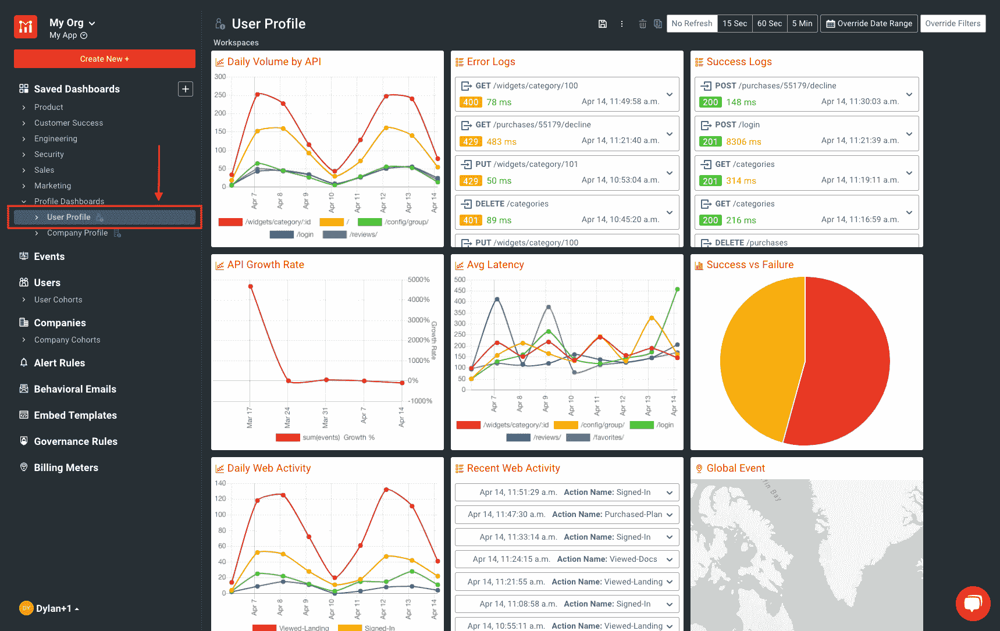
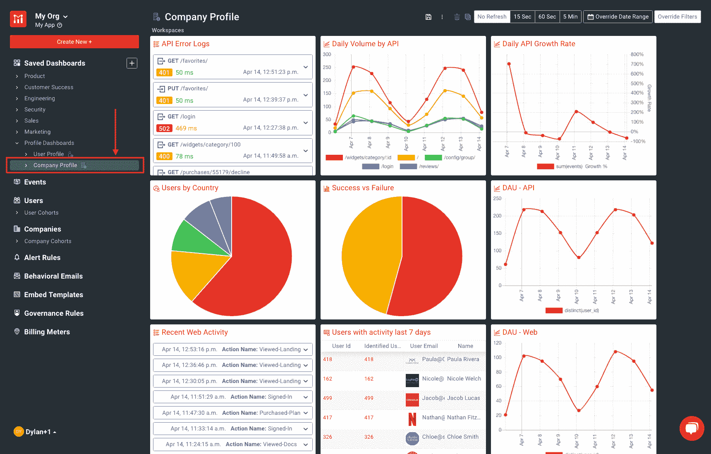
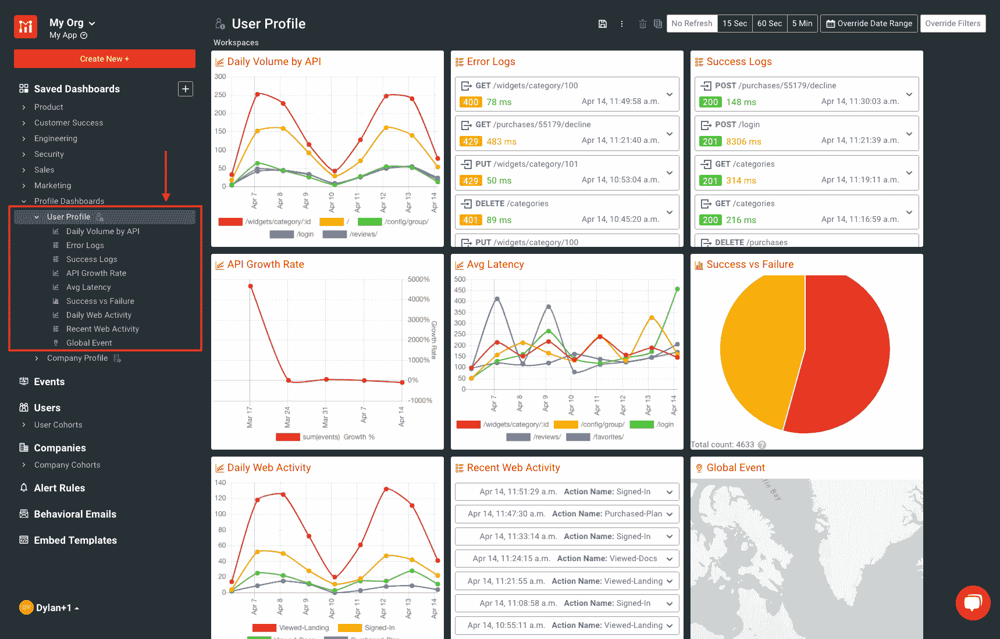
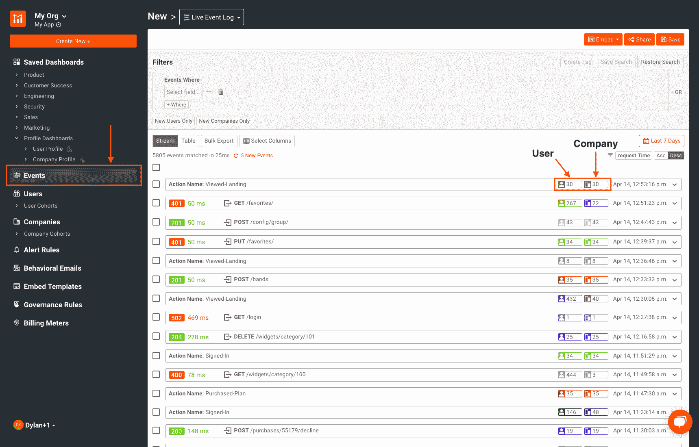
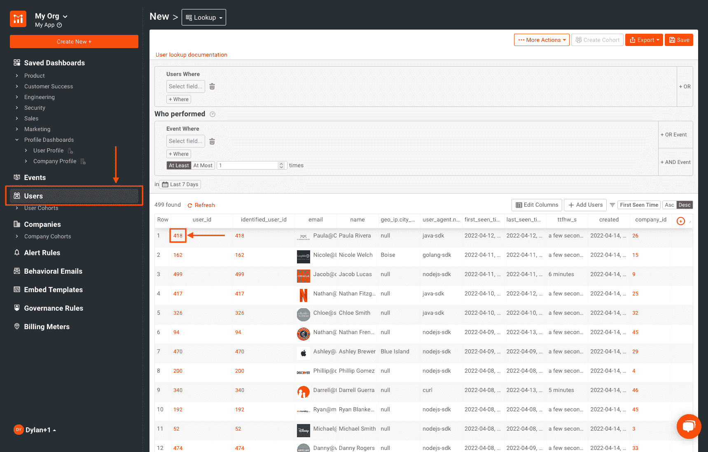

# 在 Moesif 中引入个人资料仪表板

> 原文：<https://www.moesif.com/blog/api-product-management/api-analytics/Introducing-Profile-Dashboards/>

我们很高兴地宣布**个人资料仪表盘**现已在 Moesif 中上线！我们设计了个人资料仪表盘，让面向客户的团队能够以便捷的方式监控和分析您客户的账户健康状况。这项新功能以简单、一致的方式提供客户特定信息。简档仪表板允许您查看特定用户和公司的个性化仪表板。

**个人资料仪表盘**是查看特定用户和公司关键指标的最简单方式。让我们了解如何查看和利用 Moesif 中的个人资料仪表板！

## 什么是简档仪表板？

Moesif 的**个人资料仪表板**是一个新添加的功能，可为您的整个客户群提供个性化的账户指标。这是通过提供应用于每个客户的个人资料页面的可定制模板来实现的。

**Profile Dashboards** 为 Moesif 用户提供了客户账户健康状况的直观分析。以前，Moesif 用户可以在每个用户和公司的个人资料下查看实时事件日志，该日志显示用户的活动以便于查看。Profile Dashboards 在此基础上进行了扩展，它允许您使用自己喜欢的图表创建一个控制面板模板，自动筛选和显示特定用户或所选公司的指标。

## 为什么要使用个人资料仪表板？

**Profile Dashboards** 只需导航到客户的个人资料页面，您就可以查看您想了解的关于客户使用情况和与您平台互动的一切信息。您的所有个人资料仪表板都源自一个模板，可以根据您的特定使用情形进行定制。以前，您需要覆盖现有的控制面板来筛选特定用户或公司，或者为每个唯一的用户或公司手动创建一个全新的控制面板。现在，您可以一次性创建模板，并在查看用户或公司简档时自动过滤和填充简档仪表板。

Profile Dashboards 的灵活性可以帮助您业务的许多领域，包括您的销售和客户成功团队。与手动过滤您需要的数据或操作现有的仪表板过滤器相比，即时访问帐户健康状况可以使某些任务变得更加容易。

一个很好的例子是，当客户向您的团队寻求支持时，他们从 API 接收到了 400 状态代码响应。您的支持代表可能需要几分钟时间来筛选和提取他们的信息。如前所述，他们首先需要复制一个现有的工作区，或者甚至需要从头开始创建一个新的工作区。然后，他们需要为客户遇到的问题设置所需的过滤器，并根据客户 ID 过滤结果。Profile Dashboards 允许客户成功代表转到用户的个人资料，并查看显示 **4XX/5XX 错误**的仪表板磁贴，从而简化这一过程。然后，销售代表可以轻松查看错误，并快速提供故障排除建议。

一旦设置完毕，个人资料仪表盘将是您团队工具库中的一大补充，有助于查看和维护良好的帐户健康状况。[使用 Moesif](https://www.moesif.com/features/api-dashboards?utm_campaign=Int-site&utm_source=blog&utm_medium=body-cta&utm_term=introducing-profile-dash) 构建美观、面向客户的仪表盘。

## 在哪里可以找到个人资料仪表板？

**个人资料仪表板**模板位于左侧导航窗格的**已保存仪表板**标题的底部。在这里，我们可以为每个配置文件定制我们的布局。点击**个人资料仪表板**下拉菜单，显示两个子类别**用户资料**和**公司资料**。

让我们进入**用户档案**子部分。仪表板预览显示了我们的工作区当前的样子。它还让我们深入了解将在我们的个人用户资料仪表板上显示的内容。

与用户档案类似，公司档案可以通过点击**公司档案**以同样的方式访问和编辑。

> 使用左侧导航窗格，我们可以访问**用户简介**或**公司简介**下拉列表。我们可以看到所有已配置工作区的列表。单击其中任何一项都会直接进入配置视图，在这里我们可以根据具体的使用情形对每一项进行定制。
> 
> 

## 如何查看简档仪表板

有多种方法可以导航到特定用户或公司的简档。您可以通过以下方式做到这一点:

*   进入**事件**屏幕，点击实时事件日志中的**用户 ID** 或**公司 ID**

*   导航至**用户**或**公司**屏幕，点击查找中的**用户/公司 ID**

调出用户或公司资料后，滚动到屏幕底部，查看所选用户或公司的资料仪表板。在此屏幕上，您将看到您创建的 Profile Dashboard 模板(或默认模板，如果您没有接触过它),其中包含为特定用户/公司筛选的指标和图表。不需要额外的工作，这都是为你自动过滤。

## 尝试一下

如您所见， **Profile Dashboards** 是一个很好的工具，可以为使用您平台的每个用户和公司提供个性化的图表和指标，从而帮助您业务的许多方面。我们已经为您提供了一组很好的默认仪表板磁贴来帮助您入门，但是您可以根据自己的需要轻松定制您的个人资料仪表板。要开始使用个人资料仪表盘，只需登录 Moesif 或[立即注册](https://www.moesif.com/signup?utm_campaign=Int-site&utm_source=blog&utm_medium=body-cta&utm_term=introducing-profile-dash)。如果你对 API 货币化感兴趣，也可以看看我们新的[计量计费功能](https://www.moesif.com/solutions/metered-api-billing?utm_campaign=Int-site&utm_source=blog&utm_medium=body-cta&utm_term=introducing-profile-dash)。