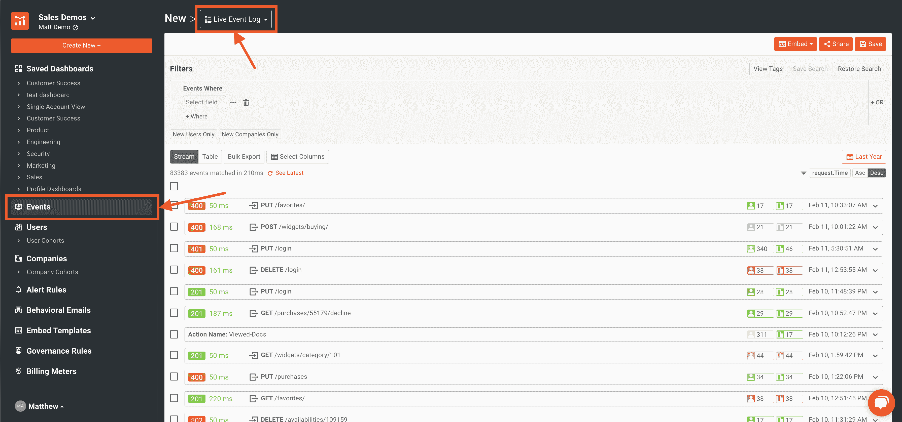
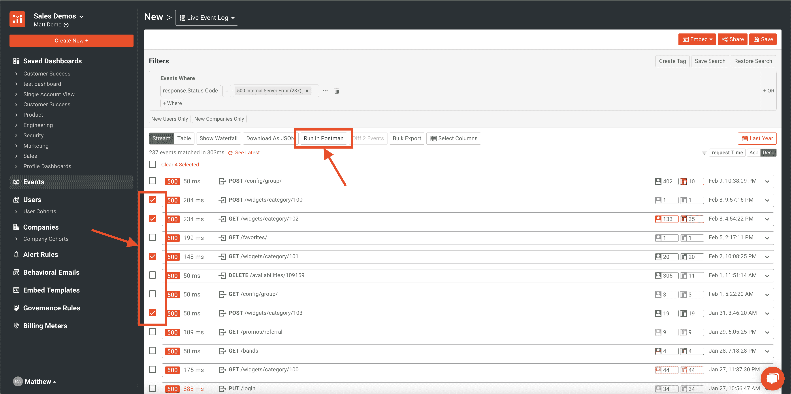
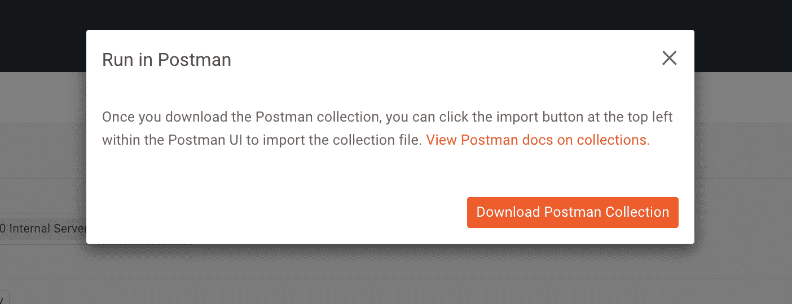
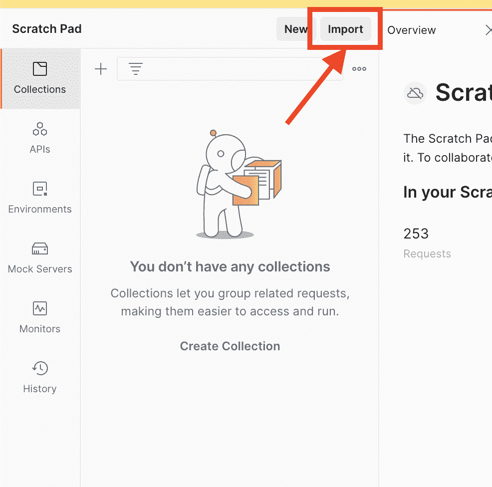
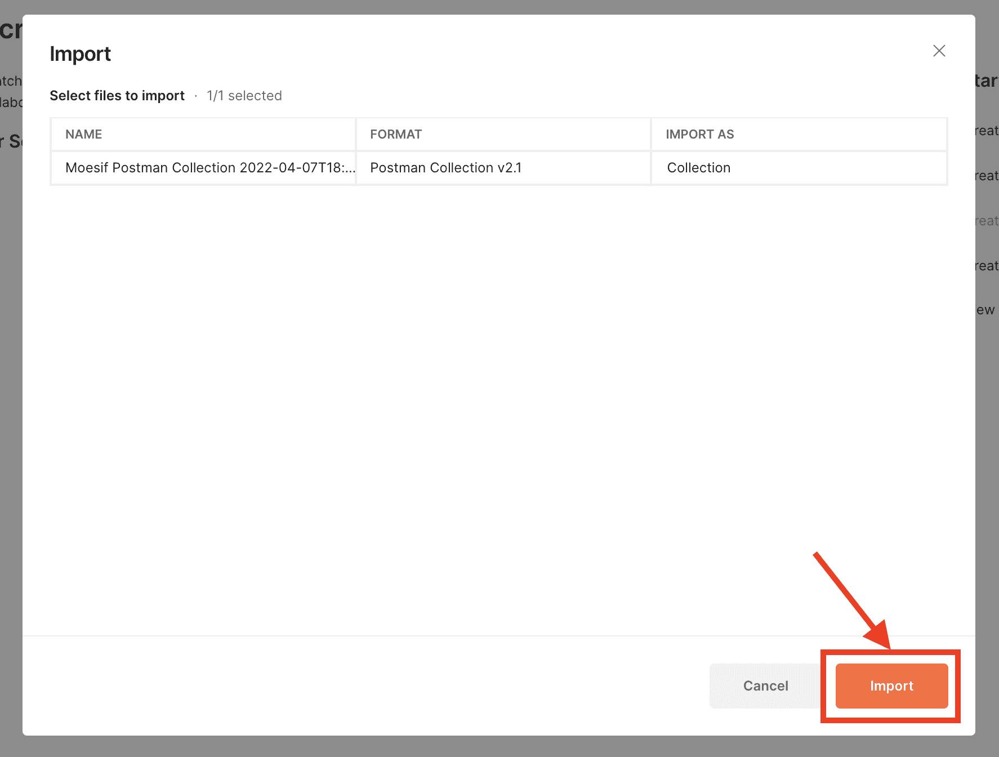
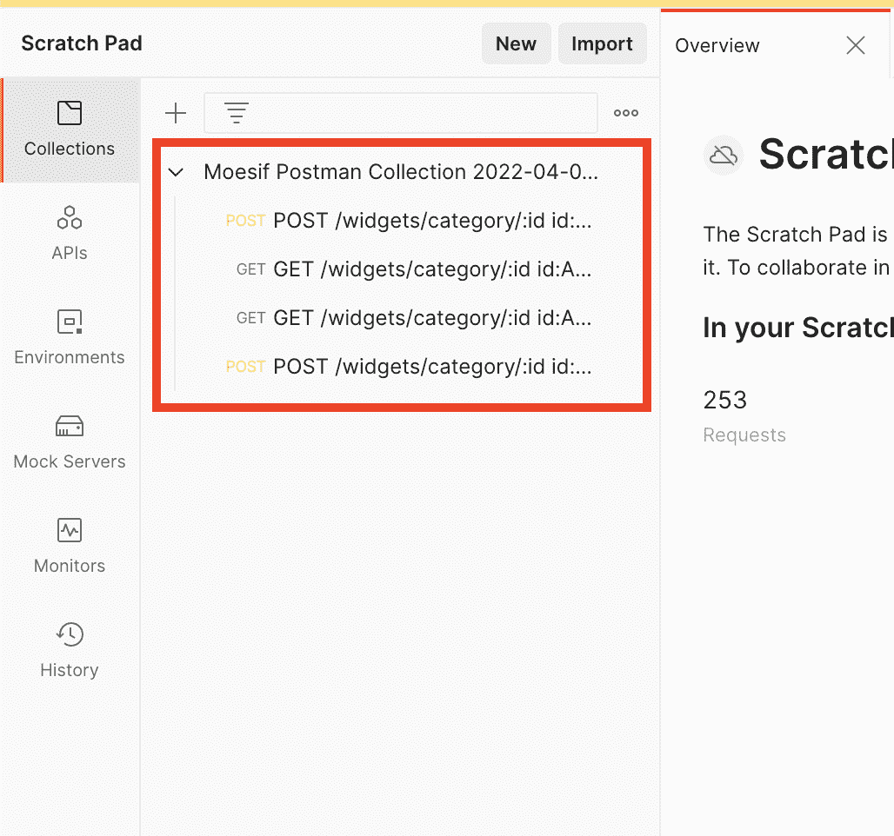
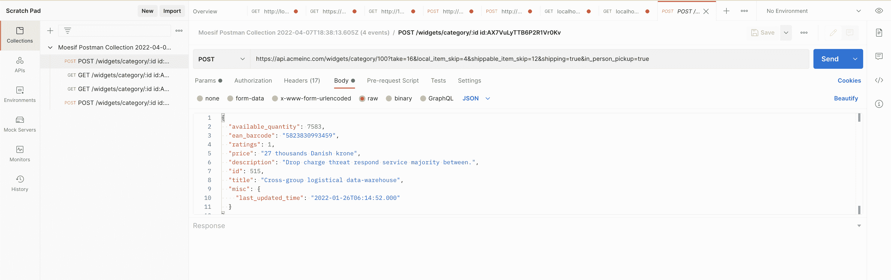

# 用 Postman 和 Moesif 调试 API

> 原文：<https://www.moesif.com/blog/technical/api-debugging/Debugging-Your-APIs-With-Postman-And-Moesif/>

对于任何处理 RESTful APIs 的开发人员来说，调试 API 都是一个挑战。尝试创建一个精确的 API 请求，特别是对于具有大型 API 请求体和多个头部的高度复杂的请求，这是必要的，但也是很难做到的。通过使用 Postman 这样的工具来创建用于调试目的的请求，并且作为 API 客户端，您可以轻松地使用原始请求的精确配置来重放 API 请求。这可以让开发人员以一致的方式重现他们试图调试的场景。

Moesif 还可以帮助简化 API 的调试过程。由于 Moesif 接收请求各个方面的数据，因此它是一个很好的平台，可以导出请求的所有细节，这样就可以很容易地重放请求以帮助调试。在 Moesif 中，您可以轻松地将所有 API 调用数据导出到 Postman 集合中。这有助于开发人员通过导入生成的集合来自动复制 Postman 中的调用。

调试最佳实践旨在确保调试错误的条件与导致错误的条件完全匹配。通过使用 Moesif 的导出功能作为调试方法的一部分，可以保证 API 端点和调试器接收到导致错误的相同请求数据。

## 在 Moesif 中导出呼叫

要从 Moesif 导出呼叫，首先导航至**实时事件日志**屏幕。

在那里，您可以选择要导出到 Postman 集合中的呼叫。只需选择您想要导出的呼叫旁边的复选框，然后在 Postman 中单击 **Run 即可导出它们。**

> 将调用导出到 Postman 集合将包含重新创建 API 调用所需的所有内容。这将包括主体、标题、参数等。

一旦你点击 **Run in Postman** 按钮，就会出现一个模式让你下载收藏。点击**下载邮差收藏**将收藏文件下载到本地机器。

在此之后，Postman 集合将被下载并准备加载到 Postman 中。

## 将集合加载到邮递员中

在 Postman 中，点击屏幕右侧的**收藏**标签，然后点击**导入**。

接下来，将出现一个模型，您可以从文件选择器中选择 Postman 集合文件，或者将文件拖放到模型上以导入它。一旦文件被选中，您将看到模式中的内容。

现在，您将点击 **Import** 来将集合实际引入 Postman。现在，您应该可以在 Postman 的**收藏**窗格中看到该收藏。

## 重放请求和调试

现在 Postman 中有了集合，选择一个请求进行重放。

将填充请求的每个细节，包括参数、头和主体。从这里，您可以单击 URL 旁边的蓝色 **Send** 按钮，发送您正在尝试调试的 web API 请求的精确副本。现在，您的调试器将加载与您当前正在调试的错误调用相同的数据，因为它是从导出的 Postman 集合中加载的。

## 自己试试吧！

下次调试 RESTful API 代码时，使用 Moesif 快速创建一个 Postman 集合，轻松复制导致问题的请求。不用担心手动将请求输入到 Postman 中会遗漏任何细节。通过从 Moesif 导出请求并通过 Postman 重放请求，您可以在最初导致错误的确切条件下调试 API。只需选择您需要的请求，导出并调试即可。这确保了您将使用原始请求中包含的确切数据来命中调试器断点。在 REST API 中调试错误应该容易且一致。有了邮差和莫西夫，就是了！

今天就开始吧，登录或[注册](https://www.moesif.com/signup?utm_campaign=Int-site&utm_source=blog&utm_medium=body-cta&utm_term=debugging-with-postman)Moesif，将这个伟大的工具添加到您的调试武库中。当你在这里的时候，也可以看看其他伟大的功能，比如我们的[提醒](https://www.moesif.com/features/api-monitoring?utm_campaign=Int-site&utm_source=blog&utm_medium=body-cta&utm_term=debugging-with-postman)、[嵌入模板](https://www.moesif.com/features/embedded-api-logs?utm_campaign=Int-site&utm_source=blog&utm_medium=body-cta&utm_term=debugging-with-postman)，以及我们的[最新计费功能](https://www.moesif.com/solutions/metered-api-billing?utm_campaign=Int-site&utm_source=blog&utm_medium=body-cta&utm_term=debugging-with-postman)，帮助你将你的 API 货币化。