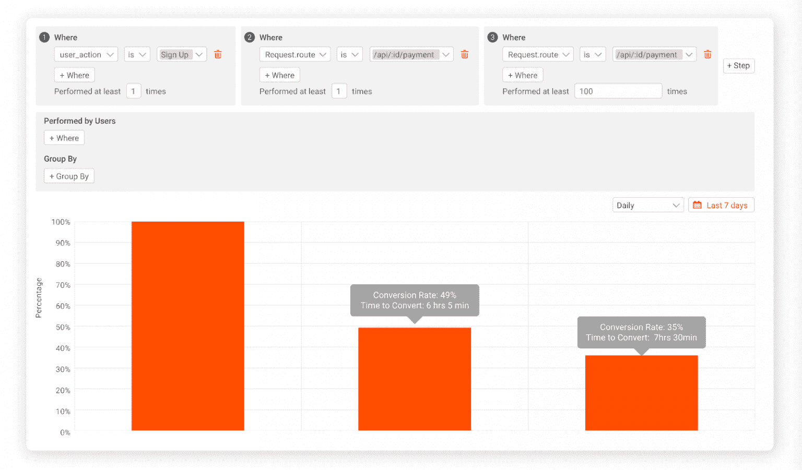

# 开发人员需要交钥匙 API 分析的 3 个原因

> 原文：<https://www.moesif.com/blog/technical/api-analytics/three-reasons-developers-need-turn-key-API-analytics/>

当您的平台运行在 API 上时，所有这些 API 都需要完美地运行。快速解决 API 中的问题不仅有帮助，而且是强制性的。延迟和错误监控只是开始:健康的服务器与健康的产品不是一回事。通过全面了解您的 API，解决错误案例和 API 滥用是最容易的，这就是 API 分析的用武之地。

如今，使用现成的解决方案来实现身份验证、支付处理和其他关键功能是很常见的。尽管如此，API 分析解决方案通常是内部构建的，耗费了数月的开发人员资源。这是你的团队可以用来进一步开发你的产品本身的时间。

幸运的是，交钥匙解决方案确实存在。请继续阅读，了解像 Moesif 这样的 API 分析平台能够使 API 开发人员的工作更容易、更快、更高效的三个原因。

## 原因 1:消除 API 错误日志的神秘性

> “作为一名科学家，我热衷于数据分析。当您有数千个错误和数百万个 API 调用时，查找、显示和共享像 400/500 错误这样的 API 指标是非常不同的”

搜索 API 事件日志非常耗时，单值指标通常无法解释复杂的错误情况。

API 分析提供了更快的查询和对有缺陷的 API 的更深入的了解，加速了您的调试过程。例如，Moesif 提供了对日志的实时洞察，可以根据任何数量的 API 调用进行扩展。将该层添加到您的 API 堆栈中可以让您…

*   实时跟踪和过滤 HTTP 请求
*   检查请求和响应 HTTP 负载
*   检查 API 日志，并在几秒钟内在 Postman 或 cURL 中重放请求
*   使用各种不同的参数，大规模细分和聚合 API 调用量

了解 API 的行为对于稳定性和良好的用户体验至关重要。增强的 API 调用可见性使得日志搜索变得更加简单。

## 原因#2:通过错误警报了解情况

> “该工具一上线，我们就能够看到正在发生的交易类型，我们就能够发现基础架构中的安全漏洞。我们有来自受制裁国家的交易，这些交易是通过我们没有封锁的某些国家进行的。从第一天开始，这就是该工具的胜利。”

*-Marat Asadurian，Trulioo 软件工程高级经理*

基础设施监控系统并不是发现 API 使用异常的最佳工具。他们更关注跟踪服务器正常运行时间、延迟和更多一般性错误。静态和动态警报消除了错误检测中的一些猜测。警报可以发送到许多不同的渠道，确保技术团队有充足的时间来解决问题。

静态警报可以在达到静态阈值时通知您。例如，您可以创建一个提醒，让您知道用户何时在您的 web 应用程序上面临授权问题。

`Alert if more than 20 HTTP ‘401 - Unauthorized’ status codes are returned in a REST API response within 15 minutes`

Moesif 的动态警报提供了一个新错误的更广阔的视角。它们会自动将错误与您的历史数据进行比较，提供发现复杂错误所需的上下文。您可以根据您的产品面临的具体问题定制我们的动态警报过滤器。如果您正在跟踪关键用户，您可以设置这样的动态警报:

`Alert if a user’s API usage is abnormally decreasing over the last week`

动态警报还为恶意用户或无意的编码错误提供了额外的防线。例如，用户可能有意或无意地向某个端点发送流量。异常大量的流量可能会使服务器过载，导致 DDoS 中断。为了防止这种情况，您可以设置一个针对端点查询数量异常增加的警报。如果某个端点收到异常大量的请求，该过滤器会立即向工程和安全团队发出警报，以便他们了解情况并迅速采取行动。

`Alert if an allowed user is creating an abnormally large amount of traffic against an endpoint, within the last 24 hours`

当涉及到错误和威胁时，额外的防线只能增强产品的可靠性。警报为您的团队提供了对 API 中的异常做出适当反应所需的时间。

## 原因 3:简化与非开发人员的协作

> “此外，您拥有的许多内置报告正是 API 公司想要的那种产品问题”

*-James Messigner，ShipEngine 开发体验总监*

虽然产品和开发团队站在同一边，但是不断变化的需求和时间表使它看起来不是这样。完美的 API 分析可以帮助您向非开发人员传达您的想法，并帮助您确定产品路线图或 bug backlog 中的优先级。

大多数现代分析平台都具有强大的数据可视化功能，API 分析也不例外。Moesif 提供安全的定制仪表板和报告，旨在向非技术和技术利益相关者传达关键的 API 见解。

例如，假设你在一个团队中开发一个应用内购买的移动平台。您的产品团队取消了一个存储支付信息以备将来使用的有缺陷的功能。使用像 Moesif 的漏斗报告这样的可视化工具，您可以证明为什么调试优先。漏斗分析是非开发者模拟他们理想客户从发现你的产品到购买的旅程的常用方法。

漏斗报告细分了过去七天内你的应用用户从销售漏斗中掉出的位置。你的产品团队知道你的理想客户在这段时间内至少进行了 100 次应用内购买。因此，我们将漏斗分为三个阶段，从左到右显示:

*   使用你的应用程序创建帐户的客户
*   对支付平台至少执行了一次 API 调用的客户
*   向支付平台提示至少 100 次 API 调用的客户

我们发现，平均而言，首次购买的顾客是在注册后 6 小时 5 分钟购买的。我们也看到只有大约一半的人在注册后进行了第一次购买。使用这种即时生成的可视化，你可以断言，修复有缺陷的功能可以减少注册和首次应用内购买之间的摩擦。

当多个团队联合起来提供一个伟大的产品时，所有团队成员理解彼此的需求是至关重要的。开发人员、设计人员、产品和客户团队之间的良好沟通有助于轻松协作，减少开发人员的干扰。

### 总之…

API 现在是我们互联世界的支柱，但分析最佳实践并没有跟上步伐。目前，开发人员补贴了不透明的 API 生命周期带来的大部分低效率。解决方案不像在内部编写分析基础架构那么简单。为了充分利用开发人员的时间，交钥匙解决方案是您的最佳选择。借助像 [Moesif](https://www.moesif.com/solutions/api-engineering?utm_campaign=Int-site&utm_source=Blog&utm_medium=body-cta&utm_term=api-solutions) 这样的 API 分析解决方案，您可以…

*   快速轻松地调试错误，无需繁琐的日志搜索和脆弱的单指标测试
*   与简单的基础设施监控相比，您可以更深入地了解 API 的使用情况
*   自动检测和通知复杂的错误、恶意攻击和延迟问题
*   与非技术合作者就 API 使用和产品健康状况进行清晰、准确的交流
*   赢回宝贵的时间，专注于编码

想确切了解 Moesif 如何节省工程资源？点击此处了解更多信息。！