# 如何集成 Moesif 和 Recurly 以轻松实现 API 货币化

> 原文：<https://www.moesif.com/blog/developer-platforms/recurly/How-To-Integrate-Moesif-And-Recurly-To-Easily-Monetize-Your-APIs/>

构建优秀的应用程序和 API 并不是一件容易的事情。更难的是，试图利用他们赚钱并创造一个可持续发展的业务。作为我们帮助公司创造更好产品的使命的一部分，我们决定投入大量精力帮助企业更容易赚钱。我们的无代码计费方法是一种简单而优雅的方式，可以非常快速地获得向客户收取使用费的能力。简单的货币化是我们从你的 API 中获取收入的最新功能的前提。我们的最新功能可以在 Moesif 的 [**计费表**](https://www.moesif.com/solutions/metered-api-billing?utm_campaign=Int-site&utm_source=blog&utm_medium=body-cta&utm_term=moesif-recurly) 屏幕下找到。

# 为什么要使用计费表？

计量产品的使用情况，并对使用情况收费，是技术产品货币化的最常见方式之一。统计使用情况，将指标发送给计费提供商，然后让计费提供商收取资金。

对于那些已经为其产品实施了基于使用量的计费方案的人来说，您知道这个过程可能相当复杂。它包括收集大量数据，将这些数据放在正确的位置，收集所欠的资金，如果发票没有支付，则进行治理，以便用户不再能够访问该服务。创建这样的计费系统需要大量的编码、集成、测试和支持工作。

Moesif 通过收集大量可以计费的指标，然后自动按用户和/或公司进行汇总，让您轻松做到这一点。有了 Moesif，您需要准确计费的所有数据都已经存在，这也是我们认为创建计费表功能非常有意义的原因。我们也已经为您完成了在 Moesif 和 [Recurly](https://recurly.com/) 之间创建集成的工作。这意味着只需几次点击，你就可以向客户收取使用费。根据复杂程度，您将在几分钟而不是几天甚至几周内拥有计费能力。

# 如何在 Moesif 中创建和使用计费表

一旦你把你的 API 和 Moesif 集成在一起，赚钱就非常简单了。在你与 Moesif 整合之后，有几个步骤可以让你知道什么时候可以获得收入。这些步骤包括:

*   在递归中设置计划和附加模块
*   将 Moesif webhook 添加到递归
*   将递归 API 细节插入 Moesif
*   在 Moesif 中配置计费参数
*   激活计费仪表

所有这些步骤都非常直观，只需几分钟。

## 在递归中设置计划和附加模块

货币化的第一步是在 Recurly 中实际设置一些计划，以便对使用进行计费。要在递归中设置计划，您需要使用左侧菜单点击**配置**，然后点击**计划**。

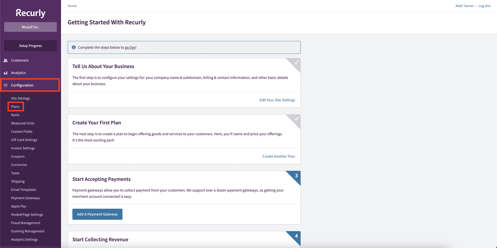

一旦你进入**计划**屏幕，你可以点击屏幕右上角的**新计划**来创建一个新计划。

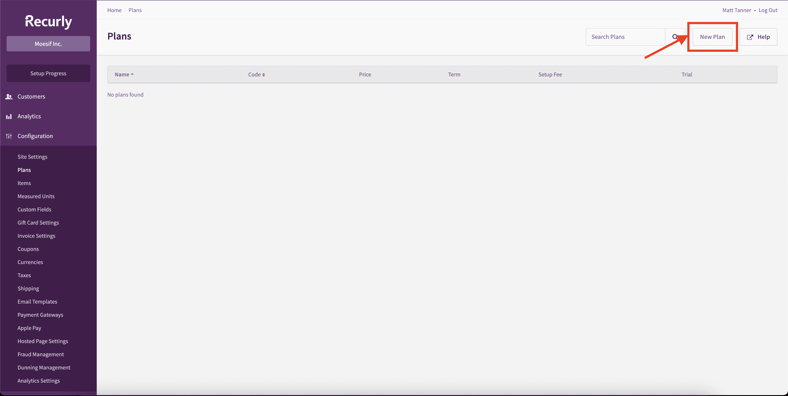

计划可以包含您需要的任何配置，但是您必须确保至少创建了一个**附加组件**。附加组件必须配置为:

*   在计费周期结束时向客户收费
*   费用基于单位价格

在递归计划中对此进行配置，如下所示:

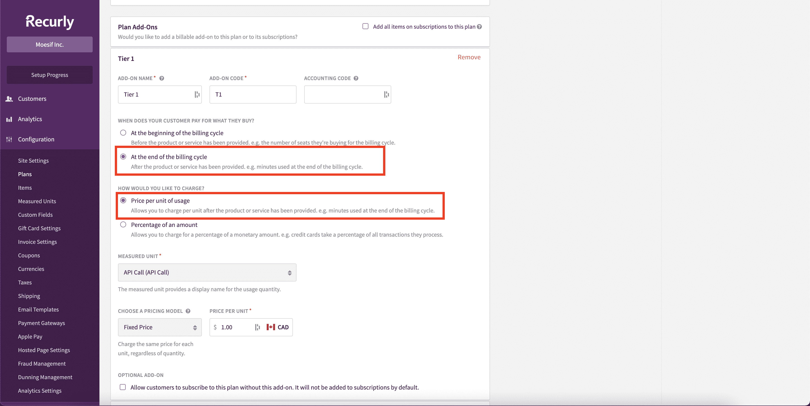

一旦您的计划配置完毕，点击屏幕底部的**创建计划**。

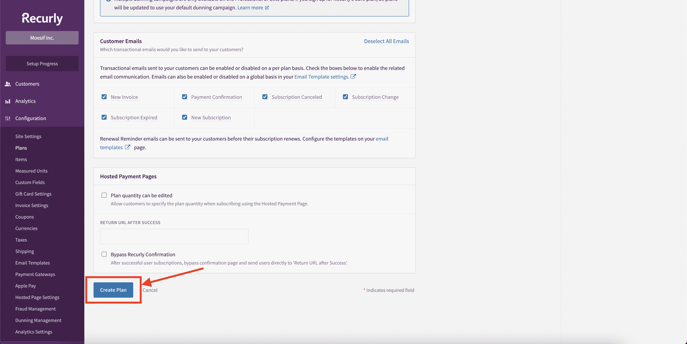

在这一点上，我们现在有一个计划，我们可以与 Moesif 集成，并开始按使用计费。

## 在 Moesif 中递归配置

一旦您的计划和附加组件被创建，是时候开始递归地集成 Moesif 了。进入**计费表**页面，点击屏幕右上角的**编辑计费提供商**下拉菜单，在 Moesif 中开始递归配置。

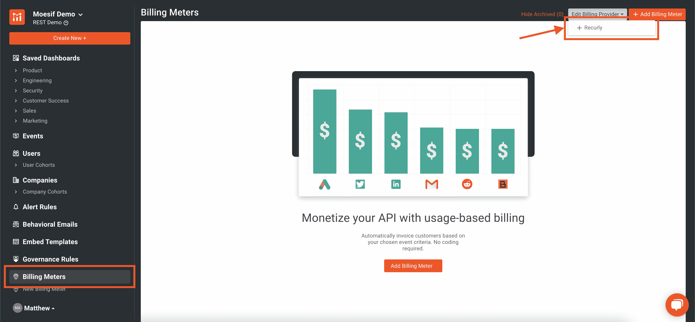

这将打开递归配置屏幕，引导您完成集成。在这个屏幕上，您可以获得递归插入 Moesif 所需的所有信息。配置的每个步骤都包含在模式中。

## 将 Moesif webhook 添加到递归

集成的第一步是在 Recurly 中将 Moesif webhook 添加到配置中。添加此功能允许 Recurly 向 Moesif 发送订阅更新。

要将 Moesif webhook 添加到 recurry，从 recurry 的左侧菜单中选择**集成**，然后选择 **Webhooks** 。

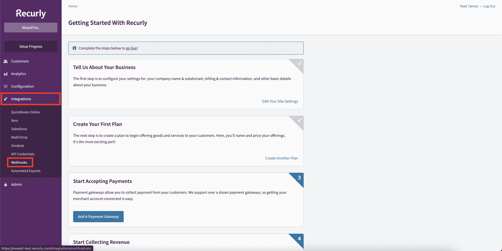

这将把你带到 **Webhooks** 页面，在这里你可以查看现有的 Webhooks 并添加新的 webhooks。要添加新的 webhook，我们将点击屏幕右上角的**配置**按钮。

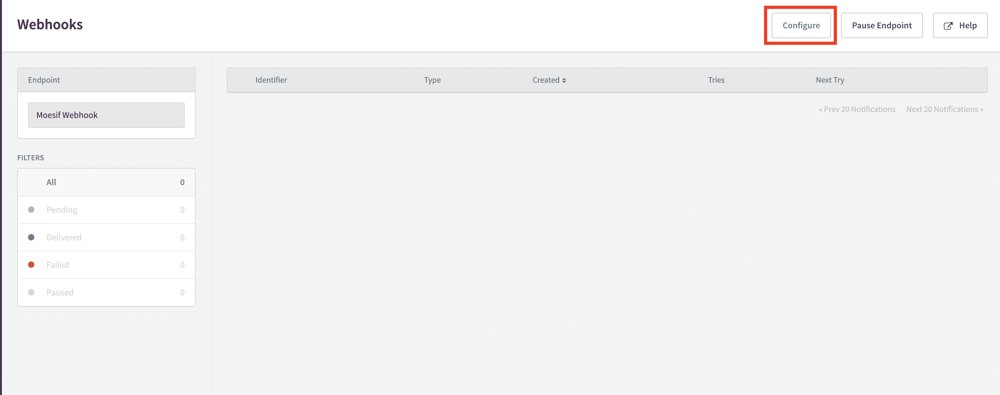

在下一个屏幕上，您需要点击屏幕右上角的**新端点**按钮。

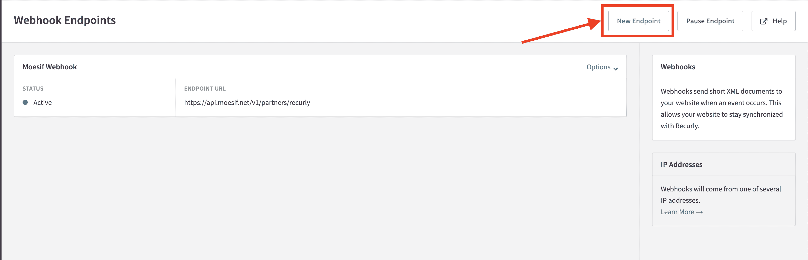

从这里，我们将把我们的 Moesif API 端点 URL 插入到**端点 URL** 字段中，并将我们的 Moesif 应用程序 ID 添加到 **HTTP AUTH 用户名**字段中。

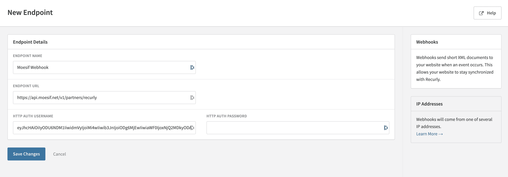

> 在 **HTTP 认证密码**字段中不应输入任何内容。

这些细节都可以在前面提到的 Moesif 中的递归配置页面上找到。

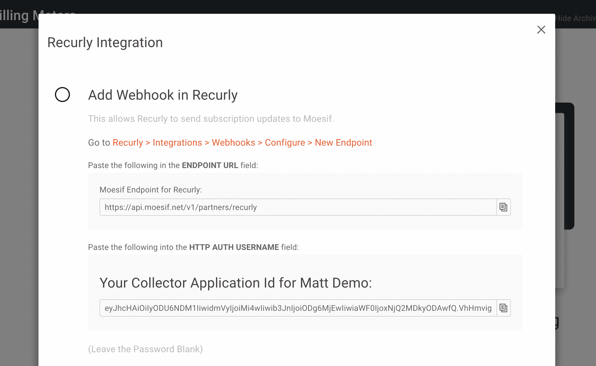

## 将递归 API 细节插入 Moesif

为了让 Moesif 在 Recurly 中将使用量添加到订阅中，我们需要将 Recurly API 细节添加到 Moesif 中。这是在 Moesif 的递归配置屏幕中完成的，这个屏幕与我们之前使用的屏幕相同。

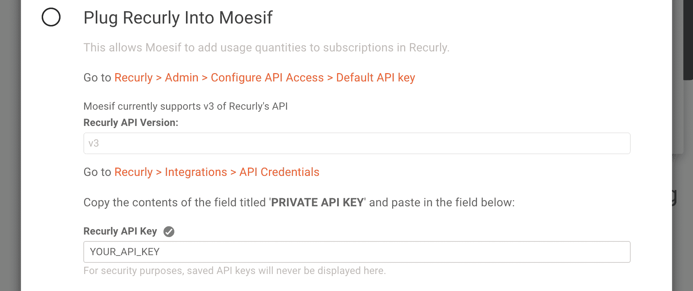

> 目前，Moesif 只支持递归 API 的 v3，因此值是默认的，并且对于**递归 API 版本**字段是不可编辑的。

对于 **Recurly API 键**字段，您需要从 Recurly 检索 API 键以将其插入。为此，在左侧菜单中点击**集成**，并选择 **API 证书**。然后，您将能够在屏幕上的**默认 API 密钥**字段中看到您的 API 的私有密钥。

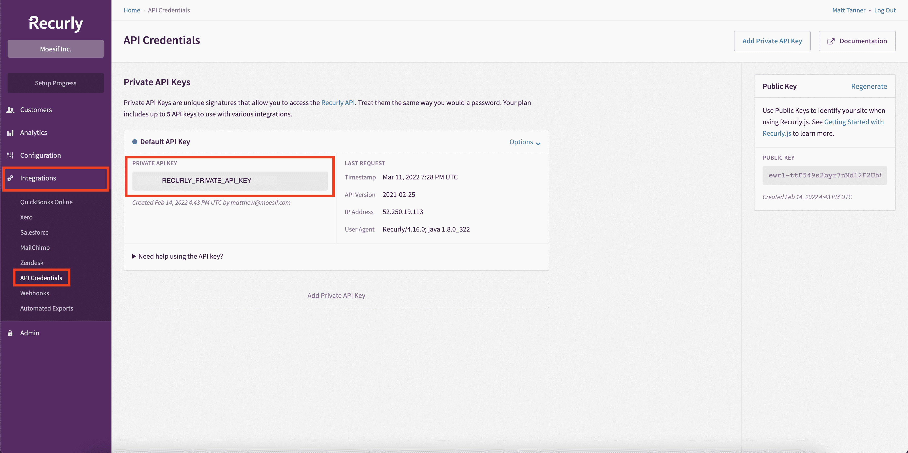

从 Recurly 复制密钥后，您将把这个密钥粘贴到 Moesif 中的 **Recurly API 密钥**字段。完成后，回到 Moesif，你可以向下滚动到屏幕底部，点击**保存**保存配置。

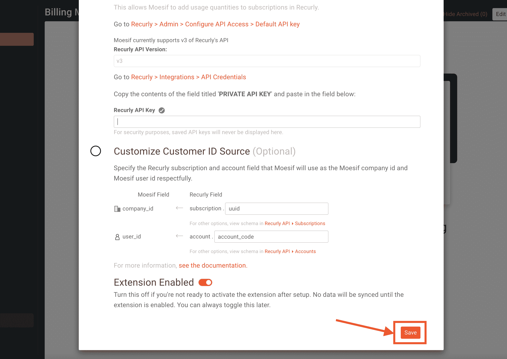

至此，您在 Moesif 中的递归集成已经完成，您可以开始使用它了。

> 或者，您也可以在 Moesif 中定制**客户 ID 源**。缺省值对于大多数目的来说应该可以，但是如果您确实需要定制它，它将允许您指定如何将递归的**订阅**和**帐户**字段映射到 Moesif 中的**公司 ID** 和**用户 ID** 。

## 在 Moesif 中配置计费参数

一旦添加了与 Recurly 的集成，您就可以在 Moesif 中配置您的计费参数。如果您还没有这样做，您将需要创建一个新的**计费表**。要做到这一点，在 Moesif 中，您需要像开始递归集成时一样，单击左侧菜单中的**计费表**链接。

一旦你进入**计费表**屏幕，你将点击 **+添加计费表**按钮开始创建一个新的计费表。

在添加计费计数器屏幕上，您将添加:

*   计费仪表名称
*   账单提供商信息
*   添加过滤器以指定要计费的事件

在下面的例子中，我设置了一个名为“我的计费计划”的计费计划，它使用 Recurly 作为我的计费提供者。我还决定对任何响应为 **200 OK** 的 API 调用计费。

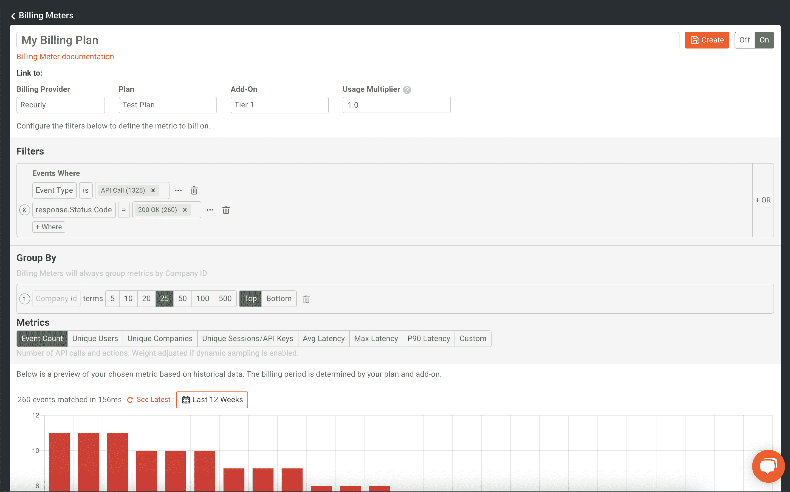

输入详细信息后，您将在屏幕底部看到过滤器输出的可视化表示。虽然计费只会发生在未来，但您将能够从历史上看到您的过滤器如何处理现有数据。这有助于确保，尤其是对于更复杂的过滤，您已经按照您需要的方式配置好了一切。

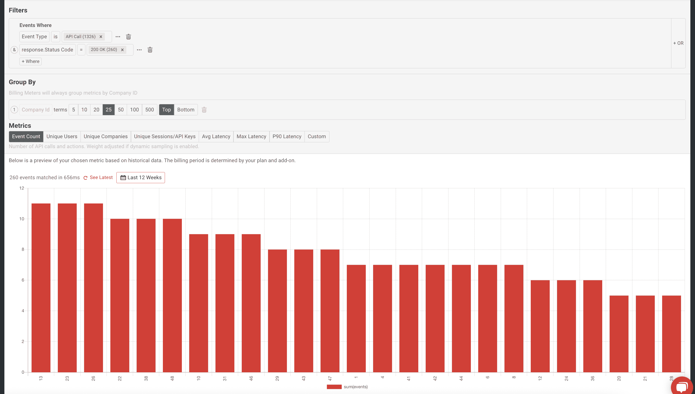

## 激活计费仪表

我们货币化的最后一步是保存和激活计费表。要做到这一点，我们只需要确保在配置页面的顶部打开计费表。

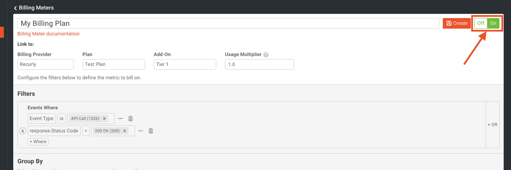

最后，我们需要点击屏幕顶部的**创建**。

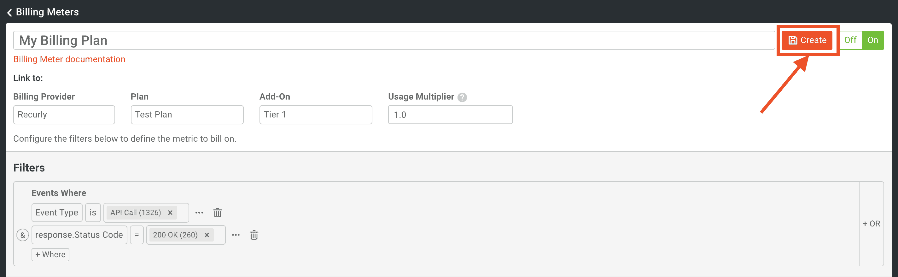

点击 **Create** 按钮后，在弹出的模式中会提示您确认计费表的创建。

> 需要注意的是，一旦创建了计费表，过滤标准和计费提供商的详细信息都不能更改。只有名称可以更改，计费表的状态可以打开和关闭。这是出于合规和审计的目的。计费仪表也不能删除，但如果不再使用，可以存档。

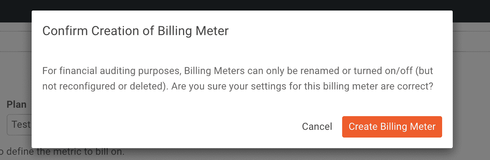

我们现在应该看到我们的新计费表出现在**计费表**主页上。

现在，我们已经成功创建了一个计费表，它将开始向 Recurly 发送使用数据。这种集成可以在几分钟内完成，不需要任何代码。如需了解更多信息，您也可以查看我们的文档。

# 你自己试试吧！

如果你有一个 API，或者你的产品的任何其他部分，你想赚钱，Moesif 可以帮助你。正如上面的步骤中所提到的，这是一种从你的产品中获得收入的简单而快速的方法。如果您已经在货币化您的产品，并在寻找一个更简单的解决方案，我们的计费功能是简化您的设置和降低您现有货币化工作的支持成本的好方法。

Moesif 还提供了许多与我们的计费功能捆绑得很好的其他出色功能，包括[漏斗指标](https://www.moesif.com/docs/user-analytics/conversion-funnel-analysis/?utm_campaign=Int-site&utm_source=blog&utm_medium=body-cta&utm_term=moesif-recurly)和[留存分析](https://www.moesif.com/docs/user-analytics/cohort-retention-analysis/?utm_campaign=Int-site&utm_source=blog&utm_medium=body-cta&utm_term=moesif-recurly)、[自动化用户行为电子邮件](https://www.moesif.com/docs/behavioral-emails/?utm_campaign=Int-site&utm_source=blog&utm_medium=body-cta&utm_term=moesif-recurly)、[定制指标仪表板](https://www.moesif.com/docs/api-dashboards/?utm_campaign=Int-site&utm_source=blog&utm_medium=body-cta&utm_term=moesif-recurly)和[治理功能](https://www.moesif.com/docs/api-governance-rules/?utm_campaign=Int-site&utm_source=blog&utm_medium=body-cta&utm_term=moesif-recurly)。[立即注册](https://www.moesif.com/signup?utm_campaign=Int-site&utm_source=blog&utm_medium=body-cta&utm_term=moesif-recurly)开始使用账单和更多功能。