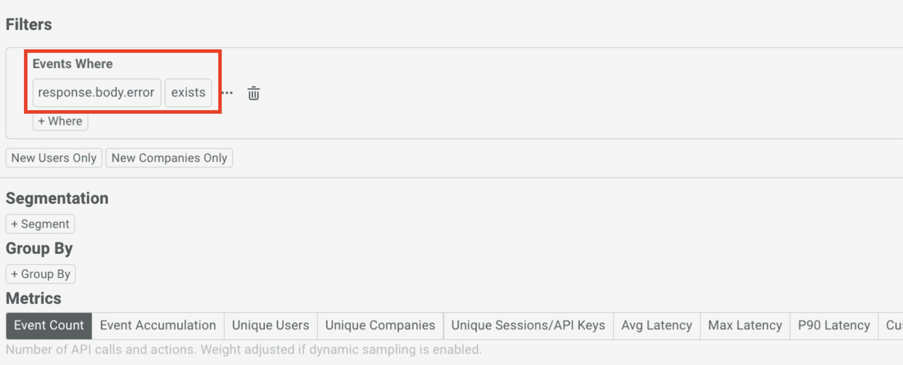
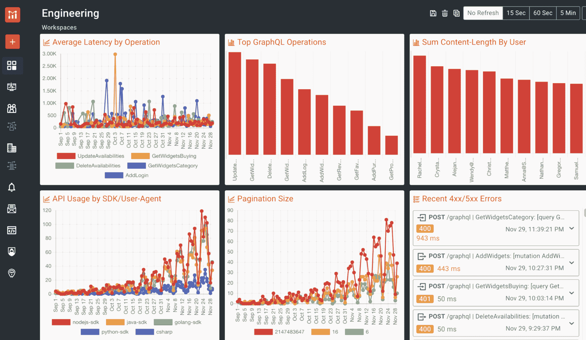

# 企业中的 GraphQL:构建、部署和监控新的企业 GraphQL 服务需要什么

> 原文：<https://www.moesif.com/blog/technical/graphql/GraphQL-In-Enterprise-What-It-Takes-To-Build-Deploy-And-Monitor-A-New-Enterprise-GraphQL-Service/>

新技术在融入企业堆栈之前，总是需要一些规划、变更和试验。GraphQL 的采用也不例外。Airbnb、网飞、Shopify 和其他行业巨头等公司都已经开始使用这一有前途的技术。在这篇博客中，我将概述创建新服务、部署新服务和监控新服务的一些关键注意事项。这里假设您对 GraphQL 有一个基本的了解，了解一些关键的用例，并且知道一些关于采用的问题。记住这一点，让我们开始吧。

# GraphQL 与。休息一下

在构建 GraphQL 服务之前，重要的是要考虑构建 Web APIs 的主流方法:REST。对 GraphQL 的一个常见误解是，它是 REST 的替代品。从这个角度考虑这项技术是非常错误的。GraphQL 和 REST 可以互为补充，大多数企业会混合使用这两种方法。

当企业从 SOAP 转移到 REST 时，这种转变更容易看到和描绘出来。两者都包含请求和响应的严格契约，这意味着将 SOAP 服务转换成 RESTful 服务很有意义。有些甚至可以以“对等”的方式进行转换。

对于 GraphQL，与 SOAP 和 REST 相比，这是一条更艰难的比较和迁移路径。没有 GraphQL 请求和响应契约，因为它们是在执行查询时定义的。GraphQL API 的调用者发送获得所需结果所需的任何数据，并以调用者请求的格式返回。这打破了 RESTful API 设计建立的传统模式，在这种模式下，端点有非常明确定义的请求和响应对象。

GraphQL 相对于 REST 的最大好处是用户可以检索他们需要的任何数据，而不必为每个变体创建一个新的端点。这无疑可以改善开发人员对 API 和数据的体验。对于 REST，这实际上导致了一个 API 问题，有时创建一个新的端点比修改一个现有的端点更容易，并可能破坏使用它的其他应用程序。结果是一大堆略有不同的 API，以及维护它们所需的大量支持工作。

当决定将您的新 API 构建为 GraphQL 还是 REST 时，您将希望确保您需要 GraphQL 的灵活性，或者您可能只需要一个小型 RESTful API 的简单性。

# 你真的需要 GraphQL 吗？

确定你是否真的需要 GraphQL 是一个非常重要的问题。随着 GraphQL 的采用，给工程师和支持团队带来了学习曲线，以及复杂性。

使用 GraphQL 的最佳时机是:

*   您有大量的关系数据，并且您不确定消费者将如何查询这些数据
*   您目前正面临 REST 端点复制的问题，并希望减少您必须支持的单个端点的数量
*   您有许多公开您需要的数据的服务，并且想要一种更简单的方法来查询它，而不需要创建许多新的端点
*   您希望订阅数据中的更改，可能使用 GraphQL 订阅作为解决方案

在以下情况下休息可能更好:

*   您的应用程序只需要简单的、预定义的 CRUD 操作
*   您正在添加到一个已经使用 RESTful 方法高效运行的现有项目中
*   你需要严格的利率限制和配额管理
*   您需要大量缓存或者需要设计吞吐量

当然，对于为什么应该使用其中一种技术来代替另一种技术，有许多不同的观点。以上只是每种方法的一些注意事项。

如果您想公开您的数据，以便多个应用程序可以完全按照他们认为合适的方式使用它，GraphQL 是一个很好的解决方案。如果你比其他人更需要一个简单的 CRUD 接口，更简单的解决方案可能是更好的选择。

# 构建新 GraphQL 服务的选项

GraphQL 服务本质上可以适应熟悉的“构建还是购买”的困境。构建 GraphQL 服务的原始且最灵活的方法是选择一种语言和框架，然后“从头”构建。几乎每种语言中都存在大量的框架。[GraphQL.org](https://graphql.org/?utm_campaign=Int-site&utm_source=blog&utm_medium=body-cta&utm_term=graph-ql-enterprise)有一个全面的列表[所有支持 GraphQL 的语言和框架](https://graphql.org/code/?utm_campaign=Int-site&utm_source=blog&utm_medium=body-cta&utm_term=graph-ql-enterprise)。

当从头开始构建一个框架时，你将拥有最大的灵活性，但也有最陡峭的学习曲线。如果出现问题，您的支持团队也需要尽快了解代码的复杂性。高灵活性和定制化的代价是构建时间、学习框架以及在定制代码投入生产后对其的支持。

一个看起来学习曲线更低的替代方法是使用一个产品来构建，该产品允许您使用现有的基础设施来创建您的 GraphQL 服务。一些例子包括:

*   **哈苏拉**
    *   连接您喜欢的数据库并自动创建一个 GraphQL API 服务
*   **动物群 T3**
    *   从单个模式创建数据库和 GraphQL API 服务
*   **[Tyk 的通用数据图](https://tyk.io/universal-data-graph/)**
    *   使用现有的 RESTful APIs 创建一个新的 GraphQL API 服务，不需要任何代码
*   **[Mulesoft 的任意点数据图](https://www.mulesoft.com/platform/anypoint-design-center/datagraph)**
    *   使用您已经构建的 API 来公开新的 GraphQL 服务

其中许多解决方案允许您使用现有的基础设施、服务和数据来创建全新的 GraphQL 服务。几乎所有的都不需要额外的代码，除了您可能想要实现的定制，这意味着学习曲线和构建时间大大减少。与构建“基础”服务相比，这种方法提供的灵活性稍低，但却能让用户快速进入市场。

# 不要忘记前端的变化

将 GraphQL 引入企业的另一个部分是对您的前端和任何将使用该 API 的客户端进行更改。在现有的前端项目中，目前可能使用 RESTful 端点，要集成和运行 GraphQL 可能需要大量的工作。每个 RESTful 调用都需要映射到等价的 GraphQL 调用，并在应用程序中处理返回的数据。为了映射这些操作，这可能需要对 GraphQL 模式有深入的了解。

仅代码更改一项就要花费大量的时间，在计划 GraphQL 转换项目时应该对其进行预算。如果前端团队不知道如何利用这项技术，他们也需要接受 GraphQL 方面的教育。这还将包括添加一个前端 GraphQL 客户端，如 Apollo Client，并学习如何使用它与您的新 GraphQL 服务进行交互。从项目一开始就使用 GraphQL，这显然不那么麻烦。

最后要考虑的是，一旦 GraphQL 发生变化，产品或系统需要多少回归测试。需要进行端到端测试，以确保 API 按照预期工作，以及服务中支持响应的任何逻辑。同样的测试方法也必须应用于前端 UI 体验，以确保应用程序像最初一样工作。

# 管理常见的 GraphQL 问题

GraphQL 仍处于起步阶段，在选择使用和实现它时，需要考虑一些问题。下面我们将回顾一些在实现 GraphQL 时需要注意的最常见的问题。

### 安全性

许多 GraphQL 采用者最担心的是 GraphQL 内置的漏洞。尽管许多经验丰富的 GraphQL 用户都知道它们，但是很容易忘记通过 GraphQL 服务暴露的许多攻击媒介。这些攻击包括 SQL 注入、查询遍历攻击和许多其他易于执行但难以发现的攻击。在[的这篇文章](https://wundergraph.com/blog/the_complete_graphql_security_guide_fixing_the_13_most_common_graphql_vulnerabilities_to_make_your_api_production_ready)中，WunderGraph 对许多最重要的漏洞进行了完整的分析。

### 贮藏

GraphQL 以其缓存的复杂性而闻名。与容易缓存的 REST 响应不同，GraphQL 提出了独特的挑战。大量的缓存问题已经由单独的解决方案解决了，但是实现起来可能很复杂，并且不是所有的解决方案都能全面地解决这个问题。本文中的[对 GraphQL 中缓存的所有方面进行了很好的概述。](https://daily.dev/blog/caching-in-graphql)

### 复杂性

实现 GraphQL 有时会比用传统的 RESTful 方法解决问题更复杂。有时 GraphQL 服务的构建和支持变得非常复杂，即使它们提供的数据本质上很简单。这也可能导致消费者需要对底层数据结构和可用字段有更复杂的理解。对于不熟悉 GraphQL API 的开发人员来说，不得不编写复杂的查询也会增加困惑。在企业层面，这可能意味着围绕现有消费者的服务能力进行大量培训。

### 速率限制和配额

对于 RESTful 端点，在特定端点上实施速率限制和配额相对简单。GraphQL 服务是通过单个端点提供的，这使得这一点有点困难。您可以对 GraphQL 端点强制实施速率限制和配额，但是这留下了很少的灵活性和定制性。实施速率限制和配额的最佳方式是限制每个字段，或者更常见的是，通过进行 GraphQL 查询成本计算并为每个用户分配特定数量的点数。几年前，Shopify 的工程团队在这个项目上做了一篇[的精彩报道](https://shopify.engineering/rate-limiting-graphql-apis-calculating-query-complexity)。像 [Moesif 的治理特性](https://www.moesif.com/features/api-governance-rules?utm_campaign=Int-site&utm_source=blog&utm_medium=body-cta&utm_term=graph-ql-enterprise)这样的工具可以为特定的 GraphQL 字段和操作符计量和执行配额。

### 错误处理

GraphQL 中处理错误的方式与 RESTful 服务略有不同。使用 REST，当调用或事务中出现问题时，会返回错误代码。这在很大程度上是一个“全有或全无”的事务，要么调用成功，要么返回大量可能的错误响应之一。使用 GraphQL，即使响应包含错误或者某些字段无法解析，响应状态仍将显示为成功。这意味着错误处理必须比仅仅查看 HTTP 响应状态代码更加明确。GraphQL 规范本身甚至包含关于如何格式化 GraphQL 响应中的错误的非常模糊的指导。在[的上一篇文章](graphql.com/blog/graphql/error-handling/full-stack-error-handling-with-graphql-apollo/)中，Apollo GraphQL 提供了一些如何解决这种挫折的小技巧。

# 部署 GraphQL 服务

部署 GraphQL 服务(包括 GraphQL 服务器和相应的前端 GraphQL 实现)的工作方式与使用框架构建 RESTful API 服务的工作方式相同。

当谈到许多“购买”的解决方案，如 [Hasura](https://hasura.io/) 或[动物群](https://fauna.com/)时，这些解决方案中的大多数都是作为 SaaS 式的托管部署提供的。这意味着部署只需要最少的工作和配置就可以启动并运行。如果需要，其中一些解决方案还提供自我管理的本地解决方案。显然，以自我管理的方式管理您自己的部署和资源将需要更多的努力和支持资源。

负责部署解决方案的团队应该知道如何配置它，并且对于“购买”的 GraphQL 产品，应该知道如何将逻辑和其他依赖项从开发环境转移到生产环境。

# 监控 GraphQL 服务

一旦您的 GraphQL 服务在生产中启动并运行，监控它的错误、使用情况和采用情况是非常重要的。传统的 APM 供应商很难监控 GraphQL，因为他们只查看 URL 和状态代码。但是，GraphQL 调用通常是针对同一个/graphql API 端点的，不一定利用 HTTP 状态代码。最好的 GraphQL 监控工具提供了分析特定操作和主体字段的灵活性。像 Moesif 这样的解决方案允许您在出现 response.body.error 这样的特定主体字段时得到警告，这是 GraphQL APIs 的一种常见错误格式。

Moesif 还可以提供与 REST APIs 相比，如何访问 GraphQL APIs 的产品见解。这使您能够跟踪从 REST 迁移到 GraphQL 时的使用差异。这包括 Moesif 跟踪 GraphQL 操作的能力，例如 GraphQL 突变，并基于特定字段进行过滤，以便您可以看到哪些正在使用以及它们是如何使用的。

您还可以使用 Moesif 为您的团队创建警报，并根据使用情况自动向用户发送电子邮件。这有助于以完全自动化的方式实现入职、特性采用和客户成功。

正在考虑 GraphQL 或者已经在你最新的项目中使用 GraphQL？[立即注册](https://www.moesif.com/signup?utm_campaign=Int-site&utm_source=blog&utm_medium=body-cta&utm_term=graph-ql-enterprise)了解 [Moesif 的 GraphQL 监控功能](hhttps://www.moesif.com/features/graphql-analytics?utm_campaign=Int-site&utm_source=blog&utm_medium=body-cta&utm_term=graph-ql-enterprise)，尽可能轻松、安全、成功地过渡到企业 GraphQL。