# Moesif 全新应用内体验升级指南

> 原文：<https://www.moesif.com/blog/announcements/features/Your-guide-to-Moesifs-new-in-app-navigation-upgrade/>

我们已经对 Moesif 的应用内体验进行了重新设计，这是一次重大的重新设计！作为我们为用户提供最佳体验之旅的一部分，我们简化了应用内导航。这一更新使得在 Moesif 中找到关键功能变得更加容易，并且有望让现有用户看到一些他们以前没有使用过但可能有用的功能。

正如所有大大小小的变化一样，可能会有一个学习曲线。这就是为什么我们制作了一个简短的指南来概述如何在 Moesif 中导航到所有您喜欢的功能。

> **TL；博士**:我们增加了一个**创建**新按钮，允许用户轻松创建他们喜欢的图表、分析和工作流程。所有导航都是通过左侧导航菜单完成的。**动态采样**功能现在可以通过**设置**访问。Moesif 中的应用程序可以通过位于 Moesif 仪表板左上角的下拉菜单进行切换。

## “新建”按钮

您可能会注意到的第一件事是，只需单击 **Create New** 按钮，即可创建新的仪表板、图表、警报和工作流。该按钮位于左侧导航的顶部。

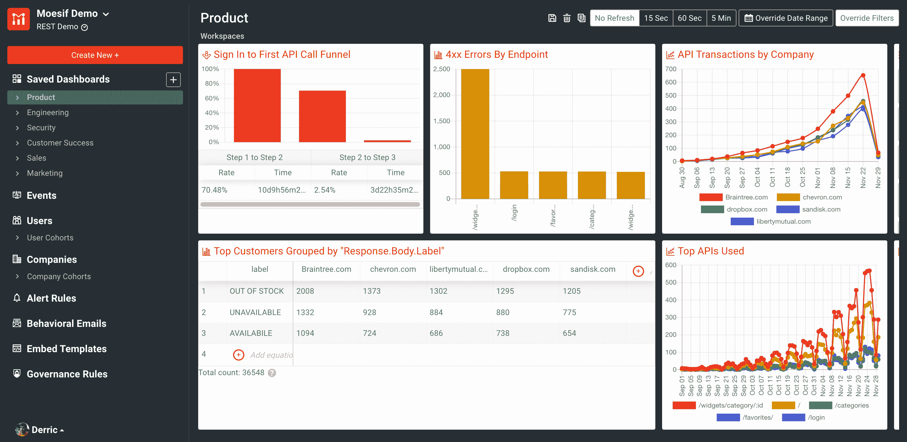

单击该按钮时，您将看到许多不同的选项，可以轻松创建新的图表、分析和工作流。将鼠标悬停在每个选项上还会给出每个选项用途的简要描述。

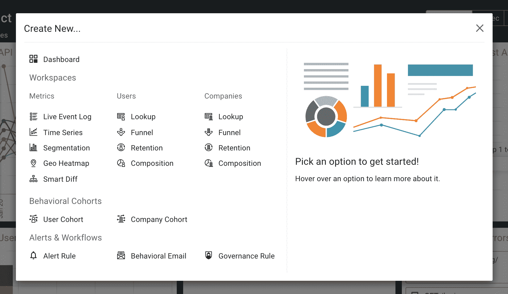

选择这些选项中的任何一个都会将您带到所选选项的相应屏幕。当然，您仍然可以单独导航到屏幕并从那里创建，但这提供了一种快速开始新内容的简化方法。此功能支持一键访问 Moesif 最常用的所有功能。

## 反馈

如果您对我们的新设计有任何反馈，请告诉我们！

## 动态采样移动了！

> 动态采样是一个节省成本的特性，它使您能够根据客户或 API 行为控制将哪些 API 调用记录到 Moesif。因为 Moesif 从不接收跳过的 API 调用，所以它们不计入您的订阅的事件配额。此外，Moesif 自动推断和标准化指标，因此即使不同的客户和行为有不同的采样率，您的报告也是准确的。

在 Moesif 中配置**动态采样**的入口已经移到**设置**菜单下。从这里，您可以访问动态采样以前为您提供的所有相同功能。

> 您还可以在**设置**菜单中找到我们新发布的隐私规则和自定义角色功能。隐私规则使得基于团队成员的角色编辑字段变得容易，并有助于保持敏感数据的私密性

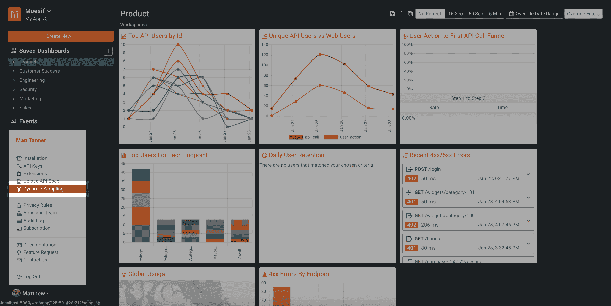

## 左侧栏

Moesif 中的导航现在通过左侧边栏菜单完成。我们设计它是为了让 Moesif 的功能更容易访问和导航。您保存的所有内容现在也可以从左侧边栏访问。在这里，您可以找到已保存的仪表板、群组、警报规则以及您或您的团队在 Moesif 中创建的其他工作流。

下面包括一些关于某些功能现在的位置以及对它们的任何改进的描述:

## 仪表盘

> 仪表板能够在单个屏幕上为您提供多个视图或图表。这是一种可定制的方式，您可以在一个地方查看所有想要的数据。
> 
> 因此，您可以更快地开始，您的 Moesif 帐户将有预建的仪表板，每个部门一个:
> 
> *   产品
> *   客户成功
> *   工程
> *   安全性
> *   销售
> *   营销
> 
> 这些包含了基于我们所看到的效果最好的指标。这可以为你提供一个很好的修改起点，或者你可以从一张白纸开始。

要访问 Moesif 中的仪表板，在左侧导航中，您可以在**保存的仪表板**菜单项下选择您想要查看的仪表板。默认情况下，Moesif 有一些预填充的仪表板，涵盖一些关键的业务领域，包括产品、客户成功、工程和其他一些领域。这些以及您创建的任何其他仪表板将列在**保存的仪表板**菜单项下。

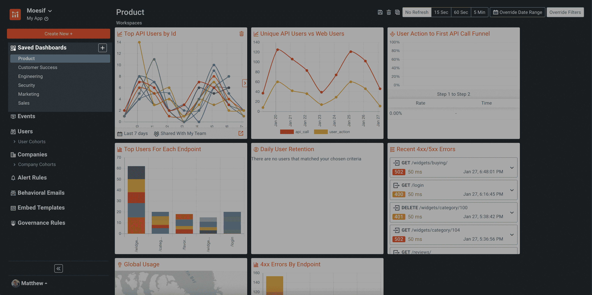

要创建新的仪表板，只需点击**保存的仪表板**菜单项旁边的 **+** 按钮。

> 您还可以在菜单中移动已保存仪表板的顺序，并创建一个**子仪表板**。当您将鼠标悬停在**保存的仪表板**下的各个项目上时，这些选项就会出现。

我们还对单个工作区内的功能进行了一些改进。为了更好的可访问性和可读性，工作区的注释现在显示在右边。现在你可以很容易地创建和发布评论(包括给你团队中的其他 Moesif 用户添加标签的能力)。

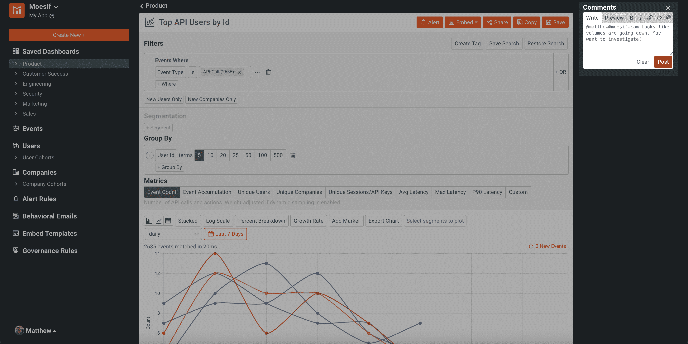

然后保存评论供以后查看。

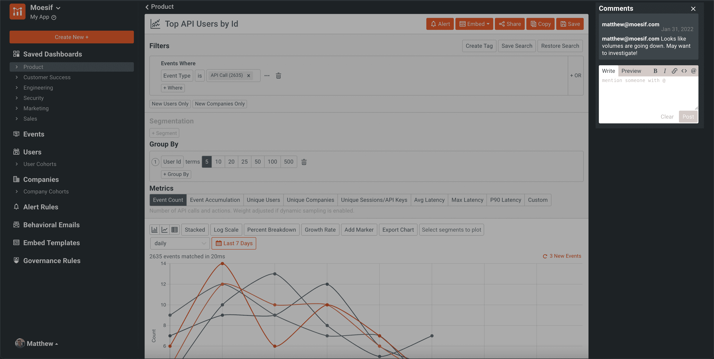

另一个改进是重新定位了**恢复搜索**按钮，这样你可以很容易地恢复你过去保存的搜索。

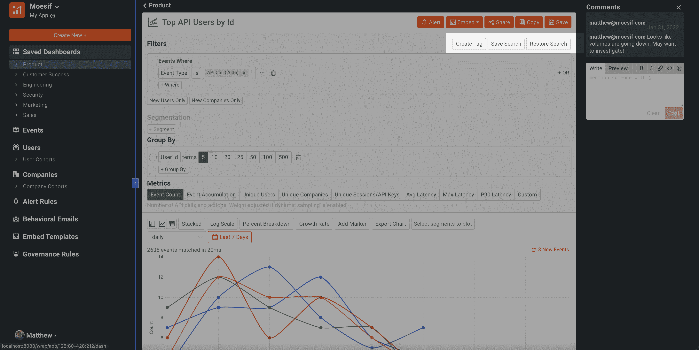

## 事件

> 事件屏幕允许用户在应用许多不同的过滤器配置时可视化他们的数据。**事件**屏幕中的视图和图表包括实时事件日志、时间序列、分段、地理热图和智能差异。

创建图表和查看事件日志可以在**事件**屏幕中完成。要导航到该屏幕，您需要在左侧菜单中选择**事件**。

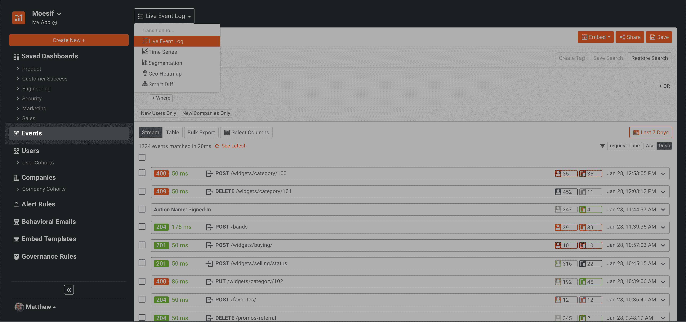

要在不同的图表和视图之间进行选择，如时间序列或实时事件日志，您需要从下拉列表中选择所需的图表，并在那里使用它。

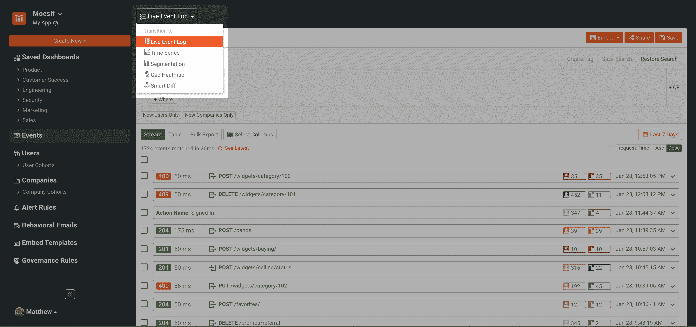

## 用户

> Moesif 中的**用户**功能允许您深入分析用户。这使得 Moesif 用户能够对基于用户的指标进行排序和过滤。有了这些数据，你就可以深入挖掘用户漏斗、留存率和用户构成分析，从而描绘出你的企业和用户群的完整图景。

用户指标和工作流也可以通过左侧导航访问。在导航中，您会看到**用户**菜单项以及到您创建的每个**用户群**的链接。

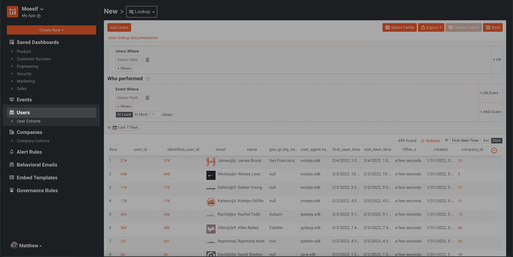

在**用户**屏幕上，您可以通过屏幕左上角的下拉菜单导航至不同的功能和工作流程。在这里，您将导航到诸如**漏斗**、**保持**和**构成**等功能。

创建用户群组后，它将显示在左侧导航中**用户**标题下的**用户群组**折叠菜单下。

## 公司

> 与 Moesif 中的**用户**功能类似，**公司**功能允许您执行相同的功能，但基于公司数据进行过滤和排序。

公司指标和工作流程也可通过左侧导航访问。在导航中，您会看到**公司**菜单项以及到您创建的每个**公司群组**的链接。

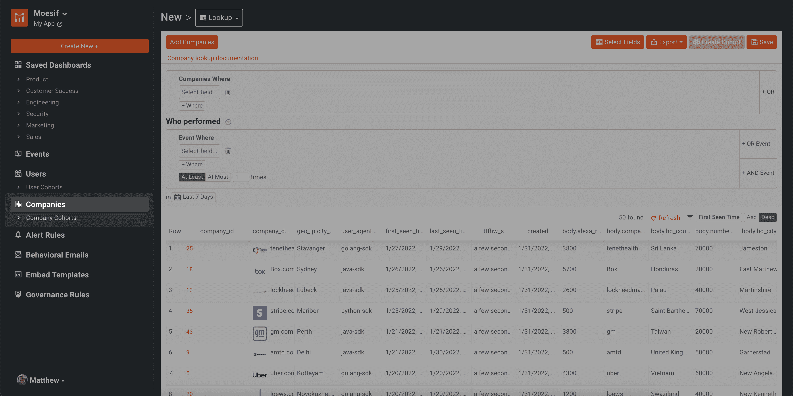

在**公司**屏幕上，您可以通过屏幕左上角的下拉菜单导航到不同的功能和工作流程。在这里，您将导航到诸如**漏斗**、**保持**和**构成**等功能。

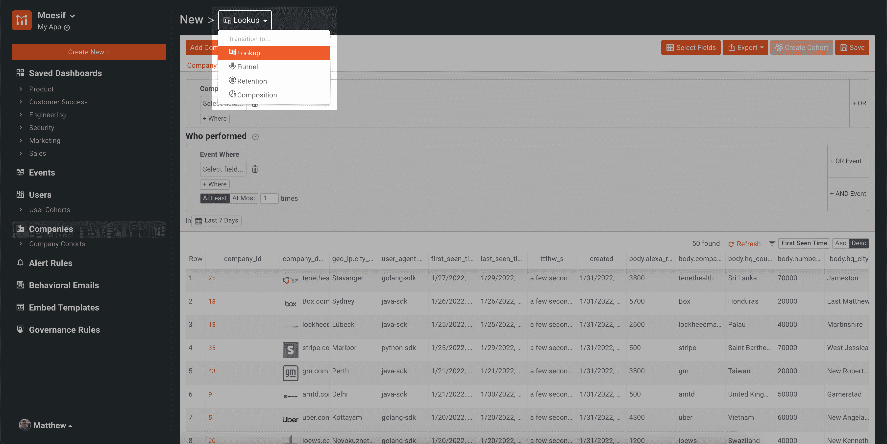

创建公司群组后，它将显示在左侧导航中**公司**标题下的**公司群组**折叠菜单下。

## 警报规则

> 警报规则使您能够监控 API 中影响客户的问题，并更加主动地确保良好的客户体验。您还可以利用警报来跟踪每个客户级别的指标。例如，您可能希望在新客户的流量大幅下降或平均延迟大幅上升时收到警报。警报可以发送到您选择的渠道，包括电子邮件、短信、寻呼机、Slack 或使用自定义的 WebHook。

警报屏幕也进行了优化，更易于导航。要进入**警报**屏幕，您可以在左侧导航的**警报**菜单项下找到它。在标题下方，您还会看到一个到**警报历史**屏幕的链接。

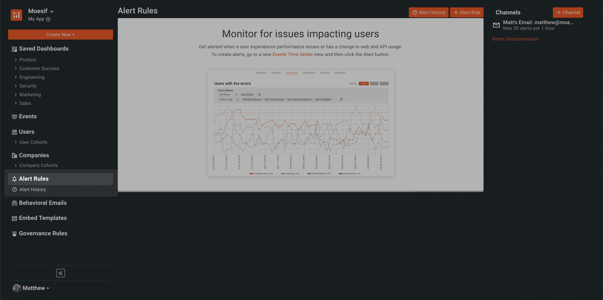

**警报频道**视图也被移至屏幕右侧，为左侧的新导航菜单让路。

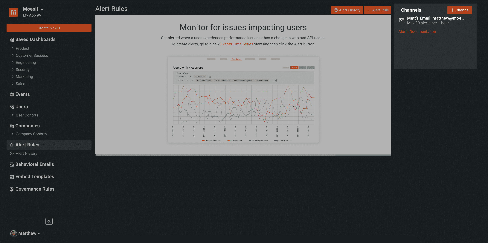

## 行为邮件

> Moesif 中的行为电子邮件功能允许用户在其应用程序中根据用户行为设置自动电子邮件。根据客户与您的应用程序的交互，发送速率限制警告、入职指导、集成错误等事件的警报，或您希望发送的任何类型的自定义电子邮件。

行为电子邮件现在也可以在左侧导航中找到。以前它们嵌套在**警报&治理**屏幕中。现在，它们更容易看到，也更容易接近。

## 嵌入式模板

> 嵌入式模板使用户能够将他们喜欢的事件日志和图表嵌入到他们的应用程序中。这允许客户查看这些指标，而不需要任何定制代码。

嵌入式模板也出现在主导航中，而不是像以前的 UI 那样嵌套在**仪表板**屏幕中。您仍然需要像过去一样，通过**指标**屏幕创建**嵌入式模板**。

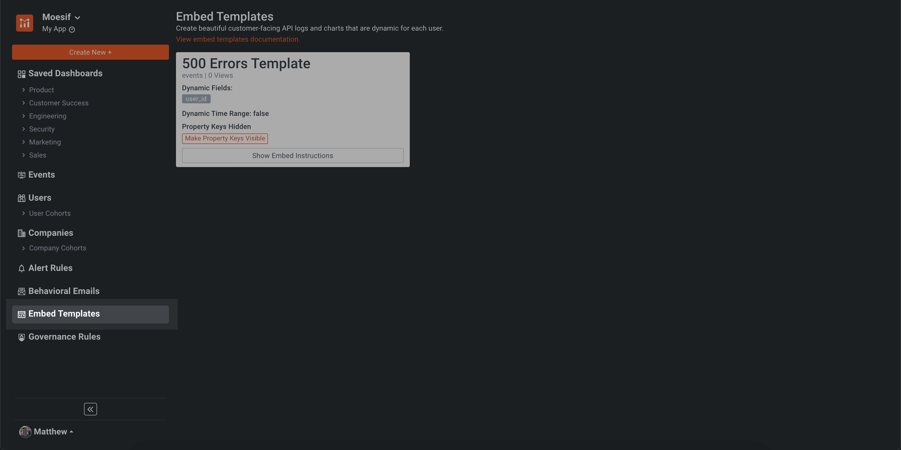

一旦创建了嵌入式模板，就可以通过**嵌入式模板**屏幕查看它们。

## 治理规则

> API 治理使您能够限制对 API 的访问，或者基于 API 的历史使用模式添加自定义头。适当的 API 治理为良好的 API 安全程序奠定了基础。例如，Moesif 的治理规则可以阻止恶意抓取您的 API 或访问异常大量项目的用户的访问。
> 
> 除了 API 安全性，您还可以利用治理来满足业务需求和连续性。例如，您可以创建一个规则来阻止具有过期发票的客户访问，或者在客户访问旧版本的 API 时添加折旧警告标题。

最后，**治理规则**现在也可以通过主导航轻松访问。以前，**治理规则**可以通过旧的**警报和治理**屏幕访问。现在，在新的左侧导航中，**治理规则**菜单项位于底部。

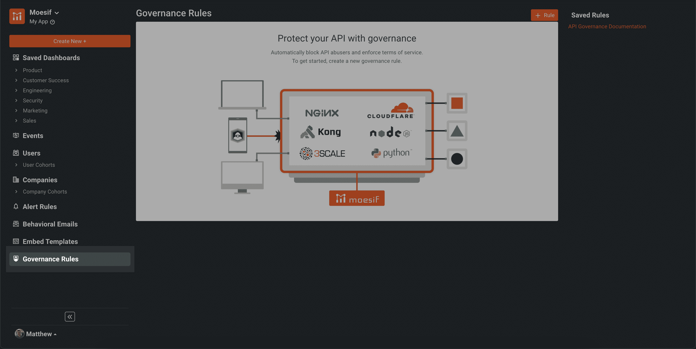

# 试试吧！

我们的最新更新现已上线，随时可以使用！只需登录 Moesif，体验我们对应用程序外观和感觉的最新改进。我们非常期待您亲自体验我们最新的 Moesif 版本！