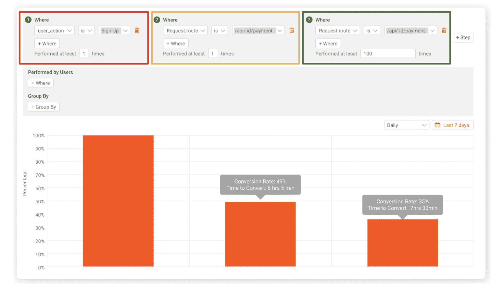
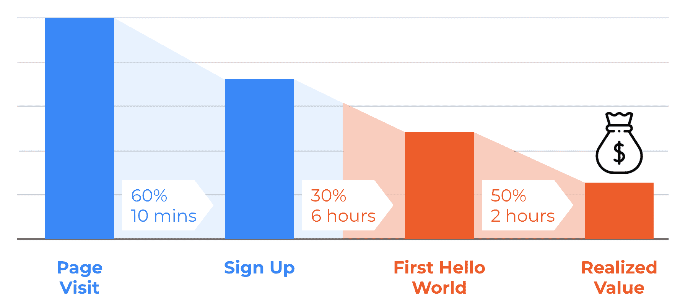

# 什么是 TTFHW？

> 原文：<https://www.moesif.com/blog/technical/api-product-management/What-is-TTFHW/>

TTFHW 不是你在技术和产品领域听到的最常见的缩写。尽管它并不常见，但可以说它是公司试图挖掘并向新用户提供价值的最重要的缩写之一。

TTFHW，或**第一次你好世界**的时间，可能是你已经想到的事情。许多产品导向的爱好者称之为顾客的“啊哈！”瞬间。这是客户第一次从你的平台获得价值的时候。许多编程语言和程序员工具称之为“Hello World”时刻。这是一个成败的里程碑，也是一个你显然希望每个客户都经历的里程碑。TTFHW 简单来说就是到达“啊哈！”瞬间。

## 什么是 Hello World？

“第一次你好世界的时间”这个术语来源于很多软件开发人员都知道的事情:第一次运行一个用新语言构建的程序(以及到达那里所需要的时间)。许多语言都有 Hello World 指南，许多开发人员通过将“Hello World”打印到控制台或屏幕上，用一种新的语言创建了他们的第一个程序。

没有这些时刻，编程语言和框架就不会给我们带来价值。一个 [Hello World 程序](https://www.helloworld.org/?utm_campaign=Int-site&utm_source=blog&utm_medium=body-cta&utm_term=ttfhw)往往是一个小而简单的程序，开发者用特定的编码语言编写。这个程序通常为他们将要编码的后续程序构成构件。

当把这个应用到产品上时，“你好，世界”或“啊哈！”时刻可能看起来有点不同。可能很简单，比如一个用户第一次调用一个 API，收到一个响应。一旦他们达到 Hello World 里程碑，他们就会继续玩和使用这个产品。最理想的结果是，他们有望成为付费客户。

在更复杂的流程中，Hello World 事件可能有多个步骤。例如，如果我们正在运行一个电子商务平台，我们的 Hello World moment 可能只有在用户注册、登录并成功完成第一次购买后才会发生。当然，其他应用和产品可能有无限复杂的 Hello World 时刻。

## 为你的产品定义 Hello World

你的产品的 Hello World moment 只能由你来定义。这是因为每个产品都是不同的。只有你能决定用户从你的平台或产品获得价值的第一瞬间。有几种方法可以描绘出你的 Hello World 时刻，我再举几个例子:

*   如果你已经创建了一种新的编程语言，这可能是用户编译他们的代码并运行他们的第一个程序的时候。
*   如果您已经创建了一个投资应用程序，这可能是用户第一次将资金存入帐户并进行第一笔交易的时刻。
*   如果你已经创建了一个 API 平台(特别是货币化的)，这可能是用户第一次调用 API 的时候，这时就要收费了。

你的应用程序很可能不属于这些类别，或者它确实属于。无论如何，您可能需要真正深入了解您认为的 Hello World 事件(或多个事件)。

如果你有一个多步骤的 Hello World，跟踪每一步是很重要的，因为你可以识别流程中的瓶颈。例如，如果您有一个 3 步流程，而第 1 步花费了用户 90%的时间来完成，这很可能也是您失去许多用户的地方。通过定义所有 3 个步骤，而不仅仅是最后一个，它给了我们一个真实的画面，我们的问题在哪里，哪里需要优化。

## 第一个你好世界的时间到了，为什么它很重要

为你的产品定义 Hello world moment 只是 TTFHW 等式的一小部分。最大的因素是到达那个点实际需要的时间。就需要多长时间而言，没有“一刀切”，但根据新产品的趋势和现代人对入职的态度，应该会很快。

顾客或用户到达 Hello World 时刻的时间越长，他们离开并完全放弃产品的可能性就越大。这意味着创造一个精益流程来实现第一个 Hello World 时刻至关重要。特别是对于多步骤流程，每个输入和点击都应该仔细管理。在“你好，世界时刻”到来之后能做的任何事情都应该推迟到那时。

通过跟踪第一个 Hello world 的时间，您可以开始收集关于哪些部分花费时间最长以及大多数用户在哪里下车的真实指标。您将能够看到趋势和阈值，例如当用户“花费超过 X 分钟来完成 Hello World 标准时，他们通常会放弃该产品”。这意味着您可以改进流程和跟踪，看看这些改进是否产生了影响。

除了简单地改进产品之外，还有第二种补救方法。这种方法可能包括当客户超过 TTFHW 的估计阈值时通知您的客户成功团队。更好的是，你可以在应用程序中通知他们进一步的资源，或者给他们发一封自动邮件，告诉他们如何更接近 Hello World 时刻。

降低你的 TTFHW 很重要，因为这能让顾客进门，让他们兴奋地使用产品。尽可能缩短用户获得价值的时间，这对用户和你的产品都是双赢的。当测量 TTFHW 时，优化用户体验是最容易衡量的。

## Moesif 中的 TTFHW 和用户漏斗

由于 Moesif 能够以高粒度跟踪用户指标，这使得它成为一个定义、跟踪和改进你的产品的伟大平台。

默认情况下，Moesif 在用户的配置文件中为 TTFHW 创建一个变量。这个高层次的 TTFHW 被计算为用户第一次被添加到 Moesif 时和他们第一次执行 API 调用时之间的差异。对于某些场景，这可能是准确确定产品 TTFHW 所需的所有复杂性。

对于更复杂的流程，我们的用户转向[用户漏斗](https://www.moesif.com/docs/user-analytics/conversion-funnel-analysis/?utm_campaign=Int-site&utm_source=blog&utm_medium=body-cta&utm_term=ttfhw)来创建多步漏斗，它跟踪 Hello World 旅程的每一步，并记录每一步之间花费的时间。正如您在上文中回忆的那样，这意味着我们可以确定哪些步骤在整个流程中花费的时间最长，而不是只关注单个事件。有了 Moesif，可以向用户漏斗添加无限数量的步骤。以下是 Moesif 中用户漏斗的一个示例:

这个用户漏斗反映了一个场景，其中有 3 个步骤来完成漏斗。第一步是用户注册时，第二步是用户第一次购买/支付时，最后一步是用户完成第 100 次购买/支付时。您还会注意到，您可以看到每个步骤的转换率以及每个步骤的转换时间。

一个额外的好处是，如果你的应用程序支持不同的配置文件和用户类型，一些产品可能会根据用户类型有不同的 Hello World 时刻。为此，可以为每个场景建立一个用户漏斗，以便准确地跟踪每个流量。

## 定义、跟踪和改进您的 TTFHW

使用 Moesif 来确定您的产品 TTFHW 并改进它很简单。Moesif 很容易与许多平台集成，包括最常见的 API 框架和 API 网关。一旦整合，您的指标可以很容易地用于确定上述所有因素。

从高层次开始，你可以很容易地定义你的用户漏斗中的一些关键步骤。从商业角度来看，进入第一个 Hello World 的结果是以后为用户带来实现的价值。下面是一个漏斗的例子，它跟踪用户对页面的初次访问，直到他们(和企业)获得实现的价值。您可以看到漏斗中每个步骤之间的平均时间以及每个步骤的转化率。

在 Moesif 中跟踪这些事件时，重要的是要记住 Moesid 可以在前端和后端跟踪事件。我们所说的[“Web 动作”](https://www.moesif.com/docs/client-integration/?utm_campaign=Int-site&utm_source=blog&utm_medium=body-cta&utm_term=ttfhw)被认为是前端事件。[“API/平台动作”](https://www.moesif.com/docs/server-integration/?utm_campaign=Int-site&utm_source=blog&utm_medium=body-cta&utm_term=ttfhw)是发生在应用后端的那些事件。您可能希望使用一种或两种类型的操作来定义您的用户漏斗。下面是一个示例，说明如何根据前面的示例拆分这些事件。

不管到达第一个“你好世界”或“啊哈！”有多复杂时刻，跟踪每一步都是吸引客户，留住客户的重要一环。TTFHW 是计算交付该价值需要多长时间。普遍的共识是 TTFHW 越快，你获得新客户的机会就越大。这是因为价值是提前交付的，确保更多的客户到达那个时刻，而不是放弃你的产品。

想走上快车道吗？只需[注册 Moesif](https://www.moesif.com/signup?utm_campaign=Int-site&utm_source=blog&utm_medium=body-cta&utm_term=ttfhw) 并查看我们的指南，了解[如何在几分钟内建立用户渠道](https://www.moesif.com/docs/guides/guide-on-creating-user-funnels-in-moesif/?utm_campaign=Int-site&utm_source=blog&utm_medium=body-cta&utm_term=ttfhw)来跟踪你的 TTFHW。