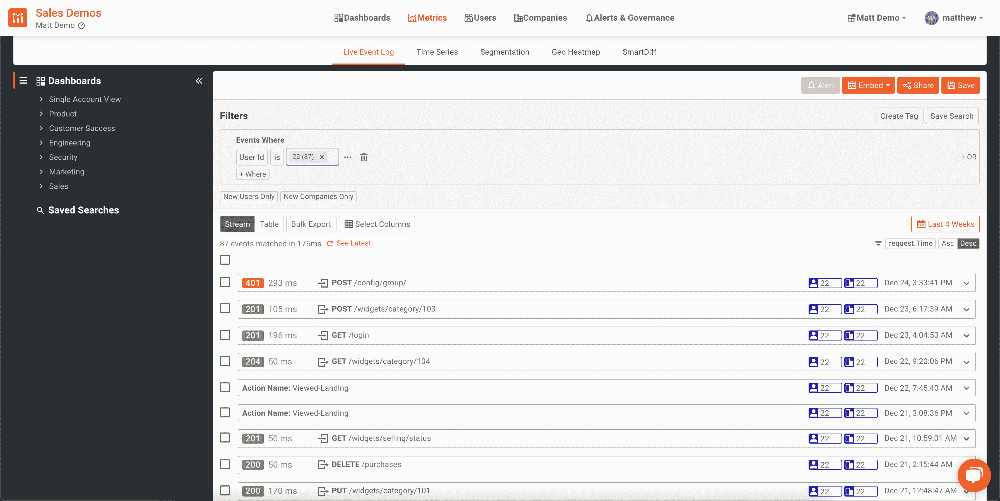
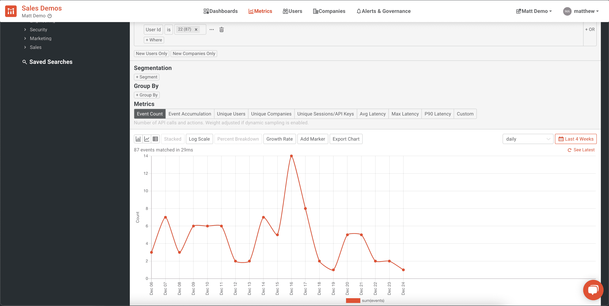
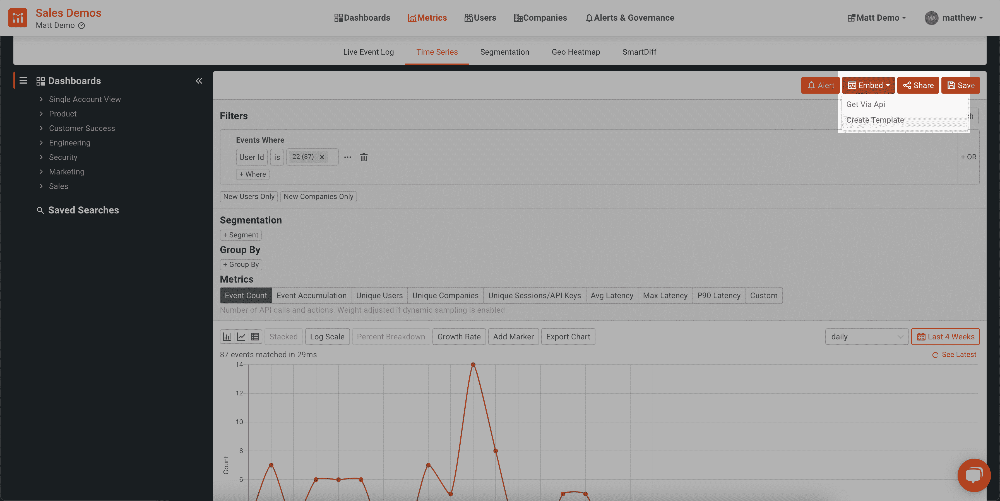
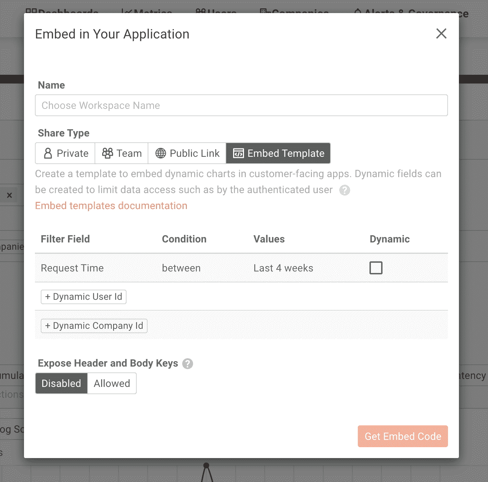
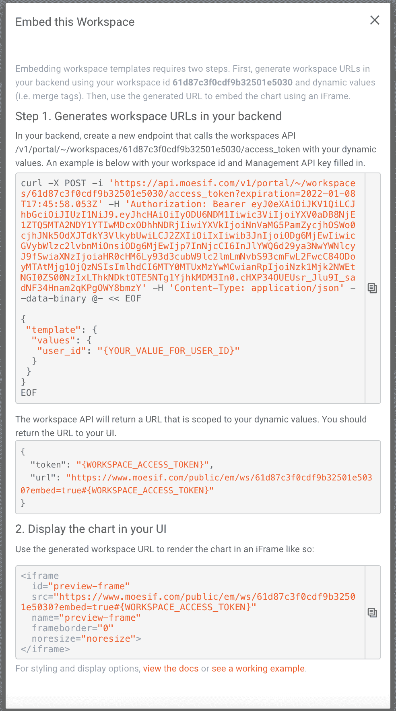
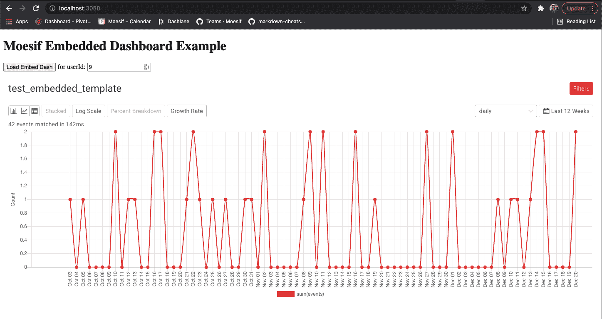
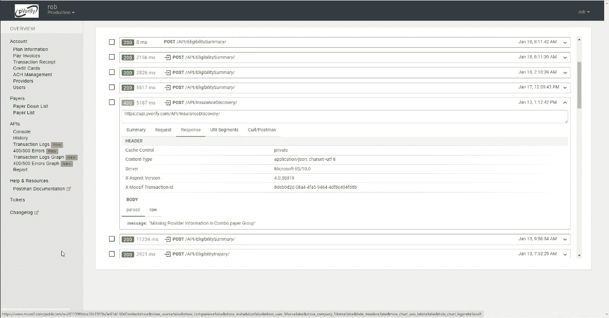
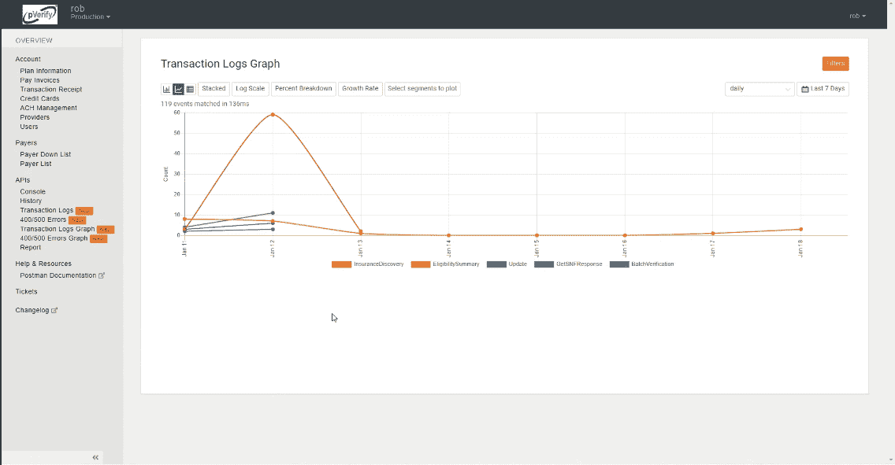
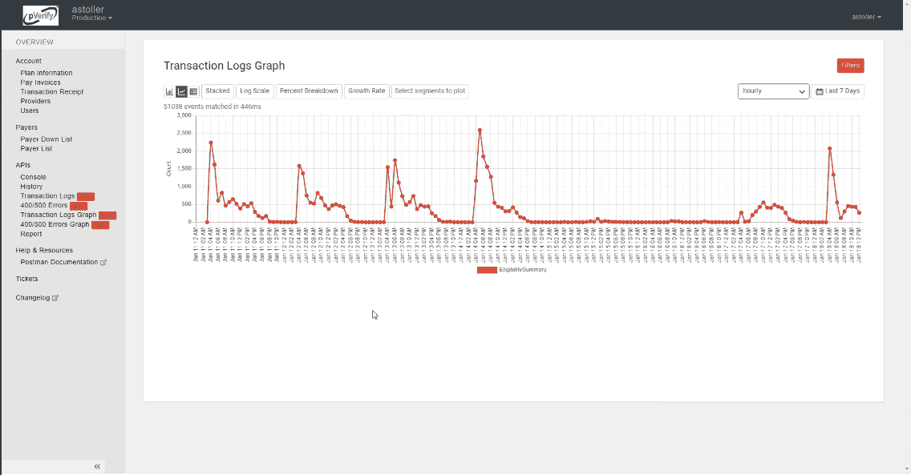

# 构建自己的应用内图表？请改用 Moesif 嵌入式模板！

> 原文：<https://www.moesif.com/blog/technical/api-analytics/Building-your-own-in-app-charts-Use-Moesif-Embedded-Templates-instead/>

某些产品可以从实时图表中获益。无论是内部的还是外部的应用程序，当它们被很好地显示时，度量标准真正地变得生动起来。

在过去，要显示这样的图形，您需要实现自己的图表工具，将数据或指标映射到工具中，然后维护这个实现。总的来说，这是一种在应用程序中可视化显示数据的非常低效和麻烦的方式。

有了 [Moesif](https://www.moesif.com/?utm_campaign=Int-site&utm_source=blog&utm_medium=body-cta&utm_term=appcharts) ，添加令人惊叹的可视化效果来显示数据变得简单且无需维护。您在 Moesif 中发现的所有有用的图表都可以很容易地导出并嵌入到您的应用程序中。在 Moesif 中有几种方法可以做到这一点，包括使用嵌入式模板或公共链接在应用程序中显示图表。

让我们探索一下使用嵌入式模板的好处，它们是如何工作的，以及 Moesif 用户利用这一特性的一些真实例子。

# 为什么要使用嵌入式模板？

许多应用程序都可以从关键指标的可视化中受益。几个例子可以说明:

*   应用流量的历史视图
*   新用户注册
*   您的应用程序中遇到的错误
*   实时显示现场活动

并非所有用户都能访问贵组织的 Moesif 平台，但这并不意味着他们不能访问某些关键图表。嵌入式模板是向用户显示相关数据的好方法，允许他们定制他们的体验和可视化，即使用户不能直接访问 Moesif。

嵌入式模板使用户能够将动态图表添加到他们的应用程序中，而不需要实际编码它们。这种方法节省了时间、支持和精力，同时仍然具有自定义解决方案的所有优势，可以在应用程序和应用程序内图表中显示相关数据。

# 可以显示哪些类型的数据和图表？

根据您需要显示的数据，在 Moesif 中有两种方法可以做到这一点。您可以利用[公共链接或嵌入模板](https://www.moesif.com/docs/api-dashboards/embed-templates/?utm_campaign=Int-site&utm_source=blog&utm_medium=body-cta&utm_term=appcharts#public-links-vs-embed-templates)来显示数据。

公共链接是 Moesif 中数据的静态视图。您可以在 Moesif 中设置过滤标准，并导出相应的图表。查看者无法更改标准或向图表输出动态添加变量。这是向经过身份验证和未经身份验证的用户显示特定静态数据集的最佳方式。

嵌入式模板类似于公共链接，但允许使用动态参数来检索和显示数据。根据特定用户 ID、日期范围或其他动态提供给图表呈现的标准进行过滤。这种方法对于经过身份验证的用户更可行。可以根据向查询发送什么参数来过滤或定制数据，并可以呈现相应的图表

在这篇文章中，我们将只关注嵌入式模板。关于公共链接的更多信息，请查看我们的[文档](https://www.moesif.com/docs/api-dashboards/embed-templates/?utm_campaign=Int-site&utm_source=blog&utm_medium=body-cta&utm_term=appcharts#public-links-vs-embed-templates)。

# 它是如何工作的？

让嵌入式模板在您的应用程序中工作非常简单。它要求您能够访问 Moesif，拥有 API 服务器，并且能够向前端代码添加 iframe 元素。

让我们进一步分解每一步:

### 创建图表和/或过滤器

第一步是在 Moesif 中实际呈现一个图表。为此，您可以转到 Metrics 屏幕，添加您的过滤器，然后在屏幕上看到可视化效果。在这个例子中，我在一个[实时事件日志](https://www.moesif.com/docs/api-analytics/event-stream/?utm_campaign=Int-site&utm_source=blog&utm_medium=body-cta&utm_term=appcharts)中显示了特定用户 ID 的所有事件。

你也可以在[时序图](https://www.moesif.com/docs/api-analytics/time-series-analysis/?utm_campaign=Int-site&utm_source=blog&utm_medium=body-cta&utm_term=appcharts)中查看相同的数据，这样我可以更容易地看到一段时间内的趋势。

至此，您已经建立了自己的过滤器，在 Moesif 中呈现了一个图表，并且可以实际生成您的嵌入模板了。

### 创建模板

创建要在 UI 中呈现的模板只需几次点击。在指标屏幕中，您可以单击“嵌入”，并在下拉列表中单击“创建模板”。

下一个屏幕将询问一些细节，包括工作区名称(实际上是您的模板名称)、您的共享类型(公共链接、嵌入式模板等)，以及一个用于选择您想要动态提供给模板的字段的区域。

一旦你这样做了，模板就创建好了，你会看到一些关于如何将图表添加到你的 UI 中的说明。

### 向 API 服务器添加端点

一旦在 Moesif 中创建了模板，就应该在 API 服务器上创建一个端点来获取数据并将其返回给 UI。返回的数据将包含您在 iframe 中实际呈现图表所需的一切，您将在前端代码中嵌入 iframe。

### 在 UI 中嵌入 iframe

最后，您需要在 UI 代码中添加一个 iframe 元素。您的代码将调用新的 API 端点，并将这些数据返回给 iframe 进行呈现。一旦从 Moesif(通过您的 API)返回了图表数据，您就可以在 UI 中很好地呈现图表了。

> 如果你想看这些步骤的更详细的演练，请查看我们关于[嵌入式模板](https://www.moesif.com/docs/guides/guide-on-creating-and-using-embedded-templates-in-moesif/?utm_campaign=Int-site&utm_source=blog&utm_medium=body-cta&utm_term=appcharts)的指南。

# 现实世界的例子

许多 Moesif 客户依赖嵌入式模板为他们提供一种向用户显示重要指标的简单方法。这为他们节省了时间，并使得在他们的应用程序中呈现实时图表变得简单且易于维护。

[pVerify](https://www.pverify.com/?utm_campaign=Int-site&utm_source=blog&utm_medium=body-cta&utm_term=appcharts) ，一款实时保险资格验证软件，使用嵌入式模板帮助客户查看 API 活动和趋势。他们没有创建自己的图表和分析解决方案，而是决定使用 Moesif 轻松地向用户显示所需的信息。

pVerify 还利用 Moesif 中可用的加密来确保在使用嵌入式模板时，它们仍然符合[HIPAA](https://digitalguardian.com/blog/what-hipaa-compliance?utm_campaign=Int-site&utm_source=blog&utm_medium=body-cta&utm_term=appcharts)。这是解决方案的重要部分，因为 pVerify 处理高度机密的医疗保健信息。

pVerify 有几个例子说明他们如何使用嵌入式模板来帮助客户监控和观察他们的 API 使用情况。这包括使用 Moesif 的实时事件日志显示。

他们还使用时间序列图表来更好地显示趋势。

通过允许用户以不同的方式过滤和查看数据，用户可以轻松地查看趋势，还可以深入到各个电话中进行更详细的探索。

使用嵌入式模板使得 pVerify 只需很少的开发就可以轻松地将图表添加到应用程序中。允许他们的用户安全地进入 [API 分析](https://www.moesif.com/docs/getting-started/overview/?utm_campaign=Int-site&utm_source=blog&utm_medium=body-cta&utm_term=appcharts)，这一切都由 Moesif 实现。

# 自己试试吧！

如果您已经在使用 Moesif，那么入门非常简单。所有 Moesif 用户都可以使用嵌入式模板，并且可以轻松添加到您现有的应用程序中。对于新用户，只需[注册一个账户](https://www.moesif.com/signup?utm_campaign=Int-site&utm_source=blog&utm_medium=body-cta&utm_term=appcharts)，[集成你的 API](https://www.moesif.com/docs/server-integration/?utm_campaign=Int-site&utm_source=blog&utm_medium=body-cta&utm_term=appcharts)，并开始使用嵌入式模板在你的应用程序中显示你最喜欢的图表。