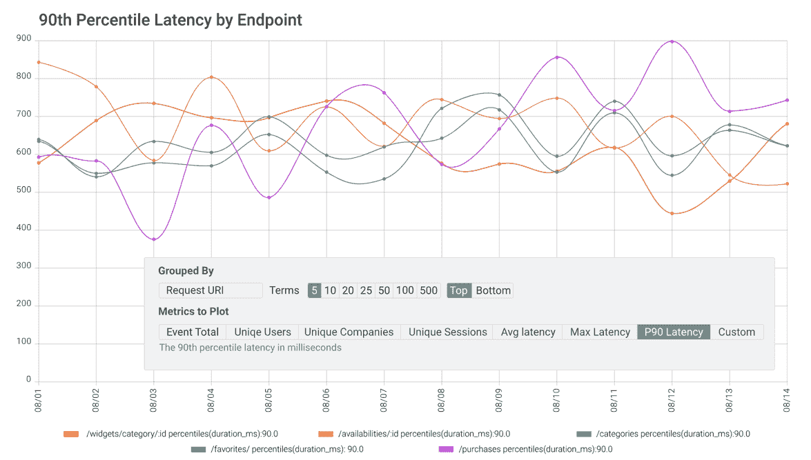

# API 的虚荣心指标与跟踪 API 交易的商业价值

> 原文：<https://www.moesif.com/blog/api-product-management/api-metrics/Vanity-Metrics-for-APIs-vs-Tracking-Business-Value-From-API-Transactions/>

作为一名 API 产品经理，您希望您的 API 拥有出色的开发人员体验。这意味着开发人员可以快速启动并运行，他们可以从您的 API 获得一致的行为，他们可以很容易地解决他们遇到的任何错误，您的 API 可以让他们轻松地解决他们的业务需求。

跟踪您的 API 是了解它们性能的一个重要部分，这导致大多数组织建立他们自己的内部 API 跟踪系统。虽然这种方法对一些组织有效，但对组织来说，错误地跟踪度量标准更为常见。跟踪错误的指标会导致对 API 的错误理解。

在这篇博文中，我们将探讨一些公司在开始定义和收集开发人员如何使用 API 的数据时面临的常见陷阱，以及您和您的团队如何关注真实的、可操作的指标，而不仅仅是虚荣的指标。

## 为什么内部 API 分析工具没有击中目标

一些组织更喜欢构建自己的 [API 分析工具](https://www.moesif.com/features/api-analytics?utm_campaign=Int-site&utm_source=blog&utm_medium=hyperlink&utm_term=Vanity-Metrics-for-APIs-vs-Tracking-Business-Value-From-API-Transactions)，并在内部跟踪指标。当组织为 API 指标构建自主开发的分析工具时，他们会遇到某些导致不准确指标的陷阱:

*   为 API 重建网站分析
*   构建产品和构建分析工具之间的权衡
*   报告看起来最成功的指标的压力
*   未能恰当地衡量 API 事务

对于产品团队来说，将他们用于网站分析的工具重新用于 API 分析是很常见的。这种方法通常将 API 调用视为等同于站点视图，将流行端点视为流行页面的类似指标，并且没有分析开发人员体验的方法。

例如，传统的 web 分析将导致在端点或呼叫量级别的报告，而这很少是重要的。有时，响应中更详细的信息会讲述一个更好的故事。或者，聚合额外的请求和响应元数据可能比使用单个 API 端点更重要。

当你试图让你的 API 适应现有的分析工具时，你可能会误解结果。例如，一个组织可能会错误地认为他们收到了许多 API 调用，因为他们的 API 很受欢迎。真实的情况可能是，访问它的开发人员经常遇到错误，或者当开发人员可能与您的端点进行更少但更长的对话时，某些端点不受欢迎。如果你的内部开发团队没有构建 API 度量工具的经验，他们可能不是构建 API 分析软件的合适团队。

除非你有无限的工程资源，否则当构建 API 分析工具的问题在内部出现时，它总是意味着将开发人员从开发你的业务所关注的产品转移到 API 分析工具上。我们已经讨论过，如果您的开发团队没有构建 API 分析工具的经验，这是多么不理想，还有一个额外的缺点是，由于开发人员专注于其他项目，所以花在构建您的产品上的时间更少。您的开发人员也很可能更喜欢关注您的产品，而不是构建分析工具。构建内部分析工具给开发团队带来了不同类型的压力。

## 不要相信虚荣的衡量标准

当内部团队不得不构建 API 分析工具时，他们也经常承受着为 API 报告良好指标的压力。没有人想成为坏消息的传递者，许多组织会要求他们的内部指标团队提供好的指标报告，以激励他们的同事，向投资者验证他们的成功，并出于营销目的共享数据。这是导致高技能开发团队报告虚荣度量的原因。他们面临着非故意的，但迅速增加的压力，要报告看起来不错的指标，这导致他们关注看起来令人印象深刻但没有反映他们的 API 实际上有多成功的指标。

尽管分享一个无意义的曲棍球棒图可能很诱人，但随着时间的推移，有比 API 请求更有用的指标，除非您可以将调用直接与收入联系起来。相反，考虑 API 的整体健康和成功，例如延迟的改善如何影响开发人员的体验。

许多组织定义了错误的成功度量标准，这使得他们对他们的 API 如何成功地实现他们的目标产生了错误的想法。虚荣心指标很容易创建，在为开发人员构建的产品中尤其常见。为开发人员构建的产品和服务通常关注开发所花费的时间，或者首次用户的数量和提供的 API 密钥。像这样的指标不能告诉你任何关于你的 API 的开发者体验，你的 API 为开发者创造了多少价值，或者你的 API 与你公司的更广泛的目标有多一致。

## 将 API 事务与业务价值联系起来

既然我们已经讨论了内部 API 分析工具的挑战以及它们如何导致虚荣心指标，那么让我们来看看应该关注哪些指标，以便您可以了解您的 API 的性能以及它在多大程度上实现了您的业务目标。让我们先来看看 API 用户的开发体验。

你的 API 的开发者体验从他们注册使用它开始。你应该[跟踪每个开发者的旅程](https://www.moesif.com/blog/api-product-management/developer-journey/Tracking-a-Developer%27s-Journey-From-Visiting-Documentation-Visit-to-First-API-Call/?utm_campaign=Int-site&utm_source=blog&utm_medium=hyperlink&utm_term=Vanity-Metrics-for-APIs-vs-Tracking-Business-Value-From-API-Transactions)，从他们最初的注册开始，到他们生成的第一个 API 密匙，接着是他们的第一个 API 调用和他们最早的 API 事务的长度和内容。这些数据为您提供了许多关于 API 开发人员体验的信息，包括:

*   开发人员开始使用您的 API 是多么容易
*   他们将它集成到项目中的速度有多快
*   乍一看，什么端点最有用
*   开发人员最容易遇到错误的地方
*   哪些开发人员需要支持

当开发人员在使用您的 API 时遇到错误时，通过提供快速支持，这些信息使您可以轻松地进一步开发您的 API 并改善您的开发人员体验。您还可以看到特定渠道的用户是否更有可能达到相关的 API 使用水平。

从中期来看，这可以让你跟踪你的 API 如何留住开发者，这是理解你的 API 提供了多少价值的重要部分。您还将了解哪些端点的事务数量最多，典型的事务持续多长时间，这表明您的资源应该集中在哪里。

您跟踪的 API 指标应该包括唯一的标识符，以便更容易地跟踪单个客户的使用数据。这使得理解您的 API 性能变得容易，并使您的客户支持变得快如闪电。客户使用是跟踪业务价值的一个重要指标，持续跟踪 API 事务非常重要，这样您的组织才能清楚地了解您的 API 满足客户需求的程度。

您的客户还对他们随时间推移的使用情况感兴趣。您应该向每个客户提供他们的使用信息，以便他们了解何时接近使用配额，这样他们就不会意外达到配额限制。他们可能还想知道在访问您的 API 时他们通常使用多少网络资源，这使得他们能够轻松地分配足够的资源来访问您的 API。他们最常使用或用于传输最多数据的终端对于您的客户来说也是重要的指标，因为这些信息会告诉他们哪些终端为他们提供了最大的业务价值。这有助于获得良好的客户体验，使他们更有可能使用您的 API。

你需要长期考虑的 API 分析的一个重要方面是如何扩展你的分析。随着客户的增长，API 调用的数量会增长，API 调用的长度和内容也会增长。虽然准确执行 API 分析已经非常具有挑战性，但久而久之变得更加困难，API 事务的数量也在增长。您的 API 分析实现需要准确地跟踪业务价值，并应对 API 的增长。

靠自己很难构建精确的 API 分析工具。即使是经验丰富的团队也需要大量资源来衡量他们的第一次分析，并且您需要不断地开发您的指标来为您的组织获得更详细的信息。但是，这不是放弃的理由。出色的 API 指标将为您的业务带来巨大的价值，它们使您的产品和支持团队更容易改善您的客户体验，并且您的指标会告诉您应该关注 API 的哪些方面。

## 跟踪 API 事务有效吗？

到目前为止，我们已经讨论了组织在分析 API 时最容易陷入的陷阱，它们发生的原因，以及您应该关注的度量标准。现在，我们将针对不同的用例，直接比较常见的虚荣心指标和 API 事务指标。

API 采用是一个对许多组织都很有价值的指标，因此正确地衡量它是很重要的。流行的方法是查看为一个 API 提供的 API 键的数量。这表明 API 很受欢迎，很多开发人员发现它很有用，但是依赖这个标准是危险的。它只是告诉你，很多开发者考虑过使用你的 API。这不会告诉你他们是否成功地实现了他们的第一个 API 调用，他们到达了入职旅程的哪个阶段，或者他们遇到了多少错误。另一方面，如果您使用唯一标识符来查看您保留用户的情况，并跟踪从创建一个 API 键到“Hello World！”需要多长时间您将知道是否需要改进您的入职、文档和支持。

许多组织已经成功地从内部构建自己的 API 分析工具过渡到 Moesif 的 API 分析工具。Symbl.ai 是一家数据驱动型公司面临着在专注于产品开发和构建内部 API 分析之间进行权衡的绝佳例子。Moesif 提供深度 API 分析，允许 symbl . ai[完全理解客户如何与他们的 API](https://www.moesif.com/casestudies/symblAi-refines-product-strategy-and-enhances-developer-experience-with-moesif?utm_campaign=Int-site&utm_source=blog&utm_medium=hyperlink&utm_term=Vanity-Metrics-for-APIs-vs-Tracking-Business-Value-From-API-Transactions) 交互。

理解您的 API 可能具有挑战性，但使用正确的分析工具，您可以为客户实现最大价值，并跟踪您成功实现组织目标的情况。使用 [Moesif API Analytics](https://www.moesif.com/?utm_campaign=Int-site&utm_source=blog&utm_medium=hyperlink&utm_term=Vanity-Metrics-for-APIs-vs-Tracking-Business-Value-From-API-Transactions) 您的组织可以构建出色的 API。