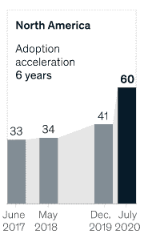
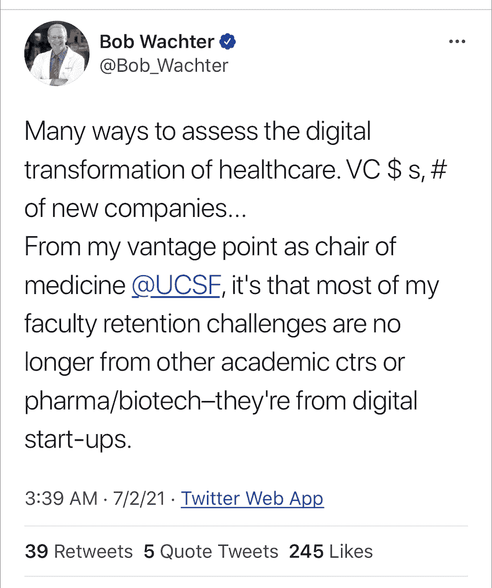
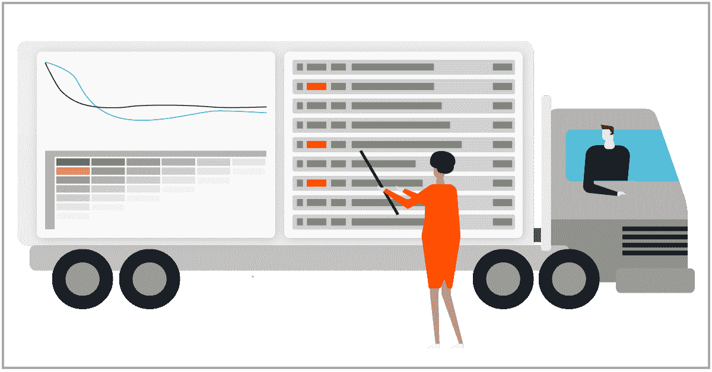
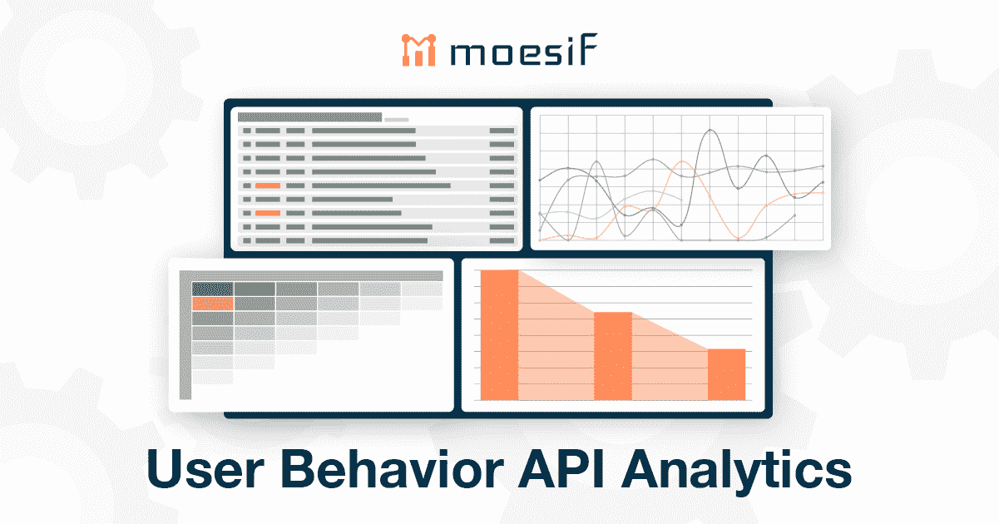

# API 现在处于数字化转型的中心

> 原文：<https://www.moesif.com/blog/business/api-observability/APIs-are-Now-at-the-Center-of-Digital-Transformation/>

当我们评估新冠肺炎如何影响我们的经营方式时，没有什么比向数字技术的转变更明显的了。尽管我们中的许多人已经从水冷却器健谈者转变为不情愿的 zoom 居住者，但对业务流程本身的影响实际上可能更深远。

据麦肯锡称，冠状病毒对提供数字产品和服务的公司起到了催化剂的作用。在所有业务领域，数字化的采用已经加速到相当于快进 6 年的程度，因此我们现在正在 2027 年运营，美国 60%的企业采用数字化流程。

<figcaption>
McKinsey: How coronavirus has transformed business forever</figcaption>

企业在采用简化、自动化和现代化现有系统的数字流程时所经历的演变被称为[数字转型](https://en.wikipedia.org/wiki/Digital_transformation#In_society)。通过为客户、合作伙伴和员工创造数字化体验，企业可以通过提高客户参与度、降低运营成本和开拓新的市场&机会来获得巨大的投资回报。

在疫情期间，旧金山最有发言权的人之一是该市主要教学医院——加州大学旧金山分校(UCSF)的内科主任。[鲍勃·沃希特博士](https://profiles.ucsf.edu/robert.wachter)管理着一个 3000 人的组织，其中包括 800 名医生，他站在疫情当地应对措施和向数字化转变的第一线，因为他的医院和许多其他医院一样，专注于新冠肺炎的面对面治疗，并将其他大部分工作外包给远程医疗。随着疫情的衰落，沃希特注意到向数字化的转移变得更加持久，在很多方面超出了人们的想象:

<figcaption>
Perspective on Digital Transformation after COVID-19 from UCSF Chair of Medicine</figcaption>

在冠状病毒所代表的地震转变中最成功的公司是那些已经接受数字化转型并将其业务战略集中在 API、应用和数据分析上的公司。通过明智的规划和设计，他们成功地简化了工程开发，提供了卓越的客户体验，并提供了与合作伙伴低摩擦的集成方式。

## API 加速开发

传统上，数字化转型需要时间来实施。现有系统的现代化就是通过尝试、学习和前进来建立技能和信心——类似于游戏中每一步的升级。

但是疫情已经强制规定了“一切照旧”和“T2 变革”的明确优先顺序。组织不得不应对变化，为新的优先事项提供资金，并快速建立能力。

使用基于微服务的应用在云中运行，敏捷团队能够构建更小的功能组件，并通过 API 将它们连接在一起。此外，由特定领域专家创建的第三方服务可以通过 API 集成到应用程序中，从而解放企业的开发团队，让他们转而开发更多增值功能。

<figcaption>
Symbl.ai uses services from Moesif to refine product strategy and enhance DevEx</figcaption>

像许多工程资源有限的公司一样，当 Symbl.ai 面临在其报告仪表板中构建新功能或添加客户要求的新产品功能的选择时，他们会优先考虑产品路线。尽管报告和仪表板对于产品驱动的公司来说是次要的，但它仍然是至关重要的。

Symbl.ai 能够轻松地将 Moesif 的分析和仪表板功能添加到他们的产品中，从而加快了上市时间:

> > Surbhi Rathore, CEO and co-founder of Symbl.ai, said: "When you are a small company, it is difficult to concentrate 20% of the continuous engineering work on building a dashboard for yourself

## API 显示应用程序的解锁版本

API 使对组织提供的能力的访问民主化。无论你是在寻找一个[运输服务](https://www.moesif.com/blog/ebooks/shipengine-accelerates-developer-adoption-with-moesif-api-analytics-platform/)来帮助管理你的包裹，还是寻找[地理围栏功能](https://www.moesif.com/blog/ebooks/radar-accelerates-the-launch-of-their-developer-first-platform-with-Moesif/)来获得位置感知体验，都有一个 API 可以满足你。

<figcaption>
Shipengine speeds developer adoption with Moesif</figcaption>

API 变得越来越容易使用。越来越多的人参与到对话中来，因为 web APIs 或 RESTful APIs 的技术性要低得多——它们最简单的形式只是一个带有一堆查询参数的 URL，几乎任何人都可以使用。

## API 支持一致的用户体验

客户期望的变化日益推动着数字化转型。现在，人们更喜欢持续的 360 度客户体验，包括电脑、电话和实物资产。

API 不仅隐藏了后端的复杂性，而且通过设计，它们还支持单一和一致的用户界面。即使您的企业产品可能使用通过 API 交付的[10 到 100](https://www.moesif.com/blog/podcasts/developer-marketing/Podcast-Launching-API-Programs-in-Non-API-First-Companies/#biz-reasons-for-external-apis)个内部和外部服务，您仍然可以完全控制前端以及您的客户如何体验您的产品并与之交互。API 避免了水平分割问题，即使在使用多个服务时，也没有单一的参考点。

## 分析性能的最佳地方是 API

API 为组成应用程序的服务提供了自然的分界点。对于收集分析数据来说，没有比数据进出服务更好的地方了。

<figcaption>
Moesif's Advanced API Analytics drives growth</figcaption>

为了确保你的用户从你的产品中获得最大收益，Moesif 提供了关于客户如何使用你的 API 的深刻见解。我们构建了一个高级的 [API 分析平台](https://www.moesif.com/features/api-analytics)，帮助 API 驱动型组织中的每个人从他们的 API 数据中学习，并做出更明智的决策来推动增长。

成千上万的客户驱动团队使用 Moesif 来真正了解他们的客户和合作伙伴如何使用他们的 API，并自动调试客户问题。

## 摘要

新冠肺炎推动许多公司跨越了数字鸿沟。一些组织在疫情之前就已经经历了数字化转型的阵痛，而另一些组织尚未开始。但是，作为一个生存问题，大多数美国企业在过去的 18 个月里已经转向了数字化。

API 曾经是系统间变化的代理，但现在它们真正驱动着业务关键用例。尽管我们可能还没有意识到这一点，但我们已经进入了 API 的黄金时代。

> > "API is everywhere. They are under everything we touch in our personal and business life, "said Kin Lane, an API preacher.