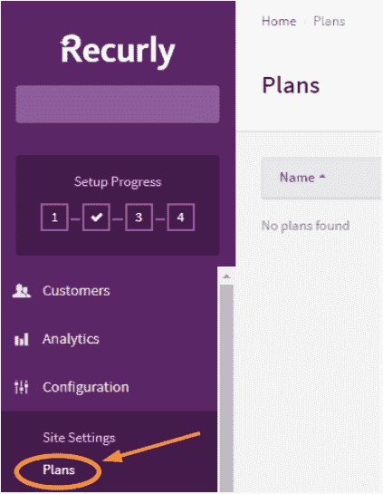
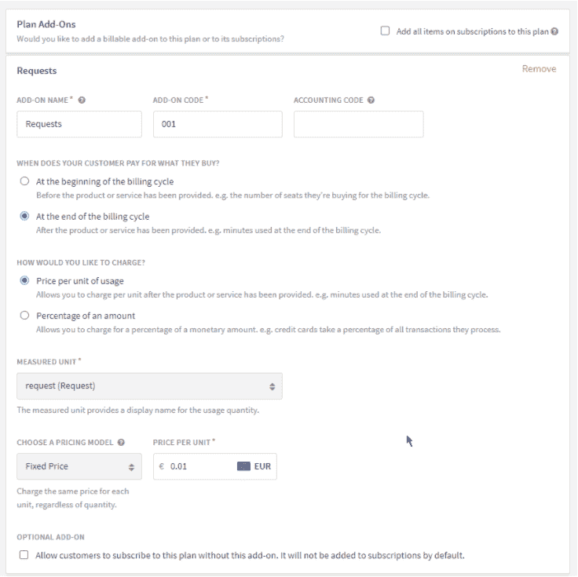

# Moesif 和 Recurly 基于使用的 API 定价

> 原文：<https://www.moesif.com/blog/developer-platforms/recurly/Usage-Based-API-Pricing-With-Moesif-And-Recurly/>

过去，购买或租赁服务器并一次性付款是很正常的，与利用率无关。随着无服务器计算的兴起，构建 API 的基础设施变得更加便宜，按需定价成为常态。既然你只为你使用的东西付费，为什么不把基于使用的定价作为一个特性包含在你自己的 SaaS 产品中呢？

通过基于使用的定价，您的客户不会被高昂的前期成本吓倒，相反，他们的成本会随着业务的增长而增长。Recurly 是一种订阅管理服务，允许您根据客户的 API 使用情况向他们收费。

本指南假设你已经熟悉 [Moesif 的计量 API 计费](https://www.moesif.com/solutions/metered-api-billing)和 [Recurly 的订阅管理](https://docs.recurly.com/docs/usage-based-billing)。我们还建议[阅读一份正确实施现收现付定价的行动手册](/blog/developer-platforms/self-service/A-Playbook-To-Properly-Implement-Pay-As-You-Go-Pricing/)，以熟悉不同的计费模式。

本文解释了如何在 Node.js 快速安装中使用 Recurly 设置基于使用的定价，API 使用数据来自 Moesif。

## 解决方案的工作原理

为了正确实施基于使用的计费，除了标准订阅管理之外，您还需要一些组件:

*   计量每个客户的平台使用情况，并根据使用情况开具发票
*   当客户接近或超过配额或阈值时，向他们发送自动提醒
*   为客户提供一个仪表板，以检查他们的订阅使用情况

## 先决条件

你需要一个 Moesif [账户](https://www.moesif.com/wrap?onboard=true&utm_source=recurlyblog)和一个递归[账户](https://app.recurly.com/signup)。你还需要安装 [Node.js](https://nodejs.org/en/download/) 。

## 设置 Moesif

第一步是将 API 请求与您的客户 id 关联起来。这是 Moesif 设置中的一个基本步骤，稍后需要它来告诉 Recurly 客户需要支付什么。

```py
// 1\. Import Modules
const express = require('express');
const app = express();
const moesif = require('moesif-nodejs');

// 2\. Set the options, the only required field is applicationId
const moesifMiddleware = moesif({
  applicationId: 'Your Moesif Application Id',

  // Optional hook to link API calls to users
  identifyUser: function (req, res) {
    return req.user ? req.user.id : undefined;
  },
});

// 3\. Enable the Moesif middleware to start logging incoming API Calls
app.use(moesifMiddleware); 
```

您还必须用一个从请求上下文中提取用户的函数来替换`identifyUser`。在本例中，id 由 Node.js 身份验证中间件设置。如果您在公司级别进行认证，您可以选择实现`identifyCompany`函数。有了这个设置，你所有的 API 请求都会被记录到 Moesif API Analytics 中。下一步是递归设置。

## 递归设置

Recurly 有计划和客户帐户，客户可以订阅多个计划。在本例中，我们将为基于使用的定价创建一个简单的计划，客户只能订阅一个计划。

要在 Recurly 中创建基于使用情况的计划，请创建计划，然后选择基于使用情况的附加组件。您可以设定一个基本价格，然后根据客户的需求提高价格。为了简单起见，我们将创建一个免费计划，在本例中只收取每次使用的费用。

图 1 显示了在哪里可以找到递归计划的配置。



点击右上角的“新计划”，然后创建一个名为“基于使用”的新计划，计划代码为“001”。每个计费周期的价格将保持为零。

在“计划加载项”下，创建新的加载项。此加载项需要名称和代码。它应该在计费周期结束时计费，因为我们事先不知道客户将使用什么。接下来，创建一个名为“requests”的新“度量单位”,并将其设置为固定价格 0.01 美元。这样，每个请求都要花一分钱。附加组件不应该是可选的。

您的计划创建表单应该如下所示:



## 连接 Moesif 和 Recurly

现在我们在 Recurly 中有了一个基于使用的计划，客户可以订阅它。我们需要递归地将订阅 id 链接到 Moesif 中的客户 ID。

Recurly 在他们的文档中明确声明，不应该使用 webhooks 来创建帐户，而应该使用 API 客户端的返回值。这意味着递归订阅创建和 Moesif 公司和用户创建必须一次完成。

先说反曲部分。在注册的 Express API 端点中，您必须使用以下两个递归 API 调用。

```py
 let account;
  try {
    account = await recurlyClient.createAccount({
      code: getNewCustomerId(),
      firstName: request.body.firstName,
      lastName: request.body.lastName,
      address: request.body.address,
    });
  } catch (error) {
    console.log(error);
    return response.end();
  }

  let subscription;
  try {
    subscription = await recurlyClient.createSubscription({
      account,
      addOns: [{ code: "001" }],
      currency: "USD",
      planCode: "001",
    });
  } catch (error) {
    console.log(error);
    return response.end();
  } 
```

第一个将为您的用户创建一个 Recruly 帐户，第二个将开始订阅。您需要自己创建一个唯一的帐户代码。最简单的方法是首先在您自己的认证系统中注册一个客户，并使用您生成的 ID。

第二个递归 API 调用将为递归帐户订阅计划。计划的代码及其附加代码是我们之前创建计划时使用的代码。

如果一切顺利，您应该最终得到两个对象，`account`和`subscription`。我们将在下一步中使用这些来将他们与 Moesif 内部的公司和用户联系起来。

```py
const moesifCompany = {
  company_id: subscription.uuid,
  metadata: subscription,
};

const moesifUser = {
  user_id: account.account_code,
  company_id: moesifCompany.company_id,
  email: account.email,
  first_name: account.first_name,
  last_name: account.last_name,
  metadata: { ...account },
};

moesifapi.ApiController.updateCompany(
  moesifCompany, (error) => {
  if (error) console.log(error);
};

moesifapi.ApiController.updateUser(moesifUser, (error) => {
  if (error) console.log(error);
}; 
```

为了从一个递归`subscription`中创建一个 Moesif 公司，我们必须创建一个带有`company_id`的新对象；为此，我们将使用新创建的`subscription`的`uuid`,并将剩余的订阅数据放入`moesifCompany`对象的`metadata`。

接下来，我们使用`moesifapi`库，它将与`moesif-nodejs`一起安装。`updateCompany`功能将在 Moesif 服务中创建新的公司记录。因为我们使用了订阅的 uuid，所以这两者现在是链接在一起的。

最后一步是创建一个 Moesif 用户。虽然它不是公司级别的计费所必需的，但如果我们想知道谁为公司发出了哪个请求，它将会有所帮助。

## 将 API 用法发送到递归

### 推送指标与预更新 wehook

从 Moesif 到 Recurly 有两种不同的同步使用方法

1.  当触发[订阅预续订 webhook](https://developers.recurly.com/reference/webhooks/index.html#subscription-notifications) 时，循环发送计费周期的使用情况，该消息在订阅续订前 1 天发送。工作量减少，但准确性降低。
2.  连续发送循环使用数据，如每小时或每天的工作。更多的工作，但也更准确

### 公司用途查询

为了确定客户的使用情况，我们首先需要决定哪些 API 调用是“可收费的”,以及每个调用值多少钱。例如，通信 API 可以基于发送的 SMS 来收费，而电子商务平台可以基于进行的购买来收费。我们可以利用 Moesif 的高级过滤机制和管理 API，只需点击几下鼠标就可以构建这个查询。在这个例子中，我们包括了所有路由匹配`/purchases`或`/withdraws`的 API 调用。

*   要在`getCompanyUsageQuery()`函数中生成 JSON，登录 Moesif，进入*事件* - > *分段*。
*   从这里，添加应该包括的任何过滤器，例如特定的端点或字段。


*   确保在公司 id 上添加过滤器。实际值和图表的日期范围无关紧要，因为它们将在代码中被覆盖。
*   点击右上角的橙色“嵌入”按钮，然后“通过 API 获取”。这将为该报告提供完整的 JSON 查询。
*   查询参数`from`和`to`以及有效负载值`company_id.raw`将在下面的代码中被覆盖。


为了将递归订阅同步到 Moesif，我们将使用一个递归 cron 作业获取过去 24 小时内所有最近创建或更新的订阅。递归订阅 id 将映射到 Moesif 公司 Id，而帐户 Id 将映射到 Moesif 用户 Id。

### 处理基于用量的开票的代码

```py
const recurly = require('recurly-nodejs');
const cron = require('cron');
const basicAuth = require('express-basic-auth');
const bodyParser = require('body-parser');
const express = require('express');
const safeGet = require('lodash/get');
const superagent = require('superagent');
const moesifapi = require('moesifapi');
const moment = require('moment');

require('body-parser-xml')(bodyParser);

const app = express();

const UNIT_COST_IN_CENTS = 1; // How much each transaction is worth in cents

// Simple sample query which can be found going to "Events" -> "Segmentation" in Moesif.
// Then select the orange Get Via API button under "Embed".
function getCompanyUsageQuery(companyId) {
    return {
        aggs: {
            seg: {
                filter: {
                    bool: {
                        must: [
                            {
                                terms: {
                                    'request.route.raw': [
                                        '/purchases',
                                        '/withdraws',
                                        '/'
                                    ]
                                }
                            },
                            {
                                term: {
                                    'company_id.raw': companyId
                                }
                            }
                        ]
                    }
                },
                aggs: {
                    weight: {
                        sum: {
                            field: 'weight',
                            missing: 1
                        }
                    }
                }
            }
        },
        size: 0
    }
}

app.use(bodyParser.xml());
app.post('/recurly/webhooks', (req, res) => {
    const event = req.body;

    if (event && event.prerenewal_notification) {

          // We should query metric the previous billing period.
          const params = {
              from: moment(prerenewal_notification.subscription.current_period_started_at).toISOString(),
              to: moment(prerenewal_notification.subscription.current_period_ends_at).toISOString()
          };

          console.log(JSON.stringify(params));

          // Get usage from Moesif
          return superagent
              .post(`https://api.moesif.com/v1/search/~/search/events`)
              .set('Authorization', `Bearer ${process.env.MOESIF_MANAGEMENT_API_KEY}`)
              .set('Content-Type', 'application/json')
              .set('accept', 'json')
              .query(params)
              .send(getCompanyUsageQuery(subscription.id))
              .then((countResult) => {

                  const count = safeGet(countResult, 'body.aggregations.seg.weight.value');

                  console.log(`Received count of ${count}`)
                  const amount = count * (UNIT_COST_IN_CENTS); // How much each transaction is worth in cents

                  console.log(`Adding cost for subscription=${subscription.id} of ${amount}`);

                  // Save the API usage amount to Recurly
                  recurly.createUsage(
                    prerenewal_notification.subscription.uuid,
                    "001",
                    { amount: amount }
                  );
              }).catch((error) => {
                  console.log(error.text);
                  res.status(500).json({ status: 'internal server error' });
              });
    } 
    console.log(JSON.stringify(event));
    res.status(500).json({ status: 'internal server error' });
});

app.listen(process.env.PORT || 5000, function() {
    console.log('moesif-recurly-example is listening on port ' + (process.env.PORT || 5000));
}); 
```

## 嵌入使用报告

现在，您的基于使用情况的发票已经通过 Moesif 和 Recurly 完全设置好了，您还需要研究如何让您的客户了解他们的使用情况。我们建议您这样做的最佳方式是使用[嵌入式仪表板](https://www.moesif.com/features/embedded-api-logs?utm_source=recurlyblog)，它优雅地显示了使用度量。

嵌入式使用情况报告使您能够向客户提供自助服务指标，以便他们能够了解他们所支付的费用。这些报告为您的客户创造了额外的透明度和信任，因为他们可以轻松地跟踪他们获得的相对于成本的价值。首先，[查看嵌入式模板文档](https://www.moesif.com/docs/api-dashboards/embed-templates/?utm_source=blog?utm_source=blog&utm_content=Usage-Based-Pricing-With-Moesif-And-Recurly)和[示例 GitHub 项目](https://github.com/Moesif/moesif-browser-embedded-api-dashboard)。

## 设置配额提醒和电子邮件

您还可以利用 Moesif 行为电子邮件，在客户接近或超过其账单周期配额时自动通知客户。这可以是一个静态阈值，特定于一个计划，甚至特定于一组客户。

首先，请按照我们的指南设置配额和计费问题的自动通知。

## 摘要

Moesif 和 Recurly 是基于使用计费的绝佳组合。遥测数据存储在 Moesif 中，因此您可以利用其附加的小部件，如行为电子邮件和嵌入式仪表板，让您的客户随时了解他们的订阅情况。

您还可以使用 Moesif 设置警报，这样，如果使用/计费在计费周期内大幅波动，您自己的客户成功团队就可以主动寻求帮助。