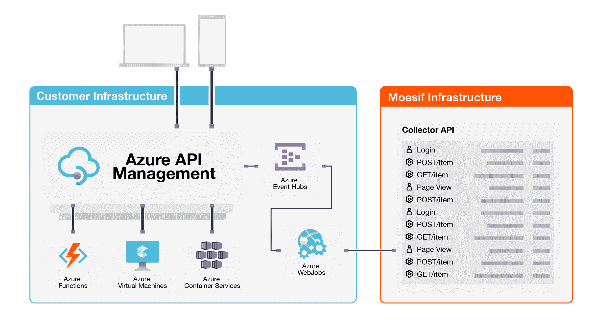
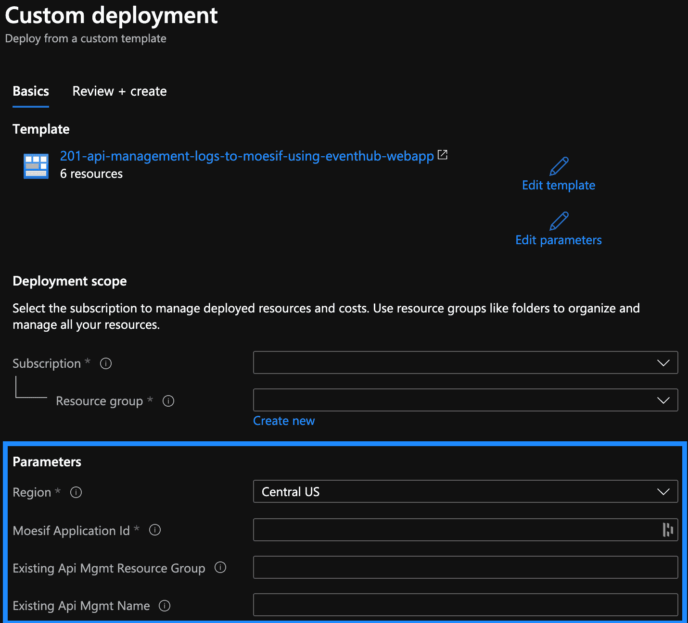
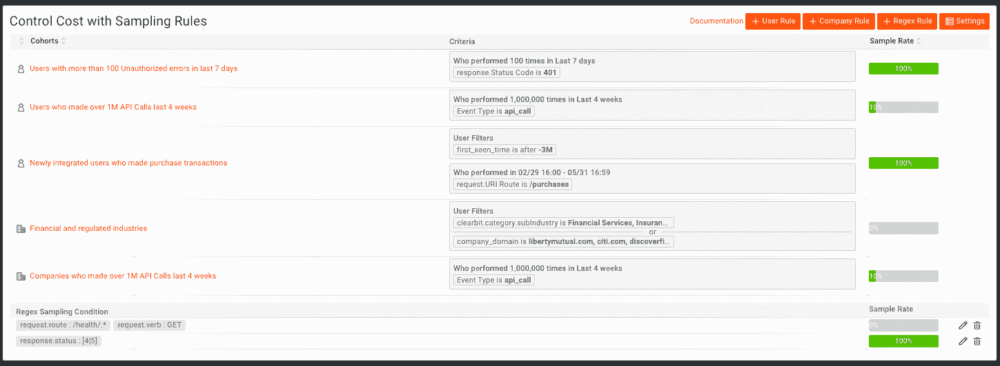

# 如何用 Moesif 插件监控 Azure API 管理性能

> 原文：<https://www.moesif.com/blog/technical/azure-api-management/How-to-Monitor-Azure-API-Management-Performance-with-the-Moesif-Plugin/>

Azure API Management (APIM)是一个强大的平台，使您能够发布和扩展 API，同时确保它们是安全的。Azure APIM 的一个很棒的特性是你可以添加插件和转换到你的 API 中，而不需要任何代码改变或者重启。

这些功能是使用 XML 策略部署的，XML 策略是一组语句的集合。 [Moesif API Observability](https://www.moesif.com/?language=azure-api-management) 可以在几分钟内添加，使用 APIM 的 XML 策略，可以轻松查看 API 调用，甚至是那些被拒绝且从未到达底层服务的调用。

## 什么是 Azure APIM 的 Moesif API 可观察性？

API 可观察性使工程和业务能够深入理解他们的 API 是如何使用的，并在客户发电子邮件支持和淹没您的团队之前识别出需要修复的内容。传统的 API 监控通常会探测端点的典型“红、黄、绿”状态，与此不同，API 可观察性使领导者能够观察 API 发生的任何行为。一些例子包括:

*   产品负责人了解 API 的用法和关注点
*   工程领导随时了解 API 问题并进行故障排除
*   安全研究人员调查 API 威胁并加以防范

## 这个解决方案是如何工作的

为了使 API 可观察性工作，监控代理需要被动地将 API 流量记录到可观察性服务中。这可以是基于 Azure Synapse Analytics 等数据仓库的定制构建，也可以是 Moesif 等交钥匙解决方案。像 Azure APIM 这样的 API 网关提供了一个集中 API 日志的自然点。否则，每个服务都需要有自己的 SDK。

这个解决方案是使用一个 [Azure 资源管理器模板](https://azure.microsoft.com/en-us/resources/templates/201-api-management-logs-to-moesif-using-eventhub-webapp/)部署的，它会自动向您的 Azure 订阅添加一些组件:

| 成分 | 目的 |
| --- | --- |
| [API 管理记录器](https://docs.microsoft.com/en-us/azure/api-management/api-management-howto-log-event-hubs) | 从 API 管理实例中捕获 API 日志，并将它们插入到 EventHub 中 |
| [Azure EventHub](https://docs.microsoft.com/en-us/azure/event-hubs/) | 缓冲原始 API 日志，直到可以使用为止 |
| [Azure WebApp](https://docs.microsoft.com/en-us/azure/app-service/) | 运行 [ApimEventProcessor](https://github.com/Moesif/ApimEventProcessor) 应用程序，该应用程序从 EventHub 中读取日志，并将日志批量发送到 Moesif |

下图显示了如何在 Azure 订阅中部署该解决方案。



一旦 Moesif 收到 API 日志，剩下的数据处理和分析就由该服务处理。

## 用例

### 了解客户 API 的使用

[API analytics](https://www.moesif.com/features/api-analytics) 的一个目标是了解谁在使用你的 API 以及他们如何使用它们。为了实现这一点，集成会自动将 API 调用关联到特定的用户配置文件。默认情况下，XML 策略还将从[上下文中提取用户信息，如用户 Id、名字和电子邮件。用户](https://docs.microsoft.com/en-us/azure/api-management/api-management-policy-expressions#ContextVariables)对象，并保存为 Moesif 中用户配置文件的一部分。您可以随时使用 Moesif 的用户跟踪 API 添加其他用户属性](https://www . moes if . com/implementation/track-user-behaviors-with-http-API？平台=http-api)

一份重要的报告是了解哪些客户使用你的 API 最多。因为我们正在跟踪名称和电子邮件，所以我们可以在 Moesif 中打开一个报告，按公司名称显示每周 API 流量。


### 疑难解答问题

借助[高基数、高维度的 API 可观察性](https://www.moesif.com/features/api-logs)，您可以根据任意数量的字段(如 URI 路由、HTTP 报头，甚至有效负载中的字段)来划分 API 日志，从而深入研究影响客户的问题。我们建议监控的一个这样的指标是第 90 百分位。与平均延迟不同，通过查看 90%的延迟，您可以更好地看到延迟的巨大变化，这对于客户来说通常比持续高延迟的 API 更糟糕。一个具有无缝随机延迟峰值的 API 可能会对他们自己的服务造成严重破坏。

为此，转到*事件- >时间序列*，然后选择指标 *P90 延迟*。你也可以按路线或服务来理解这一点。为此，通过“*请求 URI* 添加一个组 Moesif 合并路线，使`/items/1`和`/items/2`在用户界面中显示为`/items/:id`，这使您的分析更加容易。


### 研究威胁

随着您将越来越多的 API 暴露给客户、合作伙伴和单页面应用程序使用，您的安全风险也随之增加。浏览器指纹和验证码等传统机制不起作用，因此您需要利用高级用户行为分析来发现可疑用户。

一个常见的 [API 安全威胁](https://www.moesif.com/solutions/api-security)是没有针对数据抓取和故意滥用 API 的适当保护。API 提供了对你的数据的直接访问，黑客可以利用它来抓取数据。T2 检测客户滥用你的 API 的一种方法是查看每个用户访问的数据量。要创建这个指标，添加一个*response . headers . content-Length*的总和，然后按用户名分组:


## 如何用 Moesif API Observability 设置 Azure APIM

### 1.开始 Azure 资源部署

单击下面的按钮开始使用 Moesif Azure 资源模板进行自定义部署。

[T2】](https://portal.azure.com/#create/Microsoft.Template/uri/https%3A%2F%2Fraw.githubusercontent.com%2FAzure%2Fazure-quickstart-templates%2Fmaster%2Fquickstarts%2Fmicrosoft.apimanagement%2Fapi-management-logs-to-moesif-using-eventhub-webapp%2Fazuredeploy.json)

### 2.配置参数

在 Azure 模板部署面板中，设置以下属性:



*   将*资源组*设置为包含现有 Azure APIM 实例的同一个资源组。这将确保自动为您创建 APIM 记录器`moesif-log-to-event-hub`。

*   将 *Moesif 应用 Id* 设置为登录 Moesif 账户后显示的 Id。你可以在 [Moesif 网站](https://www.moesif.com/?language=azure-api-management)上免费创建一个

*   将*现有 Api 管理名称*设置为 Azure APIM 实例的名称。如果为空，您将需要手动创建 [APIM 记录器](https://docs.microsoft.com/en-us/azure/api-management/api-management-log-to-eventhub-sample#policy-declaration)。

完成后，点击底部的*审核+创建*按钮，完成模板创建向导。

> 偶尔，Azure 会报告由于新 DNS 设置传播缓慢而导致部署失败，即使一切都已成功部署。我们建议继续其余的过程。如果您在最后一步后仍有问题，[查看故障排除](#troubleshooting)。

### 3.添加 XML 策略

在 Azure 门户中，导航到您现有的 Azure API 管理实例。然后，将下面的 XML 策略添加到您希望启用 API 日志记录的所有产品或 API 中。

> 建议为所有 API 全局添加 XML 策略。然后，如果您想要创建选择性采样或抑制数据收集的规则，请使用 Moesif [动态采样](https://www.moesif.com/docs/platform/dynamic-sampling/)。规则是基于特定的客户行为、正则表达式规则等动态启用的。

有关编辑 APIM 政策的更多信息，请访问 [Azure docs](https://docs.microsoft.com/en-us/azure/api-management/set-edit-policies)

```py
<policies>
    <inbound>
        <base />
        <set-variable name="moesif-message-id" value="@(Guid.NewGuid())" />
        <log-to-eventhub logger-id="moesif-log-to-event-hub" partition-id="0">@{
var body = context.Request.Body?.As<string>(true);
var MAX_BODY_EH = 145000;
var origBodyLen = (null != body) ? body.Length : 0;
if (MAX_BODY_EH < origBodyLen){ body = body.Remove(MAX_BODY_EH); }
var headers = context.Request.Headers
    .Where(h => h.Key != "Ocp-Apim-Subscription-Key")
    .Select(h => string.Format("{0}: {1}", h.Key, String.Join(", ", h.Value).Replace("\"", "\\\""))).ToArray<string>();
var jwtToken = context.Request.Headers.GetValueOrDefault("Authorization","").AsJwt();
var userId = (context.User != null && context.User.Id != null) ? context.User.Id : (jwtToken != null && jwtToken.Subject != null ? jwtToken.Subject : string.Empty);
var cru = new JObject();
if (context.User != null) {
  cru.Add("Email", context.User.Email);
  cru.Add("Id", context.User.Id);
  cru.Add("FirstName", context.User.FirstName);
  cru.Add("LastName", context.User.LastName);}
var crus = System.Convert.ToBase64String(Encoding.UTF8.GetBytes(cru.ToString()));
var requestBody = (body != null ? System.Convert.ToBase64String(Encoding.UTF8.GetBytes(body)) : string.Empty);
return new JObject(
  new JProperty("event_type", "request"),
  new JProperty("message-id", context.Variables["moesif-message-id"]),
  new JProperty("method", context.Request.Method),
  new JProperty("ip_address", context.Request.IpAddress),
  new JProperty("uri", context.Request.OriginalUrl.ToString()),
  new JProperty("user_id", userId),
  new JProperty("contextRequestUser", crus),
  new JProperty("company_id", ""),
  new JProperty("request_headers", string.Join(";;", headers)),
  new JProperty("request_body", requestBody),
  new JProperty("contextTimestamp", context.Timestamp.ToString("o")),
  new JProperty("metadata", $@"")
  ).ToString();}</log-to-eventhub>
        <set-variable name="sent-moesif-request" value="@(true)" />
    </inbound>
    <backend>
        <forward-request follow-redirects="true" />
    </backend>
    <outbound>
        <base />
        <choose>
            <when condition="@(context.Variables.ContainsKey("sent-moesif-request") && !context.Variables.ContainsKey("sent-moesif-response"))">
                <log-to-eventhub logger-id="moesif-log-to-event-hub" partition-id="1">@{
var body = context.Response.Body?.As<string>(true);
var MAX_BODY_EH = 145000;
var origBodyLen = (null != body) ? body.Length : 0;
if (MAX_BODY_EH < origBodyLen){ body = body.Remove(MAX_BODY_EH);}
var headers = context.Response.Headers.Select(h => string.Format("{0}: {1}", h.Key, String.Join(", ", h.Value).Replace("\"", "\\\""))).ToArray<string>();
var responseBody = (body != null ? System.Convert.ToBase64String(Encoding.UTF8.GetBytes(body)) : string.Empty);
return new JObject(
  new JProperty("event_type", "response"),
  new JProperty("orig_body_len", origBodyLen),
  new JProperty("message-id", context.Variables["moesif-message-id"]),
  new JProperty("status_code", context.Response.StatusCode),
  new JProperty("response_headers", string.Join(";;", headers)),
  new JProperty("contextTimestamp", context.Timestamp.Add(context.Elapsed).ToString("o")),
  new JProperty("response_body", responseBody)
  ).ToString();}</log-to-eventhub>
                <set-variable name="sent-moesif-response" value="@(true)" />
            </when>
        </choose>
    </outbound>
    <on-error>
        <base />
        <choose>
            <when condition="@(context.Variables.ContainsKey("sent-moesif-request") && !context.Variables.ContainsKey("sent-moesif-response"))">
                <log-to-eventhub logger-id="moesif-log-to-event-hub" partition-id="1">@{
var body = context.Response.Body?.As<string>(true);
var MAX_BODY_EH = 145000;
var origBodyLen = (null != body) ? body.Length : 0;
if (MAX_BODY_EH < origBodyLen){ body = body.Remove(MAX_BODY_EH);}
var headers = context.Response.Headers.Select(h => string.Format("{0}: {1}", h.Key, String.Join(", ", h.Value).Replace("\"", "\\\""))).ToArray<string>();
var responseBody = (body != null ? System.Convert.ToBase64String(Encoding.UTF8.GetBytes(body)) : string.Empty);
return new JObject(
  new JProperty("event_type", "response"),
  new JProperty("orig_body_len", origBodyLen),
  new JProperty("message-id", context.Variables["moesif-message-id"]),
  new JProperty("status_code", context.Response.StatusCode),
  new JProperty("response_headers", string.Join(";;", headers)),
  new JProperty("contextTimestamp", context.Timestamp.Add(context.Elapsed).ToString("o")),
  new JProperty("response_body", responseBody)
  ).ToString();}</log-to-eventhub>
                <set-variable name="sent-moesif-response" value="@(true)" />
            </when>
        </choose>
    </on-error>
</policies> 
```

### 4.成功！

随着 Azure APIM 集成的完成，您应该会看到您的 [API 日志出现在 Moesif](https://www.moesif.com/features/api-logs) 中。对您的 API 网关域进行一些调用，并看到它们实时显示在 Moesif 的事件日志中。您应该会看到捕获的状态代码、URL 和其他 HTTP 参数，如下图所示:


## 识别用户

使用字段`user_id`将 API 调用与用户相关联。默认的 XML 策略使用以下逻辑从`context.User.Id`或 JWT 令牌中提取这个信息:

```py
var jwtToken = context.Request.Headers.GetValueOrDefault("Authorization","").AsJwt();
var userId = (context.User != null && context.User.Id != null) ? context.User.Id : (jwtToken != null && jwtToken.Subject != null ? jwtToken.Subject : null); 
```

您可以通过更改这些代码行来修改 userId。

## 添加用户元数据

默认情况下，XML 策略还使用 XML 策略中的以下代码保存一些有用的用户属性，如电子邮件和名字:

```py
if (context.User != null) {
  cru.Add("Email", context.User.Email);
  cru.Add("FirstName", context.User.FirstName);
  cru.Add("LastName", context.User.LastName);
}
var crus = System.Convert.ToBase64String(Encoding.UTF8.GetBytes(cru.ToString())); 
```

这些将与 Moesif 中与定义的`userId`匹配的用户配置文件一起保存。通过更改这些代码行，您可以从`context.User`中添加额外的字段来满足您的需求。

## 添加事件元数据

您也可以存储事件元数据。与用户元数据不同，事件元数据特定于每个 API 事务，可以包含 Moesif 尚未记录的有用信息，如跟踪 id 或环境变量。`metadata`字段应该是 JSON 编码的字符串。

## 采样请求

这种集成还支持[动态采样](https://www.moesif.com/docs/platform/dynamic-sampling/)。这使您能够根据用户行为有选择地对 API 调用进行采样，从而节省您的 Moesif 订阅成本。Moesif 仍然会推断原始的度量标准。



## 高级用户行为 API 分析

您可以利用您的集成，而不仅仅是孤立地查看 API 调用，并将您的整个客户之旅缝合在一起。这种方法可以更容易地看到类似于关于“*首次见面时间*”和“*价值实现时间*”的漏斗报告

跟踪用户界面中的用户操作，如“登录”或“查看的文档”，并开始跟踪用户界面中的用户操作，如“*登录*或“*查看的文档*”。这使得按客户流量划分 API 使用变得更加容易。为此，将 [moesif-browser-js](https://www.moesif.com/implementation/track-user-behaviors-with-browser) 添加到您的 UI 中，并调用 track 方法:

```py
moesif.track('Clicked Sign Up', {
  button_label: 'Get Started',
  sign_up_method: 'Google SSO'
}); 
```

一旦完成，你应该做的第一件事是生成一个漏斗报告。在下面的报告中，我们创建了一个由三个步骤组成的[漏斗分析](https://www.moesif.com/solutions/api-product-management)。

1.  第一步是客户登录您的 web 应用程序(用户操作)。
2.  第二步是通过 API 的单次支付交易。因此，从步骤 1 移动到步骤 2 显示了注册到第一次 API 调用的转换率。
3.  第三步是超过 100 笔支付交易。对于本例，我们认为这是展示客户价值的“啊哈”时刻。从第 2 步到第 3 步，显示了进行 API 调用的客户的减少，这些客户实际上看到了真正的价值。


# 结论

API 的可观察性对于工程和商业领导者在关注什么和问题在哪里做出明智的决定是至关重要的。虽然您可以使用自己的 API 网关、数据处理管道和数据仓库，但这会为您的工程团队带来巨大的时间消耗。使用完全托管的服务，如 Azure API 管理 API 网关和 [Moesif API 分析](https://www.moesif.com/features/api-analytics)可以帮助您扩展，而不会受到传统基础架构的阻碍。