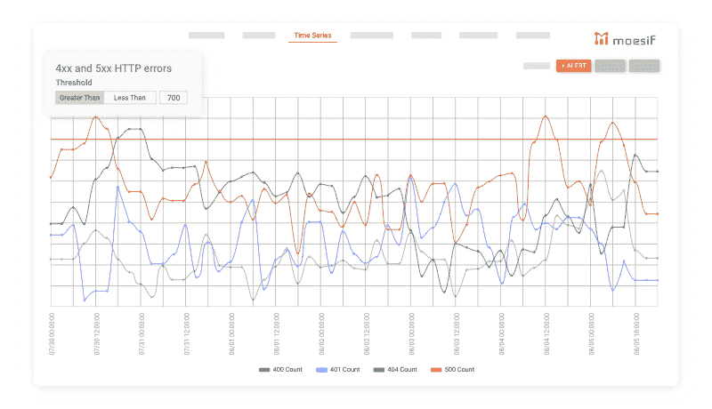
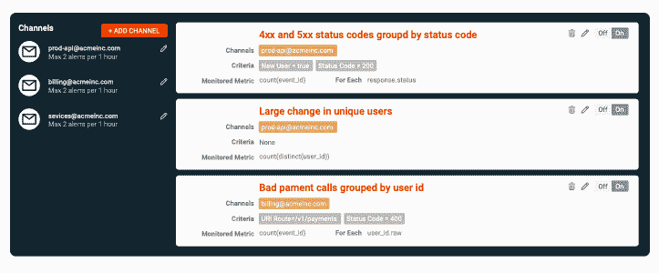

# 首次构建 API 时的 10 个错误状态代码以及如何修复它们

> 原文：<https://www.moesif.com/blog/technical/monitoring/10-Error-Status-Codes-When-Building-APIs-For-The-First-Time-And-How-To-Fix-Them/>

当您第一次调用 API 时，事情并不总是顺利的，尤其是如果您是初学者，并且是第一次将 API 集成到另一个系统中。通常缺乏 api 错误状态代码方面的文档，因为预测事情变好比预测事情变坏更容易。

HTTP 状态代码可以让您了解进行 API 调用时发生了什么。标准化的状态代码从 100 到 511，并且都具有不同的含义，但是只有从 400 到 511 的状态代码反映了错误响应。如果您正在使用 Moesif，使用这个[方便的表格](https://www.moesif.com/docs/api?utm_campaign=Int-site&utm_source=Blog&utm_medium=body-cta&utm_content=10-error-status-codes)查看最可能的 API 错误状态的摘要。

让我们看看 10 个最常见的 HTTP 状态代码，它们表示客户端或服务器端的错误响应。

## 客户端状态代码

4XX 组状态代码通常与客户端错误有关，但是对 API 的更改也会导致这些错误。以下是 5 种最常见的客户端状态错误代码以及解决方法:

### 404 未找到

这是迄今为止您能得到的最常见的 HTTP 状态代码。这表明您在请求中使用的 URL 在 API 服务器或原始服务器上不存在。虽然这是一个 4XX 错误，通常意味着客户端有问题，但这也可能表示服务器有问题。有时 API URL 路径会在版本更新后改变，但有时它们会因为服务器上的某些地方出错而改变。

最好的做法是在检查 API 是否有问题之前，先检查您的客户机代码中是否有拼写错误。

### 401 未经授权

这个状态代码意味着您还没有通过 API 的认证。API 不知道你是谁，也不会为你服务。

对于大多数 API，你需要注册并获得一个 API 密钥。然后，当您发送请求时，在 HTTP 头字段中使用这个键，告诉 API 您是谁。

这个 http 状态代码类似于不太常见的*407 Proxy authentic ation Required*，这意味着您还没有通过代理进行身份验证。

### 403 禁止

“禁止”状态表示您无权请求该 URL。您通过了身份验证，但是您通过身份验证的用户或角色不允许发出 API 请求。

当您遇到身份验证问题时也会发生这种情况，例如使用错误的 API 密钥或试图访问您的订阅计划不允许的功能。

### 400 错误请求

*400 错误请求*错误消息是最常见的 HTTP 状态代码之一。这意味着您没有正确格式化您的 API 请求。如果响应正文中没有给出额外的错误信息，您必须检查文档。您可能缺少一个查询、请求正文中的一个字段，或者标题字段可能是错误的。也可能是某些请求数据的语法不正确。

这与 *422 不可处理的实体*错误消息不同，后者在您的请求被正确格式化但无法处理时出现。

### 429 请求太多

大多数 API 订阅计划都有限制——计划越便宜，每秒允许的 API 键请求就越少。

如果您在短时间内发送了太多的请求，请考虑在您的客户端中限制它们。这种反应也可能表明您的帐户达到了每日、每周或每月的限额。如果不实施 API 分析，就有可能在没有收到推送通知或[电子邮件提醒的情况下达到这些限制。](https://www.moesif.com/features/user-behavioral-emails?utm_campaign=Int-site&utm_source=Blog&utm_medium=body-cta&utm_content=10-error-status-codes)

有时候，一个 API 听起来很合适，直到你看到它的局限性，突然它不再适合你的用例。在集成之前检查你的 API 订阅的一部分，否则你可能在集成 API 几周或几个月后遇到问题。

## 服务器端状态代码

5XX 组状态代码通常在响应服务器错误时返回，但是如果在服务器上没有被正确捕获，应该响应 4XX 的无效 API 调用也可能返回 5XX 错误。以下是 5 个最常见的错误以及解决方法:

### 500 内部服务器错误

这个 HTTP 状态代码可能意味着任何事情，但是它通常表示 API 服务器崩溃了。这可能是由与您的 API 调用相关的某些事情引起的。

仔细检查文档，确保你做的一切都是正确的:查询字段、正文字段、标题和格式。

如果这不能解决问题，也可能与 API 更新引入了错误代码或 API 从上游服务加载的数据有关。在这种情况下，您唯一的行动是联系 API 的支持。

### 502 错误网关

这个响应告诉您，您调用的服务器不是实际的 API 服务器，而是一个网关或代理。代理服务器试图以您的名义调用 API 服务器。这个错误响应也表明 API 服务器没有响应。这可能与网络问题有关，或者只是因为 API 服务器崩溃，或者因为维护而停机。

“坏网关”错误通常是暂时的，应该由 API 提供者解决，但是如果它仍然存在，您必须联系支持人员。

### 503 服务不可用

503 服务不可用状态表示服务器出错。发送了太多 API 请求，现在 API 无法处理更多请求。当客户端发送更少的未来请求时，这个问题会自行解决，但这也可能意味着 API 提供者没有为其所有客户规划足够的资源。

如果它符合您的用例，您可以通过等待发送另一个请求来使您的客户端对这个错误更有弹性。但是如果错误代码继续出现，您必须联系 API 提供者。

### 504 网关超时

像 502 错误网关状态一样，这个响应代码告诉您您正在调用的服务器是真实 API 服务器的代理。这一次，问题是 API 服务器的响应速度太慢。

这可能与代理和 API 服务器之间的高网络延迟有关。这也可能意味着 API 服务器处理请求的时间太长。

要解决这个问题，请检查您的请求内容是否与超时相关。如果您请求的数据太多或者计算时间太长，您应该尝试减少请求。

如果您认为您的请求是合理的，并且状态没有消失，请联系支持人员。

### 501 未执行

*501 未实现*状态代码与您用于请求 URL 的 HTTP 方法有关。您可以尝试不同的 HTTP 方法来发出请求。

通常，使用不适当方法的 HTTP 请求只会导致 404 not found 状态。未实现状态意味着该方法“还没有”实现 API 创建者可以使用这个状态来告诉客户端，这个方法将在将来的请求中对他们可用。

## 使用 Moesif 监控 HTTP 状态代码

Moesif 提供了一组丰富的[监控和通知](https://www.moesif.com/features/api-monitoring?utm_campaign=Int-site&utm_source=Blog&utm_medium=body-cta&utm_content=10-error-status-codes)功能，因此您可以自动了解任何 HTTP 状态代码错误，并从您的错误响应趋势中获得深刻的见解。

API 调用总是用用户身份来跟踪，所以很容易定位错误并快速解决它们。

## 摘要

毫无疑问，在使用 API 时，您会看到许多错误代码，但大多数都有合理的修复。有些与服务器错误有关，有些与客户端错误有关，通常一个错误会导致另一个错误。

总是试着通读文档和 API 注释，这样你就不会在集成时忘记一些东西。如果事情只是简单的中断，请联系 API 提供者。

在某些情况下，API 提供者永远不会为 API 消费者解决问题。如果你正在使用一个流行的 API，你也可以在网上搜索答案，特别是 [StackOverflow](https://stackoverflow.com/?utm_campaign=Int-site&utm_source=Blog&utm_medium=body-cta&utm_content=10-error-status-codes) ，找到错误响应的修复。保持决心，你很快就会看到你的 200 个 ok 状态码。