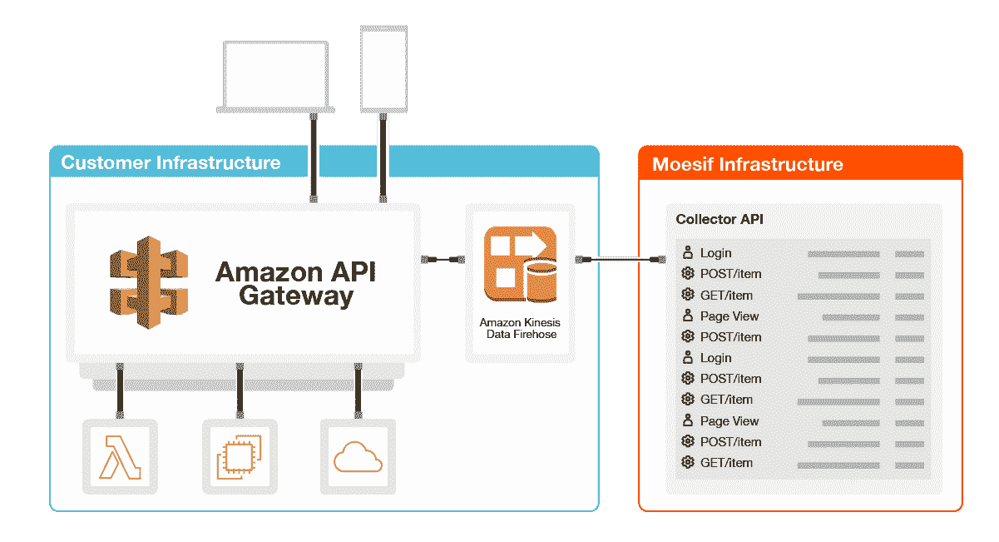
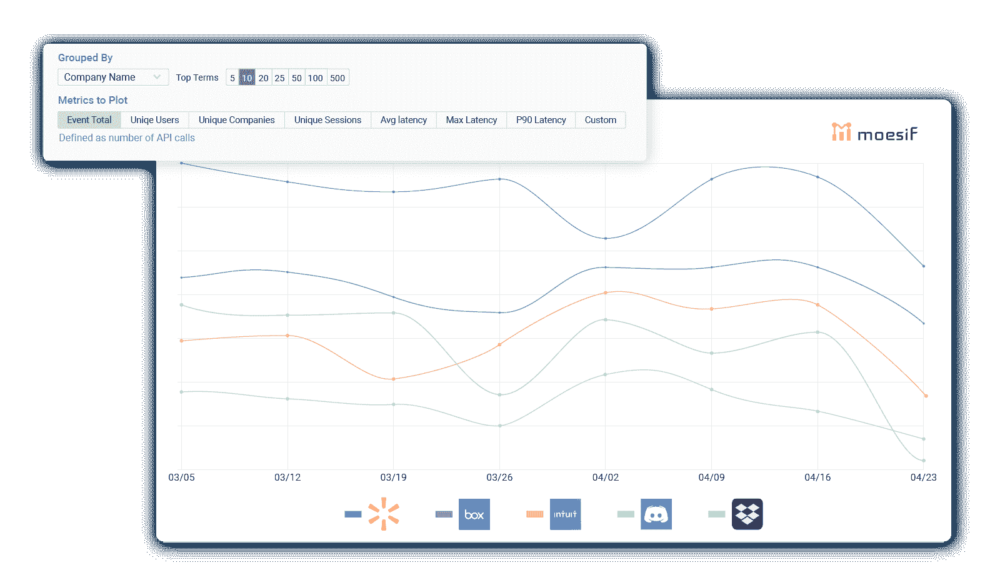
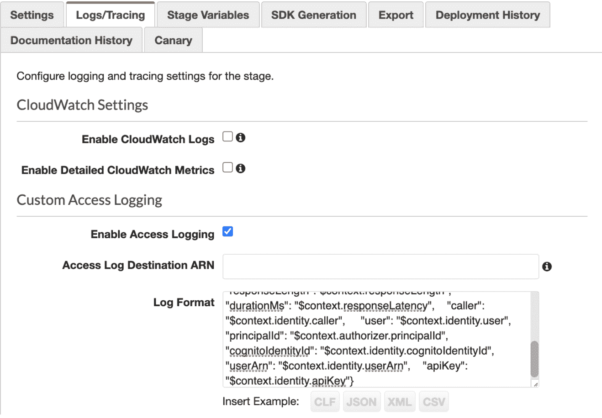

# 如何使用用于 AWS API 网关的 Moesif 插件监控 API 的使用和性能

> 原文：<https://www.moesif.com/blog/technical/aws-api-gateway/How-to-Monitor-API-Usage-and-Performance-with-the-Moesif-Plugin-for-AWS-API-Gateway/>

API 网关提供了一个中心点来管理和控制对 API 的访问，使客户和合作伙伴能够快速创建新的体验。[亚马逊 API 网关](https://aws.amazon.com/api-gateway/)拥有对各种计算资源的原生支持，如 [AWS Lambda](https://aws.amazon.com/lambda/) 或[亚马逊弹性计算云(亚马逊 EC2)](https://aws.amazon.com/ec2) 。

## API 可观察性

API 可观察性可以为您的业务和工程团队提供关于如何使用 API 的深刻见解。 [API 可观察性](https://www.moesif.com/blog/api-engineering/api-observability/What-is-the-Difference-Between-API-Observability-vs-API-Monitoring/)被多个团队利用，包括:

*   产品团队了解 API 的使用和商业价值
*   监控和解决 API 问题的工程团队
*   安全团队检测和防范 API 威胁

[Moesif API Analytics](https://www.moesif.com/?language=aws-api-gateway) 是一个 API 可观察性解决方案，您可以利用它来更好地了解 API 的用法。有一个与亚马逊 API 网关的原生[集成，这使得部署只是几个点击的问题，不需要任何代码更改或重启。作为基础设施其余部分的网关，API 网关也是为各种业务和工程团队提供 API 可观察性的自然场所。](https://www.moesif.com/implementation/log-http-calls-from-aws-api-gateway?platform=aws)

## 解决方案概述和使用案例

该解决方案将 API 分析添加到 AWS API Gateway 托管的 API 中。它的工作原理是通过一个[亚马逊 Kinesis 数据消防软管](https://www.moesif.com/implementation/log-http-calls-from-aws-api-gateway?platform=aws)将结构化 API 访问日志从你的亚马逊 API 网关实例转发到 Moesif。使用附带的 CloudFormation 模板，只需点击几下鼠标即可完成解决方案的部署，并且不需要任何停机时间。完成后，您可以实现几个目标:



### 了解客户 API 的使用

[API 分析](https://www.moesif.com/features/api-analytics)的一个关键目标是了解谁在使用你的 API 以及他们如何使用它们。默认情况下，Moesif 通过用`$context.authorizer.principalId`或`$context.identity.cognitoIdentityId`解析请求上下文，将 API 调用绑定到用户标识符，这样您就可以理解用户行为。

一份重要的报告是了解哪些客户使用你的 API 最多。API 日志传统上不包括客户人口统计信息，但像 Moesif 这样的 API 分析系统可以自动加入其他包含客户属性的数据集，如用户电子邮件或公司域。用户可以使用相同的用户 id 通过客户端集成进行跟踪，如 [moesif-browser-js](https://www.moesif.com/implementation/track-user-behaviors-with-browser?platform=browser) 或 [Segment](https://segment.com/integrations/moesif-api-analytics/) 。然后我们可以调出一个使用情况报告，按公司显示 API 流量。



### API 问题疑难解答

有了[高基数、高维度的 API 可观察性](https://www.moesif.com/features/api-logs)，您可以按照任意数量的字段(包括 HTTP 头或响应时间)来划分 API 日志。这使得无需手动日志搜索即可快速解决问题。API 的一个核心工程指标是延迟百分比，比如第 90 个百分比。最佳实践是查看平均值的 90%延迟。这种做法有助于发现可能被低平均值掩盖的较大延迟差异。您的 API 用户正在寻找持续的低延迟，而不是最低的平均延迟，因为峰值可能会对他们自己的服务造成严重破坏。

为此，转到*事件- >时间序列*并选择 P90 延迟指标。最好也了解按路线或服务细分的情况。为此，通过“*请求 URI* 添加一个组 Moesif 将自动合并路线，这样`/items/1`和`/items/2`将在 UI 中显示为`/items/:id`;


### 查找 API 安全威胁

随着您将越来越多的 API 暴露给客户、合作伙伴和单页面应用程序使用，您的安全风险也随之增加。浏览器指纹和验证码等传统机制不起作用，因此您需要利用高级用户行为分析来发现可疑用户。

一个常见的 [API 安全威胁](https://www.moesif.com/solutions/api-security)不是限制对你的专有数据的访问。然后，黑客可以通过分页攻击下载所有这些数据。一种[检测客户滥用你的 API](https://www.moesif.com/solutions/api-security) 的方法是查看每个客户下载的数据量。要创建这个指标，添加一个*response . headers . content-Length*的总和，然后按客户名称分组:


## 如何设置

该集成通过添加一个[亚马逊 Kinesis 数据消防软管](https://aws.amazon.com/kinesis/data-firehose/)来工作，该软管从你的亚马逊 API 网关接收 [API 访问日志](https://aws.amazon.com/about-aws/whats-new/2017/11/amazon-api-gateway-supports-access-logging/)，并将它们发送到 Moesif。API 网关日志有两种类型的日志: *API 访问日志*和 *CloudWatch 执行日志*。虽然执行日志是非结构化的，但人类可读，API 访问日志是结构化的，更容易被机器解析。此外，日志包含用户身份，这使得它们非常适合像 Moesif 这样的用户行为分析工具。

### 1.发射云编队栈

使用 Moesif 的 Amazon Web Services cloud formation 模板自动创建 Kinesis 数据消防软管，并将其配置为向 Moesif 发送 API 访问日志。若要开始，请单击下面的“启动堆栈”按钮。

[T2】](https://console.aws.amazon.com/cloudformation/home#/stacks/create/review?stackName=moesif-aws-api-gateway&templateURL=https://moesif-cloudformation.s3-us-west-2.amazonaws.com/public/moesif-aws-api-gateway-firehose-cloudformation.json)

这将在 AWS 控制台中打开快速创建堆栈。您需要在参数部分输入您真实的 Moesif 应用程序 Id。您可以在 [AWS Marketplace](https://aws.amazon.com/marketplace/pp/Moesif-API-Insights-Moesif-API-Analytics/B07BSK7NJT) 上登录您的 Moesif 帐户，找到您的应用程序 Id。

### 2.启用 API 网关访问日志记录

您需要在 Amazon API Gateway 中启用 API 访问日志，并将其发送到步骤 1 中的 Kinesis Data Firehose。

*   转到 AWS 控制台中的 AWS API 网关实例。
*   在左侧菜单中选择**阶段**，然后选择**日志/跟踪**选项卡
*   打开**启用访问记录**。
*   在**访问日志目的地 ARN** 下添加步骤 1 中的消防软管 ARN。



### 3.添加 JSON 日志格式

现在您已经启用了访问日志，您需要添加下面的 JSON 日志格式，以便输出与 Moesif 兼容。Moesif 将安全地忽略任何多余的键。

```py
{  "apiId":  "$context.apiId",  "requestId":  "$context.requestId",  "requestTime":  "$context.requestTime",  "protocol":  "$context.protocol",  "httpMethod":  "$context.httpMethod",  "resourcePath":  "$context.resourcePath",  "requestHostHeader":  "$context.domainName",  "requestUserAgentHeader":  "$context.identity.userAgent",  "ip":  "$context.identity.sourceIp",  "status":  "$context.status",  "responseLength":"$context.responseLength",  "durationMs":  "$context.responseLatency",  "caller":  "$context.identity.caller",  "user":  "$context.identity.user",  "principalId":  "$context.authorizer.principalId",  "cognitoIdentityId":  "$context.identity.cognitoIdentityId",  "userArn":  "$context.identity.userArn",  "apiKey":  "$context.identity.apiKey"  } 
```

### 4.成功！

API 网关集成完成后，您应该看到您的 [API 日志出现在 Moesif](https://www.moesif.com/features/api-logs) 中。对您的 API 网关域进行一些调用，并看到它们实时显示在 Moesif 的事件日志中。您应该会看到捕获的状态代码、URL 和其他 HTTP 参数，如下图所示:


## 高级用户行为分析

您可以利用您的集成，而不仅仅是孤立地查看 API 调用，并将您的整个客户之旅缝合在一起。这种方法可以更容易地看到类似于关于“*首次见面时间*”和“*价值实现时间*”的漏斗报告

跟踪用户界面中的用户操作，如“登录”或“查看的文档”，并开始跟踪用户界面中的用户操作，如“*登录*或“*查看的文档*”。这使得按客户流量划分 API 使用变得更加容易。为此，将 [moesif-browser-js](https://www.moesif.com/implementation/track-user-behaviors-with-browser) 添加到您的 UI 中，并调用 track 方法:

```py
moesif.track('Clicked Sign Up', {
  button_label: 'Get Started',
  sign_up_method: 'Google SSO'
}); 
```

一旦完成，你应该做的第一件事是生成一个漏斗报告。在下面的报告中，我们创建了一个由三个步骤组成的[漏斗分析](https://www.moesif.com/solutions/api-product-management)。

1.  第一步是客户登录您的 web 应用程序(用户操作)。
2.  第二步是通过 API 的单次支付交易。因此，从步骤 1 移动到步骤 2 显示了注册到第一次 API 调用的转换率。
3.  第三步是超过 100 笔支付交易。对于本例，我们认为这是展示客户价值的“啊哈”时刻。从第 2 步到第 3 步，显示了进行 API 调用的客户的减少，这些客户实际上看到了真正的价值。


# 结论

拥有正确的 API 可观察性解决方案可以为您的团队提供正确的可视性，从而做出明智的决策。虽然您可以使用自己的 API 网关、数据处理管道和数据仓库，但这会为您的工程团队带来巨大的时间消耗。使用完全托管的服务，如 Amazon API Gateway 和 [Moesif API Analytics](https://www.moesif.com/features/api-analytics) 可以帮助您扩展，而不会受到高维护成本或过时数据基础架构的阻碍。首先，你可以在 [AWS Marketplace](https://aws.amazon.com/marketplace/pp/Moesif-API-Insights-Moesif-API-Analytics/B07BSK7NJT) 上注册一个免费的 Moesif 账户。