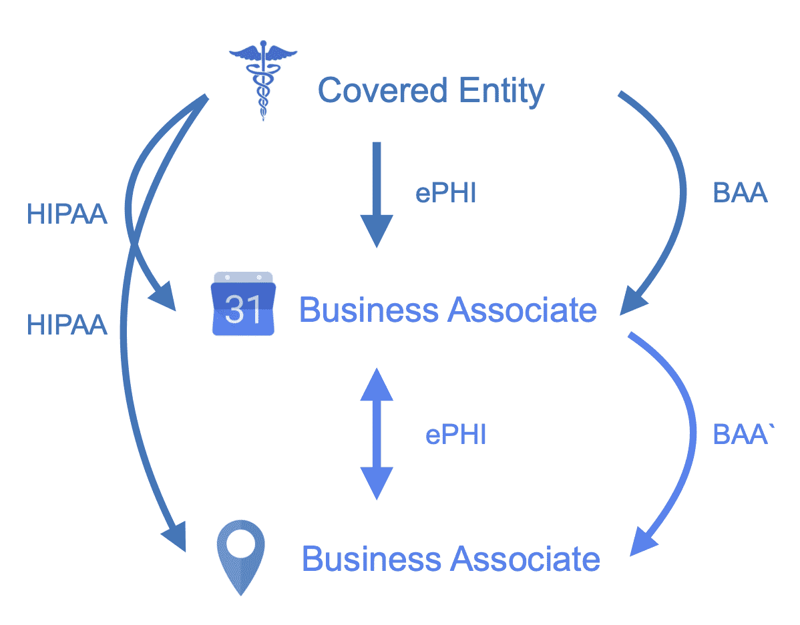
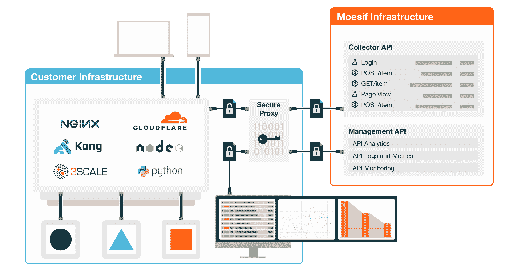

# 构建符合 HIPAA 的 API

> 原文：<https://www.moesif.com/blog/business/compliance/Building-HIPAA-Compliant-APIs/>

法律免责声明:此处陈述的任何内容都不是法律建议。它仅供参考。您应该与法律顾问密切合作，以确定 HIPAA 会对您的业务产生怎样的影响。

医疗保健占美国国内生产总值的 17%，2020 年约为 4 万亿美元。COVID 使远程医疗的使用正常化，并加快了医疗保健从医生办公室和医院向智能手机和在线应用程序提供服务的分散。

在这一巨变中，越来越多的病历被数字化、传输、存储和电子利用。API 是在这个迅速发展的市场中迅速启用新服务的先锋。然而，随着这些电子记录的出现以及从 API 获取信息的便利性，现在比以往任何时候都更需要保护患者的数据。

## HIPAA/HITECH 法律和您的 API

任何可用于识别患者身份的信息都被视为受保护健康信息，或 ePHI 代表*电子*受保护健康信息，其使用受联邦法律 HIPAA & HITECH 控制。

与金融科技中的 PCI 标准不同，没有人能够*证明*你的应用程序符合 HIPAA 作为管理机构的公民权利办公室(OCR)(卫生与公众服务部的一部分)不承认认证。相反，您 API 提供者——有责任执行定期的技术和非技术评估，以确保安全策略和程序符合法律条文。

在过去，OCR 通过民事和刑事处罚，积极寻求对不遵守 HIPAA 的公司做出判决。

> [健康保险携带和责任法案](https://www.hhs.gov/hipaa/for-professionals/index.html) (HIPAA)是 1996 年的联邦法律，并在 2009 年由[健康信息技术促进经济和临床健康法案](https://www.hhs.gov/hipaa/for-professionals/special-topics/hitech-act-enforcement-interim-final-rule/index.html) (HITECH)进行了重大修订和扩展。HIPAA/HITECH 的目的是通过标准化和保护健康信息的交流来提高医疗保健系统的效率和有效性，特别关注*隐私、安全和电子数据交换*。

## 接触 ePHI 的 API 开发者需要遵守 HIPAA 和 BAAs

最简单的形式是，如果您的 API 接触到 ePHI，那么您必须遵守 HIPAA。

合规性还有另一个问题，如果您接触 ePHI，那么您还需要与该 ePHI 的上游提供商以及您可能与之共享该 ePHI 的下游合作伙伴签署法律协议、业务合作协议(BAAs)。

最终的上游提供商是美国医疗保健和健康保险提供商，他们生产大部分 ePHI，被称为承保实体。业务伙伴是指代表相关实体或其他业务伙伴执行涉及使用该 ePHI 的工作或其他职能的公司。在交换 ePHI 之前，开发人员和他们的供应商/合作伙伴之间的 baa 必须到位，否则交换就违反了 HIPAA。

在大多数情况下，API 产品将在所涵盖的实体本身之外开发，因此这篇博文将专门关注业务伙伴，即那些使用所涵盖的实体和/或其他业务伙伴的 ePHI 创建程序/应用的 API 开发公司。

让我们看看上面的说明性例子。一家 API 公司想要开发一款能够安排医生预约的产品。API 公司需要向医疗机构请求信息，例如姓名、就诊性质、医生的专业等。在发布 ePHI 之前，患者信息的持有者(医疗实践本身或电子医疗记录提供商)需要与 API 公司签署一份 BAA。如果调度公司想要使用另一个供应商的产品，比如显示医生办公室位置的 [API 地图服务](https://radar.io/)，那么他们需要与下游合作伙伴签署另一个 BAA。最初的 API 公司及其合作伙伴现在在法律上必须遵守 HIPAA 要求以及 BAAs 中概述的那些法规。

## 当不遵守 HIPAA 是安全的时候

在四种情况下，您不必遵守 HIPAA:

### 1.不要传输、存储或处理 ePHI

保护你的公司免受 HIPAA 攻击的一个方法是*而不是*传输、存储或处理任何 ePHI。因此，您可以高枕无忧，以下是 HIPAA 指定的 18 个唯一标识符(个人可识别信息),当与健康信息结合使用时，它们将成为 ePHI:

*   名字
*   地址
*   与个人相关的日期，如生日或访问日期
*   电话/传真号码
*   电子邮件
*   severely subnormal 智力严重逊常
*   病历/健康计划/账号
*   证书或执照号码
*   汽车 VIN/车牌号码
*   设备 ID
*   Web URL
*   国际电脑互联网地址
*   指纹或声纹
*   亲戚的名字
*   患者照片
*   能够唯一识别个人的任何其他特征

### 2.学校或就业记录

就业或学校记录中的健康信息不被视为 ePHI。

### 3.自我收集的健康数据

用户收集的、未与医生共享的数据不属于 HIPAA 的管辖范围:

*   FitBit 上计算的步数
*   卡路里计数器
*   血糖读数
*   心率读数

### 4.去除标识符的 ePHI

去除了上述标识符的健康数据，也称为去识别或匿名数据，不能用于识别个人身份，因此不必遵守 HIPAA。

有许多数据提供商可以匿名提供医疗保健数据，并提供对总体人口趋势和基于价值的医疗保健项目的见解。

> 如果您的 API 只使用去标识的医疗保健数据，那么它不必遵守 HIPAA

## API 开发者的关键 HIPAA 法规

为了遵守 HIPAA，API 开发人员需要采用管理、物理和技术安全措施来保护 ePHI 的隐私和安全。这不仅仅局限于对静态、传输中和使用中的数据进行加密，它还涉及如何分发加密密钥、在团队成员讨论时如何引用 PHI，以及如何建立对系统的定期内部审计。处理健康信息的每个人都需要充分理解他们在 HIPAA 下的责任，以保护 ePHI、避免责任和保护您的公司。

HIPAA 有 3 个主要规定:

*   [隐私规则](#privacy-rule):规定了保护、使用和披露以任何形式(包括电子和口头形式)持有或传输的 ePHI 的标准和要求
*   [安全规则](#security-rule):建立 ePHI 静止或运输时的安全标准
*   违反通知规则:规定违反 ePHI 的通知内容和方式

## HIPAA 的隐私规则意味着保存详细的 API 日志

[隐私规则](https://www.hhs.gov/hipaa/for-professionals/privacy/laws-regulations/index.html)定义并限制了贵公司使用和披露 ePHI 的情况，确立了个人在 ePHI 方面的权利，并要求您采取行政、物理和技术保护措施来保护 ePHI 的隐私。基本上，如果你像我们在 [CCPA/FDPR 的博文](https://www.moesif.com/blog/business/compliance/CCPA-Requirements-and-Compliance-Checklist-for-API-Programs/)中建议的那样实施隐私最佳实践，那么你将能够遵守 HIPAA 的隐私要求。

作为业务伙伴，您必须向个人授予 HIPAA 为相关实体指定的相同权利。您只能使用或披露与您的相关实体签订的服务协议& BAA 中定义的 ePHI，或者您与适用个人签订的协议中允许的 ePHI。

首先，您必须向个人提供一份隐私实践通知(通常是与您的承保实体合作制定的文件),概述如何使用和不使用 ePHI，以及个人对其 ePHI 拥有的权利和义务。之后，您需要制定协议来尊重以下权利:

### 请求隐私保护的权利

如果个人提出要求，您必须:

*   限制使用或披露 ePHI(有少数例外)
*   以安全保密的方式将 ePHI 交付给他们
*   使用替代方法向他们传达 ePHI
*   如果个人已经支付了服务费用，则不得向健康计划披露 ePHI

### ePHI 披露日志的权利

记录 API 交易对于满足 HIPAA 对个人要求披露其 ePHI 账户的要求至关重要。如果个人要求，您必须提供每个 ePHI 披露的帐户，包括:

*   披露日期
*   收到 ePHI 的实体或个人的名称
*   公开的 ePHI 的简要描述
*   披露目的的简要说明

### 访问和修改 ePHI 的权利

This is analogous to the [Right to Access/Amend/Erase](https://www.moesif.com/blog/business/compliance/CCPA-Requirements-and-Compliance-Checklist-for-API-Programs/#how-to-comply) as defined in GPDR and CCPA

| 请求 | 要提供什么 |
| --- | --- |
| 接触权 | 特定格式的 ePHI 或表格的副本 |
| 修改权 | 修正 ePHI 的能力 |
| 发送权 | 向他人传输 ePHI 副本 |

### 管理要求

最佳实践要求采用各种管理问题来确保合规性:

*   指定一名隐私官
*   培训员工
*   实施安全措施以防止有意和意外的泄露
*   建立投诉制度
*   制裁违反 HIPAA 政策和程序的员工

## HIPAA 的安全规则意味着加密和更多

业务合作伙伴[需要](https://www.hhs.gov/hipaa/for-professionals/security/laws-regulations/index.html)确保 ePHI 在传输过程中的保密性，在使用过程中的保密性&，防止对 ePHI 安全的合理预期威胁或危害，并防止隐私规则不允许的使用或披露。

从根本上说，作为 API 开发者，安全性分为三个方面:管理、物理和技术保护。

其中许多都是通用的安全最佳实践，如:保留关于评估/更改内容的审计日志，选择适当的应用程序/计算机密码，不共享密码，以及加密包含 ePHI 的便携式设备。

但有些是 HeathTech 特有的，例如:在使用后注销包含 ePHI 的应用程序，避免在口头交流、电子聊天或未加密的电子邮件中使用个人姓名、医疗记录号码或账号，及时报告 ePHI 的任何丢失或被盗，并通知隐私官 ePHI 的不当使用。

### HIPAA 安全的技术保障

技术保护是 API 开发人员在构建兼容应用时将花费大部分时间的地方。为了确保 ePHI 在传输、静止和使用过程中的保密性，应该对 ePHI 进行加密，并且应该特别注意密钥分发。关于什么是合适的加密有很多讨论，HIPAA 仅仅需要一个[机制来加密和解密 e-PHI](https://www.law.cornell.edu/cfr/text/45/164.312) ，但是采用来自 NIST 的[最新建议](https://csrc.nist.gov/publications/detail/nistir/7977/final)将是一个安全的赌注。

| 保护 | 需要什么 | 如何在 API 环境中实现 |
| --- | --- | --- |
| 访问控制 | 仅允许授权访问 ePHI 的政策 | 认证用户
为每个用户分配唯一的 ID
设计访问控制规则
实现自动注销
支持紧急访问 ePHI |
| 审计控制 | 记录和检查对包含 ePHI 的系统的访问的正式程序 | 保存所有访问的 API 日志
定期运行风险评估以检查功能是否正常 |
| 完整性控制 | 确保 ePHI 不被不当更改或破坏的政策 | 跟踪对 ePHI 的任何修改 |
| 传输安全性 | 技术安全措施应防止在运输过程中未经授权访问 ePHI | 尽可能使用客户端加密
验证是否使用了 HTTPS |

作为可以支持 ePHI 的完全安全的 API 部署的示例，下面的架构显示了 [Moesif 的安全代理](https://www.moesif.com/docs/platform/secure-proxy/)通过内部客户端加密和自带密钥(BYOK)实现零知识安全。获得了内部安装的隐私优势，而没有构建和扩展您自己的数据基础架构的复杂性。主加密密钥从不存储在 Moesif 服务器上，相反，安全代理支持[流行的密钥存储库](https://aws.amazon.com/kms/)并自动处理密钥轮换。数据在传输、存放和使用过程中都会被加密。

## HIPAA 的违规通知规则会公开所有违规行为

违规被定义为以 HIPAA 隐私规则不允许的方式获取、访问、使用或披露 ePHI，从而危及 ePHI 的安全或隐私。除非根据您的风险评估，您能够证明 ePHI 受损的可能性很低，否则将被视为违规。

作为业务伙伴，如果发生违规，您需要在 60 天内通知相关实体及其客户。

## 对违规行为的处罚

2018 年，有超过 6.3 万起个人违反 ePHI 的行为，其中 302 起影响了 500 或更多个人，导致 OCR 处以总计 2700 万美元的罚款。

HIPAA/HITECH 定义了一个分级处罚结构，根据违规的性质和情况(包括知情和故意)可分级处罚。违规行为会公之于众，业务伙伴可能会受到民事和刑事处罚。

每次违规的民事处罚从 100 美元到 50，000 美元不等，这取决于与违规相关的知情程度或意图。违反 HIPAA 故意披露 ePHI 的业务伙伴的员工可能会被罚款高达 250，000 美元和监禁 10 年，具体取决于披露背后的意图程度。

## 医疗保健的颠覆时机已经成熟，而原料药是中心舞台

COVID 充当了现有趋势的催化剂，可能最深刻的错位出现在医疗保健领域。新常态将支持 HealthTech 基于垂直的 API，在幕后简化和自动化遗留业务流程。