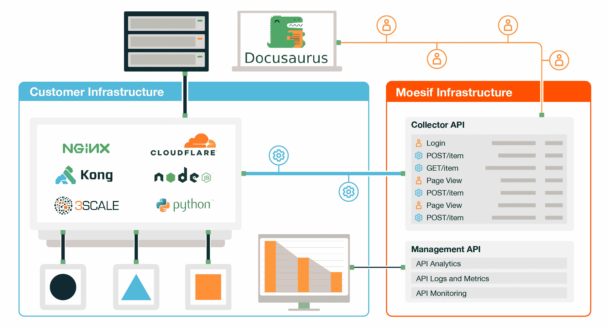

# 如何跟踪开发人员使用 Docusaurus 和 Moesif API Analytic 的体验

> 原文：<https://www.moesif.com/blog/api-product-management/docusaurus/How-to-Track-Developer-Experience-with-Docusaurus-and-Moesif-API-Analytics/>

如果你的产品是一个 API，你的客户通常是开发者。虽然许多开发人员不喜欢为他们自己的应用程序编写文档，但他们肯定喜欢为他们使用的 API 编写好的文档。写得好的文档可以帮助开发者更快地发布他们的集成和应用，而不是陷入集成问题和错误中。

好的文档也可以是一个强大的营销工具，因为它超越了页面这样的典型参考，向您的开发人员客户展示了您平台的潜在用例。当开发人员为客户最迫切的问题寻找解决方案时，他们可能会从搜索引擎中找到您的文档。目标是让你的解决方案在搜索引擎优化中排名第一。

好的文档是通过不断调整开发人员的体验而反复编写的。这需要有合适的工具来衡量指标，如首次 Hello World 的时间，并找出客户最纠结的地方。当客户在你的 API 中遇到 400 错误时，看看他们浏览的是什么文档页面。如果他们一直遇到 400 个错误而没有解决，也许这些文档页面需要更新

## 用于 Moesif API 分析的 Docusaurus 插件

Docusaurus 是一个由脸书开发团队开发的用于编写和发布文档的流行框架，为分析供应商、搜索供应商等提供了各种插件。[Moesif 有一个 Docusaurus 的插件](https://www . moe SIF . com/docs/client-integration/Docusaurus 使您能够跟踪正在浏览的文档页面，并跟踪客户的旅程。Moesif 是为 API 产品设计的，因此可以跟踪 web 活动并监控 API 流量。这使您能够构建高级漏斗报告，如首次 API 调用时间。

SDK 自动从用户设备收集有用的上下文，包括任何营销属性、设备类型和位置信息，并存储在 Moesif 中的用户和/或公司简介中。您可以通过 identifyUser()和 identifyCompany()方法添加其他客户属性，如用户电子邮件和公司域。



这使得你只需要几行代码就可以将 Moesif 集成到你的`docusaurus.config.js`中。

使用以下命令安装它:

```py
$ npm i docusaurus-plugin-moesif 
```

像这样更新你的`docusaurus.config.js`:

```py
module.exports = {
  plugins: ["docusaurus-plugin-moesif"],
  themeConfig: {
    moesif: {
      applicationId: "Your Moesif Application Id",
      // Add other Moesif options here.
    },
  },
}; 
```

这会将你的文档的所有视图发送到 Moesif，这样你就可以看到你的哪些文档是受欢迎的。

如果您想获得更深入的见解，您还可以识别哪个用户当前正在浏览哪个文档，然后将他们查看的内容链接到他们的 API 请求。

```py
window.moesif.identifyUser("12345", {
  email: "john@example.com",
  firstName: "John",
  lastName: "Doe",
  title: "Software Engineer",
  salesInfo: {
    stage: "Customer",
    lifetimeValue: 24000,
    accountOwner: "ceo@example.com",
  },
}); 
```

## 跟踪文档访问和 API 流量

一旦你设置了 Moesif，你就可以利用它来跟踪你的转化漏斗，比如有多少看过你的文档的开发者真正转化为活跃用户。然后，你可以根据他们浏览的内容，通过查看每个转化率来了解你最好和最差的文档。

对文档进行分析也是确定潜在客户对哪些功能感兴趣的绝佳方式。这也意味着你可以同时解决两个问题:向现有客户提供解决方案，并利用这些解决方案获得新客户。

从对文档运行分析中获得价值的另一种方式是将文档页面的查看与 API 的行为联系起来。如果你看到一个客户读了一个特定的 API 文档，然后因为他们发送了错误的请求而从你的 API 得到错误，这可能是你的文档传递了错误的信息。相反，如果客户收到的错误回复在阅读文档后消失了，你可以断定文档帮助了他们。

为了做到这一点，你应该安装一个 [Moesif 服务器集成](https://www.moesif.com/implementation)。下面是如何为 Node.js 执行此操作的示例:

### 1.安装 SDK

```py
npm install --save moesif-nodejs 
```

### 2.初始化 SDK

```py
// 1\. Import Modules
const express = require('express');
const app = express();
const moesif = require('moesif-nodejs');

// 2\. Set the options, the only required field is applicationId
const moesifMiddleware = moesif({
  applicationId: 'Your Moesif Application Id',

  // This function should return the same id used in the above window.moesif.identifyUser
  identifyUser: function (req, res) {
    return req.user ? req.user.id : undefined;
  },
});

// 3\. Enable the Moesif middleware to start logging incoming API Calls
app.use(moesifMiddleware); 
```

> Docusaurus 中用于函数`window.moesif.identifyUser`的用户应该与服务器集成的`identifyUser`方法中使用的 id 相匹配。这确保 Moesif 可以正确缝合在一起。

跟踪你的文档的搜索词是最重要的问题之一，因为这样你就可以发现你的文档甚至你的 API 中缺少了哪些部分。

## 摘要

API 文件是 API SaaS 公司的表格。当文档详细而完整时，即使是一个普通的 API 实现也是一种乐趣。

如果你对你的 API 文档的使用情况进行分析，你可以深入了解你的客户的心态:他们想用你的 API 做什么，这可能吗，文档是否缺乏，你的 API 是否缺乏。分析可以从分析你的文档的使用中提取所有这些东西。

有了 Moesif，你可以在一个地方对你的 API 和它的文档进行分析，甚至把动作和请求联系起来，从而收集更多的信息。您的客户是否找到了与他们的错误相关的文档，这些文档是否解决了他们的错误？使用集成的解决方案，您可以确保始终了解客户如何使用您的 API 产品，以及您如何改进它。