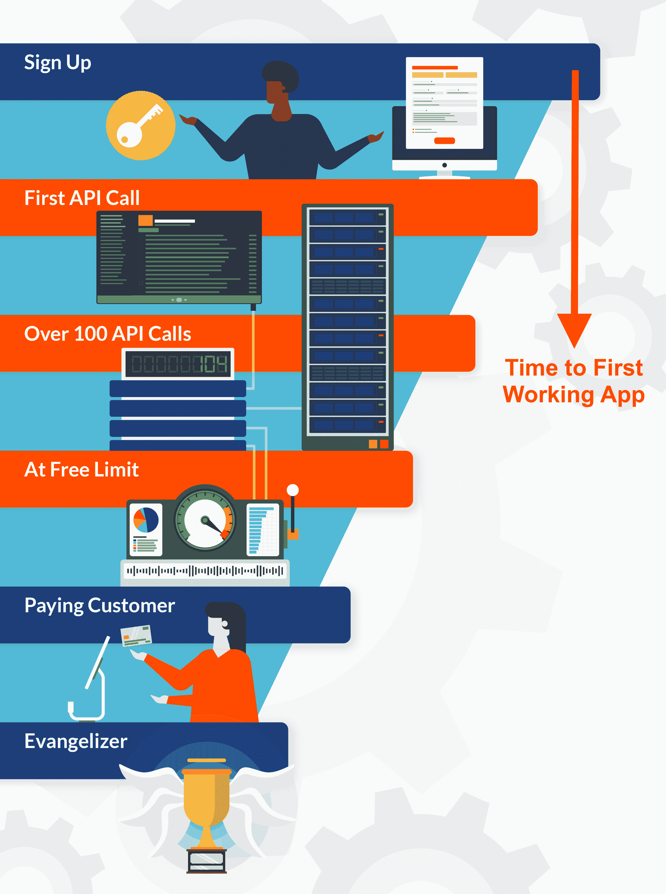
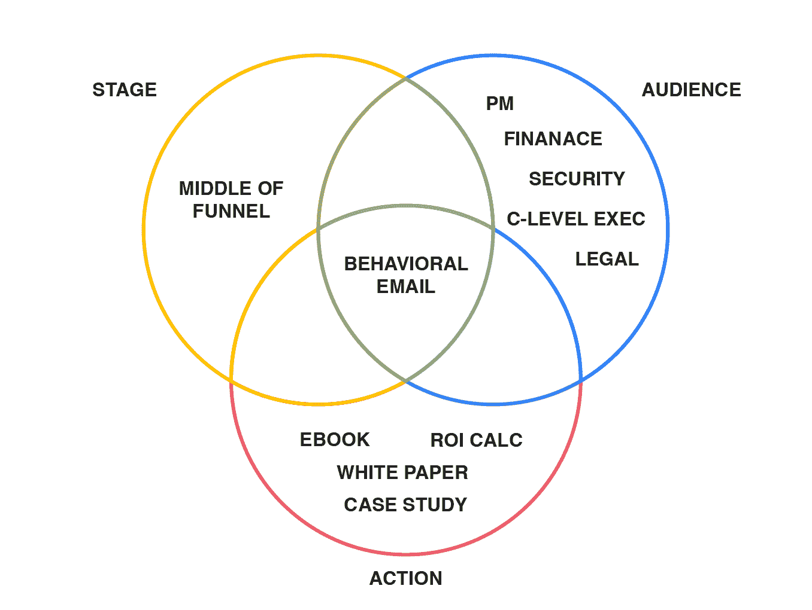

# 推动 API 集成的电子邮件营销活动

> 原文：<https://www.moesif.com/blog/developer-marketing/behavioral-emails/An-Email-Marketing-Campaign-that-Drives-API-Integration/>

最有效的营销策略之一是根据收件人的行为发送电子邮件。通过触发你的客户如何与你的产品互动，你能够分享与他们正在做的事情实际一致的内容，从而更有可能引起共鸣。

通过使用自动化的电子邮件工作流程，有可能与大批客户大规模共享超级相关的内容。通过基于行为标准的细分，而不是人口统计/公司地理标准，你可以摆脱一成不变的静态滴水活动，将基于客户的营销提升到一个新的水平。

在我们自己的客户群中，我们使用复杂的电子邮件工作流已经有一段时间了。我们发现，那些通过整合漏斗从沙盒阶段进入生产阶段的人与目标电子邮件内容**的互动是那些没有进步的人的两倍**。此外，通过优化内容，我们能够将**的参与度提升 3 倍**，从而提高了采用漏斗。

## 漏斗中部优化

在一篇配套的博客文章中，[如何加速 API 与行为电子邮件和开发者细分的集成](https://www.moesif.com/blog/technical/behavioral-emails/How-To-Accelerate-API-Integration-with-Behavioral-Emails-and-Developer-Segmentation/#steps-to-speed-api-integration?utm_source=blog)我们研究了行为电子邮件如何在集成漏斗的每个阶段驱动客户。在这篇博文中，我们专门关注漏斗(MOF)阶段的中期——在这个阶段，客户已经注册并提出了他们的第一个 API 请求，但有些事情阻碍了他们将应用程序投入生产。他们仍然处于沙盒阶段。

从最初注册到推广到生产的时间有时被称为第一个工作应用程序的时间或第一个付费应用程序的时间。API 平台提供商希望优化这一指标，并最大限度地增加投入生产的客户数量。

## 关注行为细分

在 MOF 阶段，在完成企业销售之前，通常需要争取许多不同的利益相关方。现在是时候展示你的产品带来的价值，并帮助消除任何可能阻碍决策者的障碍。

行为邮件应该在正确的时间向正确的受众提供正确的内容，这样才最有效。主要受众成员包括产品经理(项目经理在确定功能、路线图、跨学科管理、文档等方面发挥关键作用)、总委员会(GCs 关注法律合规性)、CSO(安全审查)、CFO(财务分析)和 CEO(战略契合度)。此外，开发人员需要辅助材料和工具来帮助他们解决集成问题，以及功能和性能测试支持。

## 真实世界的结果:将应用从沙盒迁移到生产环境

Moesif 已经为数以千计的客户部署了 MOF 电子邮件工作流。通过跟踪用户与行为电子邮件的互动，并将其与我们自己的分析平台的数据相关联，我们能够准确地确定我们营销工作的有效性，如下表所示。

| 电子邮件区 | 主题 | 观众 | 开放率 | 协助皈依 |
| --- | --- | --- | --- | --- |
| 特色亮点 | 仪表盘 | 首相 | ——+ | ——+ |
| 援助 | 设计评论 | 偏差 | ——+ | ——+ |
| 个案研究 | 推动采用 | 首相 | +—— | ——+ |
| 特色亮点 | 可量测性 | 首相 | ——+ | —+— |
| 特色亮点 | 客户沟通 | 首相 | ——+ | —+— |
| ROI 计算 | 构建与购买 | 首席财务官(Chief Finance Officer) | —+— | +—— |
| 个案研究 | 公司洞察 | 首席执行官 | +—— | +—— |
| 安全性* | 数据完整性 | 计算机服务机构(Computing Services Office) | ——+ | +—— |
| 合规* | 开发人员采用 | 车底距地高(Ground Clearance) | —+— | +—— |

*估计由于没有足够的数据

我们发现，展示我们 API 产品价值并推动转化的最佳方式是通过[案例研究](https://www.moesif.com/casestudies?utm_source=blog)和[特色](https://www.moesif.com/features/api-dashboards?utm_source=blog) [亮点](https://www.moesif.com/enterprise/api-analytics-infrastructure?utm_source=blog)。通过展示我们的 API 平台如何满足其他客户的需求，以及提供了哪些高级功能，那些处于集成漏斗中的人看到了他们可以通过我们的产品实现什么，以及我们如何解决他们的痛点。

如果我们观察所有经历过该工作流程的客户，我们会发现，那些将应用投入生产的人打开电子邮件并与之互动的次数是那些停留在沙盒阶段的人的两倍。开发生产应用程序的客户的电子邮件打开率为 59%，大约是那些留在沙盒中的客户的两倍。参与度与转化率成正比。

## 通过行为电子邮件提高漏斗转化率

行为电子邮件工作流的功效已经在现实世界的例子中展示出来。通过在点滴序列中使用有针对性的电子邮件，我们已经能够提高我们的转化率，并减少我们的客户的*时间到第一个工作应用*。