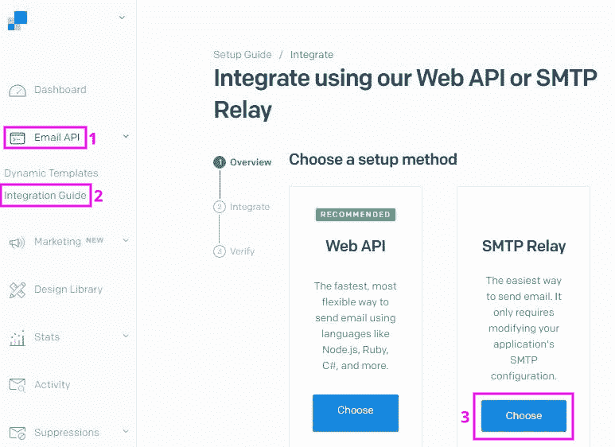
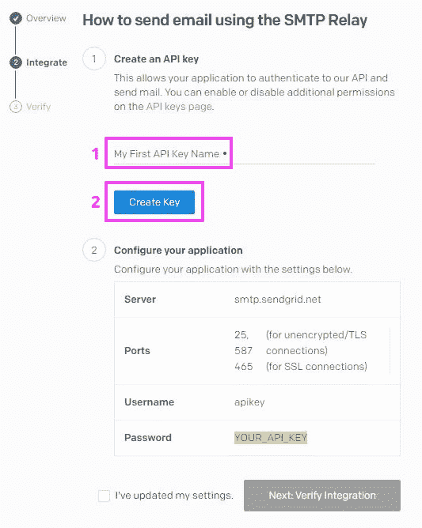
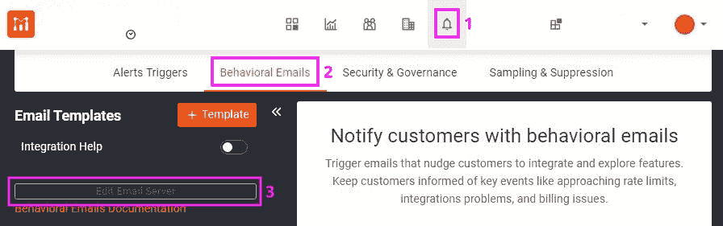
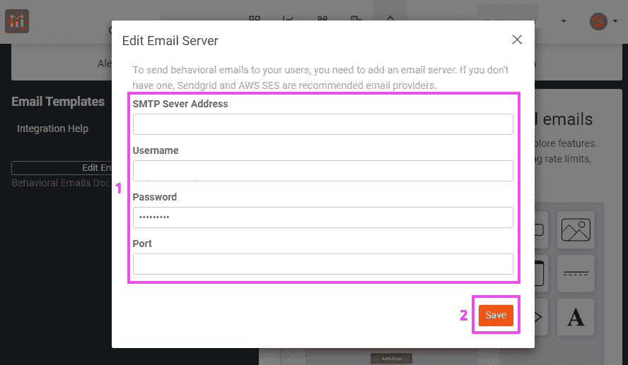
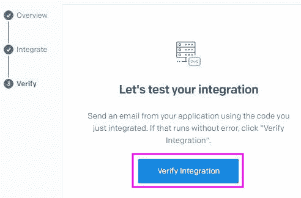
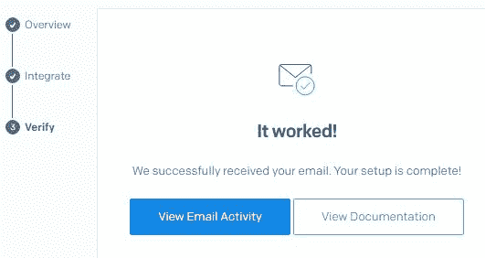

# 使用 Sendgrid 和 Moesif API Analytics 发送行为电子邮件

> 原文：<https://www.moesif.com/blog/developer-marketing/behavioral-emails/Using-Sendgrid-with-Moesif-API-Analytics-to-Send-Behavioral-Emails/>

在本指南中，您将学习如何使用 Sendgrid 发送 Moesif 行为电子邮件。

[Moesif 行为电子邮件](https://www.moesif.com/features/user-behavioral-emails)是一项根据客户的 API 使用情况自动向客户发送电子邮件的功能。这可用于通知客户有关技术问题，如达到速率限制、使用废弃的 API 或集成中断。您甚至可以使用它来触发与业务相关的事件，比如某个商品何时发货。如果某个东西可以映射到一个 API 调用，那么你可以从它发送一封电子邮件。

在[的配套文章](https://www.moesif.com/blog/technical/behavioral-emails/How-To-Accelerate-API-Integration-with-Behavioral-Emails-and-Developer-Segmentation/)中，我们介绍了如何在 Moesif 仪表板中配置行为电子邮件。

Sendgrid 是一项托管电子邮件服务。他们提供了一个 API 来向你的用户发送电子邮件，并为你托管 SMTP 服务器。

## 先决条件

该操作指南需要一个 [Moesif 账户](https://www.moesif.com/wrap?onboard=true)和一个 [Sendgrid 账户](https://signup.sendgrid.com/)。

## 设置电子邮件服务器

设置电子邮件服务器的第一步是从 Sendgrid 获取 SMTP 凭证。

为此，您必须登录到 Sendgrid [仪表板](https://app.sendgrid.com)。

下面的屏幕截图说明了如何导航到凭据。

这将启动一个向导，引导您完成 Sendgrid API 密钥的创建，为您提供 SMTP 凭证，并测试一切是否按预期工作。

API 键需要一个名称来创建。生成的 API 密钥将是您的 SMTP 密码。

这些凭证必须输入到 Moesif 电子邮件服务器配置表中。

要导航到该表单，请遵循下一个屏幕截图中的步骤。

您可以将凭证从 Sendgrid 站点复制并粘贴到 Moesif 站点。

如果 SSL 端口有问题，可以使用端口 587。

Moesif 表单如下所示:

## 测试设置

然后，您可以使用 Moesif 通过新配置的 SMTP 服务器发送一封示例电子邮件。

配置完邮件服务器后，您必须创建一个新的电子邮件模板:

对于新模板，您必须填写必填字段:模板名称、主题行和发件人电子邮件地址。

在 Sendgrid 控制台中按 verify integration，Sendgrid 将等待您发送测试电子邮件。

之后，点击 Moesif 网站上的“测试”按钮，输入目标电子邮件。

然后，Sendgrid 控制台将确认 SMTP 连接工作正常。

## 摘要

用 Sendgrid 设置 Moesif 行为邮件只需要几分钟。

使用像 Sendgrid 这样的服务可以缓解发送电子邮件时可能出现的许多常见问题，例如验证问题和电子邮件被错误地识别为垃圾邮件。

通过将 Moesif 的行为电子邮件服务与 Sendgrid 相结合，您能够让您的 API 消费者及时了解重要的问题。