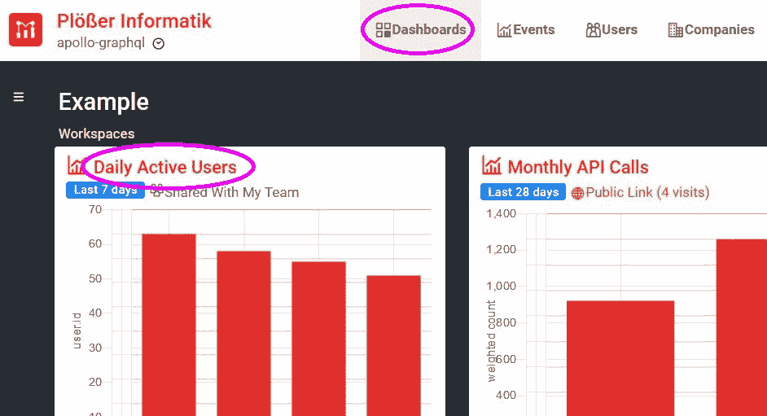
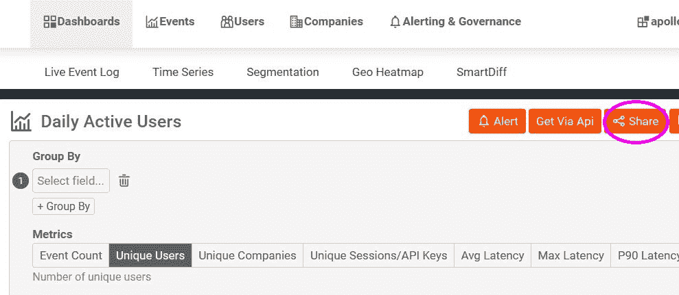
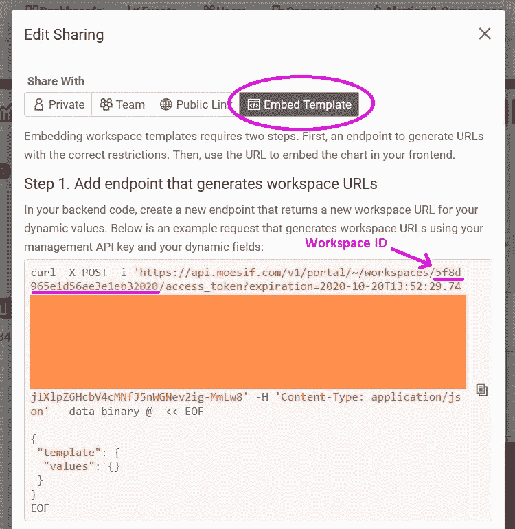

# 向客户嵌入具有表面反应指标的仪表板

> 原文：<https://www.moesif.com/blog/technical/dashboard/Embedding-Dashboards-with-React-to-Surface-Metrics-to-Customers/>

嵌入式仪表板是一种简单的方式，可以让您在团队中以及与客户分享从 Moesif 获得的见解。您定义指标，构建仪表板，然后在您的开发人员门户中共享它们，按公司或用户进行筛选。

从技术角度来看，它们只是可以显示在网页某处 iframe 中的网站。但是，为了防止用户看到来自其他用户的数据，在完成所有授权检查之后，您必须在后端获取仪表板 URL。

在一篇配套的博客文章中，我们向您展示了如何创建一个定制的仪表板，以及如何用您的数据讲述一个故事。在这篇文章中，我们将在 React 应用程序中嵌入一个 Moesif 仪表板。我们将创建一个获取仪表板 URL 的后端和一个基于 React 钩子的 React 组件，它与我们的后端对话。

## 先决条件

按照这个方法，你需要[一个 Moesif 账户](https://www.moesif.com/wrap?onboard=true)和[节点. js](https://nodejs.org/en/) 。

## 正在初始化项目

要初始化新项目，您必须运行以下命令:

```py
$ mkdir moesif-dashboard
$ cd moesif-dashboard
$ npm init -y 
```

## 创建后端

我们将使用 Express 创建一个后端，并将 Axios 作为 HTTP 客户端，与 Moesif dashboard 服务进行对话。后端将服务于前端和我们的仪表板的 URL。首先，我们需要安装软件包:

```py
$ npm i axios express 
```

之后，我们可以创建一个包含以下内容的`server.js`文件:

```py
const axios = require("axios");
const express = require("express");
const fs = require("fs");

const clientHtml = fs.readFileSync(__dirname + "/client.html");

const app = express();

app.get("/", (request, response) => response.end(clientHtml));
app.get("/dashboards/:worspaceId", async ({ params, user }, response) => {
  const url = `https://api.moesif.com/v1/portal/~/workspaces/${params.workspaceId}/access_token`;
  const body = { template: { values: { company_id: user.companyId } } };
  const headers = { Authorization: "<MOESIF_AUTH_TOKEN>" };
  const { data } = await axios.post(url, body, { headers });
  response.end(JSON.stringify(data));
});

app.listen(8888); 
```

`GET /dashboards/:workspaceId`路由将把我们的工作空间 URL 传递给客户机，以便在 iframe 中使用它。

你必须用你自己的替换掉`<MOESIF_AUTH_TOKEN>`。

`company_id`将是为一家公司过滤仪表板的动态值。

在 Express 中，认证通常通过一些中间件来完成，表示为`authMiddleware()`。它查看请求，以某种方式验证它，并向请求对象添加一个用户对象。用户对象有一个`companyId`属性，用于从 Moesif API 获取仪表板 URL。

该路线有一个用于`workspaceId`的参数。此参数使路线更加灵活。它现在可以为不同的仪表板提供 URL。

Moesif API 返回带有一个`access_token`和一个`url`的 JSON，我们简单地将它们传递给我们的后端客户端。通过该 URL 可以访问由一家公司筛选的单个仪表板；这样，我们可以防止用户访问他们不应访问的仪表板。

## 创建前端

前端将是一个简单的反应应用程序。用以下代码创建一个`client.html`:

```py
<!DOCTYPE html>

<title>Embedded Dashboard</title>

<div id="app"></div>

<script src="https://unpkg.com/react@16.13.1/umd/react.production.min.js"></script>
<script src="https://unpkg.com/react-dom@16.13.1/umd/react-dom.production.min.js"></script>
<script src="https://unpkg.com/@babel/standalone@7.11.6/babel.js"></script>

<script script type="text/babel">
  function App() {
    return (
      <div>
        <h1>Embedded Dashboard</h1>
        <Dashboard workspaceId="<WORKSPACE_ID>" />
      </div>
    );
  }

  function Dashboard({ workspaceId }) {
    const [dashboardUrl, setDashboardUrl] = React.useState("");

    React.useEffect(() => {
      fetch("/dashboards/" + workspaceId)
        .then((r) => r.json())
        .then(({ url }) => setDashboardUrl(url));
    }, [workspaceId]);

    return (
      <iframe src={dashboardUrl} frameborder="0" noresize="noresize"></iframe>
    );
  }

  ReactDOM.render(<App />, document.getElementById("app"));
</script> 
```

这里的`Dashboard`组件是必不可少的。它需要一个`workspaceId` prop 从我们的后端获取仪表板 URL。`useEffect`钩子会跟踪这个道具；每次有新值进来，它都会从后端获取仪表板 URL。这样，我们可以为不同的仪表板创建组件的多个实例，并且我们还可以通过组件的一个实例来更改当前仪表板。

## 链接嵌入式仪表板

下一步是从我们想要嵌入的仪表板中收集 worksapce IDs。要找到这些 id，您必须导航到 Moesif 控制台的“仪表板”页面。在那里你必须选择一个你想要整合的仪表板，然后点击它的标题。

<noscript></noscript>


在仪表板的详细信息页面上，您必须点击右上角的橙色“共享”按钮。

<noscript></noscript>


选择“共享并嵌入模板”。从那里，您可以提取工作区 ID，这是我们的仪表板组件所需要的，就在 cURL 示例中。

<noscript></noscript>


## 使用应用程序

要使用这个示例，您必须使用 Node.js 运行服务器:

```py
$ node server.js 
```

前端将在 [http://localhost:8888/](http://localhost:8888/) 可用。

## 摘要

如果您有一个用 React 创建的开发人员门户，那么在其中嵌入一个仪表板是非常容易的。您可以创建一个`Dashboard`组件，封装从服务器获取仪表板 URL 所需的所有客户端逻辑，并在 iframe 中显示它。

如果你想让它可配置不同的仪表盘，你得给它一个`workspaceId`作为道具；然后，您可以在多个地方使用它来加载不同的仪表板。