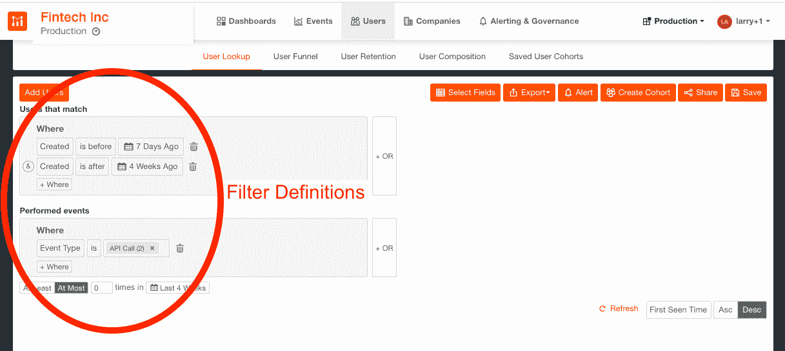
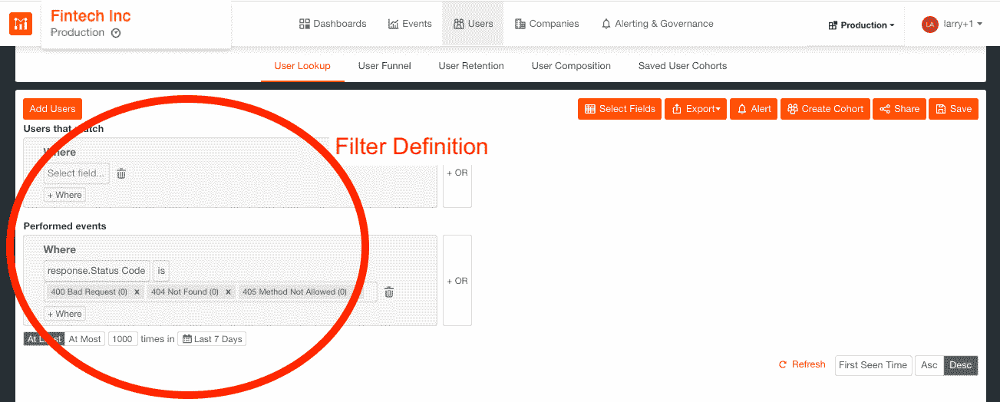
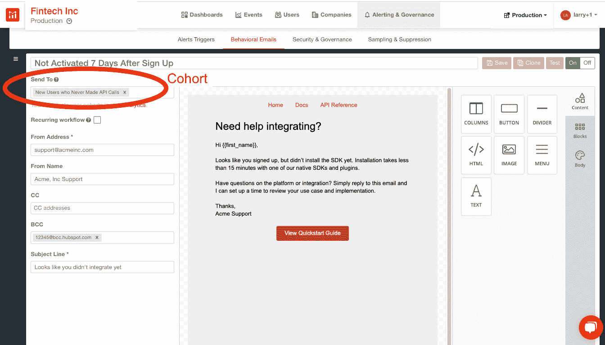
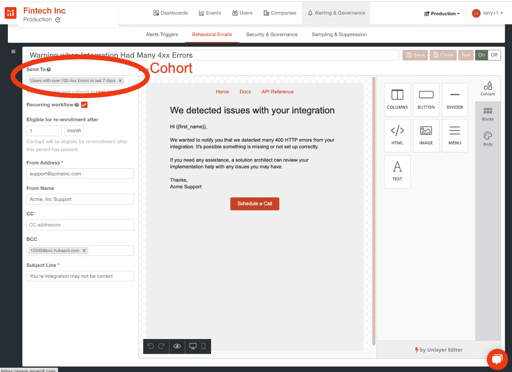

# 如何指导客户使用 Moesif 自动集成 API

> 原文：<https://www.moesif.com/blog/developer-marketing/behavioral-emails/How-to-Guide-Customers-on-API-Integration-Automatically-With-Moesif/>

你有一个开发人员正在采用的 API 程序；客户已经注册，但有些还没有集成；在那些已经整合的公司中，有一些很早就陷入困境，没有了声音；理想情况下，您希望帮助这两组客户通过开发人员漏斗。

Moesif 可以充当开发人员的催化剂，在他们遇到挫折并放弃之前主动通知他们集成问题。确保他们有良好的体验-尽快解除对客户的封锁。

## 用例

吸引顾客尝试你的产品通常只是成功的一半。在[开发者漏斗](https://www.moesif.com/blog/technical/api-analytics/Mastering-API-Analytics-for-API-Programs-Chapter-1/)中有许多阶段将这些线索转化为付费客户并最终转化为传播者。

你可能已经有客户注册了你的 API 产品，但是没有更进一步。如果他们从未尝试过你的产品，那么所有让他们进入漏斗顶端的销售和营销努力都是徒劳的。为了激励他们行动起来，在注册 7 天后给他们发一封自动邮件，提醒他们还没有融入。并将他们放入一个 [drip campaign](https://www.moesif.com/blog/technical/behavioral-emails/How-To-Accelerate-API-Integration-with-Behavioral-Emails-and-Developer-Segmentation/) ，这将向他们发送关于产品特性和常见开发者问题的有用信息。你可以挽救沉没成本，并通过一些明智的推动来扭转这些客户。

类似地，当开发人员第一次集成您的 API 时，他们很可能会遇到您的产品无法工作或者没有数据显示的时候。这通常是由于不正确的实现或客户端错误。如果什么都不做，挫折感会增加，客户可能会流失。

积极主动地让您的客户在他们的平台上更加成功，并降低他们离开的可能性。通过监控 HTTP 状态代码错误，当开发人员的实现收到太多 4xx 客户端错误时，向他们发送电子邮件，让他们知道错误的性质，以便他们可以轻松地找到解决失败调用的方法。

## 掌握客户 API 集成的行动手册

自动化重复过程是整个产品设计的一个关键属性。通过将有效载荷的可观察性与行为电子邮件相结合，Moesif 能够让您在许多功能、性能和产品问题的复杂工作流程中更加高效。

本演示行动手册重点关注您的客户在集成过程中可能遇到的问题，通过向您展示如何处理注册 7 天后仍未激活并在集成过程中收到过多 4xx 错误的用户，来具体说明 Moesif 的功能。

其他行动手册侧重于[保护您的 API 免受攻击和故意滥用](https://www.moesif.com/blog/developer-marketing/behavioral-emails/How-to-Secure-Your-API-Against-Attacks-and-Intentional-Misuse/)以及[配额和计费问题的自动通知](https://www.moesif.com/blog/developer-marketing/behavioral-emails/Automatic-Notification-of-Quota-and-Billing-Issues/)。这三部行动手册仅仅触及了我们平台的皮毛；一旦你掌握了创建自己的群组、指定触发事件和设计行为邮件的诀窍，你就会想知道在 Moesif 之前你都做了些什么。

## 配料清单

我们将使用 Moesif 的分析工具来构建这个应用程序。如果你还没有创建账户，你可以[免费注册](https://www.moesif.com/wrap?onboard=true)。

## 行动手册创建的步骤

行动手册包括工作流、sop 和文化价值观，它们共同形成了一个一致的反应—行动。不管你想达到什么目的，Moesif 行动手册包含两个关键要素:团队规范和电子邮件创建。

### 群组规范

Moesif 将[用户](https://www.moesif.com/docs/getting-started/users/)和[公司](https://www.moesif.com/docs/getting-started/companies/)定义为不同的实体，这些实体可以被分组到共享相似标准的群组中。不同的群组包括共享类似领域的群组，例如:订阅计划、端点使用、请求代码等。正如之前的[教程](https://www.moesif.com/blog/announcements/features/Leveraging-User-Behavioral-Analytics-For-API-Analytics-Platforms/)中所解释的那样，通过对用户/公司人口统计数据和行为进行过滤，可以创建群组。

要创建新的用户群组，请转到 Moesif 工具的**用户>用户查找**部分，并从下拉菜单中选择与和*执行事件*匹配的*用户字段，如下所示。事件过滤器和用户/公司字段的完整列表可以在我们的[用户分析面板](https://www.moesif.com/docs/api-analytics/#event-filters)中找到。*

*注册后 7 天未激活*

如果客户在注册后的一段时间内(比如 7 天)还没有集成您的 API，那么提醒他们会很有帮助。通常，客户成功或解决方案工程部门将手动跟进这些客户和潜在客户，以确保他们成功完成试用或 POC。这可能会带来巨大的负担，并占用客户在教育或寻找其他机会等其他领域取得成功的时间。借助 Moesif，客户激活和指导可以实现自动化和规模化。

要创建一批注册账户后 7 天仍未激活的客户，请转到**用户>用户查找**部分:

*   从*匹配*的用户设置过滤器:
    *   `Created is before 7 Days Ago`、`&`、`Created is after 4 Weeks Ago`
*   从*执行的事件*设置过滤器:
    *   `Event Type is API Call(2)`
    *   时间段为`At Most 0 times in Last 4 weeks`，如下图。

*积分有太多 4xx 错误*

如果集成有太多 4xx 错误，这可能意味着客户做错了什么，可能需要解决方案工程师或支持人员的帮助。您可以让客户知道他们的实施有异常多的客户端(4xx)错误，这意味着可能需要进一步调查，而不是对每个客户都了如指掌。您的电子邮件应该提供一些关于可疑问题的自助资源，或者安排与解决方案工程师通话的方法。

根据您的内部工作流程，您可以使用 Moesif 的抄送或密件抄送直接自动抄送给负责该客户的解决方案工程师。

要创建在过去 7 天内收到过多 4xx 错误的群组，请转到**用户>用户查找**，并从*已执行事件*中选择过滤器:`response.Status Code`是`400 Bad Request (0)`、`404 Not Found (0)`或`405 Method Not Allowed (0)`，然后将时间段设置为`At Least 1000 times in Last 7 Days`，如下所示。

一旦设置了过滤器，Moesif 将查看所有当前和历史数据，并将所有符合过滤器标准的用户/公司组合在一起。我们还将监控用户/公司是否继续属于该群体，而无需任何人工干预。

然后，该群组可用于填充行为电子邮件中的收件人列表。

### 电子邮件创建

你可以使用拖放式所见即所得编辑器在 Moesif 中设计 HTML 邮件。要创建行为电子邮件，请转到 Moesif 工具的**警报和治理>行为电子邮件**部分。

第一步是添加一个新的**+模板**，其中模板包括电子邮件设计以及其他相关信息，例如哪些群组应该接收电子邮件。关于创建电子邮件模板的完整文档在[可用](https://www.moesif.com/docs/behavioral-emails/creating-email-templates/)，但可以说，电子邮件创建非常简单，一旦完成，可以使用**测试**按钮来验证电子邮件。

*注册后 7 天未激活*

只需将预定义的群组添加到行为电子邮件的收件人列表中，为那些进步停滞的人提供帮助:

每当新注册的客户没有在 7 天内整合，他们将自动被添加到队列中，并发送一封有用的电子邮件。

*新集成有太多 4xx 错误*

同样，只需将这一群客户添加到一封行为电子邮件中，警告他们他们的实施会收到大量 4xx 错误代码:

只要在过去 7 天内积分超过 1，000 4xx，特定客户将自动添加到队列中，并且将向这些客户发送警告电子邮件。

## 外卖食品

对于一个 API 优先的公司来说，减少成功集成和驱动价值所需的时间是非常重要的。借助我们的 SaaS 平台，我们努力让我们的客户尽可能高效。通过有效负载可观察性和行为电子邮件的结合，我们创建了自动化的警告流程，有助于推动您的客户进行集成，从而节省您的时间和资源。