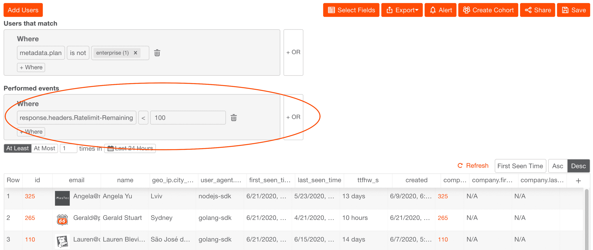
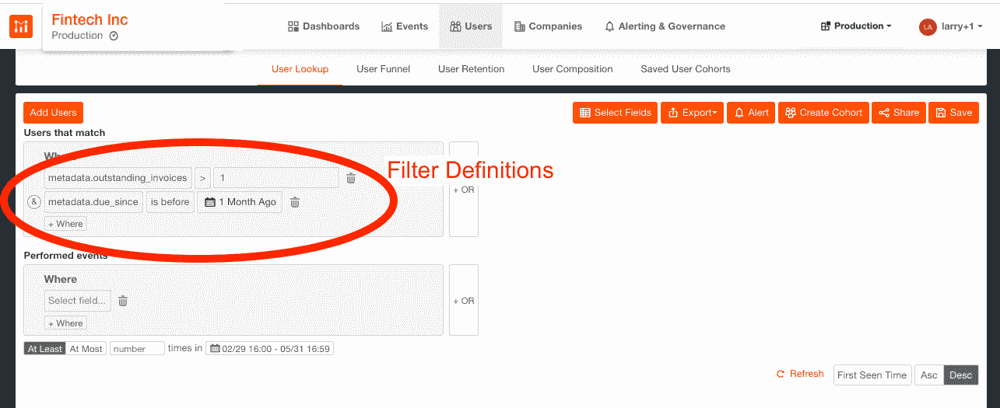
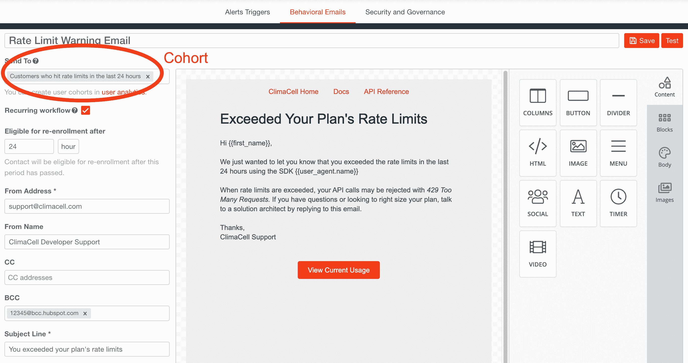
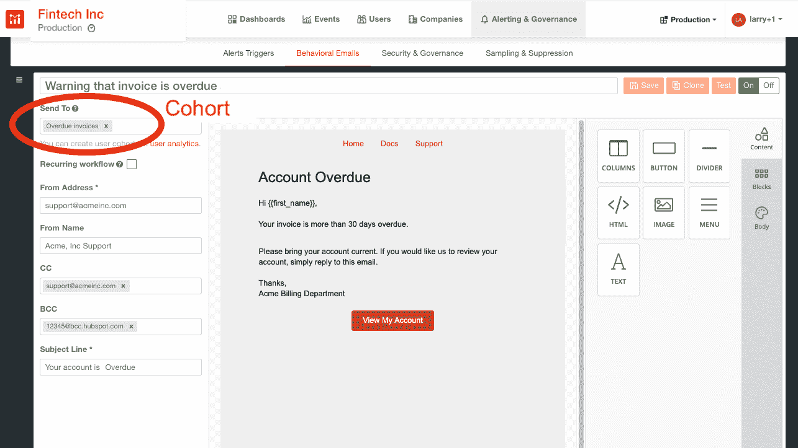

# 配额和计费问题的自动通知

> 原文：<https://www.moesif.com/blog/developer-marketing/behavioral-emails/Automatic-Notification-of-Quota-and-Billing-Issues/>

让你的顾客满意是最重要的。没有什么比在他们犯了一个无辜的错误后停止他们的服务更疏远他们了。本行动手册将引导您完成在配额或计费问题出现时让您的客户了解情况所需的步骤。

## 用例

我们都有过无意中未付的发票，或者莫名其妙地开始失控的实现。与其严厉打击并阻止你客户的服务，为什么不放他们一马，如果他们接近他们的 [API 费率限制](https://nordicapis.com/everything-you-need-to-know-about-api-rate-limiting/)或付款到期日，就给他们发个警告。

有了 Moesif 的[行为电子邮件解决方案](https://www.moesif.com/features/user-behavioral-emails),自动让您的客户保持知情是一个简单的过程；让他们有机会修改他们的实现或更改他们的订阅计划，同时确保您的 API 性能 SLA 不会失败。

在哪些情况下，您应该通知您的客户有关订购或费率限制的问题？

以下事件可能会导致超出配额:

*   有缺陷的客户实施
*   单个客户的流量突然增加，达到极限时，可能导致所有用户的服务中断
*   对您的 API 进行 DDoS 攻击，这会破坏您的服务器
*   当你的服务越来越受欢迎时，流量会出现意想不到的峰值

同样，如果出现以下情况，您的套餐可能不会续订:

*   信用卡账单有变化
*   财务部内部的联系人被调换
*   USPS 弄丢了支票

## 与 Moesif 建立更好的客户关系

客户成功管理可以通过提醒客户他们的 API 正在接近其计划的速率限制来改善客户关系。然后，在发送太多的请求错误响应之前，客户有机会调整他们的计划，或者修改 API 的参数。

大多数 API 网关如 Kong 和 NGINX 会在每个 API 调用上添加速率限制[插件](https://docs.konghq.com/hub/kong-inc/rate-limiting/) HTTP 响应头，这样速率限制就可以被开发者观察和设置。通过将 API 分析与 Moesif 的行为电子邮件相结合，通过一个简单的用户界面，扩展客户沟通的复杂功能浮出水面。

Moesif 的[集成](https://www.moesif.com/solutions/track-api-program?language=kong-api-gateway)与 Kong Gateway 的完整功能在一篇配套的[文章](/blog/technical/kong/How-to-Best-Monitor-Kong-Performance-and-API-Usage-with-the-Moesif-API-Analytics-Plugin/)中有详尽的解释。

## 自动通知配额和计费问题的行动手册

自动化重复过程是整个产品设计的一个关键属性。通过将有效载荷的可观察性与行为电子邮件相结合，Moesif 能够让您在许多功能、性能和产品问题的复杂工作流程中更加高效。

本演示行动手册重点关注您的客户可能会遇到的性能和订阅问题，通过向您展示如何处理接近其费率限制的用户或由于发票过期而可能被暂停帐户的用户，来具体说明 Moesif 的功能。

其他行动手册关注[如何保护您的 API 免受攻击和故意误用](https://www.moesif.com/blog/developer-marketing/behavioral-emails/How-to-Secure-Your-API-Against-Attacks-and-Intentional-Misuse/)以及[如何指导客户将 API 自动与 Moesif](https://www.moesif.com/blog/developer-marketing/behavioral-emails/How-to-Guide-Customers-on-API-Integration-Automatically-With-Moesif/) 集成。这三部行动手册仅仅触及了我们平台的皮毛；一旦你掌握了创建自己的群组、指定触发事件和设计行为邮件的诀窍，你就会想知道在 Moesif 之前你都做了些什么。

## 配料清单

我们将使用 Moesif 的分析工具来构建这个应用程序。如果你还没有创建账户，你可以[免费注册](https://www.moesif.com/wrap?onboard=true)。

## 行动手册创建的步骤

行动手册包括工作流、sop 和文化价值观，它们共同形成了一个一致的反应—行动。不管你想达到什么目的，Moesif 行动手册包含两个关键要素:团队规范和电子邮件创建。

### 群组规范

Moesif 将[用户](https://www.moesif.com/docs/getting-started/users/)和[公司](https://www.moesif.com/docs/getting-started/companies/)定义为不同的实体，这些实体可以被分组到共享相似标准的群组中。不同的群组包括共享类似领域的群组，例如:订阅计划、端点使用、请求代码等。正如之前的[教程](https://www.moesif.com/blog/announcements/features/Leveraging-User-Behavioral-Analytics-For-API-Analytics-Platforms/)中所解释的那样，通过对用户/公司人口统计数据和行为进行过滤，可以创建群组。

要创建新的用户群组，请转到 Moesif 工具的**用户>用户查找**部分，并从下拉菜单中选择与和*执行事件*匹配的*用户字段。事件过滤器和用户/公司字段的完整列表可以在我们的[用户分析面板](https://www.moesif.com/docs/api-analytics/#event-filters)中找到。*

*接近速率极限时的警告*

要创建一组接近其速率限制的用户，请转到**用户>用户查找**部分:

*   从*执行的事件*设置过滤器:
    *   `response.headers.Ratelimit-Remaining < 100`
    *   时间段为`At Least 1 times in Last 24 hours`，我们还将跳过企业计划中的用户，因为他们将获得更个性化的跟进:
*   从*匹配*的用户设置过滤器:
    *   `metadata.plan is not enterprise(1)`这显示在下面的屏幕截图中:

*账户逾期*

要创建一个订阅过期的群组，请转到**用户>用户查找**，从*用户中选择符合*过滤器的用户:`metadata.outstanding_invoices > 1`、`&`、`metadata.due_since is before 1 Month Ago`，如下所示。

一旦设置了过滤器，Moesif 将查看当前和历史数据，并将所有符合过滤器标准的用户/公司分组在一起。我们还将监控用户/公司是否继续属于该群体，而无需任何人工干预。

然后，该群组可用于填充行为电子邮件中的收件人列表。

### 电子邮件创建

你可以使用拖放式所见即所得编辑器在 Moesif 中设计 HTML 邮件。要创建行为电子邮件，请转到 Moesif 工具的**警报和治理>行为电子邮件**部分。

第一步是添加一个新的**+模板**，其中模板包括电子邮件设计以及其他相关信息，例如哪些群组应该接收电子邮件。关于创建电子邮件模板的完整文档在[可用](https://www.moesif.com/docs/behavioral-emails/creating-email-templates/)，但可以说，电子邮件创建非常简单，一旦完成，可以使用**测试**按钮来验证电子邮件。

*接近速率极限时的警告*

只需将预定义的群组添加到收件人的行为电子邮件列表中，警告其接近速率限制。为避免不断向客户发送垃圾邮件，请将重新注册标准设置为 24 小时:

现在，每当客户接近他们的利率限制，他们将自动被添加到队列中，并发出警告电子邮件。

*账户逾期*

同样，只需将您之前定义的一群客户添加到一封行为电子邮件中，提醒他们其订阅已过期:

每当订阅过期时，过期用户将被自动添加到群组中，并发送警告电子邮件。

## 外卖食品

借助我们的 SaaS 平台，我们努力让我们的客户尽可能高效。通过有效载荷可观察性和行为电子邮件的结合，我们为集成问题创建了自动化警告流程，为您节省了时间和资源。