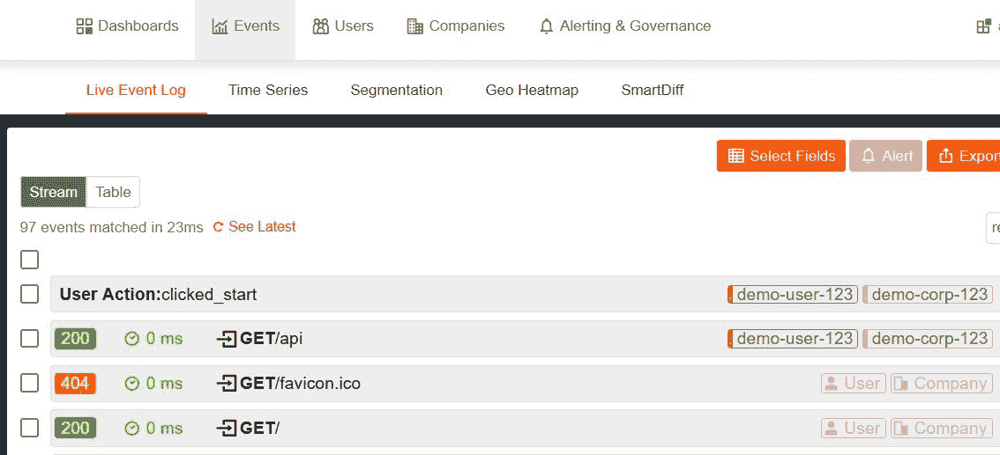
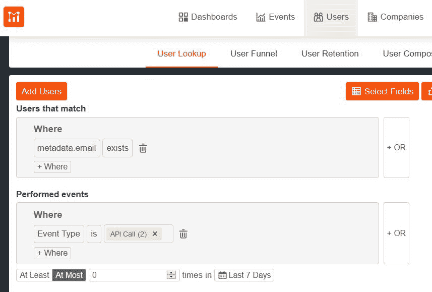
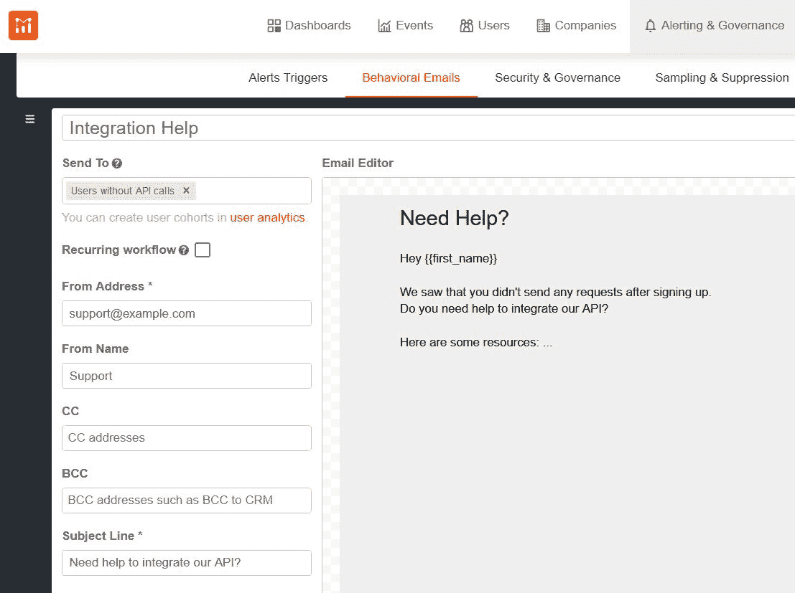

# 如何用 Nodejs 进行 Web 和 API 产品分析

> 原文：<https://www.moesif.com/blog/technical/api-analytics/How-To-Stand-Up-Web-And-API-Product-Analytics-With-Nodejs/>

本指南将带您了解如何通过跨平台分析来跟踪您的 API 和 web 应用程序中的客户行为。通过跟踪客户在 API 和 web 应用上的行为，您能够全面了解客户的旅程和指标，如首次 Hello World 的时间和价值实现时间。更多信息请见我们的博客文章，[追踪开发者从注册到第一次 API 调用的旅程](/blog/api-product-management/developer-journey/Tracking-a-Developer's-Journey-From-Visiting-Documentation-Visit-to-First-API-Call/)

然而，收集数据本身是不够的。毕竟，如果不付诸行动，就没有多大用处。这就是为什么我们会指导您如何根据客户的使用情况和行为，通过[行为电子邮件](https://www.moesif.com/features/user-behavioral-emails)使用这些数据向客户发送电子邮件。

> 专业提示:一个用户注册了，但从来没有集成或激活？向他们发送关于如何集成 API 的有用资源。

在一篇配套的[文章](/blog/technical/behavioral-emails/How-To-Accelerate-API-Integration-with-Behavioral-Emails-and-Developer-Segmentation/)中，我们写了如何在 Moesif 仪表板中配置行为电子邮件。在本文中，我们将介绍基于 Node.js 的 API 的整个设置过程。

# 先决条件

该操作指南需要一个 Moesif [账户](https://www.moesif.com)和 [Node.js](https://nodejs.org/en/) 。

# 项目设置

首先，我们需要用 NPM 创建一个新的 Node.js 项目:

```py
$ mkdir moesif-email
$ cd moesif-email
$ npm init -y && npm i express moesif-nodejs 
```

如果一切顺利，输出应该包括以下几行:

```py
- express@4.17.1
- moesif-nodejs@3.0.0 
```

在 Node.js 和 Express 的基础上，我们将建立我们的 API 和注册网站。Moesif SDK for Express 会将 API 监控数据发送到 Moesif 服务。

## 使用 Moesif 浏览器 SDK 创建网站

首先，我们需要创建一个网站。我们将使用 Moesif browser SDK 发送带有特定用户 ID 的客户端事件。这将在 Moesif 服务上创建一个新用户，并提供元数据，稍后，我们可以将用户链接到一个从网站发送的 API 请求。moesif-email/index.html 的代码如下所示:

```py
<script src="//unpkg.com/moesif-browser-js@^1/moesif.min.js"></script>

<h1>Demo API</h1>
<button id="start">Send client event</button>
<button id="api">Send API request</button>
<pre id="target"></pre>

<script type="text/javascript">
  moesif.init({ applicationId: "<YOUR_MOESIF_APP_ID>" });
  const userId = "demo-user-123";
  moesif.identifyUser(userId, {
    email: "<YOUR_EMAIL>",
    firstName: "Jane",
    lastName: "Doe",
  });
  document.getElementById("start").addEventListener("click", () => {
    moesif.track("clicked_start");
    document.getElementById("target").innerHTML = "clicked_start";
  });
  document.getElementById("api").addEventListener("click", async () => {
    const response = await fetch("/api", {
      headers: { Authorization: userId },
    });
    const json = await response.json();
    document.getElementById("target").innerHTML = JSON.stringify(json, null, 2);
  });
</script> 
```

我们包含了 Moesif browser SDK，创建了两个按钮并将它们与两个动作链接起来，发送一个客户端事件和一个 API 请求。SDK 是用 userId 配置的，所以 Moesif 知道是谁发送了客户端事件。不要忘记将`<YOUR_MOESIF_APP_ID>`替换为您实际的 Moesif 应用 ID，将`<YOUR_EMAIL>`替换为您自己的电子邮件。

客户端动作使用浏览器 SDK 将网站上发生的事情告诉 Moesif。在这种情况下，单击按钮。这与我们的 API 无关，但以后可能会很有趣。例如，当用户通过网站注册，但随后没有发送任何请求。

API 请求将使用授权头告诉 API 关于用户 Id 的信息。通过这种方式，Moesif 可以在以后将客户端事件与 API 请求联系起来。

## 使用 Moesif Express SDK 创建 API

下一步是 API 服务器。我们将使用 [Express 框架](https://expressjs.com/)来构建它。这也将服务于我们在最后一步中创建的网站。

moesif-email/index.js 的代码应包含以下内容:

```py
const fs = require("fs");
const express = require("express");
const moesif = require("moesif-nodejs");
const website = fs.readFileSync(__dirname + "/index.html");

const app = express();
app.use(
  moesif({
    applicationId: "<YOUR_MOESIF_APP_ID>",
    logBody: true,
    identifyUser: ({ headers }) => headers.authorization,
  })
);
app.get("/", (request, response) => response.end(website));
app.get("/api", (request, response) =>
  response.end(JSON.stringify({ timestamp: Date.now() }))
);
app.listen(8888, () => console.log(`Running at http://localhost:8888`)); 
```

首先，我们加载 index.html，然后我们可以创建一个 Express 应用程序，并将其配置为使用 Moesif Express SDK 作为中间件。您需要用您实际的 Moesif 应用程序 ID 替换`YOUR_MOESIF_APP_ID`。

## 测试 API

要测试 Express API，我们必须使用以下命令启动服务器:

```py
$ node . 
```

这将输出以下行:

```py
Running at http://localhost:8888 
```

如果一切顺利，我们可以用浏览器导航到`http://localhost:8888`，查看我们的网站并点击按钮。一个将发送客户端事件，另一个将发送 API 请求。



图 1:实时事件日志

如果您现在导航到 Moesif 仪表板，在那里您得到了`YOUR_MOESIF_APP_ID`,并点击顶部的“Events”选项卡，您应该看到四个不同的事件，如上面的图 1 所示。

用户动作事件是客户端事件。GET /api 事件是我们发送给 api 的请求。它们都标注了用户名和公司。另外两个事件是关于浏览器加载网站和 favicon 的请求。包含它们是因为我们使用与 API 相同的 Express 服务器交付网站，但是由于请求缺少授权头，我们没有得到用户或公司注释。


图 2:用户总结

如果您单击用户，您会看到他们的“用户摘要”,其中包括该用户的电子邮件地址，如图 2 所示。

# 设置行为电子邮件

既然我们已经创建了我们的 API，并且知道它收集数据，我们可以[设置行为电子邮件](https://www.moesif.com/docs/behavioral-emails/creating-email-templates/)。

## 创建群组

发送电子邮件的第一步是创建一个群组，即一组符合特定标准的用户。这些标准可以包括人口统计信息，如地理位置，但也包括执行的事件。

为此，我们需要转到用户查找。要访问该页面，请单击顶部导航栏中的“用户”链接，然后单击第一个导航栏下方第二个导航栏中的“用户查找”链接。



图 3:用户查找

您现在看到的视图应该类似于图 3 中的屏幕截图。

我已经在截图中为我们的队列添加了一些标准。该群组中的用户应该有一封电子邮件，并且在过去 7 天中应该没有 API 调用。您可以复制该设置，单击“创建群组”，并将其命名为“没有 API 调用的用户”。

## 创建电子邮件模板

根据群组定义，我们告诉 Moesif 用户应该满足什么标准才能获得电子邮件，或者用户必须做什么或不能做什么才能加入群组。

如果您导航到“警报和治理”，然后导航到“行为电子邮件”，您可以配置您的 SMTP 服务器并创建用于通知您的用户的电子邮件模板。



图 4:电子邮件模板创建

图 4 显示了电子邮件模板创建的屏幕截图。在“发送至”下，您可以选择您的群组。如果你选择“循环工作流”，Moesif 不会只发送一次邮件，而是在特定的时间间隔内检查用户是否满足标准，是否应该收到新邮件。

# 摘要

将端到端分析添加到基于 Express 的 Node.js API 和网站中，只需要 Moesif 的几行代码。

Moesif 浏览器和 Node.js SDKs 使您能够跟踪从初始注册到最后一次 API 调用的所有内容。这允许您将用户来自的渠道与 API 的实际使用联系起来，以便稍后可以分析整个用户旅程。

通过行为电子邮件，你可以使用这些信息自动通知你的用户任何与 API 使用相关的事情。使用 Moesif 发送有用的电子邮件。