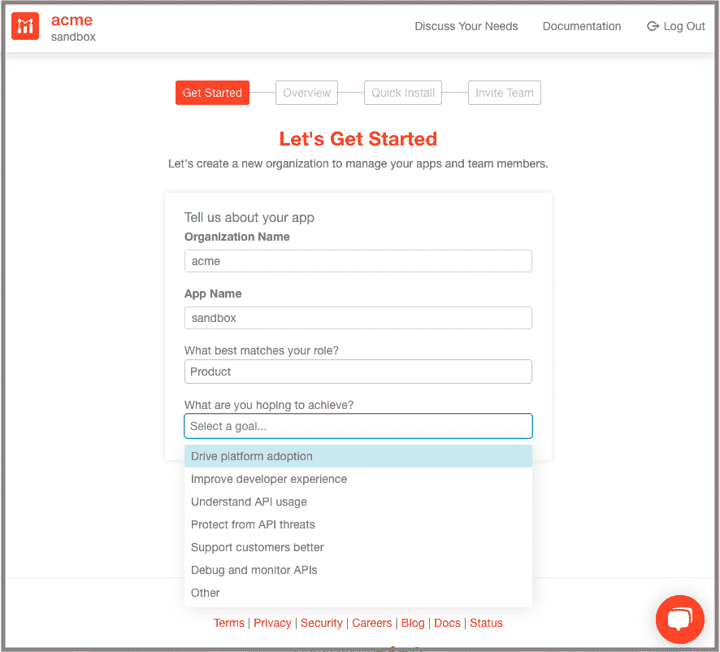
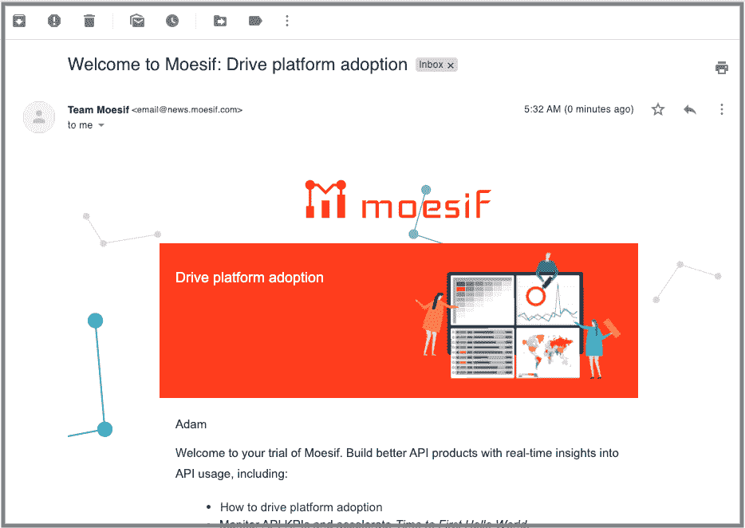
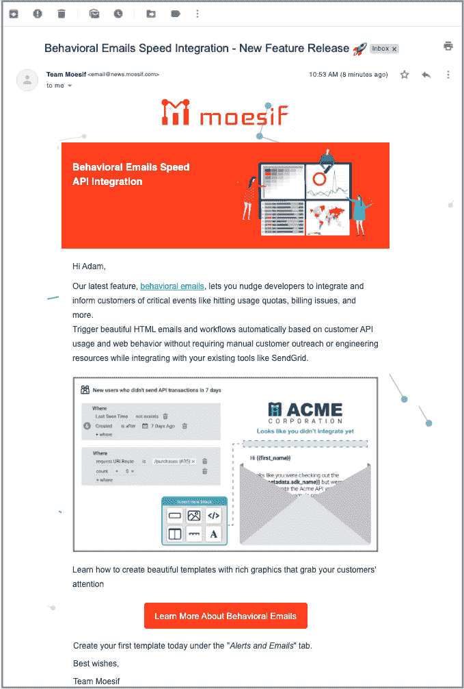

# 每个开发者工具都应该使用的 5 大行为邮件

> 原文：<https://www.moesif.com/blog/developer-marketing/behavioral-emails/Top-Five-Behavioral-Emails-Every-Developer-Tool-Should-Have/>

使用行为邮件，让你的打开率翻倍。

吸引客户的最佳方式是分享能引起共鸣的内容。没有什么比根据开发人员自己的行动和行为向他们发送有针对性的电子邮件更能引起共鸣了。

在一篇配套的博客文章中，[行为电子邮件加速 API 集成](https://www.moesif.com/blog/technical/behavioral-emails/How-To-Accelerate-API-Integration-with-Behavioral-Emails-and-Developer-Segmentation)，我们解释了行为驱动的开发人员拓展如何加速 API 产品公司的 API 集成。但是，让开发者和产品经理集成你的 API 优先平台的最佳电子邮件到底是什么呢？

我们检查了数千封发给我们自己客户的电子邮件，发现当我们将电子邮件的重点从人口统计/公司地理问题(公司规模和垂直、角色、位置等)转移到行为问题(开发人员漏斗阶段、端点问题、产品利用率、费率限制等)时，我们实现了打开率翻倍，API 上线率显著增加。通过在正确的时间将正确的内容发送给正确的人，我们能够改善我们的整体开发人员体验。

每个 API 平台公司都应该使用的五大行为邮件如下:

## 1.按目标划分的欢迎电子邮件

在注册您的服务时，询问您的潜在客户他们希望通过您的平台实现什么。例如，在我们的入职工作流程中，我们的第一步是询问他们的目标:

在他们的欢迎邮件中，清楚地表明你倾听了他们的关键问题——解释你的产品如何满足他们的需求。使用合并标签或个性化标记，并将相同密钥问题插入到电子邮件的主题行甚至标题中，如下所示。

## 2.基于 API 使用的开发人员集成电子邮件

因为 API 优先的公司最终对推动集成最感兴趣，所以衡量开发者在他们的集成漏斗中的位置，并相应地定制你的电子邮件，以更好地指导开发者的旅程。衡量他们所处阶段的最佳方法是查看 API 调用的数量。将电子邮件信息分为三组:整合漏斗的顶部、中部和底部，我们得到:

| API 调用的次数 | 整合阶段 | 电子邮件主题 |
| --- | --- | --- |
| 前 7 天没有 API 调用 | 顶端 | 文档和行动手册的集成帮助 |
| 每天少于 1，000 次 API 调用 | 中间 | 沙盒->包含案例研究的产品 |
| 每天超过 1，000 次 API 调用 | 底部 | 追加销售高级功能 |

要了解更多细节，请参见我们的同伴博客文章中关于[基于使用的电子邮件](https://www.moesif.com/blog/technical/behavioral-emails/How-To-Accelerate-API-Integration-with-Behavioral-Emails-and-Developer-Segmentation/#3-usage-based-emails)的部分。

## 3.订阅计划通知

自助式 API 平台需要随着用户数量的增加而经济地扩展。在 SaaS，最大的管理难题之一往往是处理订阅问题。通过跟踪 API 调用量，可以自动处理配额和计划调整:

| API 度量 | 电子邮件主题 |
| --- | --- |
| 接近计划定额 | 计划警告 |
| 超计划定额 | 计划升级 |
| 用户平均水平 | 速率极限 |

## 4.细微的错误警告

服务水平协议(SLA)、维护通知和错误警告通常由法律协议管理。不遵守这些约定可能会导致从不良客户关系到经济处罚的各种后果。通过深入研究 API 平台本身，可以根据细微的 API 指标发送电子邮件警告:

| API 度量 | 电子邮件主题 |
| --- | --- |
| 在过去 Z 小时内，端点 Y 上出现超过 X 个错误 | 检查端点 Y 的错误警告 |
| 使用过时或易受攻击的 SDK | 升级警告 |
| 中断供应 | 全球断电警告 |
| 平台漏洞 | 易受平台警告影响的客户子集 |
| 超过 400/500 错误流或 SLA | 检查集成的错误警告 |

## 5.新功能电子邮件

让客户了解最新和最棒的平台功能通常是保持互动的可靠方法。对于那些处于集成漏斗底部的人(生产中的人)来说尤其如此，因为他们会欣赏任何可能使他们的生活更轻松的新平台功能。事实上，当我们使用下面的通知宣传我们的新行为电子邮件功能时，我们看到电子邮件参与度随着客户使用我们平台的活跃程度而上升。

## 通过行为电子邮件提高参与度并推动采用

使用本指南作为模板，创建您自己的获胜电子邮件活动。我们发现，通过使用前 5 名行为电子邮件，我们能够将打开率提高一倍，并加速整合…