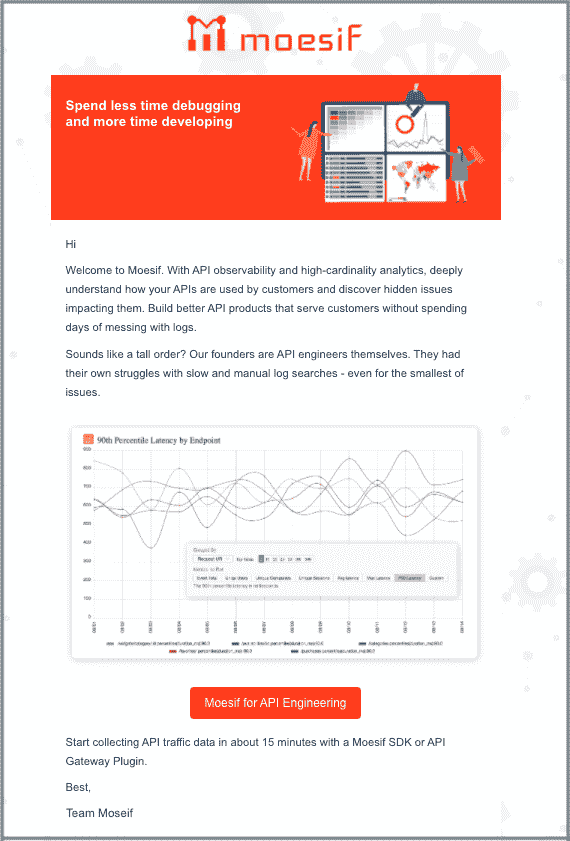
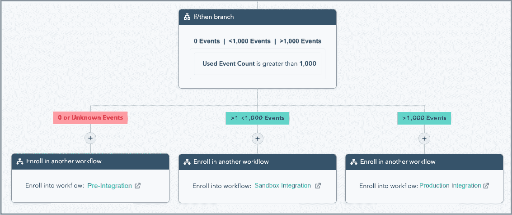
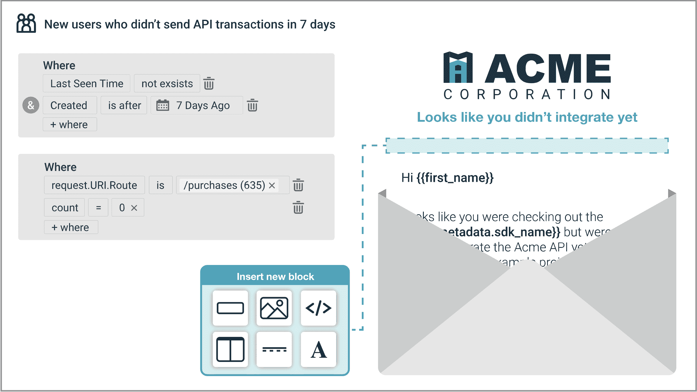
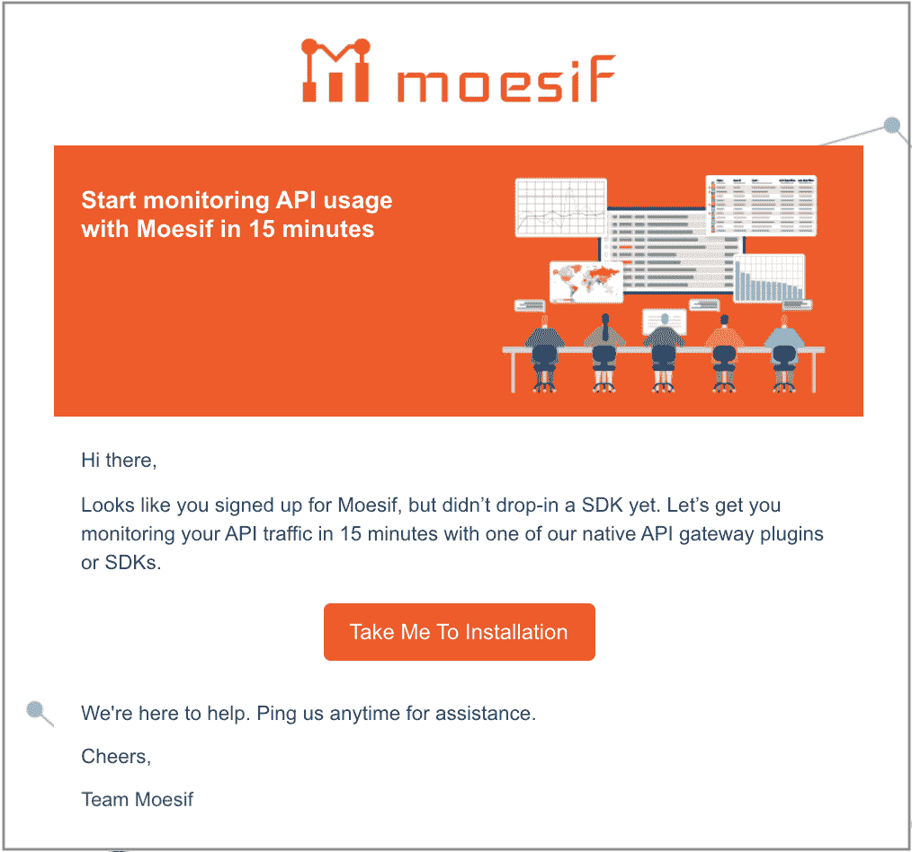
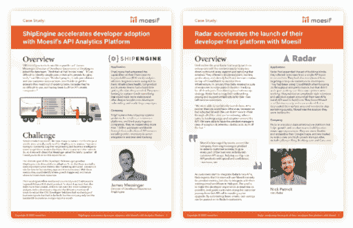
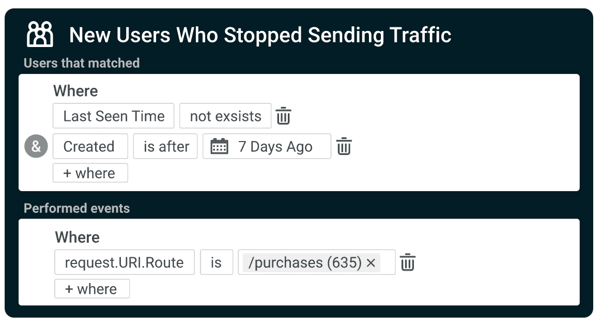
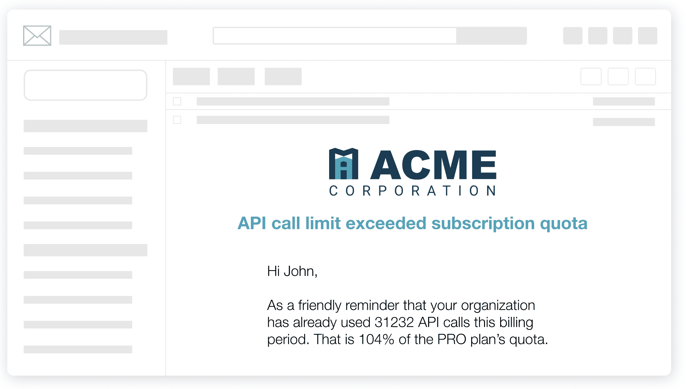

# 如何加速 API 与行为邮件和开发人员细分的集成

> 原文：<https://www.moesif.com/blog/technical/behavioral-emails/How-To-Accelerate-API-Integration-with-Behavioral-Emails-and-Developer-Segmentation/>

行为电子邮件是以用户为中心的平台集成的基石——给开发者的电子邮件在基于他们如何使用你的平台时最有效。毫不奇怪，*将*你的客户划分为具有相似行为或态度的群体的概念是市场营销中公认的最佳实践。

MarketSherpa 的[调查](https://www.marketingsherpa.com/article/chart/tactics-to-improve-email-engagement)发现，最有效的营销策略之一是根据客户的*行为*发送电子邮件。B2C 世界中常见的[例子](https://chainlinkmarketing.com/behavioral-emails/)包括，服务已注册但注册未完成的通知，表单提交后收到抵押品，购物车被放弃后邀请结帐。

对于 API 平台公司来说，行为电子邮件也是一种非常有效的沟通方式，可以帮助开发人员加速 API 集成和尝试新产品功能，同时让他们了解订阅和平台问题。

### 目录

*   [为什么 API 优先公司会使用行为电子邮件](#why-behavioral-email-in-api-first-companies)
*   [加速 API 集成的步骤](#steps-to-speed-api-integration)
    *   [1。按工作类别细分](#1-segment-by-job-category)
    *   [2。欢迎邮件](#2-welcome-email)
    *   [3。基于使用的电子邮件](#3-usage-based-emails)
*   [试用未使用的 API 产品特性](#try-unused-api-product-features)
*   [及时了解订阅和平台问题](#keep-informed-on-subscription-and-platform-issues)

## 为什么在 API 优先的公司中使用行为电子邮件

行为电子邮件是根据客户的行动或行为自动发送给客户的有针对性的消息。通过触发你的客户如何与你的网站或产品互动，你能够发送内容与他们正在做的事情实际一致的电子邮件，因此更有可能引起共鸣。

在 API 平台公司中，触发行为通常围绕 API 产品参数，如*事件计数*、*端点利用率*、*状态码*等。我们自己的客户已经研究过围绕某些动作和用户类型发送不同的消息。例如:

> ShipEngine，一个航运物流 API 平台，[查看](https://www.moesif.com/casestudies/shipengine-accelerates-developer-adoption-with-moesif-api-analytics-platform) *的出货量使用量*和*的每月出货量*，发送定制的自动订阅计划邮件。

> Radar 是一个位置基础设施 API 平台，当客户创建他们的第一个*地理围栏*时，或者当他们进行第一次*位置自动完成* API 调用时，它会发送[交易电子邮件](https://www.moesif.com/casestudies/radar-accelerates-the-launch-of-their-developer-first-platform-with-Moesif)。

在 Moesif 中，我们已经从静态的试用注册活动转向定制的自动化电子邮件。通过关注客户在入职过程中的表现，我们将[基于客户的营销](https://www.optimizely.com/optimization-glossary/account-based-marketing) (ABM)推向了新的高度。通过将角色或行业定位与我们产品的参与度相结合，我们看到了客户整合度的显著提高。

## 加速 API 集成的步骤

提高 API 集成率可以通过向受众提供相关内容来实现，而最简单的方法就是将您的客户划分为具有相似特征的群体。针对每个群体，针对该群体的行为特征，创建一个电子邮件活动，或[工作流序列](https://blog.hubspot.com/customers/creating-a-behavioral-email-marketing-strategy)。

### 1.按工作类别细分

注册后，新用户应该选择一个角色。对于 API 平台公司，典型的工作职能包括:产品、工程、营销、客户成功、开发者关系、销售、支持和高管。

### 2.欢迎电子邮件

将角色作为第一标准，发送一封欢迎电子邮件，重点关注对受众最重要的关键问题。例如，API 平台公司的开发人员最关心的是如何快速将健壮的产品推向市场。因此，缩短调试时间和防止新问题出现将会产生良好的反响。下面是一个例子，我们在这方面取得了很大的成功。请注意，单一行动号召(CTA)会将收件人带到针对其专业领域定制的登录页面。

相反，产品经理希望推动平台的采用，因此他们的关键信息更多地是做出明智的决策来刺激参与。在我们的博客文章[每个 API 产品公司都应该使用的五大行为邮件](https://www.moesif.com/blog/developer-marketing/behavioral-emails/Top-Five-Behavioral-Emails-Every-Developer-Tool-Should-Have?utm_source=blog)中，我们详细介绍了 API 优先公司最重要的邮件。

### 3.基于使用的电子邮件

在有针对性的欢迎邮件之后，是时候进一步细分了，但这次使用的是行为标准，而不是人口统计标准。因为我们对推动 API 集成最感兴趣，所以我们关注与客户在集成漏斗中的位置相关的消息:顶部、中部或底部。根据 API 调用的数量，我们将客户分成三组:

| API 事件数/天 | 阶段 | 描述 |
| --- | --- | --- |
| 0 个事件 | 顶端 | 尚未集成 |
| 0 | 中间 | 仅集成在沙盒中(小于自由计划) |
| 事件超过 1，000 | 底部 | 集成到生产中(大于自由计划) |

通过[与我们的 MarTech 工具 HubSpot 的集成](https://app.hubspot.com/ecosystem/2503070/marketplace/apps/marketing/analytics-data/moesif-api-analytics-hubspot-connector-224269)，我们将*使用的事件计数* API 参数(客户调用 API 的次数)从 Moesif 分析工具传递给 CRM。然后，根据 API 事件的数量，我们将客户登记到三个定制工作流之一:

**序列#1:预集成**

如果试用用户没有通过 API 发送任何流量，我们知道他们没有成功集成，所以重点应该更多地放在教育和集成的难易程度上(即，出色的开发人员体验)。我们的目标是让他们第一次参加 *Hello World* 也叫 *Time to First Hello World* 。为了做到这一点，我们分享关于开发者中心问题的有用文章、信息图表和电子书，并穿插来自开发者关系团队的温和的轻推/提供帮助。通过让开发人员的交流不要太虚假，他们会看到他们从你的公司以及最终从你的 API 中获得的价值。尽可能找到共同点来建立相互尊重也是一个好主意，比如上面邮件中的评论:*“我们的创始人本身就是 API 工程师。他们自己也在缓慢的手动日志搜索中苦苦挣扎。”*为此，我们吃自己的狗粮，并为过去 7 天内注册但尚未发送任何 API 调用的用户建立行为群组:

我们发现 3:1 的节奏相当成功——对于每三条有见地的内容，我们都会提供帮助。任何更频繁的“询问”都会导致开放率下降。

在*我们的*整合漏斗顶端运作良好的示例宣传材料包括:

*   您应该跟踪的 15 个 API 指标[信息图](https://www.moesif.com/blog/ebooks/15-api-metrics-every-platform-team-should-be-tracking-infographic/)，
*   如何掌握采用和保留指标[电子书](https://www.moesif.com/blog/ebooks/what-does-api-monitoring-mean-for-api-product-managers-and-growth-teams/)，或者
*   预览我们的自助服务演示应用。

还有一个不太强势的例子:

**序列#2:沙盒集成**

开发人员已经注册并提出了他们的第一个 API 请求，但是有些事情阻碍了他们将应用程序投入生产。不要只关注开发者的体验，现在是时候展示他们从你的 API 中获得的价值，并帮助他们消除任何障碍。从最初签约到推广到生产的时间有时被称为第一个工作应用程序的时间或第一个付费应用程序的时间。

说明价值的最佳方式是通过案例研究和高级特性。展示您的 API 平台如何满足其他客户的需求，并解决他们的棘手问题。通过联系其他真实世界的例子，开发人员将有希望看到他们也能从你的解决方案中得到帮助。

尽管你主要是和开发者打交道，但是在企业销售中有很多不同的利益相关者。您需要经常处理决策者、法律和安全审查、其他项目优先级以及功能和性能测试。提供宣传材料和工具，帮助开发人员解决集成问题，同时确保他们在以下方面放心:

*   [安全性和合规性](https://www.moesif.com/enterprise/security-compliance)，
*   [GDPR/CCPA 支持](https://www.moesif.com/enterprise/gdpr-compliance)，
*   [支持基础设施的可扩展性和成本降低](https://www.moesif.com/enterprise/api-analytics-infrastructure)。

最后，帮助开发人员验证他们的集成。通过使用基于他们在过去几天中进行的 API 事务数量的触发器来自动发送此电子邮件。

**顺序#3:生产整合**

既然客户已经投入生产，那么就利用您的 API 平台的所有功能来推动转换。定期让他们了解您的最新功能发布、比较指南和投资回报分析。现在是时候通过指出他们可以期待的附加价值和他们可以实现的补充结果来进一步激活用户了。如果他们仍然没有转变为付费，这些序列旨在通过发现是什么利益相关者阻碍了他们来解决这些问题。否则，考虑到它们的 API 使用水平，这些序列非常适合推动向上销售。

## 尝试未使用的 API 产品功能

与上面的生产集成阶段密切相关，但真正适用于转换漏斗的任何阶段的是让客户了解新的/未使用的 API 平台特性的愿望。最好的方法是根据客户活动自动发送电子邮件。

在我们上一节关于加速 API 集成的[步骤](#steps-to-speed-api-integration)中，我们使用 API 调用量作为触发事件，但是我们可以使用一个更加微妙的指标。尤其是在较大的公司中，关注点将集中在端点利用率和流量模式分析等方面，相应的电子邮件如下:

> “您使用过这个特殊的端点吗？让我们带您开始使用它的新功能集。”随着新组件的集成和使用，以及客户经历整个生命周期，您可以通过重复该过程来引入更多的端点。

> “我们注意到您在 7 天前停止发送流量。我们能为您提供端点 X 的帮助吗？”这是一种无需手动操作就能让客户了解信息的好方法:

电子邮件营销自动化工具非常擅长发送常规的大规模营销电子邮件，如时事通讯、新闻公告等。当你想根据五个不同的动作发送一封电子邮件，每个动作完成五次，这在任何 MarTech 平台上几乎是不可能的。对于这些行为驱动的客户电子邮件，真正需要的是像 Moesif 这样的定制平台，它被设计为基于 API 平台本身内部的特定指标发送电子邮件。

Moesif 的[行为电子邮件和工作流](https://www.moesif.com/features/user-behavioral-emails)功能是定制的，可以在您的产品中使用多个触发器轻松配置和设置交易电子邮件。同样，基于以用户为中心的事件的电子邮件工作流可以使用我们简单的图形界面来实例化。

## 随时了解订阅和平台问题

客户希望了解其平台投资的进展情况，但订阅和维护通知可能会非常昂贵，而且耗费时间。Moesif 的行为电子邮件功能使支持、CSM 和工程团队无需人工操作即可扩展客户拓展工作。

现在，可以在 Moesif API 分析工具中自动配置和发送通知，而不是由某人发送电子邮件通知客户的 API 调用限制已超过其配额:

对于自助式 API 平台，您现在能够经济地扩展涵盖许多常见订阅问题的开发人员外展电子邮件，包括:订阅使用、费率限制和大小合适的计划电子邮件等。

此外，配置 Moesif 将维护问题发送给所有客户，甚至是您的客户的子集，这也很简单。例如，在某些情况下，您可能只想通知可能受到平台漏洞影响的特定客户群，而不想向整个客户群发送电子邮件。现在，您可以使用我们的行为电子邮件功能。