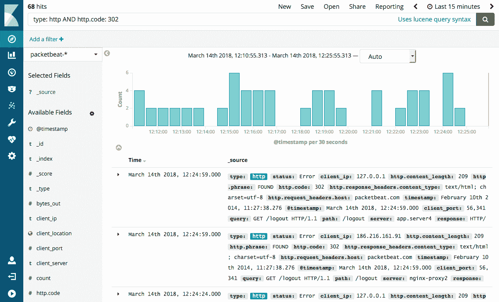
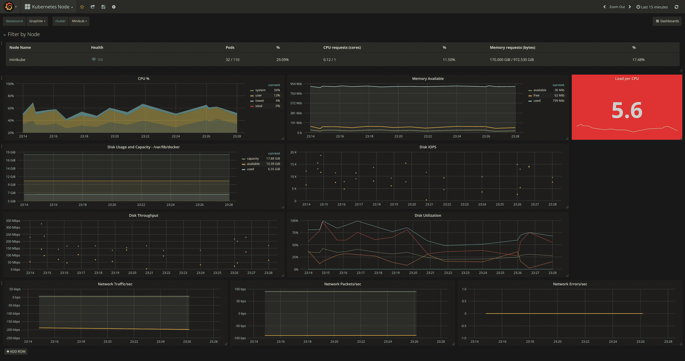
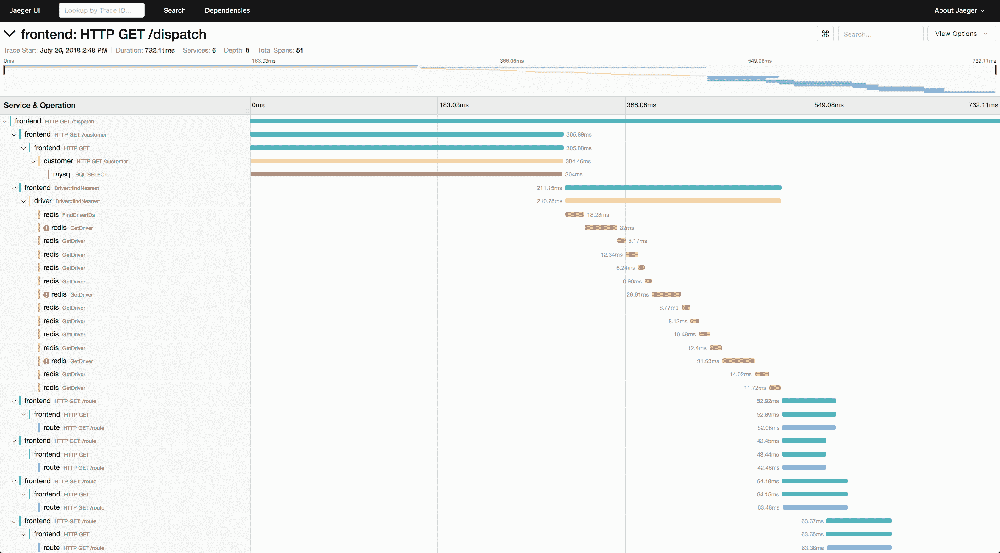
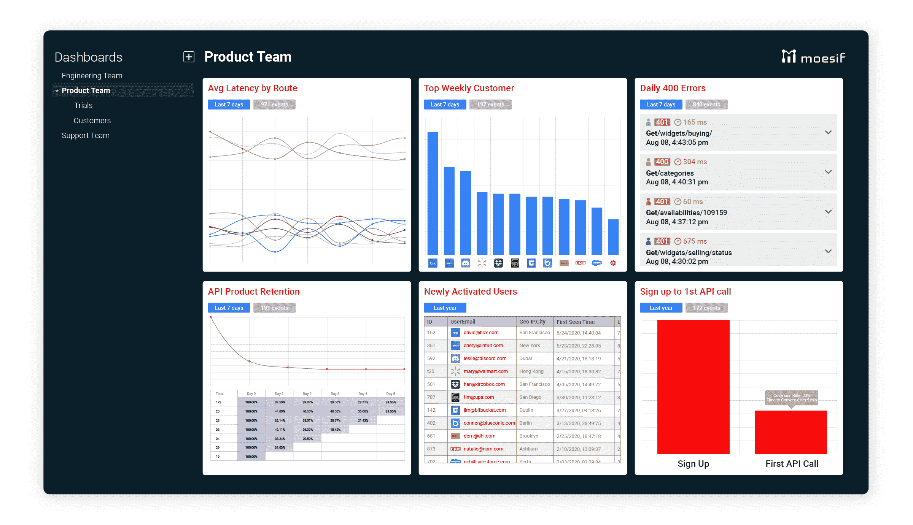

# 开源 API 分析和监控工具的比较

> 原文：<https://www.moesif.com/blog/technical/api-analytics/Comparison-of-Open-Source-API-Analytics-and-Monitoring-Tools/>

对于任何以 API 为先的公司来说，实施正确的 API 分析平台对于跟踪 API 的利用率以及发现任何可能影响客户的性能或功能问题都至关重要。您可以利用各种开源项目来构建一个完整的 API 分析平台。

在开始自己构建 API 分析解决方案之前，您应该首先列出您的需求和用例。并非所有工具都直接支持所有用例，并且可能需要在开发和集成方面进行大量投资。

## API 分析构建要求

### 需要回答工程或业务问题

工程师通常求助于 API 日志和指标来了解他们的 API 上发生了什么，检查有效负载，以及他们的服务出现的根本原因问题。*实时 API 日志记录*功能对于希望依靠其 API 分析解决方案来扑灭因 API 中断或可靠性问题而引发的火灾(希望是远火或少火)的工程师来说是必不可少的。因为实时日志记录会增加计算和存储成本，所以并非所有分析基础架构都维护实时管道。另一方面，只需要最近的数据来回答消防工程问题，因此数据可以在短时间周期后例如 24 小时后被*停用*。

工程和产品领导基于线而不是点做出战略决策。商业问题是从数据的历史趋势中得到答案的，这些数据可能超过几个月甚至几年。这意味着您的 API 分析构建应该能够长期存储数据，例如多年。这还需要能够汇总和压缩数据的基础架构，因为在原始事件日志上存储和运行聚合会削弱您的分析基础架构

### 实时警报和监控？

虽然构建仪表板并将其显示在监视器上是监视您的指标的一种很好的方式，但仍然需要定期手动检查它们。为了变得更加主动，许多 API 分析版本还具有某种监控和警报功能。从简单的基于阈值的警报(当指标达到某个值时发送电子邮件)到复杂的监控规则和工作流(可以实时执行复杂的聚合，并将警报发送到 PagerDuty 和 BigPanda 等事件响应平台),情况各不相同。

一些面向客户的团队，如开发人员关系和客户成功，可能希望构建自动化的工作流，以基于复杂的用户行为流通知客户或内部特定的内部利益相关者。

### 随处访问数据与受控访问

后 COVID 时代加速了在家工作的转变。这意味着您的 API 分析构建的内部用户可能需要在家庭网络上或在没有 VPN 的情况下访问指标。对访问 API 数据设置不必要的安全限制可能会限制您的 API 分析为您的公司提供的价值，甚至可能适得其反，造成不良习惯，如密码共享或将大量数据导出到个人设备，而不是按照设计的方式使用 API 分析构建。

另一方面，从任何地方提供自助式 API 分析也意味着拥有强大的安全性和访问控制。如果您认为将来可能需要典型的企业访问控制，如单点登录和基于角色的访问控制，那么您应该相应地规划您的 API 分析构建，即使不是立即需要。拆除和更改身份验证和授权设计并不是一件容易的事情，可能会导致完全重写。你不希望措手不及，成为未能预示典型未来增强的工程师。

### 可视化的灵活性

虽然大多数分析平台可以显示事件数据或绘制一段时间内的基本单值指标，但您的平台也可以用于更高级和更专业的分析，如[漏斗分析](/blog/technical/api-analytics/Mastering-API-Analytics-for-API-Programs-Chapter-1/)或群组保持分析。这些是营销和发展团队等业务职能部门使用的常见查询，但开发人员自己很少使用。然而，如果没有使用正确的数据模型，构建漏斗可能是一项挑战。

很多时候，您不知道需要显示什么类型的查询，但是应该选择一个在数据模型和可视化层都支持灵活性的项目。

## 比较

有各种各样的开源分析和监控项目。有些专注于监控基础设施指标，如 Kibana 和 Grafana。而其他人更专注于网络分析，如 Matomo(也称为 Piwik)。虽然这些都不是为 API 产品设计的，但您可以开发定制代码，将一些组件拼凑在一起，构建一个开源 API 分析平台

## Kibana

对于工程师来说，Kibana 是事实上的开源日志可视化工具之一。它是官方 ELK stack(Elasticsearch Logstash Kibana)的一部分，由于它与 elastic search 的紧密集成，相对于 Grafana 等设置复杂得多的工具，它是最快的可视化工具之一。Elasticsearch 本身非常适合高基数、高维度的日志数据，这是 API 日志所必须的。不利的一面是，Kibana 只与 Elasticsearch 兼容。如果您想要可视化存储在 SQL 数据库或其他数据存储中的数据，您需要到其他地方寻找。

虽然可以快速设置，但 Kibana 在可视化类型和支持的灵活性方面也相当有限。Kibana 的主要用例是提供日志搜索和对原始事件数据的简单分析，而不是提供真正的 API 监控工具。对于调试用例来说，这可能已经足够了，但是像漏斗和保留分析这样的流行业务度量不能由 Kibana 执行，这限制了它在工程团队之外的应用。

Kibana 和 Elasticsearch 被设计为与 Logstash 实例配对，该实例使您能够设计一个日志管道来处理和丰富 API 日志，例如标准化任何 HTTP 头或向每个 API 调用添加地理 IP 信息。请记住，Logstash 不能一次跨多个事件执行聚合。这种处理需要一个单独的集群计算框架来进行 map-reduce 操作，如 Spark 或 Hadoop。

Kibana 是为您希望以特别的方式浏览数据而不是创建每日仪表板的用例而设计的。您可以利用 Elasticsearch query DSL 或 Lucene 查询语法来提供极大的灵活性，但这些确实有一个陡峭的学习曲线。

默认情况下，Kibana 纯粹是一个可视化工具，这意味着像警报、异常检测和身份验证这样的事情是独立的。这意味着任何可以访问您的 Kibana 端点的人都可以访问您的数据，所以您不应该公开它。

但是，您可以购买并安装 Elasticsearch X-Pack，以获得一些监控功能和访问控制。

## 格拉夫纳

与专注于日志搜索的 Kibana 不同，Grafana 专注于基于时间序列的指标。您可以可视化各种数据库中的数据，包括 Elasticsearch、InfluxDb、OpenTSDB、Graphite 和 Prometheus。Grafana 做了一件事，而且有一件事做得非常好，那就是用漂亮的仪表板可视化存储在数据库中的时间序列指标。这就把其他所有事情都留给了您，包括配置数据源和将数据处理成可以由 Grafana 显示的时间序列度量。

与 Kibana 相比，Grafana 只处理已经存储在数据库中的时间序列数据，没有任何实时日志搜索，也无法以特别的方式浏览或探索原始数据。Grafana 的主要用例是设计一个仪表板来定期监控时间序列指标，比如在办公室的电视上。例如，您可能希望显示服务器的磁盘利用率、系统 CPI 和每分钟请求数。Grafana 有许多选项可以按照您想要的方式显示您的指标，例如使用基数 2 单位和基于百分比的指标显示存储容量。

由于其基于时间序列的架构，Grafana 在 API 调用的高基数、高维度分析方面的应用是有限的。相反，您需要花时间提前决定您想要跟踪的具体时间序列指标，并相应地对您的数据进行建模。这也限制了 Grafna 的自助式数据探索用例，业务用户可能会在您希望使用多个 *group by 的*进行细分或关联数据中的多个维度的地方寻找。

与 Kibana 相比，Grafana 以对认证和访问控制的内置支持而闻名。您还可以将 Grafana 实例连接到外部轻量级目录访问协议(LDAP)服务器或 SQL server，以便更好地控制企业设置中的访问。

您还可以将 Grafana 连接到 PagerDuty 等事件响应平台，从您的 Grafana 实例创建和触发警报。请记住，这些警报仅限于您已经在 Grafana 中监控的相同时间序列指标。

Grafana 确实有一个名为 Loiki 的独立产品，它提供了 Kibana 拥有的一些日志探索功能。

## 贼鸥

像专注于时间序列度量的 Grafana 一样，Jaeger 有一件事做得很好，那就是可视化分布式轨迹。这使得 Jaeger 与 Grafana 和 Kibana 相比有点不同，因为每个跟踪都是单独创建和查看的，而不是随时间监控指标或日志。当请求通过服务网格传播或命中微服务架构中的各种服务时，跟踪是所有上下文和计时信息的快照。因为跟踪生成的开销很大，所以通常采用采样来对每 X 个请求或特定标准进行快照。

与专注于监控时间序列指标的 Grafana 和专注于日志搜索的 Kibana 不同，Jaeger 专注于导致服务网格特定问题或依赖性问题的根源。Jaeger 支持多种数据源，如 Grafana，包括 Cassandra 和 Elasticsearch。

因为跟踪是独立创建的，所以唯一的视图就是预期的跟踪视图。没有办法随着时间的推移创造趋势。Jaeger 也没有任何警报或监控功能，所以你仍然需要一个 Grafana 或类似的实例。

## 穆塞夫

许多 API 团队发现需要大量的工具来满足他们的监控需求。Grafana 有时间序列指标，而 Kibana 支持日志搜索。一个更快的选择是专门为像 Moesif 这样的 API 产品设计的端到端解决方案。与需要预先计划时间序列指标的 Grafana 不同，Moesif 旨在使用高基数、高维 API 分析进行临时数据探索，这对于希望根据 API 使用数据做出战略决策的产品和工程领导者来说是必不可少的。

与 Kibana 和 Grafana 等基础设施监控工具相比，Moesif 利用了一个以用户为中心的数据模型,通过将 API 指标绑定到单个客户而不是基础设施，使您能够将 API 指标与业务目标保持一致。这也被称为*用户行为分析*，它能够从整体上理解多个用户操作和 API 调用的复杂用户流，而不是孤立地查看每个时间序列。

用户行为分析的一个经典例子是监控一个[转化漏斗](/blog/api-product-management/developer-journey/Tracking-a-Developer's-Journey-From-Visiting-Documentation-Visit-to-First-API-Call/)，然后根据用户获取渠道将其分解，以决定在哪里投资营销资金，或者查看不同功能或端点的[用户留存](/blog/technical/api-analytics/Mastering-API-Analytics-for-API-Programs-Chapter-2/)，以使你的 API 产品更具粘性。这也有助于跟踪更高级别的帐户健康状况，以便进行安全研究和客户成功。

与 Grafana 和 Kibana 相比，Moesif 还提供了精细的实时警报和报告功能。这使您能够看到每个客户电子邮件中哪些终端导致了最多的性能问题。借助行为电子邮件和工作流，您可以通过包含一系列步骤的自动化电子邮件来扩展客户拓展和支持工作。

