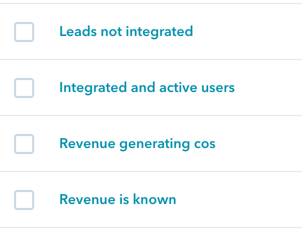

# 如何用付费营销向开发者营销

> 原文：<https://www.moesif.com/blog/developer-marketing/paid-ads/Best-Practices-for-Paid-Marketing-To-Developers/>

在 Moesif，我们主要面向开发人员和其他技术受众，如产品经理和开发人员关系团队，他们希望自己的开发人员平台取得成功。让开发人员采用你的 API 或工具是很困难的，并且需要在实验和测量上的大量投资，以达到你想要的结果。与此同时，你听到的很多关于 B2C 或 B2B 营销的网上建议在对开发者进行营销时根本不起作用。这篇文章概述了我们在 Moesif 从 0 发展到现在超过 5，000 家公司(包括德勤、UPS 和 Radar)的过程中所看到的许多发现。

## 是什么让开发者营销变得艰难

在开始你应该尝试的事情之前，让我们回顾一下对开发者来说营销有什么特别和困难的。大多数以开发人员为中心的公司都是由开发人员自己创建和领导的，所以你会认为搞清楚像产品营销这样的事情应该很容易，对吗？毕竟，你们只是在向自己推销。就像任何观众一样，没有单一的*开发者角色*。

## 精确测量是困难的

快速反复的实验对于收回付费广告的投资至关重要。如果你没有努力跟踪你的指标，你很容易就会增加你的每次收购成本(CPA)。然而，对于一个开发工具公司来说，你实际上衡量的是什么？准确的归因可能是复杂的，因为对于许多开发者工具来说，你的产品创造的大部分价值和魔力是通过 API 或集成，而不是通过移动或 web 应用程序。这意味着注册并点击你的网站的用户不一定是转换用户。然而，有一些意图是基于用户正在查看的产品的内容或区域的。对于大多数开发者优先的公司，我们建议查看一个指标，比如开发人员第一次调用 API 的次数。随后，您可以定义额外的漏斗阶段，比如通过您的 API 进行超过 X 次交易的开发人员，或者使用 Y 个不同特性的开发人员。额外的复杂性来自于归因于营销渠道，因为现在你必须在你的网站上安装仪器来跟踪开发者通过的获取渠道，然后将它与开发者对你的 API 所做的事情联系起来。

## 锁定目标很难

大多数社交广告网络都是基于个人人口统计数据来针对普通消费者，而不是开发者。你可以通过简单的*是*或*否*过滤来锁定这些网络的消费者。比如*这个人住在三藩市吗*或者*是年龄在 18 到 24 岁之间的人。这意味着，如果你是旧金山的一家披萨店，那么针对住在旧金山或附近的 18 至 24 岁的大学生投放脸书广告就相对容易了。这些人可能是理想的深夜披萨顾客。*

对于开发者来说，没有一个简单的*是*或*否*的问题就能回答“是开发者”的问题。你可以尝试类似“他们的大学学位是计算机科学吗”这样的问题，但是软件工程是一个有多种教育途径的职业，并不总是需要计算机科学学位。即使你能匹配一个人的头衔，软件工程也是一个有着不同职责的模糊角色。一些工程师为汽车和无人机开发嵌入式系统，一些软件工程师专注于构建内部数据分析基础设施，其他人则在集成计费 API。

许多开发者工具都是针对各种市场的横向市场，而不是针对某个特定的行业，但是它们解决了一个特定的问题。像企业销售一样，这意味着你需要瞄准合适的开发人员，他们将使用你的 devtool 并在内部支持它。

*   如果你正在构建一个计费 API，你需要瞄准负责计费基础设施的专家
*   如果你正在构建分析工具，你需要瞄准产品经理或工程经理，他们是事实上的分析专家
*   如果你正在为 docker 构建一个新的工具，你需要把 devops master 作为目标，他碰巧也是一个 Linux master。

## 许多利益相关者

向开发人员销售的艺术类似于最复杂的企业销售过程，其中涉及大量的利益相关者。对于 devtools，涉众的数量可能比传统的 SaaS 还要多，因为您可能要进行架构评审、安全签核、实现等等。这是因为很多时候开发者是为公司而不是为他们自己检验你的工具或产品。处理这些复杂问题可以融入您的营销计划，而不是等到最后一刻才处理异议。

## 开发者对此表示怀疑

技术受众天生多疑。他们喜欢建造东西，而不是购买服务。这就产生了固有的偏见，因为他们暴露于第三方解决方案。由于内部政治斗争，一些开发人员可能对销售和营销团队有怨恨或偏见。这降低了直接外联的有效性。虽然它确实适用于某些自上而下的销售策略，例如向 CISOs 销售安全软件，但许多 devtools 都试图让个人开发者首先采用该工具，然后在此基础上发展壮大。

## 付费集客营销

吸引开发者到你的平台(而不是填满他们的邮箱)的最有效的方法之一是集客营销。*集客营销*是*吸引*或*吸引*开发者采用你的平台，而不是强行向他们推销你的平台的艺术。从 SEO 到推荐，集客营销有多种技巧，但本文的重点是付费广告。

### 为什么集客对开发者很重要

如前所述，开发者通常对传统的营销活动持怀疑态度。无论这是一封来自特别提款权的电子邮件，有两段太长，还是一个巨大的横幅，上面写着“立即注册”。由于受数字驱动，他们宁愿不去理会那些废话，自己探索某样东西是如何工作的，也不愿被一个非技术人员告知某样东西是如何工作的。开发者也喜欢修补和发现。这种发现的感觉是一种强烈的情感。想想你最近一次发现一些新的生活帮或网站成为你的最爱，并告诉你的朋友。这就是集客营销所利用的。

有效的集客营销让开发者看起来像是自己发现了一个新的工具或平台，而实际上他们是被营销给了这个工具或平台。

### 付费广告如何做集客营销

如果做得好，付费广告可以以较低的收购成本推动采用，但它需要更多的规划和支持，而不是简单地在脸书广告上投入一大笔钱。如果做得不正确，你仍然会推销你的产品。关键是要自然。

首先，您应该确定这些计划的目标，例如:

*   品牌曝光和驱动流量
*   创建新的销售线索和开发人员注册
*   推动现有销售线索整合您的 API
*   让开发者付费或进行更大规模的部署

一旦你有了你的核心目标，你就可以像创建一个 SEO 策略和关键词规划器一样，设计一个用于社交广告的内容策略。内容是让你的广告出现的首要因素。内容应该是真实的，对开发者来说是有趣的，但是仍然与你的工具解决的具体问题相关。

你想变得多具体是一条细线。如果你走得太远，那么你就没有真正吸引到合适的开发人员来采用你的解决方案。你不能在开发者还没有意识到他们有问题的时候就推出告诉他们注册的内容。解决这一问题的方法是将上述目标映射到针对购买漏斗各阶段的内容:

#### 意识/曝光度

*   应该是信息，足智多谋，像如何 XXX 的东西，和 YYY 的最佳做法
*   例子包括:Moesif 的 apiguide.io，Launch Darkly 的 featureflags.io，Hubspot 的 website.grader.com
*   不是销售，只是将开发者暴露在问题空间中

#### 创建合格的销售线索

*   思想领导力内容/让自己成为领域专家
*   为什么要接受你正在解决的论题/想法/产品。仍然不是关于你的公司，而是关于问题/解决方案

#### 考虑您的产品

*   使用您的解决方案的结果和基准，技术白皮书
*   案例研究和比较图表

### 确保您能够捕捉到销售线索

对于大多数开发公司来说，比其他任何活动都更多的营销资金用于引导客户。然而，这需要额外的基础设施来处理。最简单的方法之一是将一些非门控内容与门控内容混合在一起。门控内容是指需要通过电子邮件来下载或查看内容。这通常最适合电子书和白皮书，因为作者通常会花更多的时间来起草它，使它对读者更有价值，而不是简单的博客帖子来克服留下电子邮件的障碍。要使封闭内容有效，您需要:

*   内容应该是高质量和思想领导水平(一些公司可以从几个 pdf 文件中产生许多线索)
*   一个专门的登录页面，消除大多数干扰。专注于下载 PDF 文件，而不是点击你的登陆页面。
*   一个表明隧道尽头的目标是接收报告的表单

不是所有的内容都需要被限制，但是如果目标是通过网站流量最大化潜在客户，拥有限制内容是一个简单的方法。门控内容可以采取其他形式，如网络研讨会和会议。

### 明确你的目标

对于开发者来说，明智地选择你的社交渠道和目标标准。正如开始提到的，瞄准开发者很难，因为角色相对模糊。规避这一点的一个方法是在能够锁定开发者的渠道上花费最多的时间和金钱。Moesif 在 LinkedIn 广告上运气不错，因为你可以缩小到特定的头衔、资历和公司行业。我们在 Reddit 上也很幸运，因为你可以针对与我们的分析平台相关的特定子编辑组。我们根本不使用脸书广告进行初步推广。相反，我们只使用它来重新定位已经注册了 Moesif 的现有开发人员，这带来了另一个问题:

### 你的广告应该以他们的行为为导向

当然，在 Moesif，我们吃自己的狗粮，并使用 Moesif 自己根据用户的 API 使用数据创建用户群组，以进行重新定位:

这些被同步到 Hubspot 和各种广告平台，这样我们可以根据开发者是否发送了他们的第一个 API 调用以及他们是否超过了他们的免费限制等来插入不同的广告。这使得广告信息更具体地针对开发者在你的开发者漏斗中的位置。

## 结束语

2020 年，随着领导力从不惜一切代价的*增长*转变为由产品优化驱动的*高效增长*，准确跟踪使用和留存至关重要。你不能再仅仅衡量浏览量和注册量这样的虚荣指标。相反，你应该衡量整个漏斗，并了解影响每个阶段的输入。价格和包装的变化如何改变你从*活跃开发者*到*转变为付费用户*的转化率。