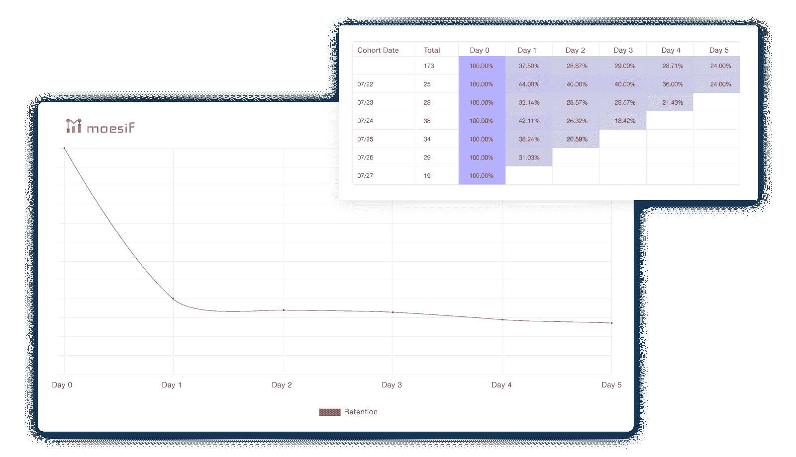

# 客户健康指标有助于 CSM 团队减少客户流失，加快 API 平台公司的追加销售

> 原文：<https://www.moesif.com/blog/customer-success/monitoring/Customer-Health-Metrics-Help-CSM-Teams-Reduce-Churn-and-Accelerate-Upsell-in-API-Platform-Companies/>

我们在旧金山的一位 API-first 同仁最近与我们分享了他们如何构建自己的综合测试系统来监控正常运行时间和延迟。这是一项大工程，包括一个巨大的红移仓库、数据狗和许多人工月的工程工作。最后，他们可以测量延迟的完整性，功能是否正确，当超出界限时，提醒 CSM/工程团队。

基础设施指标当然重要，但今天的 CSM 团队最终关心的是他们是否让客户成功，如果没有，他们希望尽早知道。通过跟踪客户健康指标，当客户面临流失风险时，或者相反，当他们已经超出计划时，就有可能变得有先见之明。

## csm 总裁

借助 Moesif 以用户为中心的方法，您可以监控端到端的客户体验，并在个别客户遇到功能或性能问题时获得提醒。类似于我们旧金山的 API 优先公司，我们已经建立了一个系统来持续监控和学习正常的 API 行为。然而，我们的 API RUM(真实用户监控)解决方案不仅仅适用于基础设施指标，我们还关注采用、参与和保留阶段的[关键客户标准](https://www.moesif.com/features/api-monitoring)。我们先进的异常检测算法让您发现未知的未知因素和领先的流失指标。

Moesif 不仅有助于管理客户保留，我们的平台还有助于追加销售。正如一句老话所说，时机就是一切——如果你过早提出涨价，你可能会激怒你的客户，而如果你太迟，机会可能会与你擦肩而过。因为留住客户的成本要低得多，尤其是那些超额完成任务的客户，所以找到最佳时机至关重要。在 Moesif 中设置一次 API 调用配额阈值，然后就可以忘记它们了。我们会在后台进行监控，然后在使用水平接近客户的订阅阈值时向您发出警报。以数据为导向，抓住可以扩展的机会。

## 粒度警报

我们改进了警报功能，以支持每日或每周趋势警报以及实时通知。只需轻轻一点，就可以在任何图表上[创建](https://www.moesif.com/docs/api-monitoring/)复杂的警报。当客户遇到问题、经历异常或性能问题时，请及时通知。根据每周活跃 API 令牌、每日 4xx 错误、95%延迟等指标，对客户健康状况进行细分、评分和更改。获得向有风险的客户群发送个性化信息的能力。

我们不仅可以确定哪些客户在使用您的 API 时遇到了问题，或者有不良的客户体验，而且我们还可以让您执行根本原因分析，了解客户为什么不再光顾。请参阅我们关于发展平台业务的[指南](https://www.moesif.com/blog/ebooks/api-analytics-the-ultimate-guide-to-grow-your-platform-business/),了解更多关于群组保持分析的信息。

## 集成和报告

使用您最喜欢的工具(如 PagerDuty 和 Slack)发送具有丰富上下文的警报。相同的警报可以通过多种渠道发送，包括短信和电子邮件，支持逐步升级的通知层级。让第一级岗位放松，然后第二级岗位开火。如果需要，通过 SMS 上报给工程人员或该系统的任何待命人员。

Moesif 还连接到 Salesforce、Hubspot 和 Zendesk 等工具，以客户驱动的方式实现客户成功。

获得关于哪些客户有搅动风险或 API 使用率低的定期报告。从您的报告中轻松创建[定制仪表板](https://www.moesif.com/blog/dashboards/technical/Self-Service-Custom-API-Dashboards-Allow-You-to-Easily-Track-and-Share-Key-API-Metrics/)，用您的数据讲述故事。在您的组织内以及与合作伙伴安全地共享仪表盘。

通过使用 Moesif 的关联引擎和评级系统来整合和过滤重复/无趣的通知，限制报告中无关警报的数量。

## 以用户为中心的客户健康

获得一个新客户的平均成本介于 5X 和留住一个现有客户的 25 倍之间。那是在前 COVID 时代。在当今世界，可能更多。识别哪些客户有流失风险，哪些客户准备追加销售，现在比以往任何时候都重要。通过 Moesif，您可以获得关键 API 指标的早期警报，将它们与特定客户联系起来，并在为时已晚之前采取主动行动。