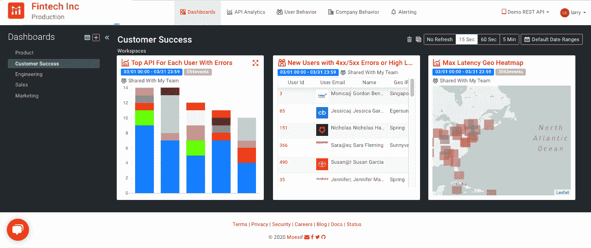
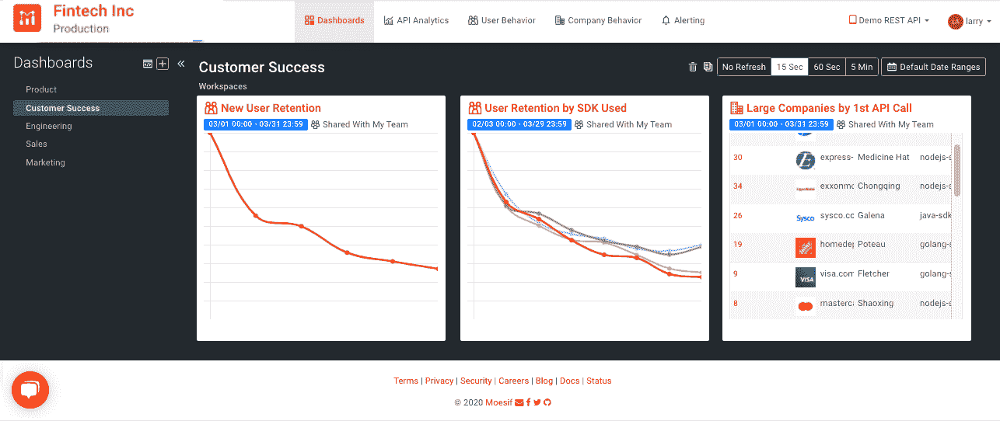

# 为什么数据驱动的客户成功在当今的新冠肺炎世界至关重要

> 原文：<https://www.moesif.com/blog/customer-success/monitoring/Why-Data-Driven-Customer-Success-is-Essential-in-Today-s-COVID-19-World/>

在今天史无前例的经济衰退中，寻找和接近新客户比以往任何时候都更加困难。现在的责任是保持*现有的*客户成为你产品的有效用户。通过密切监控 API 度量标准，客户成功管理(CSM)团队可以获得关于那些存在混乱风险的**早期警告**，并在为时已晚之前纠正事情。

## 客户获取与客户保持:至少 5X 成本差异

根据[不同的](https://hbr.org/2014/10/the-value-of-keeping-the-right-customers) [调查](https://www.invespcro.com/blog/customer-acquisition-retention/)，获得一个新客户的平均成本在 5X 和留住一个现有客户的 25 倍之间。那是在前 COVID 时代。在当今世界，可能更多。

CSM 的[使命](https://www.moesif.com/blog/customer-success/monitoring/Data-Driven-Customer-Success-and-How-API-Data-Provide-the-Leading-Indicator-of-Account-Health/)是帮助客户通过你的产品实现价值。客户价值实现是让客户不断回头客的飞轮。CSM 是加速飞轮的动力。

通过像 Moesif 这样以用户为中心的分析，可以密切关注您的客户在做什么，并在他们努力集成或使用您的产品和 API 时伸出援手。让我们看看您需要跟踪的重要指标是什么，这样您就可以达到您的保留目标

## 要跟踪以达到保留目标的指标

通过监控客户的活动，您将能够:

*   了解他们的使用行为
*   需要时提供更好的帮助
*   尽早发现客户流失
*   了解他们是否会续约

### API 调用和保留的次数

通过跟踪客户何时开始和何时停止发送流量，了解他们何时参与(如下图所示)。将您的参数绑定到波段，这样如果值移动到预定义的波段，您会得到通知。使用实时警报主动识别并联系面临风险的客户。在 Moseif 中， [alerts](https://www.moesif.com/features/api-monitoring) 可以通过 Slack、SMS、Email 和 PagerDuty 发送。有一级岗位懈怠，然后二级开火到 PagerDuty。如果需要，升级到工程或该系统的任何待命人员。

为类似的活动创建群组可以实现对大量客户的高效监控，无论他们是个人用户还是公司。按最活跃的公司分组，有 5 个以上 API 错误的新用户和许多其他类型的[字段](https://www.moesif.com/docs/api-analytics/)(上图)。

### 错误事件和流失

快速发现错误的有效负载，并与客户一起进行分类以确定问题。发现失败的系统并避免流失。如果您的客户集成了您的 API，但一直收到 400 或 500 错误，请在错误发生时立即得到通知，联系客户并控制它。按出现错误的每个用户的顶级 API、出现 4xx/5xx 错误的新用户、最大延迟(下图)等进行分组。

### 群组保持

随着时间的推移，准确测量产品保留率和粘性。产品保持率衡量的是一群用户中以某种方式与你的 API 交互，然后又回来与你的 API 交互的用户的百分比。按新用户、使用的 SDK 等分组(如下图)。

<noscript></noscript>

## 达到保留指标

CSM 团队现在面临着更大的压力来达到保留指标。随着商业因冠状病毒和就地庇护而陷入低谷，数据驱动现在比以往任何时候都更重要。监控重要指标，以避免这些艰难的讨论，保持您的客户成功，并确保他们真正续约。