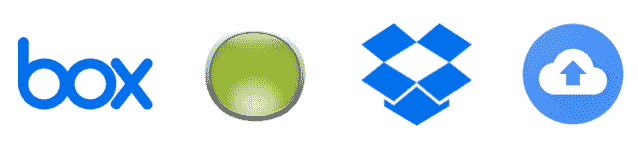

# 在 API 产品公司中在家工作的四个最重要的问题

> 原文：<https://www.moesif.com/blog/business/tools/Four-Of-The-Most-Important-Issues-When-Working-From-Home-In-An-API-Product-Company/>

“当你在家工作时，你应该试着系统地、有条理地去做，”在家工作的老手约翰·贝内特说。“这很像在家做生意，我就是这么做的”。

约翰可能对此略知一二，因为他在新罕布什尔州南部的家中工作了 15 年。他的公司[约翰·贝内特战略营销](https://www.bennettstrategy.com)，客户从大牌公司到初创公司，包括 Heroku、戴尔、Savvius、Yubico 和 Proofpoint 等。

在家工作最重要的考虑因素可以分为 4 个简单的要素:

*   物理空间
*   时间管理
*   技术
*   对齐

## 物理空间

*把办公室留在办公室，把家留在家里*

有一个专用的工作空间是个好主意。然后是你家的其他地方。单独的办公室是理想的，但即使你没有，也要分配一个你可以在一天结束时离开的空间。关上门；你的工作结束了。拔掉你的工作脑。

这很重要，原因有二:

*   你工作时不太可能被打扰或打断。你不希望孩子们在电话会议上走进房间，或者被你的妻子打断，她想知道如何为她五年级的班级设置 Zoom 分组讨论室。
*   为了你自己的理智，工作不要占据整个地方也很重要。你不会想让自己感觉从未离开过工作场所:话题不断出现，设备不断报时，项目计划摆在早餐桌上。

> 你的家庭工作空间类似于大学时代的音乐教室。你希望有一些分离，这样如果你在演奏一种安静的乐器，比如录音机或大键琴，你就不会想听到隔壁房间里传出的电吉他声。你需要一些分离。所以当你选择你的位置时，你能做到多孤立呢？是一个可以关上门的房间，还是一个走廊然后一扇门？选择一个你能真正隔绝声音的地方。

## 时间

把你的一天分成可管理的几部分。你知道什么时候你最有效率，所以把你的一天安排在那个时候。试着遵守时间表，尤其是在一天开始和结束的时候。

因为你不在办公室，也不与其他人交往——例如，你不必去三号楼从另一个项目组的人那里得到答案——你可能会久坐不动。所以，养成散步的习惯是个好主意，假设你能在隔离期间这样做。

> “当我在处理一些特别困难的事情时，比如为客户发送复杂的信息，我会快速散步 15 分钟来理清思绪。这让世界变得不同，”约翰说。

## 远程贸易的工具

我们可能在技术领域工作*，但在家工作时，我们也是*技术的大消费者*。如果没有可靠的安全性、备份、分散注意力、协作和项目管理软件，我们就无法完成远程工作。*

### 安全性

你在工作，使用电脑、平板电脑和手机。您需要确保您的设备是安全的，这样您才能高效工作。他们的所有操作系统都应该是最新的，并且应该运行安全/防病毒软件。我们很喜欢 [Bitdefender](https://www.bitdefender.com/) 和 [Malwarebytes](https://www.malwarebytes.com/) ，但是还有很多其他很棒的[选项](https://www.amazon.com/Safety-Net-Yourself-Phishing-Ransomware-ebook/dp/B07ZJVFMDT)。

<figcaption>Security Vendors</figcaption>

### 支持

远离 IT 管理员的神奇力量时，您最不想做的事情就是丢掉工作。无论是将 Word 中的最新产品规格上传到 Google Drive，将新代码分支推送到 GitHub 的资源库，还是将那些 Illustrator 文件保存到 Dropbox，都要一直备份。并将备份设置为自动运行。

有许多成熟的供应商在将工作备份到云方面做得很好。明显的候选人包括使用他们的 [Sync &备份应用](https://www.google.com/drive/download/backup-and-sync/)、 [Carbonite](https://www.carbonite.com/) 、 [Box](https://www.box.com/) 和 [Dropbox](https://www.dropbox.com/) 的 Google Drive。

<figcaption>Cloud Backup Vendors</figcaption>

### 分散注意力最小化

如果你担心被网站、游戏甚至应用程序分散注意力，那么就有一些拦截器可以限制任何东西，从网站到整个互联网，或者从单个桌面应用程序到你的整个电脑。大部分都是免费的，或者是负担得起的，你可以做一些事情，比如说，从早上 8:00 到中午 12:30 到下午 6:00 封锁 Facebook.com。看看[冷火鸡](https://getcoldturkey.com)、[自由](https://freedom.to)或[聚焦](https://heyfocus.com/)了解更多关于如何恢复生产力的细节。

<figcaption>Anti-Distraction Vendors</figcaption>

### 合作

在办公室之外，软件协作工具已经取代了饮水机旁的聊天、纸张、活动挂图、便利贴和白板。作为在家工作的员工，我们将在 [Slack](https://slack.com/) 和 [G Suite](https://gsuite.google.com/) 以及 [Zoom](https://zoom.us/) 和 [UberConferences](https://www.uberconference.com/) 中度过我们的时间。不要低估面对面看到某人并在视频通话开始时询问他们怎么样的力量。当其他人知道你是谁，并能把你的名字与面孔对应起来时，他们更有可能与你分享信息。

<figcaption>Collaboration Vendors</figcaption>

有了空闲的即时性，和同事聊天就成了快速的 DM away。记得表明你什么时候有空，这样合作者就不会在等待回应时失去理智。如果他们不在，使用[谷歌日历](https://calendar.google.com/)来预定听众。最终，视频聊天和聊天消息都是短暂的信息源。这就给我们带来了技术难题的最后一块……

### 项目管理

如果你作为团队的一员远程工作，那么你将需要跟踪任务并与他人协调正在发生的事情。项目管理行业的领导者是[阿萨纳](https://asana.com/)和[特雷罗](https://trello.com/)。对于处理多个项目，我们最喜欢的项目管理工具是 monday.com 的。所有这些管理工具使得分配任务、查看整个团队正在做什么以及在团队内部就项目和任务进行交流变得容易。

<figcaption>Project Management Vendors</figcaption>

## 对齐

当你早上没有和其他十个人在会议室时，你很难知道公司的状况。这不仅仅是项目管理的问题，而是与业务指标、目标和 KPI 保持同步。

> 公司在哪里，它需要去哪里？我们做得怎么样，我们需要做出什么反应？有哪些机会？下一步是什么？

如果你试图在你的公司灌输一种数据驱动的文化，那么让每个人都与相同的产品 KPI 和业务目标保持一致是很重要的。在一个分散的环境中，对于不涉及业务方面的团队来说，例如工程，特别容易与更大范围内发生的事情失去联系。

API 产品公司已经成功地使用 Moesif.com 的[仪表板功能](https://www.moesif.com/features/api-dashboards)来跟踪他们的业务指标。例如，我们的一个金融科技客户定期在整个公司共享一个仪表板，其中包含每日活跃用户(DAU)、集成漏斗、HTTP 状态请求、KYC 产品使用、最活跃用户、最近的 API 错误等图表。他们的仪表板显示如下。

<figcaption>Moesif Dashboarding To Track And Share Business Metrics</figcaption>

由于我们的仪表板可以安全共享，因此重要信息可以轻松地在整个组织中传播，告知所有利益相关方客户流失、产品战略、客户使用情况和许多其他重要业务指标的状态。

## 结论

由于我们中的许多人都在原地躲避，面临长期的自我隔离，远程工作需要尽可能简单。通过控制你工作的时间和地点，通过使用最合适的行业工具，你可以走很长一段路，让你的工作经历变得愉快。

作为一个独自坐在办公室里工作的人，很容易想到“好吧，这里需要那块。另一件作品发行了。那些顾客做得很好。那些其他的有搅动的危险。”在方便的仪表盘中了解企业的当前状态比以往任何时候都更加重要。您的公司仪表板已经成为一种导航地图，将帮助您的企业到达它想去的地方。