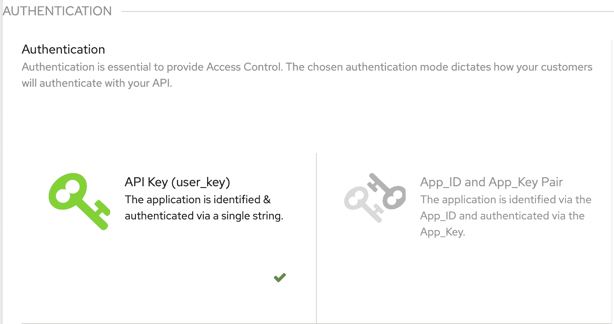

# 如何在记录 3scale API 网关的 API 调用时获取客户和应用上下文

> 原文：<https://www.moesif.com/blog/technical/3scale/How-to-Get-Customer-and-Application-Context-When-Logging-API-Calls-for-3scale-API-Gateway/>

由于 API 处理大量各种类型的数据，对于任何数据提供者来说，关键问题是如何具体保护这些数据。一种身份验证方法，使开发人员能够构建满足其所有需求的应用程序，确定谁可以访问 API 以保护敏感数据并确保请求不被篡改。身份验证是指实体证明一个身份。简而言之，认证是验证你就是你所声称的那个人的行为。如果没有身份验证，就没有简单的方法将请求与特定的用户数据相关联，也没有方法保护恶意用户的请求，恶意用户可能会删除其他用户的数据。身份验证不应该是事后才想到的，而是构建在 API 的结构中。

## 身份验证模式

根据我们的 API，我们可能需要使用不同的身份验证模式来发布访问 API 的凭证。这些范围可以从 API 密钥到定制配置。

3Scale 支持以下身份验证模式:

#### 标准 API 密钥

一种身份验证模型，其中单个随机字符串或哈希充当标识符和秘密令牌。每个具有 API 权限的应用程序都有一个唯一的字符串。默认情况下，关键参数的名称为`user_key`。在对 3scale 进行授权调用之前，我们可以使用相同的标签或选择另一个标签。

#### 应用程序标识符和密钥对

一种身份验证模型，其中不可变的标识符-应用程序 Id (App_Id)和可变的密钥字符串-应用程序密钥(App_Keys)被分成两个令牌。`App_Id`是常数，可能是也可能不是秘密。每个应用程序可以有 1-n 个应用程序密钥，其中每个密钥直接与`App_Id`相关联，并且应该被视为秘密。

在 3Scale 中，每个服务可以使用不同的身份验证模式，但每个服务只能使用一种模式。在身份验证部分，我们可以选择所需的身份验证模式。



## 应用程序上下文

3Scale 提供了一个管理 API 端点来获取与每个用户相关的应用程序上下文。应用上下文包含与单个用户相关的关于他们与 3 种规模 API(如`first_traffic_at`、`first_daily_traffic_at`)的交互的细节，以及其他个人可识别信息数据，如- `user_id`、`user_account_id`、`service_id`、`plan`信息和其他细节。有了对这些细节的访问，将请求与特定用户关联起来就很容易了。

根据我们使用的身份验证方法，我们调用管理端点来获取应用程序上下文。在使用标准 API keys 身份验证方法时，我们通过调用这个端点来获取应用程序上下文

```py
curl -v -X GET "https://#{domain}/admin/api/applications.xml?access_token=#{ADMIN_ACCESS_TOKEN}&user_key=#{user_key}" 
```

在使用应用程序标识符和密钥对身份验证方法时，我们通过调用这个端点来获取应用程序上下文

```py
curl -v -X GET "https://#{domain}/admin/api/applications.xml?access_token=#{ADMIN_ACCESS_TOKEN}&app_id=#{app_id}&app_key=#{app_key}" 
```

## 设置具有 3 个刻度的 Moesif API 分析

Moesif 在 Luarocks 中提供了一个[插件，用于捕获 API 请求和响应，并记录到 Moesif，以便通过 3Scale 轻松检查和实时调试您的 API 流量。该插件在本地捕获指标并对其进行排队，这使得该插件能够将指标数据发送到 Moesif 收集网络的带外，而不会影响您的应用程序。](https://luarocks.org/modules/moesif/lua-resty-moesif)

建议通过 Luarocks 安装 Moesif:

```py
luarocks install --server=http://luarocks.org/manifests/moesif lua-resty-moesif 
```

## 身份验证凭据位置

3Scale 为最终用户在调用 API 时通过`HTTP_Headers`或作为`query_parameters`传递身份验证凭据提供了灵活性。Moesif 将在头和查询参数中查找凭证，并获取特定用户的应用程序上下文。Moesif 提供了一个配置选项来设置字段名称，该名称与配置 API 认证设置时使用的名称相同。默认情况下，3Scale 使用`user_key`作为标准 API 密钥，使用`app_id`和`app_key`作为 App_Id 和 App_Key 对认证方法。

## 识别用户和公司(账户)

管理端点将应用程序上下文作为 XML 实体返回。Moesif 提供了一个配置选项来设置 3Scale 应用程序 XML 实体的字段名，该实体将用于标识用户和公司(帐户)。默认情况下，用户和公司字段名为`id`和`user_account_id`，但其他有效的示例包括`user_key`和`service_id`。

```py
-- Function to parse 3Scale XML entity
-- @param `user_id_name` The 3scale field name from 3scale's application XML entity used to identify the user. Default `id`.
-- @param `company_id_name` The 3scale field name from 3scale's application XML entity used to identify the company (account). Default `user_account_id`.
-- @param `debug`  A flag to print logs
function parseXML(user_id_name, company_id_name, debug)
    -- config_response is the response from an api call to fetch application context which is a XML entity 
    local response_body = config_response:match("(%<.*>)")
    if response_body ~= nil then 
        local xobject = xml.eval(response_body)
        local xapplication = xobject:find("application")
        if xapplication ~= nil then
            local xtable = {}
            for k, v in pairs(xapplication) do
                if v ~= nil and type(v) == "table" then 
                    xtable[v:tag()] = k
                end
            end

            local key = xapplication[xtable[user_id_name]]
            if key ~= nil then 
                if debug then
                    ngx.log(ngx.DEBUG, "Successfully fetched the userId ")
                end
                -- Set the UserId
                local user_id = key[1]
            else 
                if debug then
                    ngx.log(ngx.DEBUG, "The user_id_name provided by the user does not exist ")
                end
            end
            local companyKey = xapplication[xtable[company_id_name]]
            if companyKey ~= nil then 
                if debug then
                    ngx.log(ngx.DEBUG, "[moesif] Successfully fetched the companyId (accountId) ")
                end
                -- Set the CompanyId (AccountId)
                local company_id = companyKey[1]
            else 
                if debug then
                    ngx.log(ngx.DEBUG, "[moesif] The company_id_name provided by the user does not exist ")
                end
            end
        else
            if debug then
                ngx.log(ngx.DEBUG, "Application tag does not exist ")
            end
        end
    else
        if debug then
            ngx.log(ngx.DEBUG, "Xml response body does not exist ")
        end
    end
end 
```

## 结论

通过这种方式，插件可以将每个事件或行为与单个客户联系起来，并且可以通过一起查看多个事件来发现行为趋势，以确定产品问题，例如用户为什么停止使用你的 API，或者他们最常使用的功能或端点。