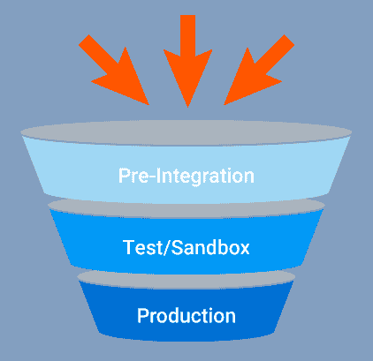
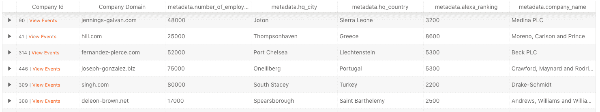
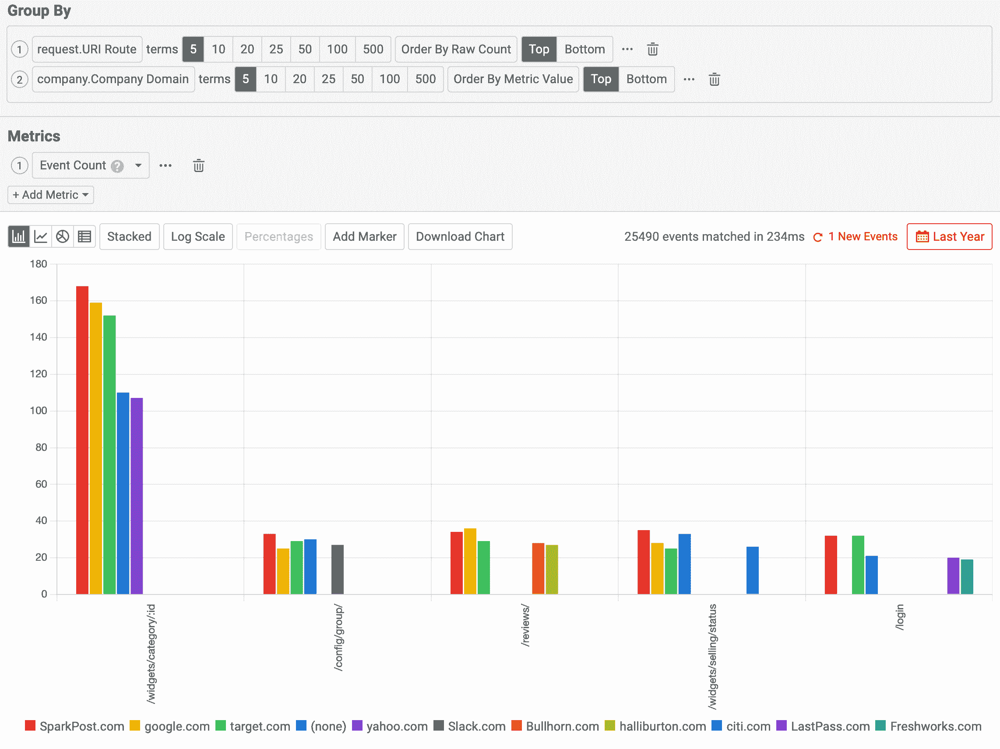
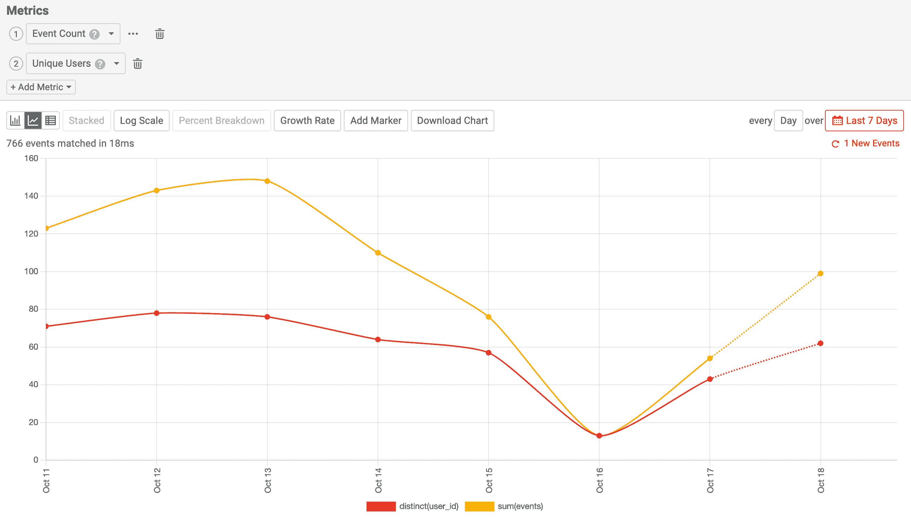

# 掌握 API 程序的 API 分析:开发者漏斗

> 原文：<https://www.moesif.com/blog/technical/api-analytics/Mastering-API-Analytics-for-API-Programs-Chapter-1/>

你有一个开发人员正在采用的 API 程序，但是不确定采用了多少。新的集成需要多长时间才能产生收入？如果你有网络或移动产品管理背景，你可能已经熟悉了用于衡量应用参与度和留存率的*移动产品分析*。成长中的 API 有相似的 KPI 来衡量你的 API 程序的成功。本文将更多地讨论您应该测量什么以及如何利用这些信息。

## 开发者漏斗

而传统的客户漏斗将仅由营销和销售漏斗组成。然而，作为一种产品，客户和合作伙伴包括开发人员的 API 拥有所谓的*开发人员漏斗*或*集成漏斗*。开发者漏斗在营销漏斗之后，销售漏斗之前，有三个核心阶段:



### 预整合阶段

开发者进入营销漏斗后的预整合阶段。虽然什么是营销漏斗，什么是开发者漏斗，这是一个模糊的概念，但意图是主要因素。他们只是在考虑通过案例研究、内容和演示账户等明确定义的营销资产来开发解决方案，还是承诺自己测试解决方案。

一旦评估或考虑阶段是积极的，就有测试的意图。这将导致开发人员开始安装，这可以通过创建一个空白工作区、下载一个配置文件或复制一个 API 密钥来看到。

这意味着你的产品是免费增值，有免费试用，或其他。

### 沙盒阶段

一旦在 API 上采取了一个动作，潜在客户就进入了沙盒阶段，这给了开发人员一种温暖的感觉，他们完成了一些事情，并且能够验证这是一个对他们来说可行的解决方案。从预集成阶段到沙盒阶段的时间通常用*到第一个 Hello World* (TTFHW)的时间来衡量。这是一个关键的 KPI，每个 API 产品经理都应该尽可能地跟踪和减少它。

开发人员可能不会进入沙盒阶段，原因有很多，包括:

*   **集成问题，如 SDK 或实现中的错误和 bugs】**

    例如，如果开发人员从您的 API 收到 500 个错误，或者 SDK 没有对您的 API 进行任何调用。后者是最难衡量的，因为开发人员完成了实现，但您没有采取任何行动。

*   **没有简单的方法来验证实施是否正确**

    如果你的产品在集成后看起来是空的，开发者可能会认为它不起作用。对于安全和分析公司来说，这种情况可能会发生，因为在处理大量数据之前，这些公司不会有有意义的见解。

*   **对 API 采取了行动，但不清楚值是什么**

    这个行动应该有一个明确的价值，而不仅仅是一个“你被整合了”的信息对于通信 API，该值可能是发送一条 SMS。对于分析公司来说，它可能是捕获和显示单个事件。

当集成成功并且有明确的价值标志时，开发人员就进入了沙盒阶段，从而创造了你的啊哈时刻。这些开发人员开始成为您的解决方案的内部倡导者。

### 生产阶段

一旦开发人员看到了解决方案的价值，他们就会希望尽快将他们的实现推向生产。然而，由于内部的阻碍，开发者可能无法将你的 API 推向生产，很多阻碍都超出了开发者个人的控制范围。

开发人员可能出于多种原因不进入生产阶段，包括:

*   **项目优先级**

    客户错误或其他项目特性可能会优先考虑。您的通信 API 集成退居二线，只是因为开发人员被分配了一堆吉拉入场券。

*   **法律与合规部**

    特别是在金融和卫生等受监管的行业，开发人员可能必须等到法律部门的必要批准。

*   **功能和性能测试**

    公司可能有测试第三方服务的内部政策，这些服务需要首先完成。

您的目标是让开发人员拥有正确的工具来消除这些异议。一旦开发人员进入生产阶段，就会有大量的流量从该帐户流向您的 API。达到生产级流量所需的时间可以称为*到第一个工作 App 的时间* (TTFWA)或*到第一个付费 App 的时间* (TTFPA)。

## 创建漏斗目标

为了对你的 API 业务有一个准确的快照，每个漏斗边界都需要明确的目标。让我们以搜索 API Algolia 为例。

### 集成前步骤目标

Algolia 的第一步将是开发人员使用 API 密钥复制功能。此时，开发人员已经注册，并且正在经历入职流程。

### 沙盒步骤目标

Algolia 的 API 有两个核心特性。查询或搜索 API 和索引 API。Algolia 的成功标准是开发者能够通过索引 API 索引至少一个实体。如果开发人员在 Algolia 中没有存储任何数据的情况下调用查询 API，这不被认为是成功的，因为查询将是空的。

为了简化集成，他们可以:

1.  驱动用户通过`POST /1/indexes/`端点索引新实体
2.  使用示例数据引导开发人员可以查询的示例索引

假设我们使用(1)，那么我们的漏斗转换点将是任何至少执行了一个`POST /v1/indexes`操作的开发者。Algolia 可能想要一个更严格的转换指标，以便他们可以跟踪任何至少执行了一个 *`POST /v1/indexes`操作*和一个 *`POST /1/indexes/{indexName}/query`操作的开发者，其中响应内容长度> 0* 。这意味着开发人员成功地索引了至少一个实体，并且能够读回它。

### 生产步骤目标

为被认为是生产级别的流量创建一个指标可能很难，因为它可能依赖于行业或项目。对于 Algolia 来说，电子商务应用程序与拥有大量动态内容的内部企业应用程序相比，具有不同的生产使用级别。对于具有动态内容的企业应用程序，每个实体可以用更新的数据以编程方式在一天内被重新索引数十或数百次。但是，如果数据从来不被查询，那么 Algolia 的值还没有被看到。因此，只寻找拥有超过 1000 个`POST /1/indexes/`操作的开发人员可能不是跟踪的最佳价值指标。一个更好的价值衡量标准可能是拥有超过 1000 个 *`POST /1/indexes/{indexName}/query`操作的开发者，其中响应内容长度> 0* 。

请注意我们如何关注 Algolia 的核心价值，即搜索。我们不太关注辅助功能，如 Algolia 的监控 API、报告 API 等，也不关注高级功能，如同义词或规则 API。

## 开发者群体细分

现在我们已经了解了*开发者漏斗*每个阶段的转化率，重要的是利用 API 分析来了解不同的开发者群体如何通过你的*开发者漏斗*。没有它，你会有一种虚假的成功感。

例如，从预集成到生产阶段，您可以有很高的转换率，但是如果大多数开发人员在没有购买力的情况下从事辅助项目，那么您可能需要重新评估您的目标。

### 建立用户和公司的档案

为了进一步细分你的漏斗，你的 API 分析解决方案应该有办法创建*用户简介*和*公司简介*。建议在用户配置文件中跟踪的变量包括:

*   电子邮件
*   名字
*   职称
*   参考网站

建议在公司中跟踪的变量包括:

*   公司收入
*   雇员人数
*   工业
*   Alexa 等级
*   MRR 计划

一旦你有了这些信息，你的开发者漏斗分析就会变得更有价值。您可以看到谁在集成，谁没有，而不仅仅是跟踪高层次的集成之旅。例如，我们可以通过*公司收入*进行细分，以比较从事副业项目的用户转化率与财富 500 强公司工程师的转化率。

将公司(即客户)与用户分开跟踪，确保您能够创建使用您的解决方案的组织中开发人员或团队数量的指标。



### 理解 API 设计

就像建立用户和公司的档案一样，你的 API 分析解决方案应该理解你的 API 的业务功能。如果您的 API 是 rest，那么只跟踪`POST /items/1`和`POST /items/2`将没有价值。然而，添加与 API 事务相关联的元数据可以为您提供更高级别的使用模式趋势。例如，如果您的 API 是 RESTful 的，那么您的分析解决方案应该将 API 事务存储到一个特定的 REST 资源操作中，比如`POST /items/:id`。这支持更高级别的图表，如下图所示，显示了使用每个 REST API 操作的顶级公司。



### 定义 API 项目

在我们深入研究获取渠道绩效和 API 增长等关键业务指标之前，我们需要定义什么是 API 参与度。毕竟，一个开发人员仅仅触及你的根端点或者仅仅探查 API 的健康可能不被认为是真正的参与。继续 Algolia 的例子，Algolia 的核心商业价值问题是快速搜索。因此，他们定义 API 参与度的标准是客户在过去 28 天内至少执行一次搜索`POST /1/indexes/{indexName}/query`。

## 衡量开发商收购

有效的新客户获取可以成就或摧毁一个原料药企业。在衡量不同流量来源的在线营销活动的有效性时，必须考虑开发者漏斗中定义的三个步骤的转化率。API 产品营销领导应该超越注册等基本指标，考虑开发者集成漏斗。这使您能够了解这些注册在整合步骤中进行了多少。

例如，像脸书广告这样的渠道可能会给你的 B2B 解决方案带来很大的影响，但如果这些注册中有很小一部分由于目标不明确而最终通过了整合过程，那么你的渠道的整体有效性就会降低，因为你不太可能从那些只注册而不做任何其他事情的人那里获得太多价值。

### 如何正确衡量开发者营销渠道

如果我们同步营销数据，例如来自营销自动化和分析工具(如 Hubspot 或 Amplitude)的海胆跟踪模块(UTM)参数，那么我们可以在队列分析中利用这些数据。这使我们能够利用我们早期的开发者漏斗，并通过渠道进行细分。一旦我们做到这一点，我们就能够看到按活动细分的每个步骤的转化率。

> 什么是 Moesif？ [Moesif](https://www.moesif.com/solutions/track-api-program) 是最先进的 API 分析平台，被数以千计的平台用于了解您最忠实的客户正在使用您的 API 做什么，他们如何访问它们，以及从哪里访问。

## 衡量 API 增长和参与度

### API MAU 和 API DAU

如果你想跟踪你的 API 程序的增长，那么 *API 月活跃用户* (API MAU)和 *API 日活跃用户* (API DAU)是每个数据驱动的产品领导者应该跟踪的两个 KPI。



这类似于 web 和移动 MAU，可以提供增长指标和 KPI 的高级概述。然而，API MAU 不是跟踪执行 UI 交互(如在应用程序中点击按钮)的不同用户，而是跟踪执行与 API 的编程交互的不同用户。根据您所在的行业，不同的用户可以是个人用户或开发人员，也可以是不同的公司或帐户。像 Moesif 这样的 API 分析产品可以跟踪哪个对账户级分析至关重要。

#### 为什么是 28 天？

尽管我们说的是 MAU，但我们实际上应该衡量固定的 28 天窗口中的活动，而不是整个月。通过使用 28 天，我们能够忽略由于一个月中的天数不一致而产生的偏差。此外，28 天确保每个时间窗口在同一个工作日开始。这保证了我们在每个时间窗口中总是有相同数量的工作日和周末。许多公司，尤其是 B2B 公司，在周末的使用水平与工作日不同。通过保持这些数字的一致性，我们可以消除这些偏见。

### 28 天 API 使用量/28 天活跃公司

您还应该跟踪每个活跃公司对同一合约定义的总 API 使用量。API 使用量只是 API 调用子部分的总 API 使用量，而不是计算不同的用户。通过按活跃的公司划分 API 的使用，您可以跟踪每个客户是如何随着 API 的发展而增长的。该指标是收入增长的领先指标。如果 API 使用量/活跃公司数持平(或者更糟的是下降)，您的 API 不会随着客户的增长而增长，并且可能很难推动销售突破计划限制。然而，随着 API 使用/活跃公司的快速增长，API 计划将享有不断增长的平均合同价值和总收入。当然，这假设你的定价是基于一些使用指标，比如 Algolia 的搜索操作或索引操作。

## 独特的 API 操作/应用

如果你有一个像 GitHub 或 Intuit 的 API 一样有数百个独立功能和实体的 API，那么测量每个应用程序调用多少个独立的函数可以帮助你了解 API 使用的广度。将此绘制成直方图有助于找出完全使用您的 API 的高级用户与可能只使用一两个端点的其他开发人员相比所占的百分比。如何跟踪不同的 API 操作将取决于 API 的架构。例如，如果您的 API 是 REST，那么您可能有 REST 端点，如:

```py
GET /items
GET /items/:id
POST /items

GET /users
GET /users/:id
POST /users

GET /purchases
GET /purchases/:id
POST /purchases

... 
```

然而，如果您的 API 是 GraphQL，您可能希望跟踪查询和变异操作，如:

```py
getItems
createItem
createItem

getUsers
getUser
createUser

getPurchases
getPurchase
createPurchase 
```

## 结论

如果您打算构建一个不断增长的 API 程序，那么您应该跟踪许多更深入的 API 指标。然而，如果您还没有开始采用数据驱动的方法，这些指标是一个很好的起点。随着您的 API 程序的发展，您将跟踪其他 KPI，这些 KPI 可以显示您的 API 程序的健康状况。像 [Moesif API Analytics](https://www.moesif.com/solutions/track-api-program) 这样的工具可以帮助您通过快速安装 SDK 来开始测量这些指标。

*[继续本系列的第 2 部分:掌握 API 分析-群组保持分析](/blog/technical/api-analytics/Mastering-API-Analytics-for-API-Programs-Chapter-2/)*