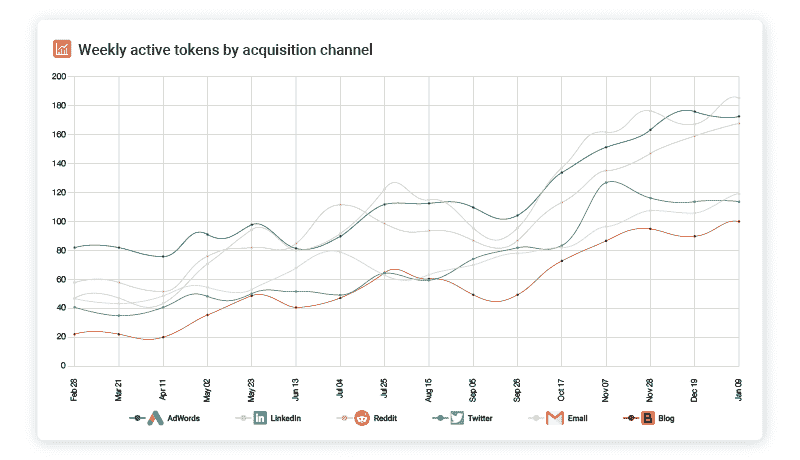

# 如何在经济衰退期间向开发商推销你的 SaaS 平台

> 原文：<https://www.moesif.com/blog/developer-marketing/recession/How-to-Market-Your-SaaS-Platform-to-Developers-During-a-Recession/>

随着最近由于新冠肺炎事件导致的公开股票市场的低迷，衰退或萧条几乎是不可避免的。我们可能会看到零售、旅游、娱乐和其他行业的大规模倒闭。冠状病毒疾病的溢出效应以及随之而来的就地避难，可能会给初创企业带来严重后果。由于就地安置规则而关闭的小型实体企业将不再花钱在脸书或 Yelp 上推广他们的业务，也不会维持他们的 SaaS 订阅。由于预计会出现经济衰退，大企业将缩减销售和营销支出。这可能会导致 SaaS 合同的座位数或使用率减少。同样，销售团队可能会发现，首席财务官和财务总监正在阻止比以前更多的购买，迫使交易陷入采购或法律审查。

好消息是，许多开发者平台和 API 都有一些技巧，可以让它们更好地适应经济衰退。然而，如果你今天没有做这些事情，现在是时候重新考虑，以确保你的产品和公关公司的寿命。

## 专注于自助服务业务

在经济衰退期间，许多大型企业由于自身的财务不确定性，不愿投入财力和人力来开展有偿试点或签署大型企业合同。你可以通过案例研究和强大的客户标识获得最好的社会证明和量化数据，但副总裁可能已经收到冻结所有非关键任务支出和招聘的指令，让他们别无选择。从积极的一面来看，许多高级工程师和经理都有 SaaS 工具的自由支配支出预算。虽然预算可能很小，仅允许每月 100 美元到 1000 美元之间的支出，但这些支出通常不需要签核或批准。通过正确的基于使用的定价模式，您将能够随着时间的推移扩展这些帐户，甚至可能接近您通常在小型企业协议中看到的 ACV，即使客户是通过信用卡按月支付。当你的竞争对手眼看着他们的销售渠道枯竭并解雇了大量销售人员时，你开始获得自助服务客户，一旦市场开始复苏，他们的使用可能会迅速增加。

## 抵御衰退的定价策略

自助服务企业有多种定价方式。通常，您希望使用价值指标而不是成本指标来定价。但是，您可以利用多个价值指标。理想情况下，确保您的定价能够实现自动追加销售，即使这意味着裁员。例如，通过 CRM 中的联系人数定价的销售工具或通过 MAU(每月活跃用户)定价的营销工具将比利用每席位定价的工具做得更好。大量裁员会导致公司重新协商降低座位数。然而，一些公司会经历 MAU 或联系数量的下降。

## 虔诚地追踪你的采纳漏斗

如果你还没有任何产品分析工具，现在正是时候。尽你所能探测一切。检测您的 API。检测您的 web 应用程序。确保每个广告或外部链接都利用了 [UTM 参数。](/blog/business/acquisition/How-to-Measure-Developer-Acquisition-with-API-Analytics-and-UTM-Parameters/)。这使您能够了解哪些获取渠道具有最高的投资回报率，并推动产品增长。漏斗顶端的增长不再理想。你应该只投资直接转化的渠道。对于大多数开发人员平台来说，这意味着客户实际上已经集成并正在积极使用您的 API。如果你只是在衡量页面浏览量和注册量，那就停下来重新评估一下你的真实想法

## 建立你的在线形象

随着会议线路的关闭，现在是时候考虑你的在线状态了。创建博客帖子和网络研讨会，既可以发布到您自己的博客上，也可以联合发布到您的空间中的合作伙伴。然而内容的关键是确保它的真实性和相关性。高质量的内容几乎总是胜过纯粹的数量。通过创建内容，你增加了你在有机搜索中的存在，但你也获得了其他好处。例如，潜在客户将通过社交渠道分享内容，让你免费获得额外的曝光率。您还可以在跟进潜在客户时利用这些内容。你可以通过分享内容让他们按照自己的节奏消费来展示价值，而不仅仅是“让我们安排一个时间来聊天”这样一致的暗示。

## 最小化流失风险

在经济衰退期间，识别和最小化客户流失风险变得比漏斗增长顶部更重要。很多时候，我们可以通过重新安排已经注册和/或正在付费的潜在客户的优先顺序来找到额外的增长。您应该有一个机制来跟踪帐户健康状况，并在情况不妙时得到提醒。需要注意的事项:

*   API 使用率逐年下降的客户
*   仅访问一个或两个终端的客户
*   查看下降较高的 SDK，这可能表明存在缺陷或缺少文档
*   具有大量错误或延迟(如未经授权的错误)的客户
*   尚未访问您的主要价值创造端点的客户

## 关注客户的成功和开发者的支持

取决于你的公司，你可能有一个更传统的客户成功部门，或者可能有一个 devrel 组，开发人员支持接管一些更传统的客户成功职责。在经济衰退期间，你目前的客户是你最大的支持者。让他们用你的 API 和令人敬畏的开发者体验获得成功，他们会告诉他们的同事和朋友。一些小事情包括跟进那些已经集成了你的 API 的开发者，看看他们在构建什么，你能提供什么帮助。如果您发现客户遇到了集成问题，请伸出援手。

## 寻求合作和整合

随着付费营销预算的缩减和销售人员的减少，实现同样的增长里程碑似乎是遥不可及的。然而，有无数的开发者平台利用合作和集成来实现有机的低成本增长。看看任何一家提供你可以上市的市场的公司，比如 GitHub、Heroku、AWS 等等。因为其中一些可能会减少你的知名度拥挤，你也应该看看其他 SaaS 工具，你的目标买家也在使用。如果你是一个营销工具，也许与 Hubspot 整合是有意义的。如果您是一个 API 监控工具，那么构建与 PagerDuty 和 Slack 的集成可能是有意义的，这样您的客户就可以通过他们现有的设置获得警报。

## 总结想法

向开发者推销一个 API 平台是困难的。通常营销和销售预算需要减少，企业更不愿意签订新合同，等等。通过关注你的采用漏斗，寻找廉价的增长渠道，如内容和合作伙伴关系，可以奏效。