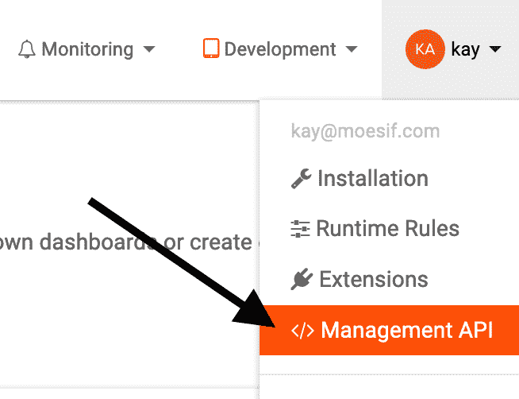

# 如何在您的 SaaS 应用中显示客户调用 API 的次数与计划限制

> 原文：<https://www.moesif.com/blog/engineering/api-analytics/How-to-Display-the-Number-of-API-Calls-a-Customer-Made-vs-Plan-Limits-in-your-SaaS-app/>

我们 Moesif 努力为我们的客户提供最先进的监控和分析，以充分利用他们的 API。其中一个工具是我们的管理 API。

Moesif 管理 API 允许我们的客户检索我们存储的关于他们的 API 的数据。有了这个 API，他们可以检查发生了多少请求或者谁做了最多的请求。

B2B 客户经常问我们一个最紧迫的问题:

**“在过去 30 天内，一个用户调用了多少次 API？”**

在本文中，我们将学习如何使用管理 API 来回答这个问题。

## 什么

我们将使用 cURL 和 Node.js。此外，Moesif 的免费用户不能使用管理 API，因此需要付费订阅。

管理 API 不支持 CORS，所以不可能从浏览器直接使用它。

## 获取管理 API 的令牌

首先，我们需要检索一个管理 API 令牌。该密钥必须通过每个请求旁边的`Authorization`报头发送。

为此，我们需要访问 Moesif 网站上的管理 API 页面。



在该页面上，我们必须选择一个范围，然后单击*生成令牌*。

在我们的 API 调用中，我们只需要选择`read:events`范围。

## 使用带有 cURL 的令牌

测试一切是否正常的最简单的方法是，复制我们点击*生成令牌*后出现在我们的令牌下方的例子。

```py
curl -X GET https://api.moesif.com/v1 \
  -H 'Accept: application/json' \
  -H 'Authorization:Bearer <API_TOKEN>' 
```

这个请求将显示类似这样的内容:

```py
{  "name":  "Moesif Management API",  "region":  "eastus"  } 
```

现在，让我们修改 cURL 请求，使它响应我们想要的答案:在过去的 30 天里，一个用户进行了多少次 API 调用？

```py
curl -X POST 'https://api.moesif.com/search/~/count/events?from=-720h&to=now' \
  -H 'Content-Type: application/json' \
  -H 'Authorization:Bearer <API_TOKEN>' \
  -d '{"post_filter":{"bool":{"should":{"term":{"user_id.raw":"<USER_ID>"}}}}}' 
```

这里发生了什么事？

我们将向管理 API 的`/search/~/count/events`端点发送一个`POST`请求，并使用查询参数`from`和`to`来指定我们希望包含在结果中的时间段。`720h`除以`24h`得到我们想要的 30 天。

我们需要设置正确的`Content-Type`并将我们的`API_TOKEN`包含在`Authorization`头中。

此外，我们需要发送一个 JSON 对象作为查询。这是因为管理 API 使用[弹性搜索 SDL](https://www.elastic.co/guide/en/elasticsearch/reference/current/search-request-body.html) 来执行搜索和过滤。

我们定义的查询只获取具有该特定 ID 的用户的呼叫。

响应看起来像这样:

```py
{  "_shards":  {  "total":  1,  "successful":  1,  "skipped":  0,  "failed":  0  },  "hits":  {  "hits":  [],  "total":  5,  "max_score":  0  },  "took":  1,  "timed_out":  false  } 
```

我们可以看到我们的*搜索*有`total`数量的`hits`，这类似于我们的总 API 调用。

## 将令牌与 Node.js 一起使用

要设置一个简单的服务器作为我们的客户机和管理 API 之间的代理，我们可以使用 Node.js。

```py
const http = require("http");
const https = require("https");

const API_TOKEN = "<API_TOKEN>";
const USER_ID = "<USER_ID>";

const quotaOneMillionCalls = 1000000;

const handleRequest = (request, response) => {
  const requestOptions = {
    method: "POST",
    headers: {
      Authorization: `Bearer ${API_TOKEN}`,
      "Content-Type": "application/json"
    }
  };

  const query = JSON.stringify({
    post_filter: {
      bool: {
        should: {
          term: { "user_id.raw": USER_ID }
        }
      }
    }
  });

  https
    .request(
      "https://api.moesif.com/search/~/count/events?from=-720h&to=now",
      requestOptions,
      moesifResponse => {
        let data = "";
        moesifResponse
          .on("data", chunk => (data += chunk))
          .on("end", () => {
            const apiCalls = JSON.parse(data).hits.total;
            const usage = apiCalls / (quotaOneMillionCalls / 100);
            response.end(
              `User ${USER_ID} made ${apiCalls} API calls. That is ${usage}% of their quota.`
            );
          });
      }
    )
    .end(query);
};

http.createServer(handleRequest).listen(8888); 
```

在这个例子中，我们使用 Node.js 的'`http`模块启动一个 HTTP 服务器，并使用它的`https`模块向管理 API 发出请求。

我们的 HTTP 服务器用描述在过去 30 天内发生了多少请求的文本来响应它接收的所有请求。

## 结论

通过它的管理 API，Moesif 提供了一个强大的工具来从你的 API 中获取重要的指标。

Elasticsearch DSL 使它非常灵活，因为它*只是另一个 HTTP API* ，它可以快速地与您想要的任何分析工具集成。