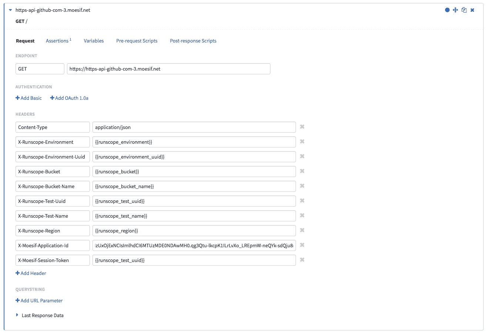
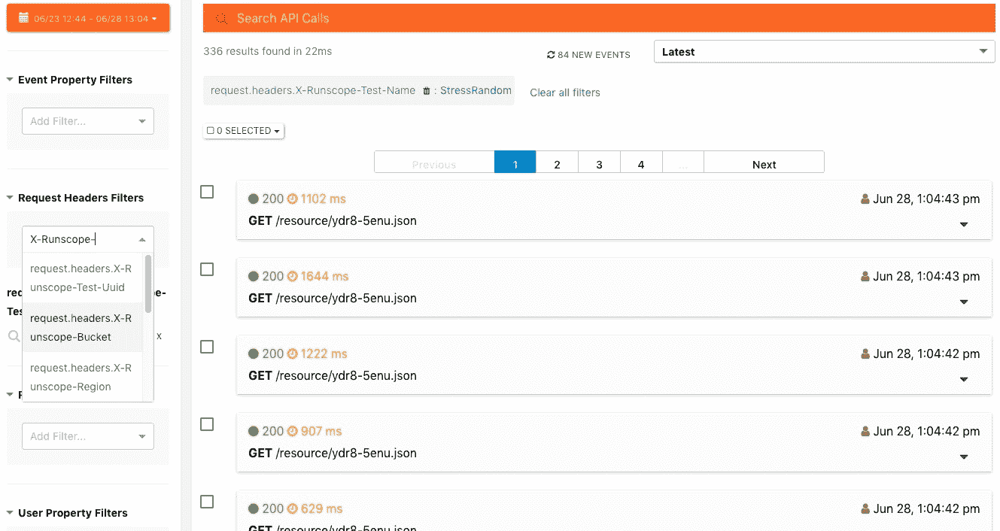
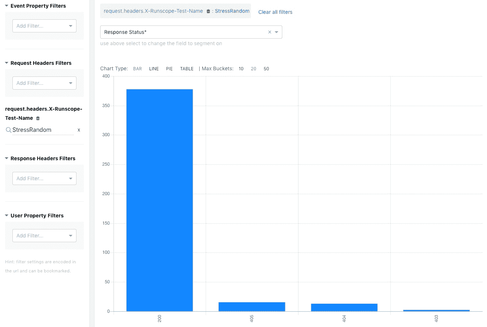

# 使用变量和 Moesif 分段调试运行范围测试

> 原文：<https://www.moesif.com/blog/companies/runscope/Debugging-Runscope-Tests-using-Variables-and-Moesif-Segmentation/>

Runscope 是测试 API 的一个很好的产品。我们有许多客户询问如何用 Moesif 的实时监控和分析来最好地补充 Runscope 的合成 API 测试和刺激生成。

## 运行范围桶

Runscope 存储桶是组织测试和请求的一种方式。如果您有一个移动应用程序连接到十个不同的第三方 API，您可以为每个 API 创建一个存储桶。这样，特定公司或服务的所有测试都组织在同一个桶中。

## Moesif 分割

Moesif 可以根据 API 调用中的任意字段进行过滤和分组，例如请求路由、响应状态代码，甚至任意 HTTP 请求或响应头。Moesif 还可以使用唯一的会话令牌将多个请求捆绑在一起作为一个*跟踪*。为了在 Moesif 中组织 Runscope 测试结果数据，我们可以在测试中添加额外的头，以便 Moesif 进行分析。

## 运行范围测试变量

Runscope 测试支持[内置变量和函数](https://www.runscope.com/docs/api-testing/variables)，它们可以被添加到测试 API 调用中，比如在 HTTP 请求头中。我们应该使用前缀`X-Runscope`将它们添加为定制的 HTTP 请求头

我们建议在您的运行范围测试中至少添加以下 HTTP 请求头:(当然，不要忘记您的`X-Moeif-Application-Id`)

| 标题键 | 标题值 | 描述 |
| --- | --- | --- |
| x-run scope-环境 | { {运行范围环境}} | 用于此测试运行的环境的名称。 |
| X-Runscope-Environment-Uuid | {{runscope_environment_uuid}} | 用于此测试运行的环境的唯一 ID。 |
| x-run scope-铲斗 | {{runscope_bucket}} | 包含执行测试的 Runscope 存储桶的存储桶键。 |
| X-Runscope-Bucket-Name | {{runscope_bucket_name}} | 包含执行测试的 Runscope 存储桶的名称。 |
| X-Runscope-Test-Uuid | {{runscope_test_uuid}} | 运行范围测试的唯一标识符。 |
| x-运行范围-测试名称 | {{runscope_test_name}} | 运行范围测试的名称。 |
| x-run scope-区域 | {{runscope_region}} | 指示启动此测试运行的位置的区域代码。 |

为了将来自同一个测试的所有 API 请求分组到单个 Moesif 跟踪中，我们还建议设置 X-Moesif-Session-Token 头:

`X-Moesif-Session-Token: {{runscope_test_uuid}}`

## 运行测试

一旦我们运行测试，我们将看到事件出现在 Moesif 事件流中，它就像一个流量检查员，但具有过滤和分析功能。由于我们添加了头，我们可以使用左边的*请求头过滤器*来过滤特定的测试名称。

例如，我们可以只显示来自*压力随机*测试的事件。

## 调查 Runscope 测试分析

由于 API 测试结果是由 Moesif 记录的，我们可以使用任何 Moesif 分析图表，如地理热图和分段图表，以更深入地挖掘我们的测试数据。例如，我们可以查看我们的*压力随机*测试的状态代码的分解。

## 结束语

将 Moesif 和 Runscope 结合使用可以增强 API 调试工作流，从而可以交付优秀的 API。如果你有任何建议来改进如何一起使用 Runscope 和 Moesif 来获得令人敬畏的 API 调试体验，请随时[告诉我们。](mailto:team@moesif.com)