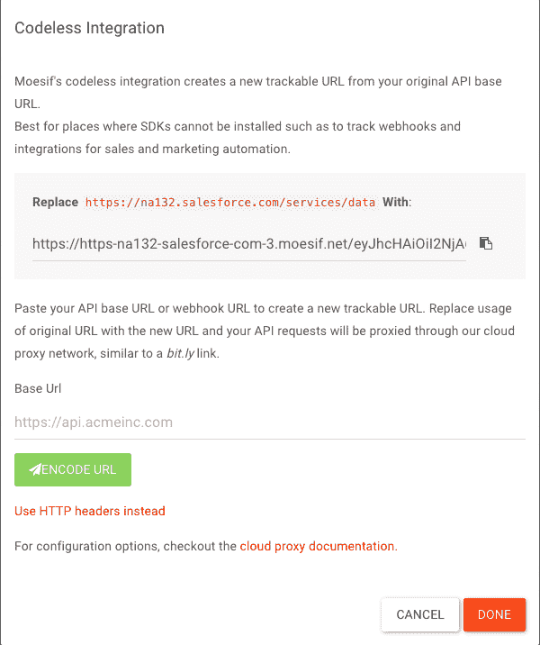
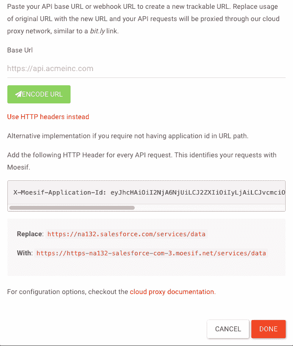
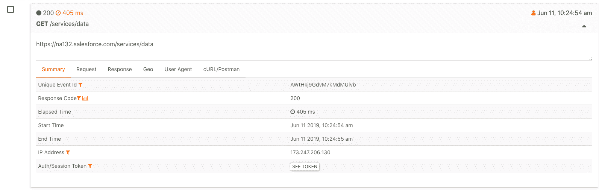

# 使用 Moesif API 分析跟踪 Salesforce API 使用配额

> 原文：<https://www.moesif.com/blog/technical/salesforce/Tracking-SalesForce-API-Usage-Quota/>

## 跟踪您的 Salesforce API 使用情况

了解第三方 API 等数字资源是确保您高效使用这些订阅的关键，并且一个团队不会剥夺其他团队的每日或每月配额。如果没有可见性，您将不知道哪些应用程序消耗了大部分资源，以及如何减少这种使用。像 Salesforce 这样的 SaaS 对访问他们的开放 API 的 API 调用的数量进行了限制。如果您经常达到配额限制，而不是仅仅提升 Salesforce 层，您可能希望找到使用限制不断达到的根本原因。

在本指南中，我们将向您展示如何在几分钟内设置 Moesif API analytics 来跟踪您的 Salesforce API 使用情况。

*   你如何确定一个特定的应用程序或部门在一段时间内调用 API 的次数？
*   出现了多少个`REQUEST_LIMIT_EXCEEDED: TotalRequests Limit exceeded`错误？
*   如何确定 API 调用是从哪个地理位置发出的？
*   我如何深入了解某一天某个已连接应用程序的 API 调用？

在本教程中，我们将讨论如何使用 [Moesif](https://www.moesif.com/) 跟踪 Salesforce API 的使用情况。

## 如何创建 Salesforce 帐户/实例

如果您还没有 Salesforce 帐户，您可以在 [Salesforce 的注册页面](https://developer.salesforce.com/signup)上创建一个新帐户。

登录后，您的组织使用的实例会在浏览器地址栏的 URL 中显示。示例 URL: `https://na132.lightning.force.com/lightning/setup/SetupOneHome/home`

在本节中，我们将创建一系列 REST 请求。在每个请求中，基本 URI 将与 REST 资源结合使用。这些例子的基本 URI 是`https://yourInstance.salesforce.com/services/data`。

下面我们将提交一个请求来检索每个可用 Salesforce 版本的信息。

```py
curl https://na132.lightning.force.com/services/data/ 
```

此请求的输出，包括响应头-

```py
Content-Length: 88
Content-Type: application/json;
charset=UTF-8 Server:
[
    {
        "version":"20.0",
        "url":"/services/data/v20.0",
        "label":"Winter '11"
    }
    ...
] 
```

## 如何创建云代理

登录你的 [*Moesif 仪表盘*](https://www.moesif.com/) ，进入*右上角菜单* - > *安装* - > `Codeless Proxy Integration`。您将看到一个框，用于输入您的 API 域或主机。Moesif 的无代码集成将从您的原始 API 基础 URL 创建一个新的可跟踪 URL。

您需要用新的 URL 替换原来的 URL，您的 API 请求将通过云代理网络进行代理，我们将看到所有请求都被 Moesif 捕获。



出于某种原因，如果我们不想让应用程序 Id 出现在 URL 路径中，我们可以为每个 API 请求添加以下 HTTP 头:



## 在 Moesif 中查看捕获事件

配置完成后，我们可以使用这个可跟踪的 URL 来发出请求。

```py
curl -XGET 'https://https-na132-salesforce-com-3.moesif.net/<ApplicationId>/services/data' 
```

*注意*:上述请求中的 applicationId 应替换为您的 Moesif ApplicationId。

我们可以通过登录 [Moesif](https://www.moesif.com/) 并查看 *API 分析* - > `Live Event Stream`来验证事件是否被捕获。



## 结论

使用上述方法，我们可以使用 Moesif 跟踪任何 Salesforce API 使用情况，并执行高级分析。