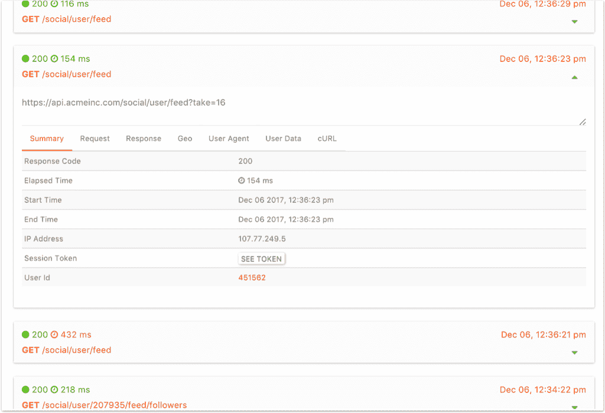

# Runscope 交通检查员 Moesif 迁移指南

> 原文：<https://www.moesif.com/blog/companies/runscope/Migration-guide-for-Runscope-Traffic-Inspector/>

Runscope 是测试 API 的一个很好的产品。他们相信 API 的发展方向，并希望帮助 API 开发者以一种简单的方式测试他们的 API。很遗憾看到他们将[关闭](https://blog.runscope.com/posts/phasing-out-traffic-inspector)他们的*流量检查员*(网关 URL、网关代理、流量流、请求捕获、共享请求等)。)来关注其他产品特性，比如他们的 API 测试。

如果您正在寻找一个平台来运行复杂的测试序列来测试您的 API，我们仍然推荐 Runscope。事实上，Runscope 测试序列与 Moesif API 分析相结合，为您提供了一个强大的平台来测试任何新的 API 更改，并监控这些更改对您的客户群的影响。

## Runscope 和 Moesif 的区别

Runscope 主要关注于测试一个 API，按照设定的时间表 ping 它并检查结果。您可以定义更精细的测试序列，也可以从 CI/CD webhooks 等中触发。如果其中一个测试序列失败，也可以配置松弛警报。

Runscope 还有一个*交通检查员*，可以用来检查这些测试的结果。一些低流量用户甚至使用 Traffic Inspector 对生产流量进行常规 API 监控，但这超出了该功能的设计范围。

[Moesif](https://www.moesif.com/features) 不关注测试序列，也没有*合成 ping*的概念。相反，Moesif 的主要关注点是 *API 分析*，为您的生产应用提供对实时 API 流量的深入了解。这意味着 Moesif 被动地捕获您的 API 数据，以了解使用趋势并检测您的 API 上的异常。

有了 Moesif，您可以看到前 10 大 API 客户调用最多的 API 端点，或者得到提醒，在推出新的 SDK 版本后，欧洲用户在 Java SDK 上遇到了更高的错误率。

Moesif 提供了许多不同的*视图*来可视化您的 API 数据，包括[事件流](https://www.moesif.com/docs/api-search/event-stream/)、[热图](https://www.moesif.com/docs/api-search/heapmaps/)、[分段](https://www.moesif.com/docs/api-search/segmentation/)和[时间序列](https://www.moesif.com/docs/api-search/time-series-analysis/)。

对于那些从 Runscope 的流量检查员迁移过来的用户来说，Moesif 的事件流是 Runscope 用户在开始时最熟悉的。

Moesif 支持各种 API 协议/架构，包括 RESTful、GraphQL 和 Web3/JSON-RPC。

### 集成差异

Runscope 的交通检查员唯一的集成是通过代理。传入的 API 调用将通过 Runscope 的代理路由，然后被中继到您真正的 API。

Runscope 有一个*云代理*可用于所有计划，还有一个*本地代理设备*可用于某些企业级计划。

Moesif 主要集成不是云代理。相反，Moesif 的大多数客户使用开源的服务器中间件 SDK，如 moesif-express 或 moesif-servlet。对于像 DApps 这样的客户端应用，也有 [moesif-browser-js](https://www.moesif.com/docs/client-integration/browser-js/) 可用。

Moesif 还有一个高可用性的云代理服务器，在你不能安装 SDK 的环境中非常有用，比如捕获 T2 网页钩子。

#### 应该选择 SDK 还是云代理？

如果你想要更多的定制和最高的性能，请使用 SDK，如果你想要替换 Runscope 的流量检查器或无法安装 SDK，请使用云代理。

#### SDK 的一些额外好处

*   而不是另一跳，这意味着对延迟没有影响。数据异步发送到 Moesif。
*   Moesif SDK 或 Moesif 服务中的故障不会影响您自己的服务正常运行时间。
*   可以自定义 API 调用如何归属于您的 user_id 和会话/身份验证令牌
*   可以在发送到 Moesif 之前清除任何敏感数据。

#### 云代理的一些额外优势

*   没有软件安装，它只是创建了一个编码的网址。
*   替换 Runscope 交通检查员。
*   可用于 webhooks 或捕获健康探测的结果。

### 综合

遵循[服务器中间件 SDK](https://www.moesif.com/docs/server-integration/)或[云代理](https://www.moesif.com/docs//proxy-integration/cloud-proxy/)各自的集成指南

在成功集成 Moesif 之后，您应该开始看到数据立即出现在 API 事件流中。可能需要几分钟事件才会开始出现。

Runscope 没有用户的概念，所以我们建议查看 moesif 文档中关于创建[用户配置文件](https://www.moesif.com/docs/getting-started/users/)的内容，以使您的集成更加强大。